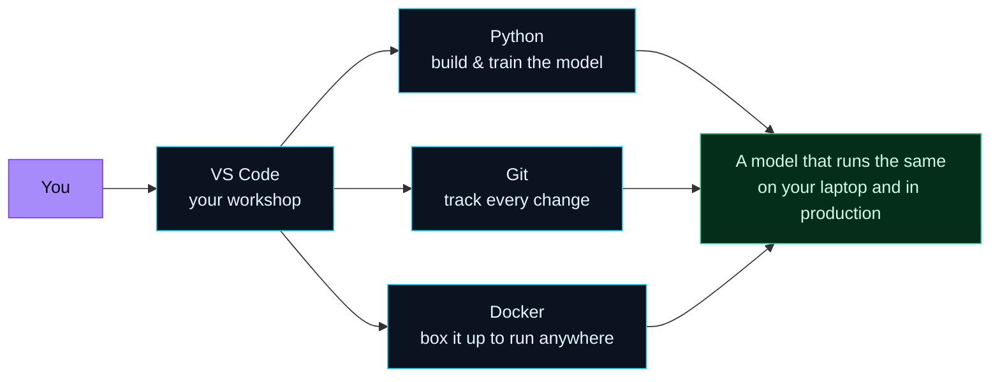

Welcome to **Day 1 of 100 Days of MLOps** — a 100-day, project-based journey that takes you from "I'm not even sure what MLOps means" to running a complete machine-learning platform on your own laptop.

This series is built for **everyone**, not just computer-science graduates. If you have never trained a model, never touched a container, and are not sure what a "pipeline" is — you are exactly who this was written for. Every idea is explained in plain English first, every command is something you can copy and run, and **everything works on your own machine** — macOS, Windows or Linux. You will **never** need a cloud account, a credit card, or a powerful server. The whole 100 days runs locally, for free.

> **New to all of this? You are in the right place.** Day 1 assumes *nothing*. Today we learn what MLOps is, install four free tools together, and finish by running a small program that checks your setup and tells you it's ready. If a word looks unfamiliar, keep reading — it gets explained the first time it matters.

By the end of today you will have:

- A clear, jargon-free understanding of **what MLOps is and why it exists**.
- **Python** installed and verified — the language machine learning is written in.
- **Git** installed — the tool that versions your code.
- **VS Code** — a free, friendly editor — set up for Python.
- **Docker Desktop** installed and running — the tool that packages your models so they run the same everywhere.
- A real program you wrote and ran: an **environment checker** that inspects your machine and prints a readiness report.

Let's go.

---

## What is MLOps, in plain English?

Imagine a brilliant chef who invents an incredible dish once, in their home kitchen. It tastes amazing — but it exists only in their head and their kitchen. To serve that dish to thousands of customers, every day, cooked exactly the same way even when the chef is on holiday, you need a whole **restaurant kitchen**: consistent ingredients, a written recipe anyone can follow, a line that cooks it the same way every time, and someone tasting the food to catch the day the tomatoes went bad.

**Machine learning** is the chef inventing the dish. A data scientist takes some data, experiments in a notebook, and produces a **model** — a program that has *learned* to make predictions (spam or not spam, this photo is a cat, this customer will churn).

**MLOps is the restaurant kitchen.** It is the set of practices and tools that take that one-off model out of the notebook and turn it into something reliable: reproducible (anyone can rebuild it and get the same result), deployable (it runs as a real service other software can call), and monitored (you find out *before your customers do* when it starts making bad predictions).

Put formally:

> **MLOps** (Machine Learning Operations) is the discipline of taking machine-learning models from an experiment on someone's laptop to a **reliable, repeatable, monitored** part of a real product — and keeping them healthy over time.

If you have heard of **DevOps** (practices for shipping and running normal software reliably), MLOps is its cousin for machine learning. It borrows DevOps ideas — version control, automation, containers, monitoring — and adds the parts that are unique to ML: you have to version **data** as well as code, track **experiments**, and watch for the model silently getting worse as the world changes. We will cover every one of those over the next 100 days.

You do **not** need to already know machine learning to start. In the first two modules we build up just enough real ML to have models worth operationalizing. Today we only set up the workshop.

---

## The four tools we install today

Everything in this series runs on four free tools. Here is what each one is and why an MLOps engineer needs it — before we install anything.

| Tool | What it is | Why you need it |
|------|------------|-----------------|
| **Python** | A programming language that reads almost like English. | Machine-learning models are written and trained in Python. It is *the* language of ML. |
| **Git** | A "save history" system for code and text files. | Lets you track every change, undo mistakes, and later version your ML projects properly. |
| **VS Code** | A free, friendly code editor from Microsoft. | The single place where you'll write code, run commands, and view files. |
| **Docker** | A tool that packages software into a **container** — a sealed box that runs the same on any machine. | The core MLOps skill: it makes "it works on my machine" become "it works *everywhere*." |

Here is how they fit together on your laptop:



**Reading this diagram:**

Start at the far left. The **purple node — "You"** — is where everything begins: you sitting at your machine. The arrow flows into **VS Code**, drawn in the cyan "tool" colour. VS Code is your *workshop*: the one window where you write code, open a terminal, and browse your project's files. Everything else happens through it, which is why every arrow passes through VS Code first.

From VS Code, three arrows fan out to the three other cyan tool nodes. **Python** is where you actually build and train models. **Git** quietly records every change you make, so you can always go back. **Docker** takes finished work and seals it in a container. These three are the workhorses — notice they don't depend on each other here; each does its own job, and you'll use them side by side.

Finally, all three tools point to the **green "goal" node** on the right: *a model that runs the same on your laptop and in production*. That green colour is used throughout this series to mean "the outcome we're aiming for." The takeaway: these four tools aren't random installs — together they turn a fragile experiment into something dependable, and that dependability is the entire point of MLOps.

Now let's install them. **Find your operating system below and follow only that section.**

---

## Installing on Windows

### 1. Python

1. Go to [python.org/downloads](https://www.python.org/downloads/) and click the big **Download Python 3.x** button.
2. Run the downloaded installer.
3. **This step is critical:** on the very first screen, tick the box **"Add python.exe to PATH"** at the bottom *before* clicking Install. This lets you run Python from any terminal.
4. Click **Install Now** and let it finish.

Verify it (open a fresh terminal — press the Windows key, type **PowerShell**, press Enter):

```powershell
python --version
```

You should see something like `Python 3.12.4`. On Windows the command is **`python`** (not `python3`).

### 2. Git

1. Go to [git-scm.com/download/win](https://git-scm.com/download/win); the download starts automatically.
2. Run the installer and click **Next** through every screen — the defaults are fine for us.

Verify:

```powershell
git --version
```

### 3. VS Code

1. Download from [code.visualstudio.com](https://code.visualstudio.com/) and run the installer (defaults are fine).
2. Open VS Code, click the **Extensions** icon on the left (the four-squares icon), search for **Python**, and install the one published by **Microsoft**.

### 4. Docker Desktop

Docker on Windows uses a feature called **WSL 2** (a lightweight Linux built into Windows). The Docker installer sets this up for you.

1. Download **Docker Desktop** from [docker.com/products/docker-desktop](https://www.docker.com/products/docker-desktop/).
2. Run the installer, keep **"Use WSL 2 instead of Hyper-V"** ticked, and finish.
3. **Restart your computer** if it asks.
4. Launch **Docker Desktop** from the Start menu and wait until the whale icon in your system tray stops animating — that means the engine is running.

Verify (in a fresh PowerShell):

```powershell
docker --version
```

---

## Installing on macOS

### 1. Python

macOS may ship with an old Python, so we install a current one directly.

1. Go to [python.org/downloads/macos](https://www.python.org/downloads/macos/) and download the latest **macOS 64-bit universal2 installer** (`.pkg`).
2. Open it and click through the installer.

Verify (open **Terminal** — press `Cmd+Space`, type **Terminal**, press Enter):

```bash
python3 --version
```

You should see `Python 3.12.4` or similar. On macOS the command is **`python3`** (with the `3`).

### 2. Git

The quickest way: just run `git --version`. If Git isn't installed, macOS pops up a box offering to install the **Command Line Developer Tools** — click **Install**.

```bash
git --version
```

### 3. VS Code

1. Download from [code.visualstudio.com](https://code.visualstudio.com/), unzip, and drag **Visual Studio Code** into your **Applications** folder.
2. Open it, go to Extensions (the four-squares icon), search **Python**, and install the **Microsoft** one.
3. Optional but handy: press `Cmd+Shift+P`, type **Shell Command: Install 'code' command in PATH**, and select it — now you can open any folder with `code .` from the terminal.

### 4. Docker Desktop

1. Download **Docker Desktop** from [docker.com/products/docker-desktop](https://www.docker.com/products/docker-desktop/) — pick the **Apple Silicon** build for M1/M2/M3/M4 Macs, or the **Intel chip** build for older Macs. (Not sure? Click the Apple logo → *About This Mac* and read the "Chip" line.)
2. Open the `.dmg` and drag **Docker** into **Applications**.
3. Launch **Docker** from Applications and wait for the whale icon in the top menu bar to go steady.

Verify:

```bash
docker --version
```

---

## Installing on Linux (Ubuntu / Debian)

### 1. Python, pip and venv

Most distros have Python already, but let's make sure pip and venv are present too:

```bash
sudo apt update
sudo apt install -y python3 python3-pip python3-venv
python3 --version
```

On Linux the command is **`python3`**.

### 2. Git

```bash
sudo apt install -y git
git --version
```

### 3. VS Code

Download the `.deb` from [code.visualstudio.com](https://code.visualstudio.com/) and install it, then open VS Code and add the **Microsoft Python** extension from the Extensions panel:

```bash
sudo apt install -y ./code_*.deb
```

### 4. Docker Desktop

The simplest path on Linux is **Docker Desktop for Linux** (it bundles the engine and starts it for you):

1. Download the `.deb` from [docker.com/products/docker-desktop](https://www.docker.com/products/docker-desktop/).
2. Install it and launch **Docker Desktop** from your applications menu.

Verify:

```bash
docker --version
```

> **Heads-up for Linux:** if you instead installed the bare **Docker Engine**, you may hit a "permission denied" error talking to Docker. Fix it once with `sudo usermod -aG docker $USER`, then **log out and back in**. Docker Desktop for Linux avoids this.

---

## Verify everything at once

You've installed four tools. Let's confirm all of them respond. Run these in your terminal (use `python` on Windows, `python3` on macOS/Linux):

```bash
python3 --version
git --version
docker --version
```

Each should print a version line. If any command says something like *"command not found"* or *"not recognized"*, jump to the **Common errors** section below — it's almost always a small, fixable thing.

One more check for Docker — an *installed* Docker is not the same as a *running* Docker:

```bash
docker info
```

If Docker Desktop is running, this prints a wall of details about your engine. If it errors with *"Cannot connect to the Docker daemon"*, open **Docker Desktop** and wait for it to finish starting, then try again.

---

## Project: your MLOps environment checker

Running four separate commands and eyeballing the output is fine once. But MLOps is about **automation** — so let's write a small Python program that checks everything *for* us and prints one clean readiness report. This is your first taste of using code to inspect and manage a system, which is what a lot of MLOps work actually is.

Everything here uses only Python's **standard library** (tools that come built-in), so there's nothing extra to install today.

### Create the file

In VS Code: **File → Open Folder**, make a new folder called `mlops-day-01`, then **File → New File** and save it as **`mlops_env_check.py`**. Paste in the complete program below.

> Throughout this series, when we give you a whole file, paste the **entire block** into that file and save. Never edit just a line here and there — replace the whole file. That way, if you make a typo, you can re-paste and start clean.

```python
"""
mlops_env_check.py — Day 1 of 100 Days of MLOps.

A friendly "is my machine ready?" report. It checks the four tools every
MLOps engineer needs on their laptop and tells you, in plain English, what
is ready and what still needs attention.

Run it with:   python mlops_env_check.py   (Windows)
           or:  python3 mlops_env_check.py  (macOS / Linux)
"""

import shutil
import subprocess
import sys


def run(command):
    """Run a command and return its first line of output, or None if it fails."""
    try:
        result = subprocess.run(
            command,
            capture_output=True,
            text=True,
            timeout=15,
        )
    except (FileNotFoundError, subprocess.TimeoutExpired):
        return None
    if result.returncode != 0:
        return None
    output = (result.stdout or result.stderr).strip()
    return output.splitlines()[0] if output else None


def check(name, command, why):
    """Print one PASS/MISSING line for a tool and return True if it is ready."""
    installed = shutil.which(command[0]) is not None
    version = run(command) if installed else None
    if version:
        print(f"  [ OK ]  {name:<16} {version}")
        return True
    print(f"  [MISSING] {name:<14} not found  — {why}")
    return False


def main():
    print("=" * 60)
    print("  100 Days of MLOps — Day 1 environment check")
    print("=" * 60)

    # Python is special: we are already running inside it, so read it directly.
    py = sys.version.split()[0]
    print(f"  [ OK ]  {'Python':<16} {py}")
    results = [(3, 10) <= sys.version_info[:2]]  # need Python 3.10+
    if not results[0]:
        print(f"          NOTE: MLOps needs Python 3.10 or newer (you have {py}).")

    results.append(check("Git", ["git", "--version"], "version control for your code"))
    results.append(check("pip", [sys.executable, "-m", "pip", "--version"], "installs Python packages"))
    docker_ok = check("Docker", ["docker", "--version"], "runs your models in containers")
    results.append(docker_ok)

    # A Docker *install* is not the same as a running Docker *engine*.
    if docker_ok:
        if run(["docker", "info"]):
            print(f"  [ OK ]  {'Docker engine':<16} running")
        else:
            print(f"  [WAIT]  {'Docker engine':<16} installed but not running — start Docker Desktop")
            results.append(False)

    print("-" * 60)
    if all(results):
        print("  All set. Your MLOps lab is ready. See you on Day 2!")
    else:
        print("  Almost there — fix the lines above, then run this again.")
    print("=" * 60)


if __name__ == "__main__":
    main()
```

### What this program does, line by line

You don't need to fully understand the code yet — we teach Python properly as we go — but here's the gist so it isn't a black box:

- `import shutil, subprocess, sys` pulls in three built-in toolkits: `shutil` can find installed programs, `subprocess` runs terminal commands *from inside Python*, and `sys` knows about the running Python itself.
- The **`run()`** function runs a command (like `git --version`) and hands back its first line of output — or `None` if the command is missing or fails. The `try/except` means a missing tool won't crash the program.
- The **`check()`** function uses `run()` to test one tool and prints a tidy `[ OK ]` or `[MISSING]` line.
- **`main()`** checks Python (which it can read directly, since it's already running it), then Git, pip and Docker, and finally whether the Docker **engine** is actually *running* — a classic Day-1 gotcha. At the end it prints one friendly summary line.
- The `if __name__ == "__main__":` line at the bottom is Python's standard "start here when run directly" switch. It's fine to treat it as boilerplate for now.

### Run it

In VS Code, open a terminal (**Terminal → New Terminal**) and run:

```bash
python3 mlops_env_check.py
```

(On Windows, use `python mlops_env_check.py`.)

If Docker Desktop isn't started yet, you'll see something like this — notice it politely tells you what's left to do:

```text
============================================================
  100 Days of MLOps — Day 1 environment check
============================================================
  [ OK ]  Python           3.12.4
  [ OK ]  Git              git version 2.54.0
  [ OK ]  pip              pip 24.0 from /Library/Frameworks/Python.framework/Versions/3.12/lib/python3.12/site-packages/pip (python 3.12)
  [ OK ]  Docker           Docker version 29.5.3, build d1c06ef
  [WAIT]  Docker engine    installed but not running — start Docker Desktop
------------------------------------------------------------
  Almost there — fix the lines above, then run this again.
============================================================
```

That `[WAIT]` line is a real, important distinction: **Docker being installed is not the same as Docker running.** Open Docker Desktop, wait for the whale icon to go steady, and run the program again. Now you'll see the finish line:

```text
============================================================
  100 Days of MLOps — Day 1 environment check
============================================================
  [ OK ]  Python           3.12.4
  [ OK ]  Git              git version 2.54.0
  [ OK ]  pip              pip 24.0 from /Library/Frameworks/Python.framework/Versions/3.12/lib/python3.12/site-packages/pip (python 3.12)
  [ OK ]  Docker           Docker version 29.5.3, build d1c06ef
  [ OK ]  Docker engine    running
------------------------------------------------------------
  All set. Your MLOps lab is ready. See you on Day 2!
============================================================
```

Your version numbers will differ — that's completely fine. What matters is that every line says `[ OK ]`. (If a line says `[MISSING]`, go back to the install section for that tool.)

### The classic first-container test

There's a tradition on every developer's first day with Docker: run the tiny **hello-world** container. This downloads a minuscule test image and runs it, proving your Docker engine can pull and run containers — the foundation of everything we do in the serving and deployment modules later.

```bash
docker run --rm hello-world
```

You should see:

```text
Hello from Docker!
This message shows that your installation appears to be working correctly.

To generate this message, Docker took the following steps:
 1. The Docker client contacted the Docker daemon.
 2. The Docker daemon pulled the "hello-world" image from the Docker Hub.
    (arm64v8)
 3. The Docker daemon created a new container from that image which runs the
    executable that produces the output you are currently reading.
 4. The Docker daemon streamed that output to the Docker client, which sent it
    to your terminal.
```

The `--rm` flag tells Docker to clean up the container after it finishes, so it doesn't leave clutter behind. If you see that message, **your machine is officially an MLOps lab.** 🎉

---

## Common errors (and how to fix them)

Setup day is where almost everyone hits a small snag. Here are the ones you're most likely to see, with the exact fix.

**1. `python: command not found` (macOS/Linux) or `'python' is not recognized...` (Windows)**

On macOS and Linux the command has a `3`: use **`python3`**, not `python`. On Windows, this almost always means the **"Add python.exe to PATH"** box was unticked during install — re-run the Python installer, choose **Modify**, and make sure that box is checked. Then open a **new** terminal (PATH changes only apply to terminals opened afterwards).

**2. `git: command not found` / `'git' is not recognized`**

Git isn't installed, or your terminal was open before you installed it. Close and reopen the terminal first. If it still fails, reinstall Git from the link above. On macOS, run `git --version` and accept the Command Line Tools pop-up.

**3. `docker: command not found`**

Docker Desktop wasn't installed, or the terminal predates the install. Reopen your terminal. On Windows, make sure you actually launched **Docker Desktop** at least once after installing.

**4. `Cannot connect to the Docker daemon at unix:///var/run/docker.sock. Is the docker daemon running?`**

This is the `[WAIT]` case from our program: Docker is **installed but not running**. Open the **Docker Desktop** application and wait until its whale icon stops animating, then retry. Docker Desktop must be running any time you use `docker` commands.

**5. Linux: `permission denied while trying to connect to the Docker daemon socket`**

Your user isn't in the `docker` group. Run `sudo usermod -aG docker $USER`, then **log out and back in** (or reboot). Using Docker Desktop for Linux avoids this entirely.

**6. Windows: "WSL 2 installation is incomplete" when starting Docker**

Docker needs WSL 2. Open PowerShell **as Administrator** and run `wsl --install`, reboot, then start Docker Desktop again. Windows will finish setting up the Linux backend Docker relies on.

**7. Two different Pythons (macOS)**

If `python3 --version` shows an unexpectedly old version, you may be seeing Apple's built-in Python. Installing the python.org `.pkg` (above) puts a current `python3` first on your PATH. Open a new terminal after installing so the change takes effect.

---

## Recap — what you now have

Today you went from zero to a working MLOps workstation:

- You understand **what MLOps is**: the discipline of taking ML models from a one-off experiment to a reliable, reproducible, monitored part of a real product — and why it exists.
- You installed and verified the **four core tools**: Python (build models), Git (version code), VS Code (your workshop), and Docker (package models to run anywhere).
- You wrote and ran a real Python **environment checker**, saw the difference between Docker being *installed* and *running*, and ran your first container with `docker run hello-world`.

**Your cheat sheet — the commands to remember:**

| Command | What it tells you |
|---------|-------------------|
| `python3 --version` (or `python` on Windows) | Python is installed and which version |
| `git --version` | Git is installed |
| `docker --version` | Docker is installed |
| `docker info` | Docker's **engine** is actually running |
| `python3 mlops_env_check.py` | Your one-shot "am I ready?" report |
| `docker run --rm hello-world` | Your Docker engine can pull and run containers |

Keep the `mlops_env_check.py` file — any time something feels off in a later lesson, run it first to confirm your basics are still healthy.

---

## Coming up on Day 2

Now that the workshop is built, we step back and look at the whole picture. **Day 2 — "The MLOps Lifecycle & Mental Model"** walks through the loop every ML system lives in: **data → train → package → deploy → monitor → retrain**. You'll learn where each of the tools you just installed fits, and you'll write a project charter for the toy prediction project we'll grow across the series. It's the map that makes the next 98 days make sense.

See the full roadmap and everything ahead on the [100 Days of MLOps series page](/series/100-days-mlops). See you tomorrow.
