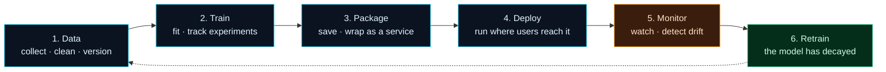

Welcome to **Day 2 of 100 Days of MLOps**. Yesterday you built your lab — Python, Git, VS Code and Docker, all verified on your own machine. Today we don't install anything new. Instead we get something just as important: **the map**.

One hundred days is a long journey, and it's easy to lose the plot somewhere around "wait, why are we learning this again?" So before we train a single model, let's zoom all the way out and answer one question: **what actually happens to a machine-learning model on its way from an idea to a real, running product?** Once you can see that whole picture, every one of the next 98 days will click into place — you'll always know *which part of the map* we're standing on.

> **No code-heavy day here — and that's on purpose.** Day 2 is a thinking day. We build one clear mental model, run a small script that prints it back to you, and write a one-page plan for the project we'll grow across the series. Short, but it's the scaffolding everything else hangs on.

By the end of today you will:

- Understand the **MLOps lifecycle** — the six-stage loop every ML system lives in.
- Know **where each tool you'll learn** (and each of the 10 modules) fits on that map.
- See why MLOps is a **loop, not a straight line** — and why "the model is finished" is a myth.
- Have written a **project charter** for `house-prices`, the toy predictor we'll carry through all 100 days.

---

## The big idea: ML in the lab vs. ML in the world

Here's a story that plays out in companies everywhere.

A data scientist spends two weeks in a notebook and builds a model that predicts customer churn with 92% accuracy. Everyone is thrilled. Then someone asks the obvious question — *"Great! How do we actually use it?"* — and the room goes quiet. The model lives in one notebook, on one laptop. Nobody else can run it. It has no way to receive new customers to score. If the data it was trained on goes out of date, nothing notices. Six months later it's quietly making bad predictions and no one knows.

That gap — between **a model that works once, for one person** and **a model that works continuously, for a product** — is the entire reason MLOps exists.

We touched this yesterday with the restaurant analogy: the data scientist is a chef who invented a dish; MLOps is the kitchen that cooks it reliably for every customer, every day. Today we make that concrete by naming the **stages** that kitchen runs on.

---

## The MLOps lifecycle

Almost every ML system, from a hobby project to Netflix's recommender, moves through the same six stages. Here they are as a single picture — the most important diagram in this entire series.



**Reading this diagram:**

Read it left to right, following the solid arrows. The four **cyan nodes** — Data, Train, Package, Deploy — are the "build" stages: this is the path that takes raw data and turns it into a running service. **Data** comes first because a model is only ever as good as what it learns from; here you collect it, clean it, and (crucially for MLOps) *version* it so you can reproduce results later. That flows into **Train**, where you actually fit a model and record every experiment. Then **Package**, where the trained model gets saved and wrapped as a service other software can call. Then **Deploy**, where that service goes live somewhere users can reach it.

Now the colour changes. **Monitor** is drawn in **amber** — the "watching" colour — because its job is different: it doesn't build anything, it keeps an eye on the live model, checking whether reality still matches what the model expects. When it notices trouble, we reach the **green node, Retrain** — the loop-closer. And here's the key move: follow the **dotted arrow** from Retrain back to Data. That dotted line is the whole point of the diagram. An ML system is **not a straight line that ends at Deploy** — it's a **loop**. The world changes, data goes stale, the model's predictions drift, and you go back to the start with fresh data and do it again.

The takeaway: **MLOps is the discipline of running this loop reliably and, as much as possible, automatically.** Every module in this series is teaching you one arc of this circle.

---

## The six stages, and where each module fits

Let's walk the loop once more, slowly, and pin each stage to the tools and days that cover it. Don't try to memorise the tools — just notice that **every stage has a home** in the curriculum.

**1. Data** — *collect, clean, and version.*
You gather examples, tidy them up, validate that they're not garbage, and version them so a result can be reproduced months later. Rushing this stage is the number-one cause of models that mysteriously break.
→ *pandas, DVC, Pandera, Feast* · Modules 2, 3 & 5 (Days 11–12, 21–25, 41–50).

**2. Train** — *fit a model and track every experiment.*
You feed the data to a learning algorithm to produce a model, and you record what you tried (settings, scores, the model file itself) so you can compare runs and pick a winner.
→ *scikit-learn, MLflow, Optuna* · Modules 2 & 4 (Days 13–20, 31–40).

**3. Package** — *save the model and wrap it as a service.*
A trained model sitting in memory is useless to the outside world. You save it to a file and wrap it in a small web service so other software can send it inputs and get predictions back.
→ *joblib, FastAPI, Pydantic, Docker, BentoML* · Module 6 (Days 51–60).

**4. Deploy** — *run it where users can reach it, and update it safely.*
You run that service somewhere reliable and learn how to roll out new versions without breaking things (canary releases, rollbacks).
→ *Docker, kind (local Kubernetes), KServe, Argo CD* · Module 9 (Days 81–90).

**5. Monitor** — *watch live predictions and detect drift.*
Once live, you track how the service behaves (is it fast? erroring?) and — uniquely for ML — whether the *incoming data* and the *model's accuracy* are drifting away from what you trained on.
→ *Prometheus, Grafana, Evidently* · Module 10 (Days 91–96).

**6. Retrain** — *when the model decays, loop back to Data — automatically.*
When monitoring raises the alarm, you kick off the whole loop again with fresh data. The dream of MLOps is that this happens **automatically**, with pipelines and CI/CD, not a human noticing months too late.
→ *Prefect, GitHub Actions, CML* · Modules 7, 8 & 10 (Days 61–80, 97).

Notice how yesterday's four tools map straight onto this: **Python** is the language every stage is written in, **Git** versions the code behind all six stages, and **Docker** is how we *package* and *deploy*. You already installed the backbone.

> **Why "reproducible" and "versioned" keep coming up.** In normal software, the code is the whole story. In ML, the model depends on **code + data + settings**. Change any one and you get a different model. That's why MLOps obsesses over versioning *all three* — it's the only way to answer "how exactly did we build the model that's live right now?" We spend all of Module 3 on this.

---

## What makes ML *Ops* different from normal software

If you've done any web or app development, a fair question is: *"Isn't this just DevOps with extra steps?"* Mostly yes — and that's why we borrow so much from it. But three things are genuinely new, and they're why this needs its own 100 days:

| | Normal software | Machine learning |
|---|---|---|
| **What you ship** | Code | Code **+ data + a trained model** |
| **Why it breaks** | A bug in the code | The *world changed* — data drifted, even with zero code changes |
| **"Done"?** | Ship it, it keeps working | It silently decays; it must be watched and retrained |

That middle row is the big one. A normal program that worked yesterday works today. A model that worked yesterday can quietly get *worse* today — not because anyone touched it, but because the real world moved on from the data it learned. Catching that is **Monitor**; fixing it is **Retrain**; and never having to think "is my model still any good?" by hand is the reason the loop exists.

---

## Project: name your problem and write its charter

Great engineering projects start with a page that says, in plain words, *what are we building and how will we know it worked?* We'll do that for the toy project we carry through the whole series: **`house-prices`** — predict a house's sale price from its features.

You'll create two files: a **charter** (your one-page plan) and a tiny **script** that prints the lifecycle back to you as a map for this project.

### 1. Create the project folder and the charter

Make a new folder called `mlops-day-02` and open it in VS Code (**File → Open Folder**). Inside it, create a file named **`charter.md`** and paste this in. Read it as you go — and feel free to change the problem to something you care about (predicting movie ratings, tomorrow's weather, whatever).

```markdown
# Project Charter — house-prices

*A one-page plan for the model we'll grow across 100 Days of MLOps.*

**The problem (one sentence).**
Predict a house's sale price from features like its size, number of bedrooms and location.

**Who would use this, and how?**
A property website could show sellers an instant estimated price the moment they list a home.

**What kind of ML problem is it?**
Regression — the answer is a *number* (a price), not a category.

**The data.**
Rows of past house sales. Each row = one house's features + the price it actually sold for.
(We'll bring in a real dataset in Module 2; for now we're just naming the shape.)

**The target (what we're predicting).**
`sale_price` — the number the model outputs.

**How we'll know it's good (success metric).**
Average prediction error in dollars (MAE). Lower is better. We'll set a real target once we have a baseline.

**The baseline to beat.**
"Always guess the average price." Any model worth deploying must beat that.

**Hard constraints.**
Everything runs locally on my laptop — no cloud, no paid services.

**The lifecycle plan (filled in as we go).**
- Data → collect, clean, version with DVC
- Train → scikit-learn model, tracked with MLflow
- Package → save with joblib, serve with FastAPI + Docker
- Deploy → local Kubernetes (kind)
- Monitor → Prometheus/Grafana + drift checks with Evidently
- Retrain → automated with Prefect when drift is detected
```

Writing this down matters more than it looks. Two of those lines — the **success metric** and the **baseline to beat** — are where most real ML projects go wrong. If you can't say *how you'll measure success* and *what dumb guess you must beat*, you have no way to know whether your fancy model is actually worth deploying. We'll come back to this charter and fill in real numbers as the series goes on.

### 2. Create and run the lifecycle map

Now create a file named **`lifecycle.py`** in the same folder and paste in the complete program below. It uses only Python's standard library, so there's nothing to install.

```python
"""
lifecycle.py — Day 2 of 100 Days of MLOps.

Prints the MLOps lifecycle as a clear, stage-by-stage map for one toy project,
so the whole 100-day journey has a shape you can hold in your head. It reads
nothing and changes nothing — it just explains the loop your project will live in.

Run it with:   python lifecycle.py   (Windows)
           or:  python3 lifecycle.py  (macOS / Linux)
"""

PROJECT = "house-prices"
GOAL = "Predict a house's sale price from its features (size, bedrooms, location)."

# Each stage: (name, what happens here, the tools we'll use, where in the series)
STAGES = [
    ("1. DATA",
     "Collect, clean and *version* the dataset so results are reproducible.",
     "pandas, DVC",
     "Modules 2, 3 & 5 (Days 11-12, 21-25, 41-50)"),
    ("2. TRAIN",
     "Fit a model and track every experiment (params, metrics, the model itself).",
     "scikit-learn, MLflow, Optuna",
     "Modules 2 & 4 (Days 13-20, 31-40)"),
    ("3. PACKAGE",
     "Save the model and wrap it as a real service that other software can call.",
     "joblib, FastAPI, Docker, BentoML",
     "Module 6 (Days 51-60)"),
    ("4. DEPLOY",
     "Run that service where users can reach it, and roll out new versions safely.",
     "Docker, kind, KServe, Argo CD",
     "Module 9 (Days 81-90)"),
    ("5. MONITOR",
     "Watch live predictions and detect when the data or the model drifts.",
     "Prometheus, Grafana, Evidently",
     "Module 10 (Days 91-96)"),
    ("6. RETRAIN",
     "When the model decays, automatically loop back to DATA and start again.",
     "Prefect, CI/CD",
     "Modules 7, 8 & 10 (Days 61-80, 97)"),
]


def main():
    bar = "=" * 70
    print(bar)
    print(f"  MLOps lifecycle for project: {PROJECT}")
    print(f"  Goal: {GOAL}")
    print(bar)

    for name, what, tools, where in STAGES:
        print(f"\n  {name}")
        print(f"      what   : {what}")
        print(f"      tools  : {tools}")
        print(f"      covered: {where}")

    print("\n" + "-" * 70)
    print("  ...and then it LOOPS: MONITOR feeds back into DATA.")
    print("  An ML system is never 'done' — it is a loop you keep healthy.")
    print(bar)


if __name__ == "__main__":
    main()
```

Open a terminal in VS Code (**Terminal → New Terminal**) and run it (`python` on Windows, `python3` on macOS/Linux):

```bash
python3 lifecycle.py
```

You should see the whole map printed for your project:

```text
======================================================================
  MLOps lifecycle for project: house-prices
  Goal: Predict a house's sale price from its features (size, bedrooms, location).
======================================================================

  1. DATA
      what   : Collect, clean and *version* the dataset so results are reproducible.
      tools  : pandas, DVC
      covered: Modules 2, 3 & 5 (Days 11-12, 21-25, 41-50)

  2. TRAIN
      what   : Fit a model and track every experiment (params, metrics, the model itself).
      tools  : scikit-learn, MLflow, Optuna
      covered: Modules 2 & 4 (Days 13-20, 31-40)

  3. PACKAGE
      what   : Save the model and wrap it as a real service that other software can call.
      tools  : joblib, FastAPI, Docker, BentoML
      covered: Module 6 (Days 51-60)

  4. DEPLOY
      what   : Run that service where users can reach it, and roll out new versions safely.
      tools  : Docker, kind, KServe, Argo CD
      covered: Module 9 (Days 81-90)

  5. MONITOR
      what   : Watch live predictions and detect when the data or the model drifts.
      tools  : Prometheus, Grafana, Evidently
      covered: Module 10 (Days 91-96)

  6. RETRAIN
      what   : When the model decays, automatically loop back to DATA and start again.
      tools  : Prefect, CI/CD
      covered: Modules 7, 8 & 10 (Days 61-80, 97)

----------------------------------------------------------------------
  ...and then it LOOPS: MONITOR feeds back into DATA.
  An ML system is never 'done' — it is a loop you keep healthy.
======================================================================
```

That printout *is* your roadmap. Any day you feel lost, run it — it tells you which stage of the loop you're learning and which module it belongs to. Keep both files; we'll build directly on this project starting in Module 2.

---

## Common errors (and how to fix them)

Even a "thinking day" has a few practical snags when you run the script. Here are the ones you're most likely to hit — plus the conceptual traps that matter most.

**1. `python: command not found` (macOS/Linux) or `'python' is not recognized` (Windows)**

Same rule as Day 1: on macOS/Linux the command is **`python3`**; on Windows it's **`python`**. If Windows still can't find it, the "Add python.exe to PATH" box was missed during install — re-run the installer and choose *Modify*.

**2. `can't open file '.../lifecycle.py': [Errno 2] No such file or directory`**

You're running the command from a different folder than the one holding the file. Your terminal's current folder must be the one with `lifecycle.py`. In VS Code, open the terminal with **Terminal → New Terminal** (it opens in your project folder automatically), or `cd` into the right folder first. Check what's around you with `ls` (macOS/Linux) or `dir` (Windows).

**3. `SyntaxError: Missing parentheses in call to 'print'. Did you mean print(...)?`**

You're looking at Python 2 code, or you retyped a `print` line by hand and dropped the parentheses. All modern Python uses `print("...")` with parentheses. Re-paste the complete file rather than editing lines by hand — that's why we always give you whole files.

**4. `IndentationError: expected an indented block after function definition on line 1`**

A partial paste. Python uses indentation (leading spaces) to group code, so the lines inside `def main():` must be indented. If only half the file made it in, you'll see this. Fix: select all (`Ctrl+A` / `Cmd+A`), delete, and paste the **entire** program again.

**5. Conceptual trap: "the model is the finished product."**

The single most common beginner mistake. A trained model is the *middle* of the story, not the end — stages 3–6 (package, deploy, monitor, retrain) are where most real MLOps work lives. If you only ever train models, you've built a chef with no kitchen.

**6. Conceptual trap: skipping straight to "deploy a model" without Data and Monitor.**

It's tempting to rush to the exciting part. But a deployed model with no versioned data (you can't reproduce it) and no monitoring (you can't tell when it breaks) is a liability, not an asset. The loop only pays off if you run *all* of it — which is exactly why this series covers all of it.

---

## Recap — what you now have

Today was about seeing the whole board before making a move:

- You learned the **MLOps lifecycle**: Data → Train → Package → Deploy → Monitor → Retrain → *(loop back to Data)*.
- You know **where every tool and module fits** on that loop, so nothing in the next 98 days is a mystery.
- You understand why MLOps is a **loop, not a line**, and why models decay and must be watched and retrained — the thing that makes ML *Ops* different from normal software.
- You wrote a **project charter** for `house-prices` and ran a script that prints the lifecycle as your personal roadmap.

**Your cheat sheet — the loop in one line:**

> **Data → Train → Package → Deploy → Monitor → Retrain →** *(back to Data)*

| Stage | In one phrase | Covered in |
|-------|---------------|-----------|
| Data | Collect, clean, **version** | Modules 2, 3, 5 |
| Train | Fit + **track experiments** | Modules 2, 4 |
| Package | Save + wrap as a **service** | Module 6 |
| Deploy | Run it + update it **safely** | Module 9 |
| Monitor | Watch + **detect drift** | Module 10 |
| Retrain | Loop back — **automatically** | Modules 7, 8, 10 |

---

## Coming up on Day 3

We're back to hands-on. **Day 3 — "Python Environments for ML"** solves a problem that bites every ML practitioner: different projects need different, conflicting versions of libraries, and installing everything globally turns your machine into a minefield. You'll learn **virtual environments** (`venv`) — isolated, throwaway workspaces — install your first real ML libraries (NumPy, pandas, scikit-learn) into one, and pin them in a `requirements.txt` so anyone can rebuild your exact setup from scratch. It's the first real "reproducibility" muscle of the series.

See the whole roadmap on the [100 Days of MLOps series page](/series/100-days-mlops). See you tomorrow.
