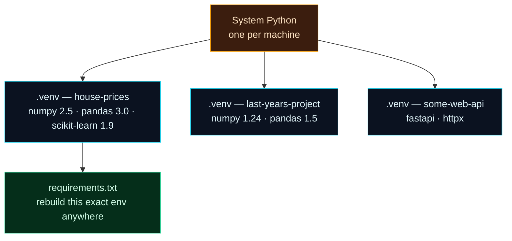

Welcome to **Day 3 of 100 Days of MLOps**. On Day 1 you built your lab; on Day 2 you learned the map. Today we're hands-on again, and we tackle the very first stage of the lifecycle loop — the thing that quietly wrecks more ML projects than any fancy algorithm ever will: **managing the libraries your project depends on.**

This might sound like housekeeping. It isn't. "Reproducibility" — being able to rebuild the exact same setup on any machine, at any time — is the beating heart of MLOps, and it starts right here, today, with two humble tools: **`venv`** and **`requirements.txt`**.

> **New to installing libraries? Perfect.** We'll go slowly. By the end you'll have installed NumPy, pandas and scikit-learn — the three libraries almost all classic ML is built on — into a clean, isolated workspace, and you'll be able to hand that exact setup to anyone else (or your future self) and have them rebuild it in one command.

By the end of today you will:

- Understand why installing libraries **globally** turns your machine into a minefield.
- Create and activate a **virtual environment** (`venv`) — an isolated, per-project Python.
- Install the core ML trio — **NumPy, pandas, scikit-learn** — into it.
- Freeze your exact setup into a **`requirements.txt`** and **rebuild it from scratch** to prove it's reproducible.

---

## The problem: dependency hell

Python code leans on **libraries** — pre-written bundles of code you install and reuse (NumPy for numbers, pandas for tables, and so on). You install them with a tool called **`pip`** (it comes with Python).

Here's the trap. Imagine you install everything **globally** — straight into your one system-wide Python:

- **Project A** (an old model you built last year) needs `pandas` version 1.5.
- **Project B** (today's project) needs `pandas` version 3.0, which changed some things.

There is only **one** global Python, so it can hold only **one** version of pandas at a time. Install 3.0 for Project B and you just silently broke Project A. Install 1.5 to fix Project A and Project B breaks. Multiply this by dozens of libraries across dozens of projects and you get what everyone calls **"dependency hell"** — a machine where nothing is reproducible and every install is a gamble.

There's a second, subtler problem: if everything is jumbled into one global Python, you can never answer *"which libraries does this specific project actually need?"* — and that means you can't hand it to a teammate or a server and have it just work.

**Virtual environments solve both problems.**

---

## The fix: a virtual environment per project

A **virtual environment** (venv for short) is a private, isolated copy of Python that belongs to **one project**. It lives in a folder *inside* your project (we'll call it `.venv`). Libraries you install while it's "active" go **only** into that folder — they don't touch your system Python or any other project.



**Reading this diagram:**

At the top, in **amber**, is your **System Python** — the one Python you installed on Day 1. There's just one of it per machine, and the golden rule is: *leave it alone.* You don't install project libraries into it.

Fanning out below are three **cyan nodes** — three separate `.venv` folders, one per project. Look closely at what's inside them: the `house-prices` project has pandas 3.0, while `last-years-project` has pandas 1.5. **Those conflicting versions coexist happily**, because each lives in its own isolated environment. That's the whole magic — the conflict that caused dependency hell simply can't happen anymore. Each project gets exactly the versions it needs.

Finally, the **green node**: from your project's environment you generate a **`requirements.txt`** — a plain text list of the exact library versions installed. That little file is what makes the environment *reproducible*: hand it to a teammate, a server, or your future self, and they can rebuild the identical environment with one command. The arrow points out of the environment because you *produce* this file from it, and it becomes the recipe anyone can follow.

Let's build one.

---

## Step 1 — Create the environment

Make a project folder (call it `mlops-day-03`), open it in VS Code (**File → Open Folder**), and open a terminal (**Terminal → New Terminal**). Now create the environment:

**macOS / Linux:**

```bash
python3 -m venv .venv
```

**Windows (PowerShell):**

```powershell
python -m venv .venv
```

This says: *"Python, use your built-in `venv` tool to create a fresh environment in a folder named `.venv`."* It takes a few seconds and creates a `.venv` folder in your project. You never edit anything inside it by hand — Python manages it.

> **Why `.venv` with a dot?** The leading dot is just a naming convention that keeps the folder tidy (it sorts to the top and signals "tooling, not my code"). Any name works, but `.venv` is the community standard, and tools like VS Code look for it automatically.

---

## Step 2 — Activate it

Creating the environment isn't enough — you have to **activate** it, which tells your terminal "from now on, use *this* project's Python and pip." The command differs by operating system:

**macOS / Linux:**

```bash
source .venv/bin/activate
```

**Windows (PowerShell):**

```powershell
.venv\Scripts\Activate.ps1
```

Once activated, your terminal prompt changes — it now starts with **`(.venv)`**. That little tag is your at-a-glance proof that the environment is active. You'll want to see it before installing anything.

> **Windows gotcha — "running scripts is disabled on this system".** The first time you activate on Windows, PowerShell may refuse with a red *"execution of scripts is disabled"* error. This is a one-time security setting. Fix it by running this once, then activating again:
>
> ```powershell
> Set-ExecutionPolicy -Scope CurrentUser RemoteSigned
> ```

You can confirm you're really inside the environment by asking where Python now points. Inside an active `.venv`, it points **into your project folder**, not your system:

```bash
python --version
```

```text
Python 3.12.4
```

(Note: once the environment is active, you can just type **`python`** and **`pip`** on every OS — the `3` distinction from Day 1 only matters for your *system* Python.)

---

## Step 3 — Install the core ML libraries

Now install the three libraries nearly all classic machine learning is built on. With the environment **active**, run:

```bash
pip install numpy pandas scikit-learn
```

- **NumPy** — fast arrays and math; the numerical foundation everything else sits on.
- **pandas** — data *tables* (rows and columns, like a spreadsheet you drive with code).
- **scikit-learn** — the classic machine-learning toolkit: dozens of ready-made models and helpers.

pip downloads them (plus the smaller libraries *they* depend on) and installs them into your `.venv`. You'll see a summary like:

```text
Installing collected packages: threadpoolctl, six, numpy, narwhals, joblib, scipy, python-dateutil, scikit-learn, pandas
Successfully installed joblib-1.5.3 narwhals-2.23.0 numpy-2.5.1 pandas-3.0.3 python-dateutil-2.9.0.post0 scikit-learn-1.9.0 scipy-1.18.0 six-1.17.0 threadpoolctl-3.6.0
```

Notice you asked for **three** libraries but got **nine**. The extras (scipy, joblib, six…) are *dependencies* — libraries your three need in order to work. pip figures those out and installs them for you. Your exact version numbers may differ from the ones above, and that's fine.

See what's installed in this environment at any time with:

```bash
pip list
```

```text
Package         Version
--------------- -----------
joblib          1.5.3
narwhals        2.23.0
numpy           2.5.1
pandas          3.0.3
pip             26.1.2
python-dateutil 2.9.0.post0
scikit-learn    1.9.0
scipy           1.18.0
six             1.17.0
threadpoolctl   3.6.0
```

---

## Step 4 — Pin your setup in requirements.txt

Right now your environment exists only on your machine. To make it **reproducible**, we capture the exact versions into a file. This is the single most important habit in this lesson.

With the environment active:

```bash
pip freeze > requirements.txt
```

`pip freeze` prints every installed library with its exact version; the `>` sends that list into a file called `requirements.txt`. Open it and you'll see:

```text
joblib==1.5.3
narwhals==2.23.0
numpy==2.5.1
pandas==3.0.3
python-dateutil==2.9.0.post0
scikit-learn==1.9.0
scipy==1.18.0
six==1.17.0
threadpoolctl==3.6.0
```

Every line pins one library to one **exact** version with `==`. That precision is the point: "install pandas" might give you a different version next month, but "install `pandas==3.0.3`" gives everyone the *same* pandas, forever. **This file — not your `.venv` folder — is what you commit to Git and share.** (More on that on Day 4.)

---

## Project: build and *rebuild* the house-prices environment

Let's make this real for the project we chartered on Day 2, and then prove the reproducibility actually works by rebuilding the environment from nothing.

### 1. A script that proves the toolbox works

In your project folder, create **`check_libs.py`** and paste this in:

```python
"""
check_libs.py — Day 3 of 100 Days of MLOps.

Proves the three core ML libraries are installed *in this environment* and can
actually do a tiny bit of work. If this runs clean, your ML toolbox is ready.

Run it (with the virtual environment activated):
    python check_libs.py
"""

import numpy as np
import pandas as pd
import sklearn

print("Library versions in this environment")
print("-" * 40)
print(f"  numpy        {np.__version__}")
print(f"  pandas       {pd.__version__}")
print(f"  scikit-learn {sklearn.__version__}")
print("-" * 40)

# A tiny real computation, one line per library, to prove they work.
prices = np.array([120000, 240000, 310000, 180000])
print(f"  numpy   → average price: {prices.mean():,.0f}")

table = pd.DataFrame({"bedrooms": [2, 4, 3], "price": [180000, 310000, 240000]})
print(f"  pandas  → rows in table: {len(table)}")

# scikit-learn ships small practice datasets; loading one proves it's wired up.
from sklearn.datasets import load_diabetes
data = load_diabetes()
print(f"  sklearn → sample dataset shape: {data.data.shape}")

print("-" * 40)
print("  All three libraries import and run. Toolbox ready!")
```

With the environment active, run it:

```bash
python check_libs.py
```

```text
Library versions in this environment
----------------------------------------
  numpy        2.5.1
  pandas       3.0.3
  scikit-learn 1.9.0
----------------------------------------
  numpy   → average price: 212,500
  pandas  → rows in table: 3
  sklearn → sample dataset shape: (442, 10)
----------------------------------------
  All three libraries import and run. Toolbox ready!
```

You just used all three libraries: NumPy averaged four prices, pandas built a small table, and scikit-learn loaded one of its built-in practice datasets (442 rows, 10 features). Your ML toolbox is real.

### 2. The reproducibility test: rebuild from scratch

Here's the payoff. We'll **delete the entire environment** and rebuild it purely from `requirements.txt` — exactly what a teammate or a deployment server would do. First, make sure you've run `pip freeze > requirements.txt` from Step 4.

**macOS / Linux:**

```bash
deactivate
rm -rf .venv
python3 -m venv .venv
source .venv/bin/activate
pip install -r requirements.txt
```

**Windows (PowerShell):**

```powershell
deactivate
Remove-Item -Recurse -Force .venv
python -m venv .venv
.venv\Scripts\Activate.ps1
pip install -r requirements.txt
```

`deactivate` leaves the environment, then we delete the `.venv` folder completely, create a brand-new one, activate it, and `pip install -r requirements.txt` reads your pinned file and reinstalls the **exact** same versions. Run `python check_libs.py` again — identical output. You just reproduced your entire ML setup from a single text file. **That is reproducibility, and it's the foundation everything else in this series stands on.**

> **The daily rhythm from here on:** open your project → `source .venv/bin/activate` (or the Windows line) → work → `deactivate` when done. Any time you install a new library, immediately re-run `pip freeze > requirements.txt` so the recipe stays current.

---

## Common errors (and how to fix them)

**1. `source: no such file or directory: .venv/bin/activate` (or Windows can't find the script)**

You used the wrong activation command for your OS, or you're not in the project folder. macOS/Linux: `source .venv/bin/activate`. Windows PowerShell: `.venv\Scripts\Activate.ps1`. Make sure your terminal is *in* the folder that contains `.venv` first.

**2. PowerShell: `... Activate.ps1 cannot be loaded because running scripts is disabled on this system`**

A one-time Windows security setting. Run `Set-ExecutionPolicy -Scope CurrentUser RemoteSigned`, press `Y` to confirm, then activate again.

**3. `ModuleNotFoundError: No module named 'numpy'`**

The classic. You ran a script but the environment **wasn't active**, so Python used your system install (which doesn't have these libraries):

```text
Traceback (most recent call last):
  File "check_libs.py", line 11, in <module>
    import numpy as np
ModuleNotFoundError: No module named 'numpy'
```

Fix: activate the environment first (look for the `(.venv)` tag in your prompt), *then* run the script. If it's active and you still see this, you installed into a different environment — run `pip install -r requirements.txt` again inside this one.

**4. `error: externally-managed-environment` when running pip**

On newer Linux and Homebrew setups, pip **refuses** to install into the system Python on purpose — to protect it. The message literally tells you the fix, and it's the whole point of today: **create and activate a venv**, then `pip install` inside it. Never fight this error by forcing a global install.

**5. You accidentally committed the `.venv` folder to Git**

`.venv` can be hundreds of megabytes and is specific to your machine and OS — it should **never** go into version control. Only `requirements.txt` does. We'll set up a proper `.gitignore` to prevent this on Day 4.

**6. A teammate's rebuild is missing a library (stale requirements.txt)**

You `pip install`ed something new but forgot to re-freeze, so `requirements.txt` is out of date and their rebuild misses it. The habit that prevents this: **every time you install or remove a library, immediately run `pip freeze > requirements.txt` again** and commit the change.

---

## Recap — what you now have

Today you built your first reproducibility muscle:

- You understand **why global installs cause dependency hell**, and why each project gets its own isolated **virtual environment**.
- You can **create, activate, and deactivate** a `venv` on any OS.
- You **installed the core ML trio** — NumPy, pandas, scikit-learn — and verified them with a real script.
- You **pinned** your setup with `pip freeze > requirements.txt` and **rebuilt it from scratch**, proving your environment is reproducible from a single file.

**Your cheat sheet:**

| Task | macOS / Linux | Windows (PowerShell) |
|------|---------------|----------------------|
| Create env | `python3 -m venv .venv` | `python -m venv .venv` |
| Activate | `source .venv/bin/activate` | `.venv\Scripts\Activate.ps1` |
| Install libs | `pip install numpy pandas scikit-learn` | *(same)* |
| Save recipe | `pip freeze > requirements.txt` | *(same)* |
| Rebuild from recipe | `pip install -r requirements.txt` | *(same)* |
| Leave env | `deactivate` | `deactivate` |

Golden rule: **if it's not in `requirements.txt`, it doesn't exist.** Freeze early, freeze often.

---

## Coming up on Day 4

Your project now has code and a `requirements.txt`, but no memory — no way to track changes, undo mistakes, or share it safely. **Day 4 — "Git Basics for ML Projects"** fixes that. You'll put the house-prices project under version control, learn the everyday `git` commands (`init`, `add`, `commit`, `status`, `log`), and — crucially for ML — write a proper **`.gitignore`** so you never commit the things that don't belong in Git: your bulky `.venv`, giant datasets, and trained model files. It's how professional ML projects keep their history clean.

See the full roadmap on the [100 Days of MLOps series page](/series/100-days-mlops). See you tomorrow.
