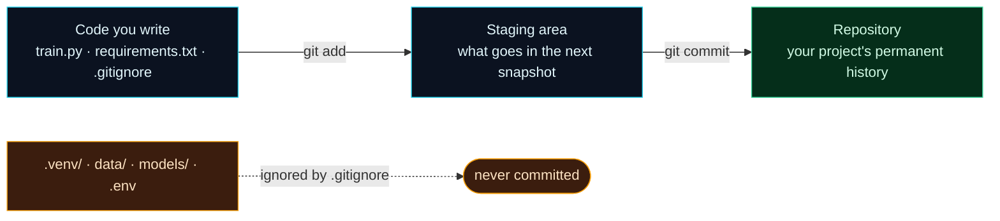

Welcome to **Day 4 of 100 Days of MLOps**. Your project now has code and a `requirements.txt`, but it has no *memory*. If you break something, there's no undo. If you want to see what changed since yesterday, you can't. If a teammate wants a copy, you're emailing zip files. Today we fix all of that with **Git** — the tool that gives your project a complete, trustworthy history.

Git is the backbone of every stage of the MLOps loop: it versions the code behind your data pipelines, your training scripts, and your deployment configs. You installed it on Day 1. Today you'll actually use it — and, just as importantly, you'll learn the ML-specific skill of telling Git what to **ignore**, so your repository stays clean and small.

> **Never used Git before? We start from absolute zero.** No prior knowledge assumed. By the end you'll have a real repository with a clean history, and you'll understand the three commands you'll use every single day for the rest of your career: `add`, `commit`, `status`.

By the end of today you will:

- Understand what Git is and the **working directory → staging area → repository** model.
- Run the everyday commands: **`init`, `status`, `add`, `commit`, `log`**.
- Write an **ML-aware `.gitignore`** that keeps `.venv`, datasets, models and secrets out of Git.
- Have the `house-prices` project under version control with a clean initial history.

---

## What is Git, and why every ML project needs it

**Git is a version-control system** — software that records snapshots of your project over time. Each snapshot is called a **commit**, and it captures exactly what every file looked like at that moment, along with a message describing the change. The full chain of commits is your project's **history**.

Why this matters enormously for ML:

- **Undo anything.** Made your model worse? Jump back to the commit where it worked.
- **See what changed.** Git shows you exactly which lines changed between any two points in time.
- **Collaborate safely.** Multiple people (or just you on multiple machines) can work without overwriting each other.
- **Reproducibility.** Remember Day 2 — an ML result depends on *code + data + settings*. Git versions the code and settings precisely, so "which version of the training script produced this model?" always has an answer.

Git has a mental model that trips up every beginner for about a day, and then clicks forever. There are **three places** a file can be:



**Reading this diagram:**

Follow the top row left to right — this is the normal life of a file. On the left, in **cyan**, is **the code you write** in your project folder (also called the *working directory*). When you're happy with some changes, you run **`git add`**, which moves them into the **staging area** — think of it as a box where you gather up the changes you want to save together. It's a deliberate "on-deck" step: you choose exactly what goes into the next snapshot. Then **`git commit`** seals that box into the **repository** (the **green** node) — a permanent, named entry in your history. Add, then commit: stage your changes, then snapshot them.

Now look at the bottom row, in **amber**. Some things in your project folder should **never** be snapshotted: your `.venv` (hundreds of megabytes, and machine-specific), your datasets and trained models (too big for Git — we version those with DVC later), and your `.env` secrets (which must never leave your machine). The **dotted arrow** shows these being caught by a special file called **`.gitignore`** and sent to "never committed." They still exist on your disk; Git just politely pretends not to see them.

The takeaway: Git is a two-step *stage-then-snapshot* system, and a good `.gitignore` is what keeps an ML repo clean instead of bloated with gigabytes of data and environment files.

---

## Step 0 — A one-time setup (identity + default branch)

Git stamps every commit with your name and email, so it needs to know who you are. You only ever do this **once per machine**. Run these with your own details:

```bash
git config --global user.name "Your Name"
git config --global user.email "you@example.com"
```

While we're here, set the default branch name to the modern standard, `main` (older Git defaults to `master`):

```bash
git config --global init.defaultBranch main
```

If you skip the identity step, your first commit will stop you with a friendly reminder — we'll see that exact message in the errors section.

---

## Step 1 — Put the project under version control

Let's version the `house-prices` project. Set up a folder like this (you can reuse Day 3's project, or make a fresh `house-prices` folder). It has some real code, plus the kinds of things that should *not* go into Git:

```text
house-prices/
├── train.py            ← your code (belongs in Git)
├── requirements.txt    ← your recipe (belongs in Git)
├── .venv/              ← environment (do NOT commit)
├── data/               ← datasets (do NOT commit)
└── models/             ← trained models (do NOT commit)
```

Open a terminal in that folder and turn it into a Git repository:

```bash
git init
```

```text
Initialized empty Git repository in /path/to/house-prices/.git/
```

That created a hidden `.git` folder — the repository's brain, where all history lives. You never touch it directly. Now ask Git what it sees:

```bash
git status
```

```text
On branch main

No commits yet

Untracked files:
  (use "git add <file>..." to include in what will be committed)
	.gitignore
	requirements.txt
	train.py

nothing added to commit but untracked files present (use "git add" to track)
```

`git status` is the command you'll run more than any other — it always tells you where you stand. Right now everything is **untracked** (Git sees the files but isn't recording them yet). But wait — notice that `.venv/`, `data/`, and `models/` are **not** in that list, even though they're in the folder. That's because of the `.gitignore` we're about to look at. (If you *do* see them listed, you haven't created `.gitignore` yet — do the next step.)

---

## Step 2 — Write an ML-aware .gitignore

A **`.gitignore`** is a plain text file that lists patterns Git should ignore. For ML projects this file is essential, because our folders fill up with things that must never be committed. Create a file named exactly **`.gitignore`** (with the leading dot, no extension) in your project root and paste this in:

```text
# Virtual environment — big and machine-specific; rebuild from requirements.txt
.venv/
venv/

# Python cache files
__pycache__/
*.pyc

# Datasets and trained models — too big for Git; we'll version these with DVC later
data/
models/
*.joblib
*.pkl

# Secrets — never commit these
.env

# Jupyter notebook checkpoints
.ipynb_checkpoints/

# macOS / editor junk
.DS_Store
```

Each block earns its place:

- **`.venv/`** — your environment is hundreds of MB and specific to your OS. It's reproducible from `requirements.txt`, so committing it is pure waste (Day 3).
- **`data/` and `models/`** — datasets and trained model files are often huge and change constantly; Git is the wrong tool for them. We'll version them properly with **DVC** in Module 3.
- **`.env`** — this will hold secrets like API keys later in the series. Committing secrets is a genuine security incident. Ignore it from day one.
- **`__pycache__/`, `.ipynb_checkpoints/`, `.DS_Store`** — machine-generated clutter nobody needs in history.

You can *prove* Git is ignoring the right things with `git check-ignore`:

```bash
git check-ignore .venv/ data/ models/model.joblib
```

```text
.venv/
data/
models/model.joblib
```

Git echoes back exactly the paths it's ignoring — confirmation your `.gitignore` is doing its job.

---

## Step 3 — Your first commit

Now let's take the first snapshot. First, **stage** everything Git is tracking (the `.` means "everything in this folder that isn't ignored"):

```bash
git add .
```

Check what's now staged:

```bash
git status
```

```text
On branch main

No commits yet

Changes to be committed:
  (use "git rm --cached <file>..." to unstage)
	new file:   .gitignore
	new file:   requirements.txt
	new file:   train.py
```

Exactly the three files that belong in Git are staged — and `.venv`, `data`, `models` are nowhere to be seen. That's the `.gitignore` working. Now **commit** the snapshot with a message describing it:

```bash
git commit -m "Initial house-prices project: train stub, requirements, gitignore"
```

```text
[main (root-commit) d0d9ac0] Initial house-prices project: train stub, requirements, gitignore
 3 files changed, 26 insertions(+)
 create mode 100644 .gitignore
 create mode 100644 requirements.txt
 create mode 100644 train.py
```

You just made your first commit — a permanent, named point in history. See it with:

```bash
git log --oneline
```

```text
d0d9ac0 Initial house-prices project: train stub, requirements, gitignore
```

(That short code, `d0d9ac0`, is the commit's unique ID — your history's first entry. Yours will differ.)

---

## Step 4 — The everyday rhythm: change, stage, commit

This is the loop you'll repeat forever. Make a change to `train.py` (add a line, say `print("step 1: load the data")`), then check what Git noticed:

```bash
git status --short
```

```text
 M train.py
```

The `M` means **modified**. Git spotted your edit. Stage and commit it:

```bash
git add train.py
git commit -m "Add data-loading step to train.py"
```

Now your history has two entries:

```bash
git log --oneline
```

```text
a882057 Add data-loading step to train.py
d0d9ac0 Initial house-prices project: train stub, requirements, gitignore
```

That's the whole daily rhythm: **edit → `git status` → `git add` → `git commit`.** Small, frequent commits with clear messages give you a history you can actually navigate. From here on, every project in this series starts with `git init` and a `.gitignore`.

---

## Common errors (and how to fix them)

**1. `Author identity unknown — *** Please tell me who you are.`**

You tried to commit before telling Git who you are:

```text
Author identity unknown

*** Please tell me who you are.

Run

  git config --global user.email "you@example.com"
  git config --global user.name "Your Name"

to set your account's default identity.
```

Fix: run those two `git config --global` commands (Step 0) with your details, then commit again.

**2. `fatal: not a git repository (or any of the parent directories): .git`**

You ran a `git` command in a folder that isn't a repository. Either you forgot `git init`, or your terminal is in the wrong folder. Run `git init` in your project root, or `cd` into the right folder.

**3. `The following paths are ignored by one of your .gitignore files`**

This appears if you try to `git add data/` (or another ignored path):

```text
The following paths are ignored by one of your .gitignore files:
data
hint: Use -f if you really want to add them.
```

This is **Git working correctly**, not an error to fight. Those paths are ignored on purpose. Don't reach for `-f` to force them in — that's exactly what we're avoiding. (Big data belongs in DVC, coming in Module 3.)

**4. `.gitignore` isn't working — a file keeps showing up**

`.gitignore` only ignores files that Git **isn't already tracking**. If you committed `.venv` *before* adding it to `.gitignore`, Git keeps tracking it. Stop tracking it (while keeping it on disk) with:

```bash
git rm -r --cached .venv
git commit -m "Stop tracking .venv"
```

**5. You committed a huge dataset or `.venv` and the repo is now bloated**

Same fix as above — `git rm -r --cached <path>` untracks it going forward and add the pattern to `.gitignore`. (Purging it from *past* history is a bigger job with `git filter-repo`; far easier to never commit it, which is why the `.gitignore` comes first.)

**6. You committed a `.env` with a real secret**

Untrack it immediately (`git rm --cached .env`), add `.env` to `.gitignore`, and — importantly — **treat that secret as compromised and rotate it** (generate a new key). Anything committed to Git should be assumed to live forever. This is why `.env` is in our `.gitignore` from the very first commit.

---

## Recap — what you now have

Your project has a memory:

- You understand Git's **working directory → staging area → repository** model and the *stage-then-snapshot* rhythm.
- You can run the everyday commands: **`init`, `status`, `add`, `commit`, `log`**.
- You wrote an **ML-aware `.gitignore`** that keeps `.venv`, `data/`, `models/`, and `.env` out of version control — and proved it with `git check-ignore`.
- The `house-prices` project is under version control with a clean history.

**Your cheat sheet:**

| Command | What it does |
|---------|--------------|
| `git init` | Turn the current folder into a repository |
| `git status` | Show what's changed / staged (run this constantly) |
| `git add <file>` / `git add .` | Stage a file / everything for the next commit |
| `git commit -m "message"` | Snapshot the staged changes into history |
| `git log --oneline` | List the commit history compactly |
| `git check-ignore <path>` | Confirm a path is being ignored |
| `git rm -r --cached <path>` | Stop tracking something you shouldn't have committed |

Golden rule for ML repos: **commit code and recipes; ignore environments, data, models and secrets.**

---

## Coming up on Day 5

You now write code in `.py` files — but a huge amount of ML work happens in **Jupyter notebooks**, the interactive scratchpads where you explore data and try ideas. **Day 5 — "Notebooks vs Scripts"** shows you both worlds and, crucially, when to use each: notebooks for exploration, clean `.py` scripts for anything that needs to run reliably (which is most of MLOps). You'll run your first notebook, then convert it into a proper script with `nbconvert` — the exact workflow for taking an experiment from "messing around" to "part of a pipeline."

See the full roadmap on the [100 Days of MLOps series page](/series/100-days-mlops). See you tomorrow.
