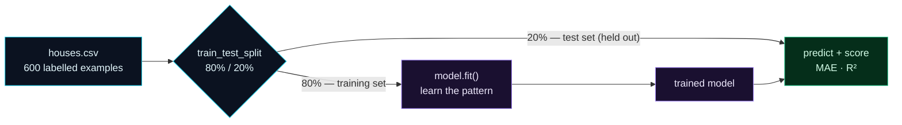

Welcome to **Day 6 of 100 Days of MLOps** — the day the "ML" finally shows up. Days 1–5 built your foundation: a working lab, isolated environments, version control, and the notebook-to-script workflow. Today we reach the **Train** stage of the lifecycle and do the thing this whole series orbits around: **we train a model.**

By the end of this lesson you'll have a program that reads house data, learns the relationship between a house's features and its price, and predicts the price of a house it has never seen — and you'll understand every line of it and every number it prints. No hand-waving.

> **Never trained a model before? This is the one.** We go slowly and define every term — features, target, training, test set, MAE, R² — in plain English as it comes up. If you can read a spreadsheet, you can follow this.

By the end of today you will:

- Understand what "training a model" actually **means**, in plain English.
- Know the **golden rule** of honest evaluation: the train/test split.
- Train a real **scikit-learn** model on the house-prices data.
- Measure it with **MAE** and **R²**, and know whether it's any good (does it beat the baseline?).

---

## What does "training a model" actually mean?

Strip away the mystique and a machine-learning model is just this: **a function that turns inputs into an output.** For us, the inputs are a house's features (its size, bedrooms, age, location) and the output is a predicted price.

The features have names:

- **Features** (often written **X**) — the *inputs*, the things we know about a house. Here: `size_sqft`, `bedrooms`, `age_years`, `location_score`.
- **Target** (often written **y**) — the *output* we want to predict. Here: `price`.

**Training** is the process of showing the model many past examples — houses where we already know the price — and letting it automatically figure out the pattern connecting features to price. Because we're teaching it with examples that already have the right answers, this is called **supervised learning**. And because the answer we predict is a *number* (a price), this specific kind of problem is called **regression**. (If we were predicting a *category* — spam / not-spam — that would be *classification*, which we'll meet on Day 13.)

So the plan is simple and it maps exactly onto four steps:

1. **Load** the example houses.
2. **Split** them into a set to learn from and a set to test on.
3. **Train** a model on the learning set.
4. **Measure** how well it predicts on the test set.

---

## The golden rule: never test on what you trained on

Step 2 hides the single most important idea in all of practical ML, so let's make it stick with an analogy.

Imagine a student who is given the exam questions *and answers* to study, then sits the exact same paper. A perfect score proves nothing — they might have just memorised it. To know if they *actually learned*, you must test them on questions they haven't seen.

Models are the same. If you measure a model on the very data it trained on, it can score suspiciously well by essentially "memorising" — a failure called **overfitting** — and then fall apart on real, new houses. So we **hold back** a portion of our data (say 20%), never let the model see it during training, and use it only at the end to grade the model honestly. That held-back portion is the **test set**.



**Reading this diagram:**

On the left, in **cyan**, is all our data — 600 houses where we know both the features *and* the true price. The diamond, `train_test_split`, is the fork in the road: it randomly divides the data into two piles. The big pile (80%, the **training set**) flows up into `model.fit()` — the **purple** "learning" step where the model studies the examples and works out the pattern. The result is a **trained model** (also purple).

The small pile (20%, the **test set**) takes a completely separate path along the bottom — notice it does **not** touch `model.fit()`. It goes straight to the **green** evaluation step, where the trained model tries to predict those held-out houses' prices and we score how close it got. Green, our "trustworthy result" colour, is earned precisely *because* the model never saw this data while training. The whole shape of the diagram — two piles, two separate paths, meeting only at the end — is the picture of honest evaluation. Memorise this; every model you ever build follows it.

---

## Step 1 — Get the data

Since this whole series is 100% local, we'll generate our own realistic house dataset rather than downloading one. (In Module 2 you'll learn to work with real external datasets; the techniques are identical.) Make sure your virtual environment from Day 3 is active and has the ML trio installed:

```bash
pip install numpy pandas scikit-learn
```

Create a file called **`make_dataset.py`** and paste this in. It builds a believable set of house sales using a fixed random seed, so **everyone who runs it gets the exact same data** — your first taste of the reproducibility we'll formalise on Day 10.

```python
"""
make_dataset.py — generates the house-prices dataset we use across the series.

Creates a realistic (but synthetic, so it stays 100% local and reproducible)
CSV of house sales. A fixed random seed means everyone gets the *same* data.

Run it:  python make_dataset.py   →   writes houses.csv
"""

import numpy as np
import pandas as pd

rng = np.random.default_rng(42)          # fixed seed → identical data every run
n = 600

size_sqft = rng.integers(600, 3500, n)
bedrooms = rng.integers(1, 6, n)
age_years = rng.integers(0, 80, n)
location_score = rng.integers(1, 11, n)   # 1 (remote) … 10 (prime area)

# A believable price built from the features, plus real-world noise.
noise = rng.normal(0, 25000, n)
price = (
    30000
    + 140 * size_sqft
    + 12000 * bedrooms
    - 900 * age_years
    + 20000 * location_score
    + noise
)
price = np.clip(price, 50000, None).round(-2)  # floor + round to nearest $100

df = pd.DataFrame({
    "size_sqft": size_sqft,
    "bedrooms": bedrooms,
    "age_years": age_years,
    "location_score": location_score,
    "price": price.astype(int),
})
df.to_csv("houses.csv", index=False)
print(f"Wrote houses.csv with {len(df)} rows")
print(df.head())
```

Run it:

```bash
python make_dataset.py
```

```text
Wrote houses.csv with 600 rows
   size_sqft  bedrooms  age_years  location_score   price
0        858         4         70               1  130500
1       2844         4         38               5  520400
2       2498         4         78               5  519000
3       1872         1         60               3  355100
4       1855         5         52               2  332600
```

You now have `houses.csv` — 600 rows, each a house with four features and a known sale price. That's our labelled data.

---

## Step 2–4 — Load, split, train, measure

Now the main event. Create **`train.py`** and paste this in. Read the comments — each numbered block is one of our four steps.

```python
"""
train.py — Day 6 of 100 Days of MLOps.

Your first end-to-end model: load data → split → train → measure.
Predicts a house's sale price from its features using scikit-learn.

Run it:  python train.py
"""

import pandas as pd
from sklearn.linear_model import LinearRegression
from sklearn.metrics import mean_absolute_error, r2_score
from sklearn.model_selection import train_test_split

# 1. LOAD ------------------------------------------------------------------
df = pd.read_csv("houses.csv")
print(f"Loaded {len(df)} houses")

# The features (X) are what we learn from; the target (y) is what we predict.
features = ["size_sqft", "bedrooms", "age_years", "location_score"]
X = df[features]
y = df["price"]

# 2. SPLIT -----------------------------------------------------------------
# Hold back 20% the model never sees in training, so we can test it honestly.
X_train, X_test, y_train, y_test = train_test_split(
    X, y, test_size=0.2, random_state=42
)
print(f"Training on {len(X_train)} houses, testing on {len(X_test)}")

# 3. TRAIN -----------------------------------------------------------------
model = LinearRegression()
model.fit(X_train, y_train)

# 4. MEASURE ---------------------------------------------------------------
predictions = model.predict(X_test)
mae = mean_absolute_error(y_test, predictions)
r2 = r2_score(y_test, predictions)

# Baseline to beat (from the Day 2 charter): "always guess the average price".
baseline_mae = mean_absolute_error(y_test, [y_train.mean()] * len(y_test))

print("\nResults on the held-out test set")
print("-" * 40)
print(f"  Baseline MAE (guess the mean): ${baseline_mae:,.0f}")
print(f"  Model MAE:                     ${mae:,.0f}")
print(f"  R² score:                      {r2:.3f}")
print("-" * 40)

# 5. USE IT ----------------------------------------------------------------
example = pd.DataFrame([{
    "size_sqft": 1800, "bedrooms": 3, "age_years": 10, "location_score": 7,
}])
predicted = model.predict(example)[0]
print(f"\nA 1800 sqft, 3-bed, 10-yr-old house in a good area → ${predicted:,.0f}")
```

A few lines deserve a callout:

- **`train_test_split(... random_state=42)`** does the 80/20 division from the diagram. The `random_state=42` fixes the "random" shuffle so your split matches ours exactly (reproducibility again).
- **`LinearRegression()`** is our model. Linear regression fits the best straight-line relationship between the features and price. It's simple, fast, and a great first model — never dismiss simple models, they're often the right call.
- **`model.fit(X_train, y_train)`** is the actual training: this one line is where learning happens.
- **`model.predict(X_test)`** asks the trained model for its price guesses on the held-out houses.

Run it:

```bash
python train.py
```

```text
Loaded 600 houses
Training on 480 houses, testing on 120

Results on the held-out test set
----------------------------------------
  Baseline MAE (guess the mean): $112,181
  Model MAE:                     $21,723
  R² score:                      0.960
----------------------------------------

A 1800 sqft, 3-bed, 10-yr-old house in a good area → $448,555
```

**You just trained a machine-learning model end to end.** Let's understand what it's telling you.

---

## Reading the numbers

Two metrics tell you whether your regression model is any good.

**MAE (Mean Absolute Error)** — on average, how many dollars off are the predictions? Our model's MAE is about **$21,700**. That means, typically, its price guess is within ~$22k of the true price. Lower is better. MAE is lovely because it's in the same units as the thing you're predicting (dollars), so it's easy to explain to anyone.

**But is $21,700 good?** You can't know from the number alone — you need something to compare it against. That's the **baseline** from your Day 2 charter: *"always guess the average price."* A model that can't beat that dumb strategy is worthless. Our baseline MAE is **$112,181** — so the model (**$21,723**) is more than **5× better** than guessing the mean. *That* is how you know it learned something real.

**R² (R-squared)** — a score from 0 to 1 for how much of the price variation the model explains. **0** means "no better than always guessing the mean"; **1** means "perfect." Our **0.960** means the model explains 96% of what makes prices differ — excellent (helped by our data being fairly clean; real-world data is messier, and that's fine).

> **The charter comes alive.** Back on Day 2 you wrote down a success metric (MAE) and a baseline to beat (guess the mean). Today those weren't academic — they're the exact two numbers that told you the model works. That's why we insisted on writing them down first.

---

## Common errors (and how to fix them)

**1. `FileNotFoundError: [Errno 2] No such file or directory: 'houses.csv'`**

`train.py` looks for `houses.csv` in the folder your terminal is in. Run `make_dataset.py` first (in the same folder), and run both from that folder.

**2. `KeyError: "['bedroms'] not in index"`**

A typo in a column name — pandas can't find a column you asked for:

```text
KeyError: "['bedroms'] not in index"
```

Column names must match the CSV header exactly (`bedrooms`, not `bedroms`). Check spelling and capitalisation.

**3. `UserWarning: X does not have valid feature names, but LinearRegression was fitted with feature names`**

You called `predict` with a bare Python list (`[[1800, 3, 10, 7]]`) instead of a DataFrame. It still works, but scikit-learn warns because it can't check the columns line up. Predict with a DataFrame that has the same columns (as `train.py` does with the `example`), and the warning disappears — and you're protected from silently passing features in the wrong order.

**4. `ValueError: could not convert string to float`**

Linear regression only understands numbers. If a feature is text (like a location *name* instead of a *score*), you'll hit this. For now all our features are numeric on purpose; turning text features into numbers ("encoding") is exactly what Day 15 covers.

**5. Your R² is negative, or the model does worse than the baseline**

A negative R² means the model is literally worse than guessing the mean — usually a sign of a bug: you swapped X and y, trained on the wrong columns, or your features have no real relationship to the target. Re-check that `X` is the features and `y` is the target, and that you're scoring on `y_test` vs predictions on `X_test`.

**6. Suspiciously perfect scores (R² = 1.000, MAE ≈ 0)**

Almost always **data leakage** — the model saw the answers. The classic cause is evaluating on the training data instead of the held-out test set, or accidentally leaving the target inside your features (`X`). Always score on `X_test`/`y_test`, and make sure `price` is only in `y`, never in `X`.

---

## Recap — what you now have

You crossed the line from setup into machine learning:

- You understand **features (X)**, **target (y)**, **supervised learning**, and **regression** in plain English.
- You know the **golden rule** — train on one split, evaluate on a held-out **test set** — and why it prevents overfitting.
- You trained a real **scikit-learn** `LinearRegression` model on the house-prices data.
- You measured it with **MAE** and **R²**, compared against a **baseline**, and confirmed it genuinely learned (5× better than guessing).

**Your cheat sheet — the four-step arc:**

| Step | scikit-learn | What it does |
|------|--------------|--------------|
| Load | `pd.read_csv(...)`, pick `X` and `y` | Get features and target |
| Split | `train_test_split(X, y, test_size=0.2, random_state=42)` | Hold back a test set |
| Train | `model.fit(X_train, y_train)` | Learn the pattern |
| Measure | `model.predict(X_test)`, `mean_absolute_error`, `r2_score` | Grade it honestly |

Golden rule: **always keep a test set the model never trains on** — and always compare against a baseline.

---

## Coming up on Day 7

Your trained model currently vanishes the moment the script ends — every run retrains from scratch. Real systems can't do that; they train once and reuse the model thousands of times. **Day 7 — "Saving & Loading Models"** shows you how to **persist** a trained model to a file with `joblib`, load it back in a completely separate script, and make predictions without retraining — the essential bridge from "Train" to "Package" in the lifecycle, and the first step toward serving your model to the world.

See the full roadmap on the [100 Days of MLOps series page](/series/100-days-mlops). See you tomorrow.
