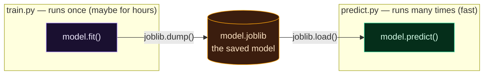

Welcome to **Day 7 of 100 Days of MLOps**. Yesterday you trained a real model — but did you notice its fatal flaw? The moment `train.py` finished, the model **disappeared**. It lived only in memory, so every single run started from scratch, retraining before it could predict anything.

That's fine for learning. It's impossible for production. Real systems **train once** (maybe an expensive job that takes hours) and then **reuse that one model thousands or millions of times** to serve predictions. To do that, you need to save the trained model to a file and load it back later — a skill called **persistence**, and it's the bridge from the "Train" stage of the lifecycle to "Package" and "Serve."

> **This is a short, high-leverage day.** One new tool (`joblib`), two small scripts, and one important gotcha that trips up real teams. By the end you'll separate *training* from *predicting* the way every production ML system does.

By the end of today you will:

- Save a trained model to a file with **`joblib`** — and understand why we bundle it with its feature names.
- Load that model in a **completely separate program** and predict without any training code.
- Understand the **"works on my machine" version trap** and why it makes `requirements.txt` matter.
- Know why trained models belong in **DVC / a registry**, never in Git.

---

## The idea: train once, predict many times

A trained model is really just a bunch of learned numbers (for our linear regression: one coefficient per feature, plus an intercept). **Persistence** means writing those numbers to a file so you can reload the exact same model later, in a different program, on a different day, without retraining.

Picture the two halves as separate programs connected by a single file:



**Reading this diagram:**

There are two boxes here, and the whole point is that they're **separate programs**. On the left, the **purple** box is `train.py` — the expensive part, where `model.fit()` does the learning. It runs **once**. When it's done, the arrow labelled `joblib.dump()` writes the trained model out to the **amber cylinder** in the middle: `model.joblib`. The cylinder shape means "stored data on disk" — this file is the model, frozen and saved.

On the right, the **green** box is `predict.py`, an entirely different program that runs **many times**. It doesn't train anything — it just uses `joblib.load()` to read `model.joblib` back into memory and calls `model.predict()`. Notice there's no arrow from `train.py` to `predict.py` directly; they never talk to each other. Their *only* connection is the file in the middle. That decoupling is the big idea: **you train offline, save the result, and serve predictions from the saved file** — which is exactly what we'll turn into a web service in Module 6.

---

## Step 1 — Save the model with joblib

`joblib` is a small library (it came along with scikit-learn on Day 3) that's the standard way to save scikit-learn models. It's like Python's built-in `pickle`, but optimised for the large number-arrays that models are full of.

Here's the key design choice we make: instead of saving *just* the model, we save a small **bundle** — the model **plus the list of feature names** it was trained on. Why? Because a bare model file is a trap: it doesn't tell you what inputs it expects, or in what order. Bundling that information means whoever loads it later (including future-you) can't get it wrong.

Update your `train.py` from Day 6 to this complete version (it trains, then saves):

```python
"""
train.py — Day 7 of 100 Days of MLOps.

Same as Day 6, but now we SAVE the trained model to a file so it can be reused
without retraining. We save the model together with the feature names it expects,
so whoever loads it knows exactly how to call it.

Run it:  python train.py   →   writes model.joblib
"""

import joblib
import pandas as pd
from sklearn.linear_model import LinearRegression
from sklearn.metrics import mean_absolute_error
from sklearn.model_selection import train_test_split

df = pd.read_csv("houses.csv")
features = ["size_sqft", "bedrooms", "age_years", "location_score"]
X = df[features]
y = df["price"]

X_train, X_test, y_train, y_test = train_test_split(
    X, y, test_size=0.2, random_state=42
)

model = LinearRegression()
model.fit(X_train, y_train)

mae = mean_absolute_error(y_test, model.predict(X_test))
print(f"Trained. Test MAE: ${mae:,.0f}")

# SAVE — bundle the model with the feature names it was trained on.
bundle = {"model": model, "features": features}
joblib.dump(bundle, "model.joblib")
print("Saved model to model.joblib")
```

(Make sure `houses.csv` from Day 6 is in this folder — copy it over, or re-run `make_dataset.py`.) Run it:

```bash
python train.py
```

```text
Trained. Test MAE: $21,723
Saved model to model.joblib
```

You now have a **`model.joblib`** file sitting in your folder — about 1 KB for this tiny model. That file *is* your trained model, frozen in time.

---

## Step 2 — Load it in a separate program and predict

Now the payoff. Create a **brand-new** file called **`predict.py`**. Look closely at what's *not* in it: no `LinearRegression`, no `fit()`, no `houses.csv`, no training whatsoever. It just loads the saved model and uses it.

```python
"""
predict.py — Day 7 of 100 Days of MLOps.

A completely separate program that LOADS the saved model and predicts — with no
training code at all. This is how real systems work: train once, predict many
times. Notice there is no LinearRegression, no fit(), no houses.csv here.

Run it (after train.py):  python predict.py
"""

import joblib
import pandas as pd

# LOAD the bundle we saved in train.py.
bundle = joblib.load("model.joblib")
model = bundle["model"]
features = bundle["features"]
print("Loaded model.joblib")

# A new house we want a price for.
new_house = {"size_sqft": 2000, "bedrooms": 4, "age_years": 5, "location_score": 8}

# Build a one-row DataFrame using the model's own feature order — no guessing.
X_new = pd.DataFrame([new_house])[features]
predicted = model.predict(X_new)[0]

print(f"House: {new_house}")
print(f"Predicted price: ${predicted:,.0f}")
```

Run it:

```bash
python predict.py
```

```text
Loaded model.joblib
House: {'size_sqft': 2000, 'bedrooms': 4, 'age_years': 5, 'location_score': 8}
Predicted price: $512,089
```

That prediction was **instant** — no training happened. And notice how the saved `features` list did real work: we used it (`[features]`) to arrange the new house's columns in exactly the order the model expects. That's the payoff of bundling metadata with the model. You've just separated training from serving — the foundational pattern behind every deployed model in the world.

---

## The "works on my machine" trap

Here's the gotcha that bites real ML teams, and it's a perfect illustration of why MLOps exists.

A saved model file is tightly bound to the **library versions** that created it. If you train with scikit-learn 1.9 and a teammate loads that `model.joblib` with scikit-learn 1.3, scikit-learn will warn you — because the internal format may have changed and the predictions could be subtly wrong. The warning reads like this:

```text
InconsistentVersionWarning: Trying to unpickle estimator LinearRegression
from version 1.9.0 when using version 1.3.0. This might lead to breaking
code or invalid results. Use at your own risk.
```

This is the "works on my machine" problem in its purest form: the *same model file* behaving differently depending on the environment it's loaded into. It's exactly why Day 3's **`requirements.txt`** matters so much — pinning `scikit-learn==1.9.0` means everyone loads the model with the same version that saved it. Later in the series, **model registries** (Module 4) go further and record the whole environment alongside each model, so a saved model always knows the world it was born in.

Two more things follow from a model being a saved file:

- **Models don't belong in Git.** They're binary, can be huge, and change every retrain — precisely why your Day 4 `.gitignore` excludes `*.joblib` and `models/`. We version them properly with **DVC** in Module 3.
- **Only load models you trust.** Loading a `joblib`/`pickle` file runs code embedded in it, so a malicious file could harm your machine. Never `joblib.load()` a model file from an untrusted source — same caution as running a downloaded script.

---

## Common errors (and how to fix them)

**1. `FileNotFoundError: [Errno 2] No such file or directory: 'model.joblib'`**

You ran `predict.py` before `train.py` (so the model file doesn't exist yet), or you're in the wrong folder:

```text
FileNotFoundError: [Errno 2] No such file or directory: 'model.joblib'
```

Run `python train.py` first to create `model.joblib`, then `python predict.py`, both from the same folder.

**2. `InconsistentVersionWarning: Trying to unpickle estimator ... from version X when using version Y`**

The model was saved with a different scikit-learn version than the one you're loading with. Reinstall the pinned versions from your `requirements.txt` (`pip install -r requirements.txt`) so the load version matches the save version. Don't ignore this — mismatched versions can silently produce wrong predictions.

**3. `ModuleNotFoundError: No module named 'sklearn'` when loading**

The environment you're loading in doesn't have scikit-learn installed. A saved model still needs its libraries present to be un-pickled. Activate the right virtual environment and `pip install -r requirements.txt`.

**4. Predictions look wrong / `UserWarning` about feature names**

You passed features in the wrong order or with the wrong names. This is exactly what the bundled `features` list prevents — always build your input with `pd.DataFrame([...])[features]` so the columns match what the model was trained on.

**5. `KeyError: 'model'` after loading**

You loaded an old `model.joblib` that saved the bare model, not the `{"model": ..., "features": ...}` bundle. Re-run the updated `train.py` to regenerate the bundle, or adjust your load code to match how it was saved.

**6. You committed `model.joblib` to Git by accident**

Models don't belong in version control. Untrack it with `git rm --cached model.joblib` and confirm `*.joblib` is in your `.gitignore` (it is, from Day 4). Model versioning is DVC's job, coming in Module 3.

---

## Recap — what you now have

You separated training from serving — the pattern behind every deployed model:

- You can **save** a trained model with `joblib.dump()` and **load** it with `joblib.load()`.
- You bundle the model **with its feature names** so it can never be called the wrong way.
- You wrote a `predict.py` that reuses the model **with no training code at all** — instant predictions.
- You understand the **version trap** (why `requirements.txt` matters) and why models live in **DVC/registries**, not Git.

**Your cheat sheet:**

| Task | Code |
|------|------|
| Save a model | `joblib.dump(bundle, "model.joblib")` |
| Load a model | `bundle = joblib.load("model.joblib")` |
| Bundle metadata | `{"model": model, "features": features}` |
| Predict safely | `model.predict(pd.DataFrame([row])[features])` |

Golden rule: **train once, save, then load-and-predict** — and pin your library versions so the model behaves the same everywhere.

---

## Coming up on Day 8

Your project now has several loose scripts — `make_dataset.py`, `train.py`, `predict.py` — plus data and a model file, all dumped in one folder. That works for three files; it becomes chaos at thirty. **Day 8 — "Project Structure That Scales"** gives your project a professional skeleton: a `src/` package for code, clear `data/` and `models/` folders, a config file so settings aren't hardcoded, and a README. It's how real ML projects stay navigable as they grow — and it makes everything that comes after (pipelines, testing, deployment) dramatically easier.

See the full roadmap on the [100 Days of MLOps series page](/series/100-days-mlops). See you tomorrow.
