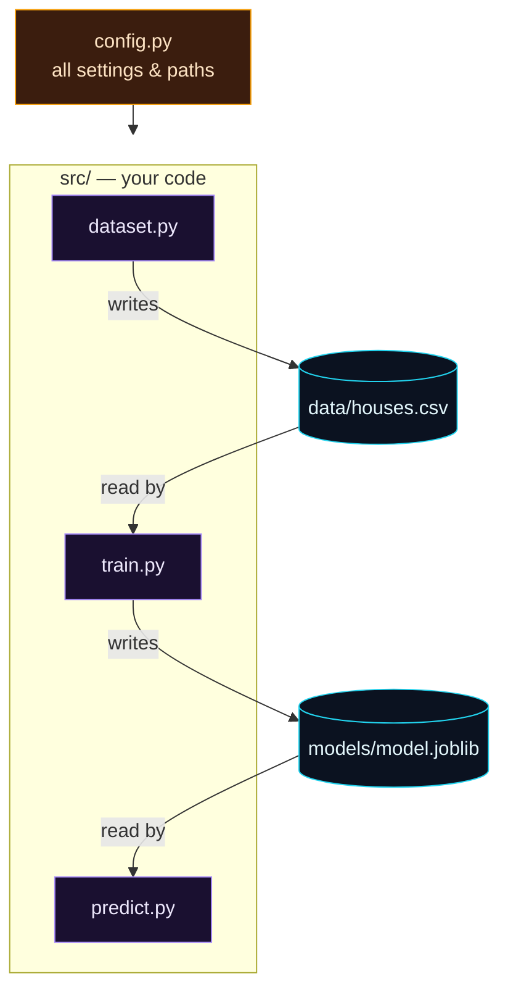

Welcome to **Day 8 of 100 Days of MLOps**. Look at your project folder right now: `make_dataset.py`, `train.py`, `predict.py`, `houses.csv`, `model.joblib`, `requirements.txt` — all dumped together in one directory. It *works*. But this is exactly the point where real projects start to rot: paths are hardcoded, settings are copy-pasted between files, and adding a tenth or twentieth script turns the folder into an unnavigable mess.

Today we fix that once and for all by giving the house-prices project a **professional structure** — the same shape you'll find in real ML repositories. This isn't busywork or aesthetics: good structure is what makes everything *after* this — pipelines, testing, packaging, deployment — dramatically easier. A tidy project is a project you can automate.

> **This is a refactoring day.** We don't add new ML — we reorganise what you've already built into a clean, scalable layout, and learn to run it as a proper Python package. The payoff compounds for the next 92 days.

By the end of today you will:

- Know the **standard ML project layout** and why each folder exists.
- Move all your code into a **`src/` package** and run it with `python -m`.
- Kill hardcoded paths and settings with a single **`config.py`** (and robust `pathlib` paths).
- Write a **README** so anyone — including future-you — can run the project in three commands.

---

## Why structure matters

Loose scripts cause four specific pains, and each folder in a good layout answers one:

- **"Where does anything live?"** → separate folders for **code**, **data**, **models**, **config**, **docs**.
- **"I changed `test_size` in one script but not the others."** → one **`config.py`** as the single source of settings.
- **"It only works if I run it from exactly the right folder."** → **`pathlib`** paths that work from anywhere.
- **"How do I even run this?"** → a **README** with the exact commands.

Here's the target layout for `house-prices`:

```text
house-prices/
├── README.md            ← how to set up and run
├── requirements.txt     ← pinned dependencies (Day 3)
├── .gitignore           ← ignore data/models/venv (Day 4)
├── config.py            ← all settings and paths, one place
├── data/                ← datasets (git-ignored)
│   └── houses.csv
├── models/              ← trained models (git-ignored)
│   └── model.joblib
└── src/                 ← your code, as a package
    ├── __init__.py
    ├── dataset.py
    ├── train.py
    └── predict.py
```

And here's how the pieces relate at runtime:



**Reading this diagram:**

At the top, in **amber**, sits **`config.py`** — the single place every setting and path lives. Its arrow points into the **purple `src/` box**, meaning *all three code modules read their settings from that one file*. Change `test_size` or a folder path once, in config, and `dataset.py`, `train.py` and `predict.py` all follow — no more editing the same number in three places.

Inside the purple box are the three code modules. Follow the arrows out of them to the **cyan cylinders** — the data stores on disk. `dataset.py` **writes** `data/houses.csv`; `train.py` **reads** that CSV and **writes** `models/model.joblib`; `predict.py` **reads** the model. Notice the clean separation: code lives in `src/`, but the *things code produces* — data and models — live in their own dedicated folders (the same folders your `.gitignore` keeps out of version control). The takeaway: **config feeds code; code reads and writes data/models in well-known places.** Everything has exactly one home.

---

## Step 1 — config.py: one home for every setting

Create **`config.py`** in the project root. This is where every path and knob now lives — no more magic numbers scattered across scripts.

```python
"""
config.py — one home for every setting and path in the project.

No more magic numbers or hardcoded paths scattered across scripts. Change a
setting here and every part of the project sees it. Paths are built relative to
this file, so the code runs correctly no matter which folder you launch it from.
"""

from pathlib import Path

# Paths (relative to the project root, wherever that lives on disk) -----------
ROOT = Path(__file__).resolve().parent
DATA_DIR = ROOT / "data"
MODELS_DIR = ROOT / "models"
HOUSES_CSV = DATA_DIR / "houses.csv"
MODEL_PATH = MODELS_DIR / "model.joblib"

# Data + model settings (the knobs, all in one place) ------------------------
N_SAMPLES = 600
FEATURES = ["size_sqft", "bedrooms", "age_years", "location_score"]
TARGET = "price"
TEST_SIZE = 0.2
RANDOM_STATE = 42
```

The star here is `ROOT = Path(__file__).resolve().parent`. It computes the project's folder from the location of `config.py` itself, then builds every other path from it. This means paths like `data/houses.csv` are **absolute and correct no matter where you run the code from** — the number-one fix for "it works on my machine but not yours." No more relative-path `FileNotFoundError` surprises.

---

## Step 2 — Move code into a src/ package

Create a **`src/`** folder with an empty **`src/__init__.py`** inside it. That empty file is what tells Python "`src` is a package" — a group of modules you can import from. Now put your three scripts inside `src/`, each rewritten to read from `config`.

**`src/dataset.py`** (was `make_dataset.py`):

```python
"""src/dataset.py — generate the house-prices dataset into data/houses.csv."""

import numpy as np
import pandas as pd

import config


def make_dataset():
    rng = np.random.default_rng(config.RANDOM_STATE)
    n = config.N_SAMPLES

    size_sqft = rng.integers(600, 3500, n)
    bedrooms = rng.integers(1, 6, n)
    age_years = rng.integers(0, 80, n)
    location_score = rng.integers(1, 11, n)
    noise = rng.normal(0, 25000, n)
    price = (
        30000 + 140 * size_sqft + 12000 * bedrooms
        - 900 * age_years + 20000 * location_score + noise
    )
    price = np.clip(price, 50000, None).round(-2)

    df = pd.DataFrame({
        "size_sqft": size_sqft,
        "bedrooms": bedrooms,
        "age_years": age_years,
        "location_score": location_score,
        "price": price.astype(int),
    })

    config.DATA_DIR.mkdir(parents=True, exist_ok=True)
    df.to_csv(config.HOUSES_CSV, index=False)
    print(f"Wrote {config.HOUSES_CSV.relative_to(config.ROOT)} ({len(df)} rows)")


if __name__ == "__main__":
    make_dataset()
```

**`src/train.py`**:

```python
"""src/train.py — train the model and save it to models/model.joblib."""

import joblib
import pandas as pd
from sklearn.linear_model import LinearRegression
from sklearn.metrics import mean_absolute_error
from sklearn.model_selection import train_test_split

import config


def train():
    df = pd.read_csv(config.HOUSES_CSV)
    X = df[config.FEATURES]
    y = df[config.TARGET]

    X_train, X_test, y_train, y_test = train_test_split(
        X, y, test_size=config.TEST_SIZE, random_state=config.RANDOM_STATE
    )

    model = LinearRegression()
    model.fit(X_train, y_train)

    mae = mean_absolute_error(y_test, model.predict(X_test))
    print(f"Trained. Test MAE: ${mae:,.0f}")

    config.MODELS_DIR.mkdir(parents=True, exist_ok=True)
    joblib.dump({"model": model, "features": config.FEATURES}, config.MODEL_PATH)
    print(f"Saved model to {config.MODEL_PATH.relative_to(config.ROOT)}")


if __name__ == "__main__":
    train()
```

**`src/predict.py`**:

```python
"""src/predict.py — load the saved model and predict one house's price."""

import joblib
import pandas as pd

import config


def predict(house: dict) -> float:
    bundle = joblib.load(config.MODEL_PATH)
    model, features = bundle["model"], bundle["features"]
    X_new = pd.DataFrame([house])[features]
    return model.predict(X_new)[0]


if __name__ == "__main__":
    house = {"size_sqft": 2000, "bedrooms": 4, "age_years": 5, "location_score": 8}
    price = predict(house)
    print(f"House: {house}")
    print(f"Predicted price: ${price:,.0f}")
```

Notice each script now (a) reads its settings from `config`, (b) uses `config.*` paths so it never guesses where files are, and (c) creates its output folder with `mkdir(parents=True, exist_ok=True)` so `data/` and `models/` appear automatically. And `predict.py` now exposes a reusable `predict(house)` **function** — that's what we'll wrap in a web service later.

---

## Step 3 — Run it as a package with `python -m`

Because your code now lives in a package, you run each part as a **module** from the project root, using the `-m` flag and dotted names:

```bash
python -m src.dataset    # generate data/houses.csv
python -m src.train      # train + save models/model.joblib
python -m src.predict    # load model + predict one house
```

```text
Wrote data/houses.csv (600 rows)
Trained. Test MAE: $21,723
Saved model to models/model.joblib
House: {'size_sqft': 2000, 'bedrooms': 4, 'age_years': 5, 'location_score': 8}
Predicted price: $512,089
```

Same results as before — but now everything is organised, configurable, and runs the same way every time. Why `python -m src.train` instead of `python src/train.py`? Running with `-m` treats `src` as a proper package and puts the project root on Python's import path, so `import config` and imports between your own modules resolve correctly. Running a file *by its path* doesn't set that up — which is one of the errors below.

---

## Step 4 — A README so anyone can run it

Finally, a **`README.md`** at the root. This is the front door of your project — the first thing a teammate (or you, six months from now) reads.

```markdown
# house-prices

Predict a house's sale price from its features. Part of 100 Days of MLOps.

## Setup
    python3 -m venv .venv && source .venv/bin/activate   # Windows: .venv\Scripts\Activate.ps1
    pip install -r requirements.txt

## Run
    python -m src.dataset    # generate data/houses.csv
    python -m src.train      # train + save models/model.joblib
    python -m src.predict    # load model + predict one house

## Layout
- `config.py` — all settings and paths
- `src/` — code (dataset, train, predict)
- `data/` — datasets (git-ignored)
- `models/` — trained models (git-ignored)
```

That's it. Three commands to reproduce everything, documented where people look first. This structure — `config.py`, `src/`, `data/`, `models/`, README — is the shape every project in the rest of this series will use.

---

## Common errors (and how to fix them)

**1. `No module named 'src'` when running `python -m src.train`**

You're not in the project root. The `-m src.train` form only works from the folder that *contains* `src/`:

```text
Error while finding module specification for 'src.train' (ModuleNotFoundError: No module named 'src')
```

`cd` back to the `house-prices` root and run it there.

**2. `ModuleNotFoundError: No module named 'config'` when running `python src/train.py`**

You ran the file *by path* instead of as a module:

```text
  File ".../src/train.py", line 9, in import config
ModuleNotFoundError: No module named 'config'
```

Running a file by path doesn't put the project root on the import path, so `import config` fails. Use the module form instead: `python -m src.train`.

**3. `src/` isn't recognised as a package**

You forgot the empty **`src/__init__.py`** file. Create it (it can be completely empty) — that's the marker that makes `src` an importable package.

**4. `FileNotFoundError` for `data/houses.csv` or `models/model.joblib`**

Run the steps in order: `dataset` before `train`, `train` before `predict`. Because we use `config` paths and `mkdir(parents=True)`, the folders create themselves — but the *data* only exists after `dataset` runs and the *model* only after `train` runs.

**5. You edited a setting and nothing changed**

You changed a hardcoded value inside a script instead of in `config.py`. The whole point of `config.py` is that settings live in exactly one place — change them there, not in the scripts.

**6. `data/` and `models/` got committed to Git**

Confirm your `.gitignore` (Day 4) lists `data/`, `models/`, and `*.joblib`. If they were committed before you ignored them, untrack with `git rm -r --cached data models`.

---

## Recap — what you now have

Your project went from a pile of scripts to a professional package:

- You know the **standard ML layout**: `src/` code, `data/` and `models/` outputs, `config.py`, README.
- All settings and paths live in **one `config.py`**, with `pathlib` paths that work from anywhere.
- Your code is a **package** you run with `python -m src.dataset / src.train / src.predict`.
- A **README** documents the whole thing in three commands.

**Your cheat sheet:**

| Piece | Purpose |
|-------|---------|
| `config.py` | All settings + paths in one place (`ROOT = Path(__file__).resolve().parent`) |
| `src/__init__.py` | Empty file that makes `src` a package |
| `python -m src.train` | Correct way to run a module inside the package |
| `data/`, `models/` | Generated outputs, git-ignored |
| `README.md` | Setup + run instructions, the project's front door |

Golden rule: **code in `src/`, settings in `config.py`, outputs in `data/`/`models/`, run with `python -m`.**

---

## Coming up on Day 9

You now run the project with three separate commands — and you type them by hand every time. **Day 9 — "Task Automation, Cross-OS"** replaces that with one-word commands: `make setup`, `make train`, `make clean`. You'll learn `Makefile`s for macOS/Linux and the cross-platform `invoke` tool for Windows, so the whole team runs the project the same way with a single command. Automating your own workflow is the first real taste of the "Ops" in MLOps.

See the full roadmap on the [100 Days of MLOps series page](/series/100-days-mlops). See you tomorrow.
