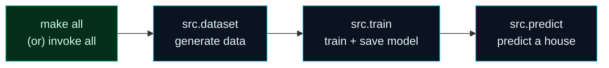

Welcome to **Day 9 of 100 Days of MLOps**. Yesterday you gave your project a clean structure — but to run it you still type three separate commands by hand, in the right order, every single time:

```bash
python -m src.dataset
python -m src.train
python -m src.predict
```

That's three chances to make a typo, forget a step, or run them out of order. And when a teammate joins, you have to explain the whole sequence. Today we replace all of that with **one word**. This is your first real taste of the "Ops" in MLOps: **automating your own workflow** so it's fast, repeatable, and identical for everyone on the team.

> **A short, satisfying day.** Two small tools, a handful of one-line commands, and your project suddenly runs itself. We cover the classic (`make`) *and* the cross-platform option (`invoke`) so no matter your OS, you're covered.

By the end of today you will:

- Understand **task runners** and why automating your workflow matters.
- Write a **`Makefile`** to run your pipeline on macOS/Linux with `make all`, `make clean`.
- Write a cross-platform **`tasks.py`** with `invoke` that works on **Windows too**.
- Know exactly **which tool to reach for** on which machine.

---

## The idea: one command for a whole workflow

A **task runner** lets you give a name to a sequence of commands, then run that sequence by name. Instead of remembering and typing three commands, you type one — `make all` — and the tool runs them in the right order.



**Reading this diagram:**

On the left, in **green**, is the single command you type: `make all` (or its cross-OS twin `invoke all`). Green is our "this is the goal / the thing you rely on" colour — and here the goal is *one simple command*. From it, the arrows flow left to right through the three **cyan** steps — generate data, train the model, predict — **in order**. The task runner guarantees that order: `train` only runs after `data`, `predict` only after `train`. The takeaway is simple but powerful: **you press one button; the tool runs the whole pipeline correctly, the same way, every time.** That reliability is the entire reason automation is a core MLOps skill — the same one-command idea later drives CI/CD and scheduled retraining.

We'll build this with two tools, because of one wrinkle: **`make` isn't available on Windows by default.** So we learn the classic first, then the cross-platform option.

---

## Option A — Makefile (macOS / Linux)

`make` is a decades-old automation tool that comes pre-installed on macOS and Linux (on macOS it arrives with the Xcode Command Line Tools you may have installed on Day 1). It reads a file called **`Makefile`** that lists **targets** — named tasks — and the commands to run for each.

Create a file named exactly **`Makefile`** (no extension) in your project root:

```makefile
.PHONY: setup data train predict all clean

setup:            ## install dependencies
	pip install -r requirements.txt

data:             ## generate the dataset
	python -m src.dataset

train:            ## train and save the model
	python -m src.train

predict:          ## predict one house
	python -m src.predict

all: data train predict   ## run the whole pipeline

clean:            ## delete generated data, models and caches
	rm -rf data models src/__pycache__ __pycache__
```

Two things to understand:

- Each **target** (`setup`, `data`, …) is a named task; the indented line under it is the command that runs. The line `all: data train predict` means "to make `all`, first make `data`, then `train`, then `predict`" — that's how one command chains the whole pipeline.
- **`.PHONY`** at the top tells `make` these targets are just task names, not real files it should look for. Always list your task names there.

> **⚠️ The one Makefile rule that trips up everyone: recipe lines must be indented with a real TAB, not spaces.** This is non-negotiable in `make`. If your editor inserts spaces, you'll get a cryptic `missing separator` error (see the errors section). In VS Code, when you open a file named `Makefile` it switches to tab indentation automatically — but double-check the bottom status bar shows **"Tab"** and not "Spaces" while editing it.

Now run your whole pipeline with one command:

```bash
make all
```

```text
python -m src.dataset
Wrote data/houses.csv (600 rows)
python -m src.train
Trained. Test MAE: $21,723
Saved model to models/model.joblib
python -m src.predict
House: {'size_sqft': 2000, 'bedrooms': 4, 'age_years': 5, 'location_score': 8}
Predicted price: $512,089
```

`make` prints each command as it runs it, then the command's output. And when you want a clean slate:

```bash
make clean
```

```text
rm -rf data models src/__pycache__ __pycache__
```

One word to run everything; one word to reset. That's the whole appeal.

---

## Option B — invoke (works everywhere, including Windows)

`make` is great, but its `rm -rf` recipe won't work in Windows' Command Prompt, and Windows has no `make` at all. Since our whole project is Python, we can use a **Python-based task runner** that behaves identically on every OS: **`invoke`**.

Install it into your virtual environment (and add it to `requirements.txt`):

```bash
pip install invoke
```

Now create **`tasks.py`** in your project root. Each `@task` function is a command you can run, and because it's Python, even the "clean" step is cross-platform:

```python
"""
tasks.py — cross-OS task runner (works on Windows too, unlike make).

Run:  invoke --list        (see all tasks)
      invoke all           (data -> train -> predict)
      invoke clean
"""

import shutil

from invoke import task


@task
def setup(c):
    """Install dependencies from requirements.txt."""
    c.run("pip install -r requirements.txt")


@task
def data(c):
    """Generate the dataset."""
    c.run("python -m src.dataset")


@task
def train(c):
    """Train and save the model."""
    c.run("python -m src.train")


@task
def predict(c):
    """Predict one house's price."""
    c.run("python -m src.predict")


@task(data, train, predict)
def all(c):
    """Run the whole pipeline: data -> train -> predict."""


@task
def clean(c):
    """Delete generated data, models and caches (cross-OS)."""
    for path in ["data", "models", "src/__pycache__", "__pycache__"]:
        shutil.rmtree(path, ignore_errors=True)
    print("Cleaned data/, models/ and caches")
```

A few nice touches: each function's docstring becomes its help text; `@task(data, train, predict)` declares those as **pre-tasks** so `invoke all` runs them first, in order; and `clean` uses Python's `shutil.rmtree` instead of `rm`, so it works the same on Windows, macOS and Linux.

List every available task (note it reads your docstrings):

```bash
invoke --list
```

```text
Available tasks:

  all       Run the whole pipeline: data -> train -> predict.
  clean     Delete generated data, models and caches (cross-OS).
  data      Generate the dataset.
  predict   Predict one house's price.
  setup     Install dependencies from requirements.txt.
  train     Train and save the model.
```

Run the pipeline:

```bash
invoke all
```

```text
Wrote data/houses.csv (600 rows)
Trained. Test MAE: $21,723
Saved model to models/model.joblib
House: {'size_sqft': 2000, 'bedrooms': 4, 'age_years': 5, 'location_score': 8}
Predicted price: $512,089
```

And clean up — cross-platform this time:

```bash
invoke clean
```

```text
Cleaned data/, models/ and caches
```

Same one-command convenience as `make`, but it runs identically on every operating system.

---

## Which one should you use?

Both are great; pick by your situation:

| Use **`make`** when… | Use **`invoke`** when… |
|----------------------|------------------------|
| You're on macOS/Linux | You (or teammates) are on **Windows** |
| The team is all-Unix | You want one tool for the whole cross-OS team |
| You want the ubiquitous ML-repo standard | Your tasks need real Python logic, not just shell |

For this **all-OS, beginner-friendly series, `invoke` is the safe default** — it works everywhere and it's just Python. But `make` is so common in ML repositories that you must be able to read a `Makefile`, so we keep both. Many real projects even ship both, with the `Makefile` targets simply calling `invoke`.

---

## Common errors (and how to fix them)

**1. `Makefile:2: *** missing separator. Stop.`**

The number-one Makefile error: a recipe line is indented with **spaces instead of a TAB**.

```text
Makefile:2: *** missing separator.  Stop.
```

Fix: re-indent every recipe line with a single real Tab character. In VS Code, click "Spaces" in the bottom status bar → "Indent Using Tabs", or enable **View → Render Whitespace** to see which is which.

**2. `make: command not found` (or `'make' is not recognized`) on Windows**

Windows doesn't ship `make`. This is exactly why we built `tasks.py` — use `invoke` instead (`pip install invoke`, then `invoke all`). You don't need `make` on Windows at all.

**3. `invoke: command not found`**

`invoke` isn't installed, or your virtual environment isn't active. Activate the environment (look for `(.venv)` in your prompt) and `pip install invoke`. If it's active and still missing, you installed it into a different environment.

**4. `No module named 'src'` when a task runs**

Your task runner is executing `python -m src.dataset` from the wrong folder. Run `make`/`invoke` from the **project root** (the folder containing `src/`, the `Makefile` and `tasks.py`), exactly like Day 8.

**5. A task runs, but uses the wrong Python / can't find your libraries**

`make` and `invoke` run commands in your current shell, so your **virtual environment must be active** before you call them. Activate it first (`source .venv/bin/activate` or the Windows equivalent), then run your task. (`make setup` / `invoke setup` install deps *into* whatever environment is active.)

**6. `invoke` can't find `tasks.py`**

`invoke` looks for a file named exactly `tasks.py` in the current folder. Make sure it's named correctly and you're running from the project root.

---

## Recap — what you now have

Your project runs itself:

- You understand **task runners** and why one-command workflows are a core MLOps habit.
- You wrote a **`Makefile`** (`make all`, `make clean`) for macOS/Linux — and learned the sacred **TAB** rule.
- You wrote a cross-platform **`tasks.py`** with `invoke` that runs identically on **Windows** too.
- You know **which tool to reach for** on which machine.

**Your cheat sheet:**

| Goal | `make` (macOS/Linux) | `invoke` (all OSes) |
|------|----------------------|---------------------|
| See tasks | *(read the Makefile)* | `invoke --list` |
| Run the pipeline | `make all` | `invoke all` |
| Just train | `make train` | `invoke train` |
| Reset | `make clean` | `invoke clean` |
| Recipe indentation | **real TAB** required | *(normal Python)* |

Golden rule: **if you type a sequence of commands more than twice, make it a task.**

---

## Coming up on Day 10

We finish Module 1 by closing the loop on the theme that's been humming under everything: **reproducibility**. **Day 10 — "Reproducibility 101"** makes your training *bit-for-bit* repeatable. You'll learn where randomness sneaks into ML (data splits, model initialisation, data generation), how to pin it down with **random seeds**, and how pinned dependencies + seeds + one-command runs combine so that anyone, anywhere, gets the **exact same model** from your project. You'll prove it by running training twice and showing identical results — the foundation the entire rest of the series stands on.

See the full roadmap on the [100 Days of MLOps series page](/series/100-days-mlops). See you tomorrow.
