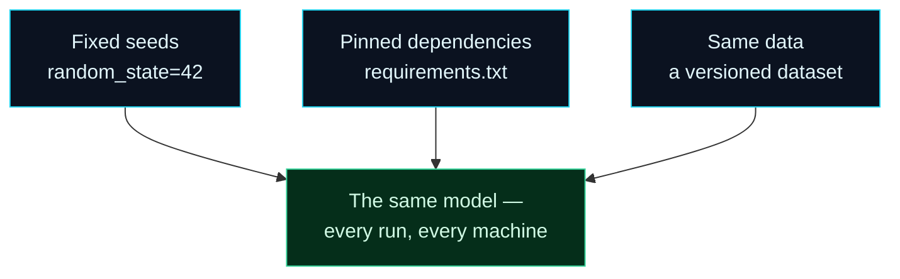

Welcome to **Day 10 of 100 Days of MLOps** — the final day of Module 1. We close out your foundation by making explicit the theme that's been quietly running under everything since Day 3: **reproducibility**.

Here's the nightmare it prevents. You train a model, it scores well, everyone's happy. A month later a bug appears, you re-run your training script to investigate — and you get a *different model* with *different numbers*. Now you can't tell whether the bug is new, whether last month's good result was a fluke, or what actually changed. You've lost the ability to reason about your own system. **Reproducibility is what stops that from ever happening**: the guarantee that the same code + data + settings always produces the exact same model, for you today and for anyone, on any machine, later.

> **The most important habit in the series.** It sounds mundane, but every serious MLOps practice — experiment tracking, CI/CD, debugging a production model — assumes you can reproduce a result. Today we make training *bit-for-bit* repeatable and prove it.

By the end of today you will:

- Understand **why reproducibility is the foundation** of MLOps.
- Know **where randomness sneaks into ML** and how to pin it down with **seeds**.
- Know the **three pillars** that together make a result reproducible.
- **Prove** your training is repeatable — run it twice, get byte-identical results.

---

## Where randomness sneaks in

Machine learning is full of *deliberate* randomness. It's useful — but uncontrolled, it destroys repeatability. The main places it enters our project:

- **Generating data.** Our `make_dataset.py` uses random numbers to create houses.
- **The train/test split.** `train_test_split` **shuffles** the data before splitting, so which houses land in the test set is random.
- **Model initialisation.** Many models (neural nets, random forests) start from random values. (Linear regression doesn't, which is why our numbers were already stable.)

Run any of these without control and you get slightly different results every time — a different test set, a different model, different scores. The fix is a **random seed**.

A computer's "random" numbers actually come from a formula with a starting point. Fix that starting point — the **seed** — and the sequence of "random" numbers becomes the *same* sequence every time. That's why you've seen `random_state=42` in every split and `np.random.default_rng(42)` in the data generator since Day 6: **42 is our seed**, and it's what's made every result in this series identical to what you saw on screen. (The number itself is arbitrary — 42 is a running programmer joke — what matters is that it's *fixed*.)

---

## The three pillars of reproducibility

A seed alone isn't enough. A truly reproducible ML result stands on three pillars — all of which you've already been building:



**Reading this diagram:**

Three **cyan pillars** across the top each feed into the single **green outcome** at the bottom — *the same model, every run, every machine*. Green is our "the result you can trust" colour, and it only appears when **all three** pillars are in place.

The first pillar, **fixed seeds**, tames the randomness we just discussed — same seed, same shuffle, same model. The second, **pinned dependencies**, is your `requirements.txt` from Day 3: recall Day 7's version trap — the *same* code can behave differently under scikit-learn 1.3 vs 1.9, so pinning `scikit-learn==1.9.0` keeps everyone on identical library behaviour. The third, **same data**, is the one we've handled with a seeded generator so far, but real projects need to *version* their datasets so everyone trains on exactly the same rows — that's what **DVC** gives us in Module 3.

The takeaway: reproducibility isn't one trick, it's a discipline of controlling *all* the inputs — code, randomness, dependencies, and data. Miss any pillar and the green guarantee collapses. (And Day 9's one-command runs make the *process* itself repeatable, so nobody reproduces a result by remembering a sequence of steps.)

---

## Proving it: run training twice, get identical results

Talk is cheap — let's *prove* our training is reproducible. We'll train the model twice in the same run and compare the results with a **fingerprint**: a short hash (a `sha256`) computed from the model's predictions. If two runs produce the exact same predictions, they produce the exact same fingerprint. If even one prediction differs by a fraction of a cent, the fingerprint changes completely.

Make sure `houses.csv` is in your folder, then create **`reproducibility.py`**:

```python
"""
reproducibility.py — Day 10 of 100 Days of MLOps.

Proves training is reproducible: with a FIXED seed, two separate training runs
produce a bit-for-bit identical model. Remove the seed and they diverge. This is
the difference between an experiment you can trust and one you can't.

Run it:  python reproducibility.py
"""

import hashlib

import pandas as pd
from sklearn.linear_model import LinearRegression
from sklearn.model_selection import train_test_split

FEATURES = ["size_sqft", "bedrooms", "age_years", "location_score"]


def train_and_fingerprint(seed):
    """Train once with the given split seed; return a short hash of its predictions."""
    df = pd.read_csv("houses.csv")
    X, y = df[FEATURES], df["price"]
    X_train, X_test, y_train, y_test = train_test_split(
        X, y, test_size=0.2, random_state=seed
    )
    model = LinearRegression().fit(X_train, y_train)
    preds = model.predict(X_test)
    # A fingerprint of the exact predictions — same predictions => same hash.
    return hashlib.sha256(preds.tobytes()).hexdigest()[:12]


print("Same seed (42), two separate runs:")
h1 = train_and_fingerprint(42)
h2 = train_and_fingerprint(42)
print(f"  run 1 fingerprint: {h1}")
print(f"  run 2 fingerprint: {h2}")
print(f"  identical? {h1 == h2}")

print("\nDifferent seeds (0 vs 1) — randomness changes the result:")
a = train_and_fingerprint(0)
b = train_and_fingerprint(1)
print(f"  seed 0 fingerprint: {a}")
print(f"  seed 1 fingerprint: {b}")
print(f"  identical? {a == b}")
```

Run it:

```bash
python reproducibility.py
```

```text
Same seed (42), two separate runs:
  run 1 fingerprint: 6cbd19673337
  run 2 fingerprint: 6cbd19673337
  identical? True

Different seeds (0 vs 1) — randomness changes the result:
  seed 0 fingerprint: c9f8e222e529
  seed 1 fingerprint: e871151fb935
  identical? False
```

Look at what this proves. With the **same seed**, two independent training runs produced the **identical** fingerprint (`6cbd19673337`) — byte-for-byte the same predictions. Change the seed, and the fingerprint changes completely, because a different shuffle put different houses in the test set. **The seed is the difference between a result you can reproduce and one you can't.**

And here's the real magic: because your dataset comes from a seeded generator and your dependencies are pinned, that fingerprint `6cbd19673337` should be the **same on your machine as on mine** — run it and check. That's reproducibility across *machines*, not just across runs. (If you get a different fingerprint, one of the three pillars differs — most likely a different scikit-learn version; `pip install -r requirements.txt` to match.)

---

## An honest caveat: perfect determinism has limits

Classic scikit-learn on a CPU — everything we do in these early modules — is fully deterministic once seeds are fixed, as you just saw. But be aware that some setups are *harder* to make bit-for-bit identical: GPU computations, deep-learning frameworks, and heavily parallel operations can introduce tiny variations even with seeds set. In those cases you aim for "reproducible enough" (results that match within a tiny tolerance) and lean harder on the other pillars — pinned environments and versioned data. For now, and for a great deal of real ML, fixed seeds give you exact reproducibility. Just don't be shocked later when a GPU model needs extra care.

---

## Module 1 complete — look how far you've come

That's a wrap on **Module 1: Foundations & Your Local MLOps Lab.** In ten days you went from an empty machine to a real, reproducible, automated ML project:

- **Days 1–2** — a working lab (Python, Git, VS Code, Docker) and the mental map of the whole MLOps lifecycle.
- **Days 3–5** — isolated environments, version control with an ML-aware `.gitignore`, and the notebook-to-script workflow.
- **Days 6–7** — you trained a real model end to end, then saved and reloaded it.
- **Days 8–10** — you gave the project a professional structure, automated it behind one command, and made it reproducible.

Your `house-prices` project is now something you can hand to anyone, on any OS, and they can rebuild your exact model in three commands. That is a genuine MLOps foundation — most people never get this far. From here, the series builds *up*: real data, experiment tracking, serving, pipelines, deployment and monitoring.

---

## Common errors (and how to fix them)

**1. Results wobble between runs even though you set a seed**

There's an unseeded source of randomness somewhere. Make sure **every** random operation gets the seed: the data generator (`np.random.default_rng(seed)`), the split (`random_state=seed`), and the model if it has a `random_state` parameter. One missed seed is enough to break reproducibility.

**2. You get a different fingerprint than the article (or than a teammate)**

One of the three pillars differs. Most often it's **dependency versions** — run `pip install -r requirements.txt` so your scikit-learn/NumPy match. Next most likely: your `houses.csv` differs (regenerate it with the seeded `make_dataset.py`), or you're on a different Python version.

**3. `ValueError: could not broadcast` / shape errors in the hash step**

You changed the features or the data shape between runs. The fingerprint compares predictions, so both runs must use the same features on the same data. Keep `FEATURES` and the dataset constant.

**4. Thinking a seed makes the model "correct"**

A seed makes results **repeatable**, not **accurate**. `random_state=42` isn't magic — it doesn't improve the model, it just fixes *which* random split you get so everyone sees the same one. Reproducibility and model quality are separate concerns.

**5. Committing a seed but not the data or the requirements**

Reproducibility needs all three pillars committed together. A fixed seed with an unpinned `requirements.txt`, or with data that isn't versioned, still drifts. Pin your deps (Day 3), and version your data (DVC, Module 3).

**6. Different results after upgrading a library**

Expected — this is the Day 7 version trap. An upgrade can change numerical behaviour. That's *why* we pin versions; upgrade deliberately, re-freeze `requirements.txt`, and re-verify your fingerprints when you do.

---

## Recap — what you now have

You made your work trustworthy:

- You understand **why reproducibility is the foundation** of everything in MLOps.
- You know where **randomness** enters ML and how a **seed** pins it down.
- You know the **three pillars**: fixed seeds + pinned dependencies + versioned data.
- You **proved** your training is bit-for-bit repeatable with a prediction fingerprint.

**Your cheat sheet:**

| Pillar | How | Covered |
|--------|-----|---------|
| Fixed seeds | `random_state=42`, `np.random.default_rng(42)` | Today |
| Pinned dependencies | `pip freeze > requirements.txt` | Day 3 |
| Versioned data | seeded generator now → **DVC** later | Module 3 |
| Repeatable process | one-command runs (`make`/`invoke`) | Day 9 |

Golden rule: **control every input — code, seeds, dependencies, and data — and the same result follows every time, everywhere.**

---

## Coming up on Day 11 — Module 2 begins

Foundation done; now we go deeper into real machine learning. **Module 2 — "Machine Learning You Can Operationalize"** starts with **Day 11 — "Working with Data: pandas for ML."** So far our data has been clean and synthetic. Real data is messy — missing values, wrong types, weird outliers — and how you load, inspect and clean it decides whether your model succeeds or fails. You'll learn the pandas skills that every ML project leans on daily, and produce a clean, model-ready dataset from a raw one.

See the full roadmap on the [100 Days of MLOps series page](/series/100-days-mlops). See you tomorrow.
