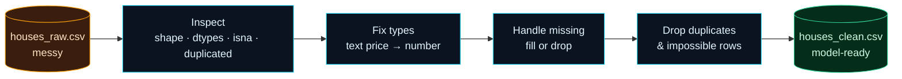

Welcome to **Day 11 of 100 Days of MLOps** — the start of **Module 2: Machine Learning You Can Operationalize.** Module 1 gave you a solid MLOps foundation. Now we go deeper into the machine learning itself, starting with the least glamorous and most important skill of all: **working with real data.**

Here's a truth every ML practitioner learns the hard way: **data scientists spend most of their time not on models, but on cleaning data.** Our house data so far has been perfectly clean because we generated it. Real data never is. It arrives with prices stored as text, missing values, duplicate rows, and impossible entries — and if you feed that mess to a model, you get a mess back. **Garbage in, garbage out.** Today you learn the pandas skills to turn raw mess into model-ready data.

> **New to pandas? You met it briefly on Day 5 — now we go properly.** pandas is the spreadsheet-of-code that every ML project runs on. We'll inspect a messy dataset, diagnose its problems, and fix them one by one. Every step is something you'll do on almost every project.

By the end of today you will:

- **Inspect** any dataset fast — shape, types, missing values, duplicates.
- Fix the four most common data problems: **wrong types, missing values, duplicates, impossible entries**.
- Understand the **judgment calls** (fill vs. drop) that cleaning always involves.
- Turn a genuinely messy `houses_raw.csv` into a clean, model-ready `houses_clean.csv`.

---

## The tool: pandas and the DataFrame

**pandas** is a Python library for working with **tables** of data. Its core object is the **DataFrame** — think of it as a spreadsheet you control with code: rows and columns, where each column has a name and a type. You already have it installed (Day 3).

The universal first move with any new dataset is to **inspect** it before touching it. These are the commands you'll run first, every single time:

| Command | Answers |
|---------|---------|
| `df.shape` | How many rows and columns? |
| `df.head()` | What do the first few rows look like? |
| `df.dtypes` | What *type* is each column (number? text?) |
| `df.info()` | Types + missing-value counts in one view |
| `df.describe()` | Min/max/mean/etc. for the numeric columns |
| `df.isna().sum()` | How many missing values per column? |
| `df.duplicated().sum()` | How many duplicate rows? |

Inspecting first is how you find the problems *before* they silently corrupt your model. Cleaning always follows the same shape:



**Reading this diagram:**

On the left, the **amber cylinder** is the raw file — messy, straight from the source, and never safe to model on as-is (amber is our "handle with care" colour). The very first arrow goes to **Inspect**, the cyan step where you *look before you leap*: `shape`, `dtypes`, `isna`, `duplicated` tell you exactly what's wrong. Everything downstream depends on this — you can't fix what you haven't diagnosed.

The three cyan steps that follow are the fixes, in a sensible order: **fix types** (turn text prices into numbers), **handle missing** values (fill or drop), then **drop duplicates and impossible rows**. Order matters a little — for example, you convert a column's type only after dealing with its missing values, or the conversion errors out (you'll see exactly that in the errors section). Finally the flow reaches the **green cylinder**, `houses_clean.csv` — tidy, correctly typed, no gaps, *model-ready*. Green means "safe to build on." The takeaway: cleaning is a repeatable pipeline — **inspect, then fix in order** — not random poking at a spreadsheet.

---

## Step 1 — Create a realistically messy dataset

So you can practise on real-world mess, here's a generator that produces the kinds of problems data actually arrives with. Create **`make_messy.py`**:

```python
"""
make_messy.py — creates houses_raw.csv, a REALISTICALLY messy dataset.

Real-world data is never clean. This injects the problems you actually meet:
prices stored as text ("$240,000"), missing values, duplicate rows, and
impossible ages. Day 11's job is to clean it up. Deterministic (seed 42).

Run it:  python make_messy.py   →   writes houses_raw.csv
"""

import numpy as np
import pandas as pd

rng = np.random.default_rng(42)
n = 500

size_sqft = rng.integers(600, 3500, n)
bedrooms = rng.integers(1, 6, n).astype(float)
age_years = rng.integers(0, 80, n)
location_score = rng.integers(1, 11, n)
noise = rng.normal(0, 25000, n)
price = (30000 + 140 * size_sqft + 12000 * bedrooms
         - 900 * age_years + 20000 * location_score + noise)
price = np.clip(price, 50000, None).round(-2)

df = pd.DataFrame({
    "size_sqft": size_sqft,
    "bedrooms": bedrooms,
    "age_years": age_years,
    "location_score": location_score,
    "price": price,
})

# --- now dirty it up, the way real data arrives -------------------------------
# 1) price stored as TEXT with $ and thousands commas
df["price"] = df["price"].map(lambda p: f"${p:,.0f}")

# 2) missing bedrooms (~4% of rows)
missing_idx = rng.choice(n, size=20, replace=False)
df.loc[missing_idx, "bedrooms"] = np.nan

# 3) a few impossible ages (data-entry errors)
df.loc[rng.choice(n, size=5, replace=False), "age_years"] = 999

# 4) duplicate rows (the same listing entered twice)
dupes = df.sample(15, random_state=1)
df = pd.concat([df, dupes], ignore_index=True)

df.to_csv("houses_raw.csv", index=False)
print(f"Wrote houses_raw.csv with {len(df)} rows (messy on purpose)")
```

Run it and peek at the mess:

```bash
python make_messy.py
```

```text
Wrote houses_raw.csv with 515 rows (messy on purpose)
```

Open `houses_raw.csv` and you'll see prices like `"$206,000"` (text, not numbers) and some blank bedroom cells. That's our patient. Let's diagnose and treat it.

---

## Step 2 — Inspect, then clean

Create **`clean.py`**. It does the two-phase job every cleaning task follows: **inspect** to find the problems, then **fix** them one at a time.

```python
"""
clean.py — Day 11 of 100 Days of MLOps.

Load a messy raw dataset, INSPECT it to find the problems, then CLEAN it into a
tidy, model-ready file. This inspect-then-fix loop is daily pandas work in ML.

Run it:  python clean.py   →   reads houses_raw.csv, writes houses_clean.csv
"""

import pandas as pd

# --- LOAD -------------------------------------------------------------------
df = pd.read_csv("houses_raw.csv")
print("=== INSPECT the raw data ===")
print(f"shape: {df.shape}")               # (rows, columns)
print("\ncolumn types:")
print(df.dtypes)
print(f"\nmissing values per column:\n{df.isna().sum()}")
print(f"\nduplicate rows: {df.duplicated().sum()}")

# --- CLEAN ------------------------------------------------------------------
print("\n=== CLEAN ===")

# 1) price is text like "$206,000" → strip $ and commas, make it a number
df["price"] = (
    df["price"].str.replace("$", "", regex=False)
               .str.replace(",", "", regex=False)
               .astype(int)
)
print("• parsed price from text to integer")

# 2) drop exact duplicate rows
before = len(df)
df = df.drop_duplicates()
print(f"• dropped {before - len(df)} duplicate rows")

# 3) impossible ages (999) → treat as missing, then drop those rows
df.loc[df["age_years"] > 120, "age_years"] = pd.NA
bad_age = df["age_years"].isna().sum()
df = df.dropna(subset=["age_years"])
print(f"• removed {bad_age} rows with impossible ages")

# 4) missing bedrooms → fill with the median (a safe, typical value)
median_beds = df["bedrooms"].median()
missing_beds = df["bedrooms"].isna().sum()
df["bedrooms"] = df["bedrooms"].fillna(median_beds).astype(int)
print(f"• filled {missing_beds} missing bedrooms with median ({median_beds:.0f})")

df["age_years"] = df["age_years"].astype(int)

# --- SAVE -------------------------------------------------------------------
df.to_csv("houses_clean.csv", index=False)
print(f"\n=== RESULT ===")
print(f"clean shape: {df.shape}")
print(f"missing values now: {int(df.isna().sum().sum())}")
print("\nclean column types:")
print(df.dtypes)
print("\nWrote houses_clean.csv")
```

Run it:

```bash
python clean.py
```

```text
=== INSPECT the raw data ===
shape: (515, 5)

column types:
size_sqft           int64
bedrooms          float64
age_years           int64
location_score      int64
price                 str
dtype: object

missing values per column:
size_sqft          0
bedrooms          20
age_years          0
location_score     0
price              0
dtype: int64

duplicate rows: 15

=== CLEAN ===
• parsed price from text to integer
• dropped 15 duplicate rows
• removed 5 rows with impossible ages
• filled 20 missing bedrooms with median (3)

=== RESULT ===
clean shape: (495, 5)
missing values now: 0

clean column types:
size_sqft         int64
bedrooms          int64
age_years         int64
location_score    int64
price             int64
dtype: object

Wrote houses_clean.csv
```

Read the two halves. The **inspect** phase immediately surfaced every problem: `price` came in as `str` (text!), `bedrooms` had 20 missing values, and there were 15 duplicate rows. The **clean** phase fixed each one, and the final report proves it worked — 495 tidy rows, **zero** missing values, and every column now a proper number. That `houses_clean.csv` is ready to train on.

---

## The four fixes, and the judgment behind them

Each cleaning step maps to a problem you'll meet constantly:

**1. Wrong types — text that should be numbers.** `price` arrived as `"$206,000"`. A model can't do maths on text, so we stripped the `$` and `,` with string operations (`.str.replace`) and converted to a number with `.astype(int)`. Always check `df.dtypes` — a numeric column showing up as `str`/`object` is the classic hidden bug.

**2. Duplicates.** The same listing entered twice would let the model "see" some houses more than others, skewing it. `df.drop_duplicates()` removes exact repeats.

**3. Impossible values.** An age of `999` is a data-entry error, not a real house. We marked those as missing (`pd.NA`) and dropped those rows. Domain knowledge tells you what's "impossible" — a human age of 999, a negative price, a 0-square-foot house.

**4. Missing values — and the big judgment call.** For the 20 missing bedroom counts we had two options: **drop** those rows (lose data) or **fill** them with a reasonable value (keep the rows). We *filled* with the **median** — a safe, typical value that won't skew things. The rule of thumb: **drop** when a row is broken beyond repair or missing its target; **fill (impute)** when a single feature is missing but the rest of the row is useful. There's no single right answer — cleaning is full of these judgment calls, and being deliberate about them is the skill.

> **Why not just `dropna()` everything?** It's tempting to drop every row with any missing value. But on real data that can throw away half your dataset. Filling (imputing) keeps hard-won data. Reach for dropping when the *target* is missing (you can't learn from a house with no price) or a row is clearly junk; reach for filling when you'd otherwise lose usable rows.

---

## Common errors (and how to fix them)

**1. `FileNotFoundError: [Errno 2] No such file or directory: 'houses_raw.csv'`**

Run `make_messy.py` first (in the same folder) to create the raw file, then run `clean.py` from that folder.

**2. `TypeError: Cannot perform reduction 'mean' with string dtype`**

You tried a numeric operation on a text column:

```text
TypeError: Cannot perform reduction 'mean' with string dtype
```

This is the "text that should be a number" trap — `price` is still `"$206,000"` text. Convert it to a number first (strip `$`/`,`, `.astype(int)`), *then* do maths. Always fix `dtypes` before computing.

**3. `IntCastingNaNError: Cannot convert non-finite values (NA or inf) to integer`**

You called `.astype(int)` on a column that still has missing values:

```text
pandas.errors.IntCastingNaNError: Cannot convert non-finite values (NA or inf) to integer.
```

Handle the missing values *first* (`fillna(...)` or `dropna()`), then convert to `int`. That's why `clean.py` fills bedrooms *before* casting.

**4. You dropped far more rows than expected**

`df.dropna()` with no arguments drops a row if **any** column is missing. To only drop rows missing a *specific* column, use `df.dropna(subset=["age_years"])`. Check `df.shape` before and after so a cleaning step never silently deletes half your data.

**5. `KeyError: 'colname'`**

A column name typo or a stray space/capital. Print `df.columns` to see the exact names (`"Price "` with a trailing space is a real and maddening bug), and match them precisely.

**6. You edited a filtered copy and the original didn't change**

In modern pandas (3.x, Copy-on-Write), assigning into a *filtered* subframe (`subset = df[df.x > 0]; subset["flag"] = 1`) changes only the copy, not the original `df` — silently. To modify the original, work on `df` directly with `df.loc[df.x > 0, "flag"] = 1`. Don't try to edit through a filtered view.

---

## Recap — what you now have

You can turn raw mess into model-ready data — the daily reality of ML:

- You **inspect** any dataset instantly: `shape`, `dtypes`, `info()`, `isna().sum()`, `duplicated().sum()`.
- You fix the big four: **wrong types**, **duplicates**, **impossible values**, and **missing values**.
- You understand the **fill-vs-drop judgment** that cleaning always involves.
- You produced a clean, zero-missing, correctly-typed `houses_clean.csv` from a messy raw file.

**Your cheat sheet:**

| Task | pandas |
|------|--------|
| Inspect | `df.shape`, `df.info()`, `df.describe()`, `df.dtypes` |
| Count missing | `df.isna().sum()` |
| Count / drop duplicates | `df.duplicated().sum()`, `df.drop_duplicates()` |
| Text → number | `df["c"].str.replace(...)`, `.astype(int)` |
| Fill / drop missing | `df["c"].fillna(value)`, `df.dropna(subset=[...])` |
| Filter-and-set safely | `df.loc[mask, "col"] = value` |

Golden rule: **inspect first, fix deliberately** — and never trust a dataset you haven't looked at.

---

## Coming up on Day 12

You have clean data — but *how* you split it for training decides whether you can trust your results. On Day 6 you used a simple train/test split; real projects need a **three-way** split and a sharp eye for a subtle bug that inflates scores and fools teams. **Day 12 — "Train/Validation/Test Splits"** covers the validation set, why it exists, **data leakage** (the silent killer of ML projects), and stratification — so your evaluation is honest and your model's reported score is real.

See the full roadmap on the [100 Days of MLOps series page](/series/100-days-mlops). See you tomorrow.
