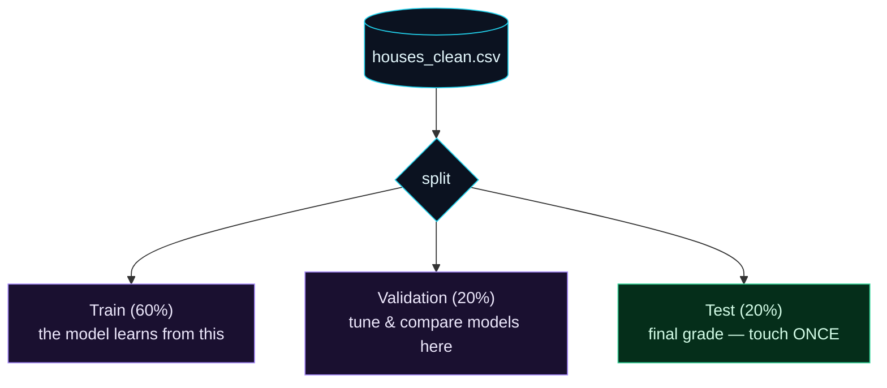

Welcome to **Day 12 of 100 Days of MLOps**. On Day 6 you split your data two ways — train and test — and it worked fine. But real projects need more, because of a subtle trap: **the moment you start tuning your model, a simple train/test split stops being honest.** Today you'll learn the professional three-way split, and meet the single most dangerous bug in all of applied ML: **data leakage.**

This is a "get it right or everything downstream is a lie" day. A model with a leaked evaluation looks brilliant in testing and then fails in production — and because the numbers looked great, nobody sees it coming. Learning to split data honestly is what makes every metric you report trustworthy.

> **Short and pivotal.** One new idea (the validation set), one dangerous bug to recognise (leakage), and a script that splits your data correctly and saves the pieces. The habits you build today protect every result for the next 88 days.

By the end of today you will:

- Know the **three sets** — train, validation, test — and the distinct job each does.
- Understand **data leakage** in both its forms, and how to prevent it.
- Do a correct **three-way split** and **save** the pieces so everyone evaluates identically.
- Know what **stratification** is and when you need it.

---

## Why two sets aren't enough

On Day 6 the logic was: train on one pile, test on another the model never saw. Good. But watch what happens in a real project. You train a model, check it on the test set — 80%. You tweak a setting, check again — 82%. Tweak, check — 84%. Feels like progress, right?

It's an illusion. Every time you look at the test set and make a change based on it, you're letting information from the test set influence your model. After twenty tweaks, you've effectively *fitted your decisions to the test set* — so its score no longer predicts how you'll do on genuinely new data. You've "used up" your test set.

The fix is a **third** set. Split the data into **three**:



**Reading this diagram:**

At the top, the **cyan cylinder** is all your clean data. The `split` node divides it into three, and the colours tell you how much to trust each. The two **purple** sets are your *working* sets. **Train (60%)** is what the model actually learns from. **Validation (20%)** is where you do all your tinkering — try different settings, compare models, pick a winner. You can look at the validation set as often as you like; that's its job.

The **green** set, **Test (20%)**, is different — and green here means "sacred." You **do not touch it** while developing. It sits locked away until the very end, when you use it **exactly once** to get an honest final grade on the model you already chose. Because you never tuned against it, its score is a fair estimate of real-world performance. The mental model: **train = homework, validation = practice exams you can take repeatedly, test = the one real exam you sit once.** Keep that discipline and your reported numbers mean something.

---

## Data leakage: the silent killer

**Data leakage** is when information the model shouldn't have sneaks into training — making it look better in testing than it will ever be in reality. It comes in two forms:

**Form 1 — evaluating or tuning on the test set.** Exactly the problem above: peeking at the test set while developing. The three-way split prevents it — you tune on validation, and the test set stays untouched.

**Form 2 — preprocessing before splitting.** This one is sneakier and catches even experienced people. Suppose you want to scale a feature, which needs the feature's average. If you compute that average over the **whole** dataset *before* splitting, then the average — and therefore your model — has secretly "seen" the test rows. Test information has leaked into training.

Our `split.py` shows this concretely. The average `size_sqft` is **2,051** over all the data, but **2,002** over the training set only. Those are different numbers — so a scaler fitted on "all the data" bakes in knowledge of the test rows. The rule that prevents it:

> **Split first. Then fit any preprocessing (scaling, imputing, encoding) on the training set only**, and apply those same fitted values to validation and test. Never let a transformation learn from data outside the training set.

This is so important — and so easy to get wrong by hand — that scikit-learn has a whole tool to enforce it: the **Pipeline**, which is exactly what Day 15 is about. Today, just burn the rule into your brain: **split before you transform.**

---

## Do the split (and save it)

Create **`split.py`**. It reads the clean data from Day 11, splits it 60/20/20 with two calls to `train_test_split`, saves each piece, and demonstrates the leakage check.

```python
"""
split.py — Day 12 of 100 Days of MLOps.

Split the clean data three ways — train / validation / test — and save each
split so everyone trains and evaluates on exactly the same rows. Also shows why
preprocessing must be fitted on the TRAIN split only (leakage).

Run it:  python split.py   →   writes train.csv, val.csv, test.csv
"""

import pandas as pd
from sklearn.model_selection import train_test_split

RANDOM_STATE = 42

df = pd.read_csv("houses_clean.csv")
print(f"Full dataset: {len(df)} rows")

# Two-step 3-way split: first peel off 20% for TEST, then split the rest 75/25
# → 60% train, 20% validation, 20% test.
train_val, test = train_test_split(df, test_size=0.20, random_state=RANDOM_STATE)
train, val = train_test_split(train_val, test_size=0.25, random_state=RANDOM_STATE)

print(f"  train:      {len(train):>4}  ({len(train)/len(df):.0%})")
print(f"  validation: {len(val):>4}  ({len(val)/len(df):.0%})")
print(f"  test:       {len(test):>4}  ({len(test)/len(df):.0%})")

train.to_csv("train.csv", index=False)
val.to_csv("val.csv", index=False)
test.to_csv("test.csv", index=False)
print("Saved train.csv, val.csv, test.csv")

# --- Why the order matters: LEAKAGE demo ------------------------------------
# To scale a feature you need its mean. If you compute that mean over the WHOLE
# dataset, information from the test rows leaks into training. Fit on TRAIN only.
print("\n=== Leakage check: mean of size_sqft ===")
leaky_mean = df["size_sqft"].mean()          # uses test rows too — LEAKY
correct_mean = train["size_sqft"].mean()      # train only — correct
print(f"  over ALL data (leaky):   {leaky_mean:,.1f}")
print(f"  over TRAIN only (right): {correct_mean:,.1f}")
print("  → they differ, so using the 'all data' number leaks test info.")
```

Why two `train_test_split` calls? There's no built-in three-way split, so we do it in two steps: first peel off 20% as **test**, then split what remains into **train** and **validation**. The second `test_size=0.25` is 25% *of the remaining 80%*, which is 20% of the whole — giving a clean 60/20/20. Run it:

```bash
python split.py
```

```text
Full dataset: 495 rows
  train:       297  (60%)
  validation:   99  (20%)
  test:         99  (20%)
Saved train.csv, val.csv, test.csv

=== Leakage check: mean of size_sqft ===
  over ALL data (leaky):   2,051.3
  over TRAIN only (right): 2,001.8
  → they differ, so using the 'all data' number leaks test info.
```

You now have three saved files. **Saving the splits matters for MLOps**: everyone on the team — and every future run — trains and evaluates on the exact same rows, which (with Day 10's seeds and pinned deps) makes your whole evaluation reproducible. And the leakage check makes the danger concrete: 2,051 vs 2,002 is the size of the mistake you'd bake in by preprocessing before splitting.

---

## Stratification: keeping the mix right

When you split randomly, you *usually* get a representative slice in each set. But for **classification** with imbalanced classes, random luck can bite — imagine 5% of houses are "luxury" and a random test set happens to get almost none. Then your test score says nothing about luxury homes.

**Stratification** fixes this: `train_test_split(..., stratify=y)` keeps the *class proportions* the same in every split. If 5% of all houses are luxury, then 5% of train, validation and test are too.

One catch: stratification is for **categories**, not continuous numbers. Try to stratify on a continuous target like `price` and scikit-learn refuses, because nearly every price is unique:

```text
ValueError: The least populated classes in y have only 1 member, which is too
few. The minimum number of groups for any class cannot be less than 2. ...
```

That's expected — you stratify on a *class* label, not a price. We'll use `stratify=y` properly tomorrow on Day 13, where we turn house prices into a classification problem.

---

## Common errors (and how to fix them)

**1. `ValueError: The least populated classes in y have only 1 member ...`**

You tried to `stratify` on a continuous target (like `price`). Stratification only works on categorical labels with repeated values. Drop `stratify` for regression; use it (on the class column) for classification.

**2. Your splits are different every run**

You forgot `random_state`. Without it, `train_test_split` shuffles differently each time, so your train/val/test rows change on every run and results aren't reproducible. Always pass `random_state=42` (Day 10).

**3. Your reported score is great but production is bad — classic leakage**

You either tuned against the test set, or you preprocessed (scaled/imputed/encoded) before splitting. Fix: keep the test set untouched until the end, and fit all preprocessing on the **training set only** (Day 15's Pipelines make this automatic).

**4. `ValueError: Found input variables with inconsistent numbers of samples`**

Your `X` and `y` have different lengths — usually a row got dropped from one but not the other. Split the whole DataFrame together (as we do), or split `X` and `y` in the same call so they stay aligned.

**5. The validation set is tiny and its scores jump around**

If your dataset is small, a 20% validation set can be too few rows to trust — its score wobbles. For small data, **cross-validation** (coming on Day 16) reuses the data more efficiently. For now, just be aware that a noisy validation score can mean "too few validation rows," not "bad model."

**6. You keep peeking at the test set "just to check"**

Discipline problem, not a code problem — but the most common one. Every peek erodes the honesty of the final number. Do all experimentation on validation; unlock the test set once, at the very end.

---

## Recap — what you now have

Your evaluations are now honest and reproducible:

- You know the **three sets**: train (learn), validation (tune), test (grade once).
- You understand **data leakage** — peeking at test, and preprocessing before splitting — and how to avoid both.
- You did a correct **60/20/20 split** and **saved** the pieces for reproducible evaluation.
- You know what **stratification** does and that it's for classification, not continuous targets.

**Your cheat sheet:**

| Concept | Key point |
|---------|-----------|
| Train set | The model learns from it (~60%) |
| Validation set | Tune and compare here, as often as you like (~20%) |
| Test set | Final grade — untouched until the end, used once (~20%) |
| 3-way split | Two `train_test_split` calls (0.20, then 0.25) |
| Leakage rule | **Split first, then fit preprocessing on train only** |
| Stratify | `stratify=y` for classification; not for continuous targets |

Golden rule: **the test set is sacred** — touch it once, and never let a transformation learn from anything but the training data.

---

## Coming up on Day 13

So far our model predicts a *number* (a price) — that's regression. But a huge share of real ML predicts a *category*: spam or not, fraud or legit, will-churn or won't. **Day 13 — "Classification Models & Metrics"** turns house prices into a classification problem ("is this house expensive?") and teaches the metrics that matter when accuracy alone lies to you: **precision, recall, F1, and the confusion matrix.** It's the other half of supervised learning — and the metrics are where most beginners get fooled.

See the full roadmap on the [100 Days of MLOps series page](/series/100-days-mlops). See you tomorrow.
