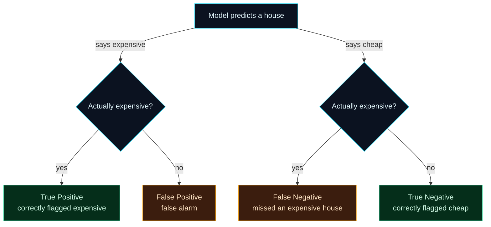

Welcome to **Day 13 of 100 Days of MLOps**. Everything so far predicted a *number* — a house's price. That's **regression**. But an enormous share of real-world ML predicts a *category* instead: is this email spam or not? Is this transaction fraud or legit? Will this customer churn or stay? That's **classification**, and today you'll build your first classifier — and, more importantly, learn to measure it honestly.

Here's the hook: **accuracy — the obvious metric — routinely lies.** A fraud detector that flags *nothing* can be "99.9% accurate" (because 99.9% of transactions are legit) while being completely useless. Understanding why, and what to measure instead, is one of the most valuable things in this entire series. Miss it and you'll ship models that look great on paper and fail in reality.

> **New to classification metrics? This is the day they finally click.** We build a real classifier, then decode the confusion matrix, precision, recall and F1 with a concrete example you can see. No formulas without meaning.

By the end of today you will:

- Turn a regression problem into a **classification** one and train a classifier.
- Understand why **accuracy alone is misleading** on imbalanced data.
- Read a **confusion matrix** and compute **precision, recall and F1** from it.
- Know **which metric to optimise** for which real-world problem.

---

## From price to category

Our houses have a price — a number. To make a classification problem, we turn that number into a **label**: is a house **expensive** (above the median price) or not? That gives us a clean yes/no target, `is_expensive`, with two balanced classes. The model will predict that label from the same features as before (size, bedrooms, age, location) — but crucially, **not** from the price itself (that would be cheating).

We'll use a **Decision Tree** classifier. It's a great first classifier: it needs no feature scaling, it's fast, and it makes decisions the way a human might ("if size > 2000 and location is good, probably expensive"). scikit-learn makes training it identical to the regression flow — `fit` then `predict` — only the metrics change.

---

## The problem with accuracy

**Accuracy** is the fraction of predictions the model got right. It's intuitive and useful — *when your classes are balanced.* But lean on it blindly and it will fool you.

Imagine screening for a rare disease present in 1% of people. A "model" that says **healthy** for everyone is **99% accurate** — and catches **zero** sick patients. The accuracy number looks fantastic; the model is worthless. This is the **accuracy paradox**, and it's why serious ML never reports accuracy alone. To see what's really happening, you need to break predictions into their four possible outcomes — the **confusion matrix**.



**Reading this diagram:**

Every prediction takes one of two branches from the top: the model either **says expensive** or **says cheap**. Then reality decides which of four boxes we land in. Down the "says expensive" branch: if the house really is expensive, that's a **True Positive** (green — a correct hit); if it isn't, it's a **False Positive** (amber — a false alarm). Down the "says cheap" branch: if the house was actually expensive, that's a **False Negative** (amber — we *missed* one); if it really was cheap, that's a **True Negative** (green — correctly passed over).

The two **green** boxes are the correct predictions; the two **amber** boxes are the two *different kinds of mistake* — and that distinction is the whole point. A false alarm (FP) and a miss (FN) are not equally bad in every situation, and accuracy blurs them into one number. Precision and recall, which we compute straight from these four boxes, keep them separate. Memorise these four outcomes — every classification metric is built from them.

---

## Precision, recall, and F1

From those four boxes come the metrics that actually matter:

- **Precision** — of all the houses the model *called* expensive, how many really were? `TP / (TP + FP)`. High precision means *few false alarms* — when it says "expensive," trust it.
- **Recall** — of all the houses that *really are* expensive, how many did the model *catch*? `TP / (TP + FN)`. High recall means *few misses* — it finds the ones that matter.
- **F1 score** — a single number balancing the two (their harmonic mean). Useful when you want one metric that rewards being good at *both*.

There's a natural **tension**: push the model to flag more houses as expensive and you catch more real ones (higher recall) but raise false alarms (lower precision), and vice-versa. Which to favour depends entirely on the problem:

- **Spam filter** → favour **precision**. A false alarm means a real email lost to the spam folder — costly. Better to let a little spam through than bin an important message.
- **Disease / fraud screening** → favour **recall**. A miss means an undetected illness or fraud — catastrophic. Better a few false alarms than a missed case.

There's no universally "best" metric — **the right metric is a business decision.** That's a genuinely MLOps mindset: you don't just train a model, you decide what "good" means for *this* problem.

---

## Build it: train and measure a classifier

Create **`classify.py`** (using the clean data from Day 11):

```python
"""
classify.py — Day 13 of 100 Days of MLOps.

A classification problem: instead of predicting a house's price (a number), we
predict a CATEGORY — is this house "expensive" (above the median price) or not?
Then we measure it properly: accuracy, a confusion matrix, and precision/recall/F1.

Run it:  python classify.py
"""

import pandas as pd
from sklearn.metrics import (
    accuracy_score,
    classification_report,
    confusion_matrix,
)
from sklearn.model_selection import train_test_split
from sklearn.tree import DecisionTreeClassifier

df = pd.read_csv("houses_clean.csv")

# Turn the price into a yes/no LABEL: expensive = above the median price.
median_price = df["price"].median()
df["is_expensive"] = (df["price"] > median_price).astype(int)   # 1 = expensive, 0 = not
print(f"Median price: ${median_price:,.0f}")
print(f"Class balance: {df['is_expensive'].value_counts().to_dict()}")

features = ["size_sqft", "bedrooms", "age_years", "location_score"]
X = df[features]
y = df["is_expensive"]

# stratify=y keeps the same expensive/cheap ratio in train and test (Day 12).
X_train, X_test, y_train, y_test = train_test_split(
    X, y, test_size=0.2, random_state=42, stratify=y
)

model = DecisionTreeClassifier(max_depth=5, random_state=42)
model.fit(X_train, y_train)
pred = model.predict(X_test)

print(f"\nAccuracy: {accuracy_score(y_test, pred):.3f}")

print("\nConfusion matrix  (rows = actual, cols = predicted)")
print("               pred_cheap  pred_expensive")
cm = confusion_matrix(y_test, pred)
print(f"  actual_cheap      {cm[0][0]:>4}          {cm[0][1]:>4}")
print(f"  actual_expensive  {cm[1][0]:>4}          {cm[1][1]:>4}")

print("\nClassification report")
print(classification_report(y_test, pred, target_names=["cheap", "expensive"]))
```

Run it:

```bash
python classify.py
```

```text
Median price: $422,000
Class balance: {0: 248, 1: 247}

Accuracy: 0.909

Confusion matrix  (rows = actual, cols = predicted)
               pred_cheap  pred_expensive
  actual_cheap        45             5
  actual_expensive     4            45

Classification report
              precision    recall  f1-score   support

       cheap       0.92      0.90      0.91        50
   expensive       0.90      0.92      0.91        49

    accuracy                           0.91        99
   macro avg       0.91      0.91      0.91        99
weighted avg       0.91      0.91      0.91        99
```

Now read it like a professional. Focus on the **expensive** class. The confusion matrix shows **45 true positives** (expensive houses correctly flagged), **5 false positives** (cheap houses wrongly called expensive), and **4 false negatives** (expensive houses missed). From those:

- **Precision** for expensive = 45 / (45 + 5) = **0.90** — when it says "expensive," it's right 90% of the time.
- **Recall** for expensive = 45 / (45 + 4) = **0.92** — it catches 92% of the truly expensive houses.
- **F1** = **0.91** — a strong balance of the two.

The `classification_report` computes all of this for you, per class, in one call. The classes are near-balanced here (248 vs 247), so accuracy is trustworthy too — but you now have the tools for when it isn't.

---

## Common errors (and how to fix them)

**1. `ValueError: Number of classes, 2, does not match size of target_names, 3`**

You gave `classification_report` more (or fewer) `target_names` than there are classes:

```text
ValueError: Number of classes, 2, does not match size of target_names, 3.
Try specifying the labels parameter
```

The number of names must match the number of classes — two classes, two names (`["cheap", "expensive"]`).

**2. Great accuracy, useless model (the accuracy paradox)**

Your data is imbalanced and accuracy is hiding it. Always look at the **confusion matrix** and **per-class recall**. If one class has near-zero recall, the model is ignoring it no matter what accuracy says. Use `stratify=y` (Day 12) and consider precision/recall/F1 as your real scorecard.

**3. `UndefinedMetricWarning: Precision is ill-defined and being set to 0.0`**

The model never predicted one of the classes, so precision for that class divides by zero. Usually a sign of severe imbalance or an under-powered model — revisit your data balance, or the model/threshold.

**4. `ValueError: Found input variables with inconsistent numbers of samples`**

Your `X` and `y` (or `y_test` and `pred`) have different lengths. Make sure you score predictions from `X_test` against `y_test`, and that no row got dropped from one but not the other.

**5. You accidentally left the target in the features**

If `price` (or anything derived from it) sneaks into `X`, the model "cheats" and scores near-perfectly — a form of leakage (Day 12). Keep `is_expensive` and `price` out of `X`; only real features go in.

**6. A LogisticRegression warns it "failed to converge"**

Linear models like `LogisticRegression` are sensitive to features on wildly different scales (size in thousands vs bedrooms in single digits) and can fail to settle. The fix is **feature scaling** — which is exactly Day 15. Decision trees (used here) don't need scaling, which is why we chose one today.

---

## Recap — what you now have

You can build and *honestly* evaluate a classifier:

- You turned a regression target into a **classification** label and trained a Decision Tree.
- You understand the **accuracy paradox** and why accuracy alone is dangerous.
- You can read a **confusion matrix** and compute **precision, recall and F1** from its four boxes.
- You know **which metric to favour** for which real-world problem — a business decision, not a default.

**Your cheat sheet:**

| Metric | Question it answers | Formula |
|--------|---------------------|---------|
| Accuracy | What fraction did I get right? | (TP+TN) / all |
| Precision | When I say "yes," am I right? | TP / (TP+FP) |
| Recall | Of the real "yes"es, how many did I catch? | TP / (TP+FN) |
| F1 | One number balancing precision & recall | harmonic mean |

Golden rule: **never judge a classifier on accuracy alone** — read the confusion matrix and pick the metric that matches what a mistake actually costs.

---

## Coming up on Day 14

Classification has its metrics; regression has its own — and choosing the right one changes which model you'd pick. **Day 14 — "Regression Models & Metrics"** goes deep on measuring number-predictions: **MAE** (you met it on Day 6), **RMSE** (which punishes big misses harder), and **R²** (how much of the variation you explain). You'll learn exactly when to prefer each, and why a model that looks best on one metric can look worst on another.

See the full roadmap on the [100 Days of MLOps series page](/series/100-days-mlops). See you tomorrow.
