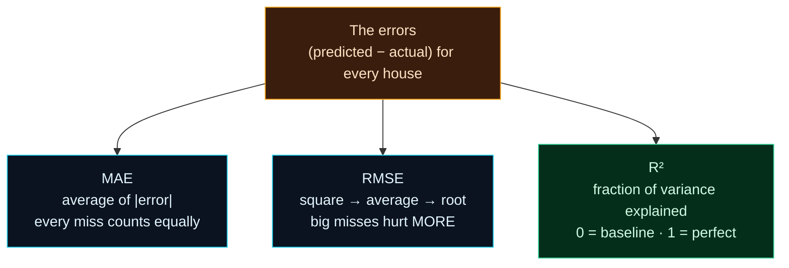

Welcome to **Day 14 of 100 Days of MLOps**. Yesterday you learned that classification has several metrics and picking the right one matters. Regression — predicting a *number*, like our house prices — is exactly the same story. You met **MAE** on Day 6; today we add **RMSE** and **R²**, and learn the thing that actually matters: **the same predictions look different through different metrics, and which one you choose can change which model you'd ship.**

This is a short, sharp day that pays off forever. Every regression project you ever do will report one of these three numbers — and knowing what each really measures is the difference between choosing a good model and being fooled by a number.

> **Metrics made concrete.** No abstract formulas floating in space — we compute all three on real models and watch them disagree, so you *feel* the difference.

By the end of today you will:

- Understand **MAE**, **RMSE** and **R²** — what each measures and its units.
- See why **RMSE punishes big mistakes** far more than MAE does.
- Watch two models get ranked differently by different metrics.
- Know **which metric to reach for** in which situation.

---

## The three metrics

All regression metrics start from the same raw material: the **error** on each prediction — how far off it was (`predicted − actual`). The three metrics are just three different ways of summarising all those errors into one number.

**MAE — Mean Absolute Error.** Take the size of each error (ignoring sign), average them. "On average, how many dollars off am I?" Its units are dollars, it's dead easy to explain, and it treats every error **equally** — being $50k off counts exactly five times as much as being $10k off, no more.

**RMSE — Root Mean Squared Error.** Square each error, average, then square-root. Also in dollars — but because it **squares** errors before averaging, big misses hurt *disproportionately*. One huge blunder moves RMSE a lot; a scatter of small errors barely does. RMSE is **always ≥ MAE**, and the *gap between them* tells you how much a few large errors are hurting you.

**R² — R-squared.** A unitless score (usually 0 to 1) for how much of the variation in price your model explains. **0** = no better than always guessing the mean; **1** = perfect. It can even go **negative** (worse than guessing the mean). Great for a quick "how good, roughly?" and for comparing across different problems, since it has no units.



**Reading this diagram:**

At the top, in **amber**, is the raw material every metric shares: **the errors** — one number per house, how far the prediction missed. Three arrows fan out to three ways of summarising them. **MAE** (cyan) just averages the error sizes — democratic, every miss equal. **RMSE** (cyan) squares first, which is why "big misses hurt more" — squaring blows up large errors before averaging, so RMSE is the metric that *notices blunders*. **R²** (green) is different in kind: instead of an error size, it reports a *fraction explained*, a relative score you read like a grade from 0 to 1.

The key takeaway is that all three start from the **identical** set of errors — they only differ in how they *weigh* them. So they can rank the same models differently. Choose your metric based on what a mistake actually costs, exactly like yesterday's precision-vs-recall decision.

---

## See them in action

Create **`metrics.py`** (using Day 11's clean data). It measures two different models with all three metrics.

```python
"""
metrics.py — Day 14 of 100 Days of MLOps.

Measure regression models three ways — MAE, RMSE, R² — and compare two models.
The point: the same predictions look different through different metrics, and a
model can win on one and lose on another.

Run it:  python metrics.py
"""

import pandas as pd
from sklearn.linear_model import LinearRegression
from sklearn.metrics import mean_absolute_error, r2_score, root_mean_squared_error
from sklearn.model_selection import train_test_split
from sklearn.tree import DecisionTreeRegressor

df = pd.read_csv("houses_clean.csv")
features = ["size_sqft", "bedrooms", "age_years", "location_score"]
X, y = df[features], df["price"]
X_train, X_test, y_train, y_test = train_test_split(
    X, y, test_size=0.2, random_state=42
)

models = {
    "LinearRegression": LinearRegression(),
    "DecisionTree(depth=4)": DecisionTreeRegressor(max_depth=4, random_state=42),
}

print(f"{'model':<24}{'MAE':>12}{'RMSE':>12}{'R²':>8}")
print("-" * 56)
for name, model in models.items():
    model.fit(X_train, y_train)
    pred = model.predict(X_test)
    mae = mean_absolute_error(y_test, pred)
    rmse = root_mean_squared_error(y_test, pred)
    r2 = r2_score(y_test, pred)
    print(f"{name:<24}{mae:>12,.0f}{rmse:>12,.0f}{r2:>8.3f}")

print("\nNote: RMSE is always ≥ MAE. The bigger the gap, the more a few large")
print("errors are dragging the model down (RMSE squares each error).")

# --- Why the choice matters: same MAE, very different RMSE ------------------
import numpy as np

# Model A: consistently $10k off.   Model B: perfect except one $50k blunder.
errors_A = np.array([10, 10, 10, 10, 10]) * 1000
errors_B = np.array([0, 0, 0, 0, 50]) * 1000
print("\n=== Same MAE, different RMSE (why the metric you pick matters) ===")
for name, e in [("Model A (steady $10k off)", errors_A), ("Model B (one $50k blunder)", errors_B)]:
    mae = np.abs(e).mean()
    rmse = np.sqrt((e ** 2).mean())
    print(f"  {name:<28} MAE ${mae:>7,.0f}   RMSE ${rmse:>7,.0f}")
print("  → MAE calls them equal; RMSE flags Model B's big blunder.")
```

Run it:

```bash
python metrics.py
```

```text
model                            MAE        RMSE      R²
--------------------------------------------------------
LinearRegression              21,014      26,671   0.962
DecisionTree(depth=4)         48,104      59,584   0.810

Note: RMSE is always ≥ MAE. The bigger the gap, the more a few large
errors are dragging the model down (RMSE squares each error).

=== Same MAE, different RMSE (why the metric you pick matters) ===
  Model A (steady $10k off)    MAE $ 10,000   RMSE $ 10,000
  Model B (one $50k blunder)   MAE $ 10,000   RMSE $ 22,361
  → MAE calls them equal; RMSE flags Model B's big blunder.
```

Two lessons jump out. First, on our data **LinearRegression wins on all three metrics** — MAE, RMSE and R² all say it beats the shallow tree (our data really is roughly linear, so the linear model fits it well). Notice too that RMSE ($26,671) is meaningfully above MAE ($21,014) — the gap is telling you a handful of houses are missed by more than the typical amount.

Second — and this is the money shot — the bottom demo. **Model A and Model B have the exact same MAE ($10,000)**, so MAE calls them equal. But Model B has one $50k blunder, and RMSE catches it: **$22,361 vs $10,000**. If a single large error is a disaster for your use case, RMSE is the metric that will tell you; MAE will happily hide it.

---

## Which metric should you use?

Like yesterday's precision-vs-recall, there's no universal winner — it depends on what a mistake costs:

- **Use MAE** when every dollar of error is equally bad and you want a number that's easy to explain to non-technical people ("we're typically $21k off"). It's robust to the odd outlier.
- **Use RMSE** when **big errors are disproportionately costly** — pricing where a wildly wrong estimate loses a deal, or forecasting where one huge miss breaks the system. RMSE punishes those blunders.
- **Use R²** for a quick, unit-free sense of quality and to compare a model against the "guess the mean" baseline, or across different datasets. But pair it with MAE/RMSE — R² alone doesn't tell you the error in real dollars.

The professional move: **report MAE and RMSE together.** MAE tells you the typical error; the MAE-to-RMSE gap tells you about the tail of big misses. Together they paint the full picture.

---

## Common errors (and how to fix them)

**1. `TypeError: got an unexpected keyword argument 'squared'`**

Old tutorials compute RMSE with `mean_squared_error(y, pred, squared=False)`. Modern scikit-learn (1.4+) removed that argument:

```text
TypeError: got an unexpected keyword argument 'squared'
```

Use the dedicated function instead: `from sklearn.metrics import root_mean_squared_error`, then `root_mean_squared_error(y, pred)`.

**2. A negative R²**

Not a bug — it means the model is **worse than just guessing the mean**. Usually a sign of a broken setup: swapped `X`/`y`, evaluating on the wrong split, or features with no real signal. Re-check your inputs (and revisit Day 6's end-to-end flow).

**3. Comparing MAE across different targets**

An MAE of "5" is great for predicting house *age* and terrible for predicting *price* — MAE and RMSE are in the **units of the target**, so they're only comparable within the same problem. To compare across different targets, use the unit-free **R²** (or a percentage error).

**4. Getting "higher is better" backwards**

For **MAE and RMSE, lower is better** (they're error sizes). For **R², higher is better** (1 is perfect). Mixing these up leads to picking the worst model — always check which direction "good" is for the metric you're reading.

**5. `ValueError: Input contains NaN`**

A metric choked on missing values in `y_test` or your predictions. Clean the data first (Day 11) — no metric works on `NaN`.

**6. Reporting only one metric**

Not an error the computer raises, but a real mistake. A single metric hides things (RMSE hid nothing above only because we also saw MAE). Report MAE **and** RMSE (and R² for context) so the tail of big errors can't sneak past you.

---

## Recap — what you now have

You can measure a regression model like a pro:

- You know **MAE** (typical error, all misses equal), **RMSE** (punishes big misses), and **R²** (variance explained, unit-free).
- You saw two models ranked, and a case where **MAE calls two models equal but RMSE doesn't**.
- You know **which metric to reach for** based on what an error costs.
- You know to **report MAE and RMSE together** for the full picture.

**Your cheat sheet:**

| Metric | Units | Good direction | Best when… |
|--------|-------|----------------|-----------|
| MAE | target's (e.g. $) | lower | all errors equally bad; want interpretability |
| RMSE | target's (e.g. $) | lower | big errors are disproportionately costly |
| R² | none (0–1) | higher | quick quality check; comparing across problems |

Golden rule: **the metric encodes what a mistake costs** — choose it deliberately, and report MAE + RMSE together.

---

## Coming up on Day 15

You've now got clean data, honest splits, and the metrics to judge both classification and regression. Time to make your models *better* — and to do it **without leaking**. **Day 15 — "Feature Engineering with sklearn Pipelines"** introduces scaling and encoding (turning categories like a neighbourhood name into numbers), and wraps preprocessing + model into a single scikit-learn **Pipeline** — the tool that makes Day 12's "fit preprocessing on train only" rule *automatic and impossible to get wrong*. It's the last day of Module 2, and the pattern you'll use in every serious project after.

See the full roadmap on the [100 Days of MLOps series page](/series/100-days-mlops). See you tomorrow.
