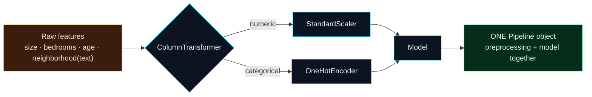

Welcome to **Day 15 of 100 Days of MLOps**. You can now clean data, split it honestly, and measure models properly. Today you learn to make models *better* through **feature engineering** — transforming raw features into forms models can actually use — and you'll do it with the single most important tool in day-to-day scikit-learn: the **Pipeline**.

Here's why this day matters beyond the transforms themselves. Feature engineering is where **data leakage** (Day 12) loves to sneak back in — scale or encode your data the wrong way and you quietly leak test information into training. The Pipeline doesn't just save typing; it makes that mistake **structurally impossible**. And as a bonus, it gives you one tidy object — preprocessing *and* model together — that you can save and serve, which is exactly what we'll need when we build a model service in Module 6.

> **A cornerstone day.** Two everyday transforms (scaling, encoding), one powerful tool (Pipeline), and a pattern you'll use in literally every serious ML project from here on.

By the end of today you will:

- **Scale** numeric features and **one-hot encode** categorical (text) ones.
- Understand why doing this by hand risks **leakage**.
- Bundle preprocessing + model into a single scikit-learn **Pipeline** with `ColumnTransformer`.
- Save the whole thing as **one file** — preprocessing and model together, serving-ready.

---

## Two transforms every project needs

**Scaling.** Our features live on wildly different scales: `size_sqft` is in the thousands, `bedrooms` in single digits. Some models — linear and logistic regression, KNN, SVM — are sensitive to that and behave badly (remember Day 13's "failed to converge"). **StandardScaler** rescales each numeric feature to a comparable range (mean 0, similar spread), which helps those models a lot. (Tree-based models don't care about scale — but scaling never hurts.)

**Encoding.** Models do maths, so they can't ingest text. If a feature is a category — a **neighborhood** like `"downtown"`, `"suburb"`, `"rural"` — you must turn it into numbers. The right tool for categories with no inherent order is **one-hot encoding**: it creates one 0/1 column per category (`is_downtown`, `is_suburb`, `is_rural`). We use one-hot rather than just numbering them 0/1/2, because numbering would falsely tell the model that "rural (2) is greater than downtown (0)" — an order that doesn't exist.

Feed a model raw text and it refuses, loudly:

```text
ValueError: could not convert string to float: 'suburb'
```

That error is the model saying "encode your categories first." So we will — the right way.

---

## The leakage trap, and the tool that removes it

You already know the rule from Day 12: **fit preprocessing on the training set only.** A `StandardScaler` needs each feature's mean; a `OneHotEncoder` needs the list of categories. If those are learned from the *whole* dataset before splitting, test information leaks into training.

Doing this by hand — fit the scaler on train, transform train, transform val, transform test, keep it all aligned, remember to do it again at serving time — is fiddly and *very* easy to get wrong. scikit-learn's **Pipeline** solves it by chaining preprocessing and the model into **one object**:



**Reading this diagram:**

On the left, in **amber**, are the **raw features** — a mix of numbers and text, straight from the CSV, not yet model-ready. They flow into the **ColumnTransformer**, the router that sends each *kind* of column to the right transform: numeric columns go to **StandardScaler**, the text `neighborhood` column goes to **OneHotEncoder** (the two cyan steps). Both transformed streams then feed into the **Model**.

Here's the crucial part: everything inside is wrapped into the **one green object** on the right — the **Pipeline**. When you call `.fit(X_train, y_train)` on it, it fits the scaler *and* the encoder *and* the model, all using **only the training data**. When you call `.predict(X_test)`, it applies those already-fitted transforms and predicts — it *cannot* accidentally learn from the test set, because fitting only happens inside `.fit()`. Leakage stops being a discipline you have to remember and becomes something the structure guarantees. And because it's one object, you save the whole thing — preprocessing and model — as a single file. That's the takeaway: **a Pipeline is preprocessing + model fused into one leak-proof, save-able unit.**

---

## Build it

First, a dataset with a real text category. Create **`make_dataset.py`**:

```python
"""make_dataset.py — house data WITH a text category (neighborhood)."""

import numpy as np
import pandas as pd

rng = np.random.default_rng(42)
n = 500

neighborhoods = np.array(["downtown", "suburb", "rural"])
premium = {"downtown": 120000, "suburb": 60000, "rural": 15000}

size_sqft = rng.integers(600, 3500, n)
bedrooms = rng.integers(1, 6, n)
age_years = rng.integers(0, 80, n)
neighborhood = rng.choice(neighborhoods, n)

noise = rng.normal(0, 25000, n)
price = (30000 + 140 * size_sqft + 12000 * bedrooms - 900 * age_years
         + np.array([premium[nb] for nb in neighborhood]) + noise)
price = np.clip(price, 50000, None).round(-2).astype(int)

pd.DataFrame({
    "size_sqft": size_sqft,
    "bedrooms": bedrooms,
    "age_years": age_years,
    "neighborhood": neighborhood,   # <-- TEXT category, not a number
    "price": price,
}).to_csv("houses.csv", index=False)
print("Wrote houses.csv (with a text 'neighborhood' column)")
```

Now the Pipeline. Create **`pipeline.py`**:

```python
"""
pipeline.py — Day 15 of 100 Days of MLOps.

Feature engineering done right. We SCALE the numeric features and ONE-HOT ENCODE
the text 'neighborhood', then bundle those transforms + the model into a single
scikit-learn Pipeline. The Pipeline fits preprocessing on the TRAIN split only —
so leakage (Day 12) is impossible — and is one object to save and serve.

Run it:  python pipeline.py
"""

import joblib
import pandas as pd
from sklearn.compose import ColumnTransformer
from sklearn.linear_model import LinearRegression
from sklearn.metrics import mean_absolute_error, r2_score
from sklearn.model_selection import train_test_split
from sklearn.pipeline import Pipeline
from sklearn.preprocessing import OneHotEncoder, StandardScaler

df = pd.read_csv("houses.csv")

numeric = ["size_sqft", "bedrooms", "age_years"]
categorical = ["neighborhood"]
X = df[numeric + categorical]
y = df["price"]

X_train, X_test, y_train, y_test = train_test_split(
    X, y, test_size=0.2, random_state=42
)

# Apply a different transform to each kind of column.
preprocess = ColumnTransformer([
    ("num", StandardScaler(), numeric),
    ("cat", OneHotEncoder(handle_unknown="ignore"), categorical),
])

# One object: preprocessing THEN model. fit() learns both, on train data only.
model = Pipeline([
    ("preprocess", preprocess),
    ("regressor", LinearRegression()),
])
model.fit(X_train, y_train)

pred = model.predict(X_test)
print(f"MAE: ${mean_absolute_error(y_test, pred):,.0f}")
print(f"R²:  {r2_score(y_test, pred):.3f}")

# Predict on a RAW house — note 'neighborhood' is still text. The pipeline
# encodes it for us, exactly like it did in training. No manual preprocessing.
new_house = pd.DataFrame([{
    "size_sqft": 2000, "bedrooms": 4, "age_years": 5, "neighborhood": "downtown",
}])
print(f"\nPredicted price (downtown): ${model.predict(new_house)[0]:,.0f}")

# The whole pipeline (preprocessing + model) saves as ONE file — serving-ready.
joblib.dump(model, "pipeline.joblib")
print("Saved pipeline.joblib (preprocessing + model in one file)")
```

Run both:

```bash
python make_dataset.py
python pipeline.py
```

```text
Wrote houses.csv (with a text 'neighborhood' column)
MAE: $19,506
R²:  0.967

Predicted price (downtown): $472,179
Saved pipeline.joblib (preprocessing + model in one file)
```

Look at what just happened. We fed the model a `neighborhood` column full of **text**, and it worked — because the Pipeline one-hot encoded it automatically. When we predicted on a brand-new house, we passed `"downtown"` as plain text and the Pipeline encoded it *exactly as it did in training*. We never manually transformed anything, never risked a leak, and the whole preprocessing-plus-model bundle saved to a single `pipeline.joblib`. That one file is what you'd hand to a web service — and it will preprocess raw inputs the same way, forever.

> **Why `handle_unknown="ignore"`?** At serving time you might get a neighborhood the model never saw in training (say `"seaside"`). By default a `OneHotEncoder` *errors* on unknown categories; `handle_unknown="ignore"` tells it to encode the unknown as all-zeros instead of crashing your service. A small setting that saves a real production outage.

---

## Common errors (and how to fix them)

**1. `ValueError: could not convert string to float: 'suburb'`**

You fed a text column straight to a model without encoding it. Route categorical columns through a `OneHotEncoder` (via a `ColumnTransformer`/`Pipeline`, as above) so they become numbers first.

**2. `ValueError: Found unknown categories ['seaside'] in column 0 during transform`**

Your `OneHotEncoder` met a category at predict-time that it never saw in training, and it's set to error by default:

```text
ValueError: Found unknown categories ['seaside'] in column 0 during transform
```

Set `OneHotEncoder(handle_unknown="ignore")` so unseen categories are handled gracefully instead of crashing.

**3. Great validation scores, poor production — leakage again**

You scaled or encoded *before* splitting (or outside the Pipeline). Put every transform **inside** the Pipeline and only ever call `.fit()` on the training data — then leakage can't happen. This is the whole reason Pipelines exist.

**4. `ValueError: A given column is not a column of the dataframe`**

Your `ColumnTransformer` lists a column name that isn't in `X` (typo, or you forgot to include it in `X`). Make sure the `numeric` and `categorical` name lists exactly match the DataFrame's columns.

**5. You numbered categories 0/1/2 instead of one-hot encoding**

Label-numbering a *nominal* category (no natural order) tells the model a false ranking — that `rural=2` is "more" than `downtown=0`. For unordered categories use **one-hot** encoding. (Only use ordinal integers when the category genuinely has an order, like small < medium < large.)

**6. You scaled the target `y`**

Scale **features** (`X`), not the target. If you scale `y`, your predictions and metrics come out in scaled units and won't mean dollars anymore. Only `X` goes through the feature transforms.

---

## Recap — what you now have

You can engineer features the professional, leak-proof way:

- You **scale** numeric features and **one-hot encode** text categories.
- You understand why hand-preprocessing risks **leakage**, and how a **Pipeline** makes it impossible.
- You built a `ColumnTransformer` + `Pipeline` that routes each column type to the right transform and fits on **train only**.
- You saved the entire **preprocessing + model** as one `pipeline.joblib` — ready to serve.

**Your cheat sheet:**

| Piece | Role |
|-------|------|
| `StandardScaler` | Rescale numeric features to comparable ranges |
| `OneHotEncoder(handle_unknown="ignore")` | Turn text categories into 0/1 columns, safely |
| `ColumnTransformer` | Route numeric vs categorical columns to different transforms |
| `Pipeline` | Chain preprocessing + model into one leak-proof object |
| `joblib.dump(pipeline, ...)` | Save preprocessing **and** model together |

Golden rule: **put every transform inside a Pipeline** — it's leak-proof by construction and gives you one object to save, load and serve.

---

## Coming up on Day 16

A single validation split can be lucky or unlucky — especially on smaller data. **Day 16 — "Cross-Validation & Honest Evaluation"** shows how to evaluate a model on *several* splits and average the results, so your score reflects real ability instead of the luck of one split. You'll learn k-fold cross-validation, how to spot overfitting from the spread of scores, and why cross-validation is the trustworthy way to compare models and settings.

See the full roadmap on the [100 Days of MLOps series page](/series/100-days-mlops). See you tomorrow.
