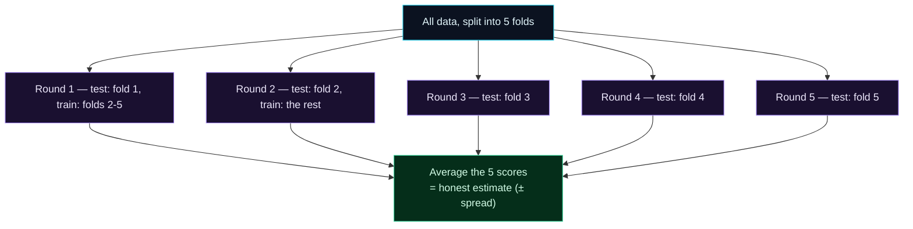

Welcome to **Day 16 of 100 Days of MLOps**. On Day 12 we flagged a weakness: a single validation split's score can be noisy — especially on smaller datasets, one unlucky split can make a good model look bad (or a bad one look good). Today we fix that properly with **cross-validation**, the technique serious ML uses to get an *honest* estimate of how good a model really is.

Cross-validation is one of those ideas that quietly separates people who "ran a model once and got 85%" from people who can actually say how well their model works. It gives you three things at once: a trustworthy performance number, a measure of how *stable* that number is, and a clear early-warning signal for **overfitting**. You'll use it constantly.

> **Building on Day 12.** You know train/validation/test. Cross-validation is a smarter way to use your data for the "measure how good this is" job — squeezing a reliable estimate out of limited data.

By the end of today you will:

- Understand why a **single split** can mislead you.
- Run **k-fold cross-validation** and read its **mean ± spread**.
- Compare models fairly using cross-validation.
- Spot **overfitting** from the gap between training and cross-validation scores.

---

## Why one split isn't enough

When you split off 20% for testing, *which* 20% you happen to get is random. On a small dataset, one split might hand you an easy test set (flattering score) and another a hard one (harsh score). Reporting the number from a single split is like judging a student on one exam question — it might not reflect their real ability.

**k-fold cross-validation** removes the luck. You split the data into *k* equal **folds** (say 5). Then you train and test *k* times — each time, one fold is the test set and the other four are training — so **every row gets a turn in the test set exactly once**. Average the *k* scores and you get a far more reliable estimate.



**Reading this diagram:**

At the top, the **cyan** node is all your data, chopped into 5 equal folds. From it, five **purple** rounds run in turn. In Round 1, fold 1 is the test set and folds 2–5 are training; in Round 2, fold 2 takes its turn as test while the rest train; and so on through Round 5. The key thing to notice: across the five rounds, **every fold is used for testing exactly once, and for training four times** — so no data is wasted, and no single lucky split decides your fate.

All five scores flow into the **green** node at the bottom, where they're averaged. That average is your honest performance estimate — and the *spread* of the five scores (their standard deviation) is a bonus: a tight spread means the model performs consistently; a wide spread means its performance depends heavily on which data it sees, a warning sign. The takeaway: **cross-validation trades a bit more computation for a much more trustworthy answer** — and it's the standard way to evaluate and compare models.

---

## Run it

scikit-learn's `cross_val_score` does the whole rotation in one call. Crucially, when you pass it a **Pipeline** (Day 15), it refits the *entire* pipeline — scaler, encoder, model — on each fold's training data, so preprocessing never leaks across folds. Create **`cv.py`** (using Day 15's `houses.csv` with the `neighborhood` column):

```python
"""
cv.py — Day 16 of 100 Days of MLOps.

One split can be lucky. Cross-validation trains and tests on SEVERAL splits and
averages — a far more honest estimate. We also see the train-vs-CV gap that
reveals overfitting. cross_val_score refits the whole Pipeline on each fold, so
preprocessing stays leak-free (Day 12/15).

Run it:  python cv.py
"""

import numpy as np
import pandas as pd
from sklearn.compose import ColumnTransformer
from sklearn.linear_model import LinearRegression
from sklearn.model_selection import cross_val_score
from sklearn.pipeline import Pipeline
from sklearn.preprocessing import OneHotEncoder, StandardScaler
from sklearn.tree import DecisionTreeRegressor

df = pd.read_csv("houses.csv")
numeric = ["size_sqft", "bedrooms", "age_years"]
categorical = ["neighborhood"]
X = df[numeric + categorical]
y = df["price"]

preprocess = ColumnTransformer([
    ("num", StandardScaler(), numeric),
    ("cat", OneHotEncoder(handle_unknown="ignore"), categorical),
])


def make(model):
    return Pipeline([("preprocess", preprocess), ("model", model)])


# --- 5-fold cross-validation of the linear model, scored by R² --------------
lin = make(LinearRegression())
scores = cross_val_score(lin, X, y, cv=5, scoring="r2")
print("Linear model — 5-fold R² scores:")
print("  " + "  ".join(f"{s:.3f}" for s in scores))
print(f"  mean {scores.mean():.3f}  ±  {scores.std():.3f}")

# --- Compare two models fairly, both by cross-validation --------------------
print("\nComparing models by mean CV R²:")
for name, model in [
    ("LinearRegression", LinearRegression()),
    ("DecisionTree(depth=4)", DecisionTreeRegressor(max_depth=4, random_state=42)),
]:
    cv = cross_val_score(make(model), X, y, cv=5, scoring="r2")
    print(f"  {name:<24} {cv.mean():.3f}  ± {cv.std():.3f}")

# --- Overfitting shows up as a big train-vs-CV gap --------------------------
deep = make(DecisionTreeRegressor(max_depth=None, random_state=42))
deep.fit(X, y)
train_r2 = deep.score(X, y)
cv_r2 = cross_val_score(deep, X, y, cv=5, scoring="r2").mean()
print("\nOverfitting check — a very deep tree:")
print(f"  train R²: {train_r2:.3f}   (looks perfect...)")
print(f"  CV R²:    {cv_r2:.3f}   (...but real performance is lower)")
print(f"  gap of {train_r2 - cv_r2:.3f} = overfitting")
```

Run it:

```bash
python cv.py
```

```text
Linear model — 5-fold R² scores:
  0.973  0.962  0.959  0.965  0.958
  mean 0.963  ±  0.006

Comparing models by mean CV R²:
  LinearRegression         0.963  ± 0.006
  DecisionTree(depth=4)    0.879  ± 0.030

Overfitting check — a very deep tree:
  train R²: 1.000   (looks perfect...)
  CV R²:    0.899   (...but real performance is lower)
  gap of 0.101 = overfitting
```

Three things to take from this. **First**, the five fold scores (0.973, 0.962, …) are all close and average **0.963 ± 0.006** — a tight spread, so the linear model is genuinely stable, not lucky. **Second**, comparing models is now fair: the linear model (0.963) beats the tree (0.879), and the tree's larger spread (±0.030) says it's also less consistent. **Third**, the overfitting check is the punchline.

---

## Overfitting, made visible

The deep tree scores a **perfect 1.000 on the training data** — it has essentially memorised every house. But its **cross-validation R² is only 0.899** — that's its *real* ability on data it hasn't seen. The **0.101 gap** between "looks perfect on training" and "actually 0.899 in reality" *is* overfitting, made measurable.

This is the single most useful diagnostic in practical ML:

> A big gap between **training score** and **cross-validation score** means the model is **overfitting** — memorising the training data instead of learning general patterns. A small gap means it's generalising well.

You never see this from training score alone (it always looks great). Cross-validation is what exposes the truth — which is exactly why we don't trust a model until we've cross-validated it.

---

## A note on scikit-learn's "neg" scores

For error metrics like MAE, scikit-learn's scoring strings are **negated** — you ask for `"neg_mean_absolute_error"`, and it returns *negative* numbers (e.g. `-19500`). Why? Because `cross_val_score` follows a "higher is better" convention, and since lower error is better, it flips the sign so that "less negative = better." To read it as dollars, just negate it back: `-scores.mean()`. R² needs no such trick (higher is already better), which is why we scored by `"r2"` above.

---

## Common errors (and how to fix them)

**1. `InvalidParameterError: The 'scoring' parameter ... Got 'rmse' instead`**

You used a scoring name scikit-learn doesn't recognise:

```text
InvalidParameterError: The 'scoring' parameter of cross_val_score must be a str
among {... 'r2', 'neg_root_mean_squared_error', 'neg_mean_absolute_error' ...},
a callable or None. Got 'rmse' instead.
```

Use the official names: `"r2"`, `"neg_root_mean_squared_error"`, `"neg_mean_absolute_error"`, `"accuracy"`, `"f1"`, and so on. Note the `neg_` prefix on error metrics.

**2. Your MAE scores are all negative**

Not a bug — that's the `neg_` convention above. Negate to read real values: `-cross_val_score(..., scoring="neg_mean_absolute_error")`.

**3. Wildly different scores across folds (huge ± spread)**

Your model's performance depends heavily on which rows it sees — usually too little data, or a model that's too complex for it. A big spread is a warning that your single-split score would have been unreliable. Get more data, simplify the model, or at least report the spread honestly.

**4. Cross-validation scores are much worse than your single-split score**

Your earlier good number was a lucky split. The cross-validation average is the honest one — trust it over any single split.

**5. Leakage sneaks back in during cross-validation**

If you scale or encode *before* calling `cross_val_score` (outside the pipeline), each fold's preprocessing has seen the whole dataset — leakage. Always pass a **Pipeline** to `cross_val_score` so preprocessing refits inside each fold (Day 15).

**6. Cross-validation feels slow**

It trains the model *k* times, so it's roughly *k*× the work of one fit. That's the cost of an honest estimate. For quick experiments use fewer folds (e.g. `cv=3`); for a final, careful evaluation use 5 or 10.

---

## Recap — what you now have

You can evaluate models the trustworthy way:

- You understand why a **single split** can mislead, and how **k-fold CV** removes the luck.
- You read a CV result as **mean ± spread** — the estimate *and* its reliability.
- You **compare models fairly** using cross-validation instead of one split.
- You detect **overfitting** from the **train-vs-CV gap** (deep tree: 1.000 vs 0.899).

**Your cheat sheet:**

| Task | Code |
|------|------|
| 5-fold CV (R²) | `cross_val_score(pipe, X, y, cv=5, scoring="r2")` |
| CV for MAE (negate) | `-cross_val_score(pipe, X, y, cv=5, scoring="neg_mean_absolute_error")` |
| Report result | `scores.mean()`, `scores.std()` |
| Overfitting signal | training score ≫ CV score |
| Leak-safe CV | pass a **Pipeline** to `cross_val_score` |

Golden rule: **don't trust a model until you've cross-validated it** — the average is your real score, the spread is your reliability, and the train-vs-CV gap is your overfitting alarm.

---

## Coming up on Day 17

Cross-validation tells you how good a model *is* — next we use it to make a model *better*. **Day 17 — "Hyperparameters & Tuning"** covers the settings you choose before training (a tree's depth, a model's strength) and how to search for the best combination automatically with **GridSearchCV**, which cross-validates every candidate for you. You'll take a model from its out-of-the-box defaults to a tuned, measurably better version — the honest way, without leaking.

See the full roadmap on the [100 Days of MLOps series page](/series/100-days-mlops). See you tomorrow.
