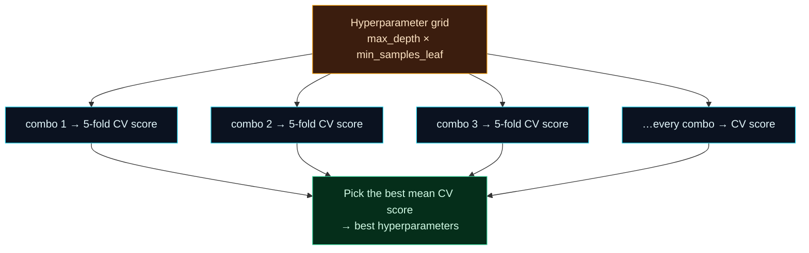

Welcome to **Day 17 of 100 Days of MLOps**. Yesterday cross-validation gave you an *honest* way to measure a model. Today you'll use that same tool to make a model *better* — by tuning its **hyperparameters**, the settings you choose before training. And you'll do it the professional way: not by fiddling by hand, but with **GridSearchCV**, which searches combinations for you and cross-validates each one so the whole process stays honest.

This is where "I trained a model" becomes "I found a *good* model." The defaults scikit-learn ships are reasonable starting points, but they're almost never the best choice for *your* data. A short, automated search often buys you a real, measurable improvement — for free.

> **Builds directly on Day 16.** Tuning without cross-validation is how people fool themselves into shipping worse models. GridSearchCV bakes CV in, so every candidate is judged fairly.

By the end of today you will:

- Know the difference between **parameters** and **hyperparameters**.
- Use **GridSearchCV** to search combinations, cross-validating each.
- Read `best_params_` and `best_score_`, and measure the **improvement over default**.
- Tune a model *inside a Pipeline* without leaking.

---

## Parameters vs hyperparameters

Two words that sound alike but mean very different things:

- **Parameters** are what the model **learns** during `fit()` — the coefficients of a linear regression, the split points of a decision tree. You never set these by hand; training finds them.
- **Hyperparameters** are the settings **you choose before** training — a decision tree's `max_depth`, how many samples a leaf must have (`min_samples_leaf`), a linear model's regularisation strength. Training does *not* choose these; you do.

Hyperparameters control how the model learns, and the right values depend on your data. A tree that's too shallow underfits (misses real patterns); too deep and it overfits (memorises — you saw exactly this on Day 16). The sweet spot is found by **trying values and measuring** — which is what tuning is.

Doing that by hand is tedious and dangerous: you'd retrain over and over and, without care, end up overfitting to your validation set. Instead we automate it.

## GridSearchCV: try everything, cross-validate everything

**GridSearchCV** takes a **grid** of hyperparameter values, tries **every combination**, scores each one with cross-validation, and hands you the winner.



**Reading this diagram:**

At the top, in **amber**, is the **grid** — every value you want to try for each hyperparameter. GridSearchCV forms every *combination* of them (if you give 5 depths and 4 leaf-sizes, that's 5 × 4 = 20 combinations). Each combination becomes one of the **cyan** nodes, and — this is the important bit — each is scored with full **5-fold cross-validation** (Day 16), not a single lucky split. So every candidate is judged on the same fair, honest basis.

All those CV scores flow into the **green** node, where GridSearchCV picks the combination with the best mean CV score and reports it as the winning hyperparameters. The takeaway: **GridSearchCV = "cross-validate every combination and keep the best."** It turns tuning from guesswork into a systematic, leak-free search — and because CV is built in, the winner it reports is one you can actually trust.

---

## Tune a model

Create **`tune.py`**. We tune a decision tree's depth and leaf size, *inside* the Pipeline so preprocessing never leaks.

```python
"""
tune.py — Day 17 of 100 Days of MLOps.

Hyperparameters are the settings you choose BEFORE training (like a tree's
depth). GridSearchCV tries every combination, cross-validates each, and picks
the best — automatically and without leakage. We compare a default model to the
tuned one.

Run it:  python tune.py
"""

import pandas as pd
from sklearn.compose import ColumnTransformer
from sklearn.model_selection import GridSearchCV, cross_val_score
from sklearn.pipeline import Pipeline
from sklearn.preprocessing import OneHotEncoder, StandardScaler
from sklearn.tree import DecisionTreeRegressor

df = pd.read_csv("houses.csv")
numeric = ["size_sqft", "bedrooms", "age_years"]
categorical = ["neighborhood"]
X = df[numeric + categorical]
y = df["price"]

preprocess = ColumnTransformer([
    ("num", StandardScaler(), numeric),
    ("cat", OneHotEncoder(handle_unknown="ignore"), categorical),
])
pipe = Pipeline([("preprocess", preprocess),
                 ("model", DecisionTreeRegressor(random_state=42))])

# Baseline: the model with its default settings.
default_cv = cross_val_score(pipe, X, y, cv=5, scoring="r2").mean()
print(f"Default DecisionTree — mean CV R²: {default_cv:.3f}")

# The grid: every combination of these will be tried. Note the "model__" prefix
# targets a step inside the Pipeline.
grid = {
    "model__max_depth": [3, 5, 8, 12, None],
    "model__min_samples_leaf": [1, 5, 10, 20],
}
n_combos = len(grid["model__max_depth"]) * len(grid["model__min_samples_leaf"])
print(f"\nSearching {n_combos} combinations, each with 5-fold CV...")

search = GridSearchCV(pipe, grid, cv=5, scoring="r2")
search.fit(X, y)

print(f"\nBest CV R²:      {search.best_score_:.3f}")
print(f"Best parameters: {search.best_params_}")
print(f"Improvement over default: {search.best_score_ - default_cv:+.3f}")
```

The one piece of new syntax is the **`model__`** prefix in the grid. Because our estimator is a Pipeline with a step named `"model"`, `"model__max_depth"` means "the `max_depth` of the step called `model`." That double-underscore is how you reach into a Pipeline to tune the right piece. Run it:

```bash
python tune.py
```

```text
Default DecisionTree — mean CV R²: 0.899

Searching 20 combinations, each with 5-fold CV...

Best CV R²:      0.917
Best parameters: {'model__max_depth': 8, 'model__min_samples_leaf': 5}
Improvement over default: +0.018
```

The default tree scored **0.899**; after searching 20 combinations, GridSearchCV found that **`max_depth=8, min_samples_leaf=5`** lifts it to **0.917** — a real, honest **+0.018** improvement, measured by cross-validation. That's a better model for the cost of a few seconds of search, no guesswork involved.

One convenience: by default GridSearchCV **refits** the best combination on all your data, so `search` itself is a ready-to-use fitted model — `search.predict(new_data)` uses the winning settings, and you can `joblib.dump(search.best_estimator_, ...)` to save it (Day 7).

---

## Two things to keep in mind

**Grids grow fast.** Every value you add multiplies the work: 5 depths × 4 leaf sizes × 5 folds = 100 model fits already. Add a third hyperparameter with 5 values and it's 500. Keep grids focused. For large search spaces, **`RandomizedSearchCV`** samples a fixed number of random combinations instead of trying them all — far cheaper, and usually nearly as good.

**Never tune on the test set.** GridSearchCV cross-validates on the data you give it — treat that as your training/validation data. Keep a **separate test set** (Day 12) that the search never sees, and use it once at the very end for your final honest number. Tuning against the test set is just leakage in a fancier outfit.

---

## Common errors (and how to fix them)

**1. `ValueError: Invalid parameter 'max_depth' for estimator Pipeline(...)`**

You forgot the step-name prefix. When tuning a Pipeline, hyperparameter keys must be `stepname__param`:

```text
ValueError: Invalid parameter 'max_depth' for estimator Pipeline(...)
```

Use `"model__max_depth"` (the step is named `"model"`), not `"max_depth"`.

**2. The search takes forever**

Your grid is too big — remember it's (product of all value counts) × (number of folds) model fits. Trim the grid, use fewer folds while experimenting (`cv=3`), or switch to `RandomizedSearchCV(n_iter=20)` to cap the number of combinations tried.

**3. `InvalidParameterError: The 'scoring' parameter ... Got 'rmse'`**

Same as Day 16 — use a valid scoring name like `"r2"`, `"neg_root_mean_squared_error"`, `"accuracy"`. Error metrics take the `neg_` prefix.

**4. Your tuned model isn't better on the test set**

You may have tuned too aggressively and overfit to the cross-validation folds, or your grid didn't include a genuinely better setting. Keep grids sensible, and always confirm the tuned model on a held-out **test set** before believing the improvement.

**5. You passed raw preprocessing outside the pipeline**

If you scale/encode before `GridSearchCV`, every CV fold leaks (Day 15). Tune the **Pipeline**, so preprocessing refits inside each fold for every candidate.

**6. `best_params_` picks the extreme edge of your grid**

If the best value is the largest (or smallest) you offered, the real optimum may be beyond your grid. Extend the range in that direction and search again.

---

## Recap — what you now have

You can turn a default model into a tuned one, honestly:

- You know **parameters** (learned) vs **hyperparameters** (you set).
- You use **GridSearchCV** to try every combination and cross-validate each.
- You read `best_score_` / `best_params_` and measured a real **+0.018** gain.
- You tune **inside a Pipeline** (leak-free) and keep a **test set** untouched for the final number.

**Your cheat sheet:**

| Task | Code |
|------|------|
| Define a grid | `{"model__max_depth": [3, 5, 8], ...}` |
| Search + CV | `GridSearchCV(pipe, grid, cv=5, scoring="r2").fit(X, y)` |
| Best result | `search.best_score_`, `search.best_params_` |
| Use / save best | `search.predict(...)`, `search.best_estimator_` |
| Big search space | `RandomizedSearchCV(pipe, grid, n_iter=20)` |

Golden rule: **tune with cross-validation, inside the pipeline, on non-test data** — then confirm the winner once on the held-out test set.

---

## Coming up on Day 18

So far our data has been well-behaved and balanced. Reality often isn't: fraud is rare, disease is rare, and a naive model just predicts "no" every time and calls it 99% accurate. **Day 18 — "Handling Imbalanced & Messy Data"** tackles the class-imbalance problem head-on — why accuracy betrays you (again), and practical fixes like `class_weight="balanced"` and resampling that make a model actually *catch* the rare cases that matter most.

See the full roadmap on the [100 Days of MLOps series page](/series/100-days-mlops). See you tomorrow.
