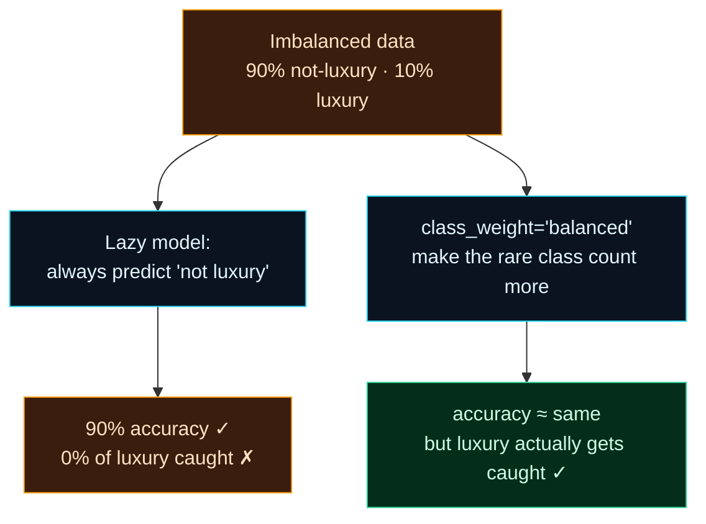

Welcome to **Day 18 of 100 Days of MLOps**. Every classification problem we've built so far had roughly balanced classes. Real problems often don't — and that changes everything. The cases you most want to catch are usually the **rare** ones: fraud among millions of legit transactions, disease among healthy patients, the few customers about to churn. On data like that, the obvious approach fails in a way that's genuinely dangerous, because it fails *while looking successful*.

Today you'll see the trap with real numbers — a model that scores 90% accuracy and catches **zero** of the cases that matter — and learn the practical fixes that make a model actually find the rare class. This is one of the most important real-world skills in applied ML.

> **Builds on Day 13's metrics.** The accuracy paradox we mentioned there becomes concrete today, with a live demonstration and a one-line fix that rescues it.

By the end of today you will:

- See exactly how **class imbalance** makes accuracy lie.
- Judge a model on the **rare class's recall**, not overall accuracy.
- Fix imbalance with **`class_weight="balanced"`** and understand the trade-off.
- Know where **resampling** (and SMOTE) fits, and how to use it without leaking.

---

## The trap: a rare class the model ignores

Let's make a rare class: label the **top 10%** most expensive houses as **"luxury."** Now 90% of houses are "not luxury" and only 10% are luxury. Watch what a lazy model does.

The simplest possible "model" always predicts the majority class — "not luxury," every time. On our data that's right 90% of the time, so it scores **90% accuracy**. Sounds great! But it has caught **zero** luxury homes — the only ones we actually cared about. Its **recall** on the luxury class is **0%**.



**Reading this diagram:**

Start at the top: the **amber** node is our **imbalanced data** — 90% not-luxury, 10% luxury. From it, two paths diverge. The **left path** is the trap: a lazy model (cyan) that always predicts the majority "not luxury." It lands in the **amber "trap" box** — *90% accuracy, but 0% of luxury caught.* The accuracy looks like success; the model is useless for its actual job. That's the danger of imbalance — the failure is disguised as a good score.

The **right path** is the fix: `class_weight="balanced"` (cyan) tells the model to treat the rare class as *more important*, so a mistake on a luxury home counts for more during training. It leads to the **green** node — accuracy stays about the same, but now the model *actually catches* luxury homes. The takeaway: on imbalanced data, **overall accuracy is the wrong thing to watch** — you care about the rare class's recall, and you often need to explicitly tell the model to care about it too.

---

## See it, then fix it

Create **`imbalance.py`**. It compares three models on how well they handle the rare luxury class.

```python
"""
imbalance.py — Day 18 of 100 Days of MLOps.

A rare class ("luxury" homes, ~10%) exposes the accuracy trap: a model that
never predicts luxury still scores ~90% accuracy while catching ZERO luxury
homes. We fix it with class_weight="balanced" and watch recall jump.

Run it:  python imbalance.py
"""

import pandas as pd
from sklearn.compose import ColumnTransformer
from sklearn.dummy import DummyClassifier
from sklearn.linear_model import LogisticRegression
from sklearn.metrics import precision_score, recall_score
from sklearn.model_selection import train_test_split
from sklearn.pipeline import Pipeline
from sklearn.preprocessing import OneHotEncoder, StandardScaler

df = pd.read_csv("houses.csv")

# Rare positive class: the top 10% most expensive homes are "luxury".
threshold = df["price"].quantile(0.90)
df["is_luxury"] = (df["price"] > threshold).astype(int)
print(f"Class balance: {df['is_luxury'].value_counts().to_dict()}  "
      f"({df['is_luxury'].mean():.0%} luxury)")

numeric = ["size_sqft", "bedrooms", "age_years"]
categorical = ["neighborhood"]
X = df[numeric + categorical]
y = df["is_luxury"]
X_train, X_test, y_train, y_test = train_test_split(
    X, y, test_size=0.2, random_state=42, stratify=y
)

pre = ColumnTransformer([
    ("num", StandardScaler(), numeric),
    ("cat", OneHotEncoder(handle_unknown="ignore"), categorical),
])


def report(name, model):
    model.fit(X_train, y_train)
    pred = model.predict(X_test)
    acc = (pred == y_test).mean()
    rec = recall_score(y_test, pred, zero_division=0)      # of real luxury, how many caught
    prec = precision_score(y_test, pred, zero_division=0)  # of predicted luxury, how many right
    print(f"  {name:<34} accuracy {acc:.2f}   luxury recall {rec:.2f}   precision {prec:.2f}")


print("\nHow well is the RARE 'luxury' class handled?")
report("Always-'not-luxury' baseline", DummyClassifier(strategy="most_frequent"))
report("LogisticRegression (default)", Pipeline([("p", pre), ("m", LogisticRegression(max_iter=1000))]))
report("LogisticRegression (balanced)",
       Pipeline([("p", pre), ("m", LogisticRegression(max_iter=1000, class_weight="balanced"))]))
print("\n→ Accuracy barely moves, but 'balanced' rescues luxury recall.")
```

Run it:

```bash
python imbalance.py
```

```text
Class balance: {0: 450, 1: 50}  (10% luxury)

How well is the RARE 'luxury' class handled?
  Always-'not-luxury' baseline       accuracy 0.90   luxury recall 0.00   precision 0.00
  LogisticRegression (default)       accuracy 0.93   luxury recall 0.30   precision 1.00
  LogisticRegression (balanced)      accuracy 0.92   luxury recall 1.00   precision 0.56

→ Accuracy barely moves, but 'balanced' rescues luxury recall.
```

This one table tells the whole story. The **baseline** scores 90% accuracy while catching **none** of the luxury homes (recall 0.00) — the trap. The **default** logistic regression looks decent at 93% accuracy, but its luxury recall is only **0.30** — it's *missing 70% of luxury homes* while its accuracy hides it. Flip on **`class_weight="balanced"`** and luxury recall jumps to **1.00** — it now catches *every* luxury home — while accuracy barely moves (0.93 → 0.92).

---

## Reading the trade-off

Look closely at that last row: recall went to 1.00, but **precision dropped to 0.56.** That's the precision/recall tension from Day 13, live. By telling the model to care more about the rare class, it now flags more houses as luxury — catching all the real ones (recall ↑) but also raising some false alarms (precision ↓).

Is that a good trade? **It depends entirely on what a mistake costs** — exactly the decision from Day 13:

- If **missing** a luxury home is expensive (a missed fraud, a missed diagnosis), favour **recall** — `class_weight="balanced"` is your friend.
- If **false alarms** are expensive, you may prefer the higher-precision default and accept lower recall.

The key MLOps mindset: on imbalanced data, you *choose* the operating point deliberately, guided by the rare class's recall and precision — never by accuracy alone.

---

## Other tools: resampling and SMOTE

`class_weight` is the simplest fix and often enough. Two more you'll meet:

- **Oversampling** the minority (duplicating or synthesising more rare examples) or **undersampling** the majority (dropping some common examples) to even out the classes.
- **SMOTE**, which *synthesises* new minority examples rather than copying them — via the `imbalanced-learn` library (`pip install imbalanced-learn`).

One critical rule if you resample: **resample the training data only, inside cross-validation** — never the test set, and never before splitting. Otherwise you leak (Day 12) and your scores lie. `imbalanced-learn` provides a pipeline that does this correctly. For most problems, start with `class_weight="balanced"` — it's built in, leak-free, and frequently all you need.

> **"Messy" data too.** Imbalance is one kind of messy; the others you met on Day 11 — missing values, wrong types, duplicates — still apply here. Clean first (Day 11), *then* address imbalance. A rare class made of dirty rows is two problems stacked.

---

## Common errors (and how to fix them)

**1. `UndefinedMetricWarning: Precision is ill-defined and being set to 0.0 due to no predicted samples`**

The model never predicted the positive class at all (like the lazy baseline), so precision is 0/0:

```text
UndefinedMetricWarning: Precision is ill-defined and being set to 0.0 due to
no predicted samples. Use `zero_division` parameter to control this behavior.
```

It's telling you the model is ignoring the rare class — the very problem to fix. Pass `zero_division=0` to silence the warning, and use `class_weight="balanced"` to fix the underlying issue.

**2. "95% accuracy!" but the model is useless**

Classic imbalance. Stop looking at accuracy; look at the **rare class's recall and precision** (and the confusion matrix). If recall on the important class is low, the accuracy is meaningless.

**3. Your train/test split has almost no rare cases in one side**

Random splitting can starve one side of the rare class. Always use `stratify=y` (Day 12) so both splits keep the same class ratio.

**4. You resampled before splitting (or resampled the test set)**

Leakage. Synthetic/duplicated rows must only touch the **training** data, created *after* the split (and inside CV folds). Never resample the test set — it must reflect the real-world class balance.

**5. `class_weight` did nothing**

You set it on the wrong object, or the model doesn't support it. It goes on the **classifier** (`LogisticRegression(class_weight="balanced")`, `DecisionTreeClassifier(class_weight="balanced")`), not on the scaler or the pipeline wrapper.

**6. Recall went up but precision cratered — did I break it?**

No — that's the expected trade-off. Higher recall on a rare class usually costs precision. Decide which matters for your problem; if you need both high, you may need a better model, more data, or a tuned decision threshold.

---

## Recap — what you now have

You can handle the rare classes that matter most:

- You saw how **imbalance makes accuracy lie** — 90% accuracy, 0% of the rare class caught.
- You judge imbalanced models by the **rare class's recall/precision**, not accuracy.
- You fixed it with **`class_weight="balanced"`** (recall 0.30 → 1.00) and understood the precision trade-off.
- You know where **resampling/SMOTE** fits, and the golden rule: **resample train only**.

**Your cheat sheet:**

| Situation | Move |
|-----------|------|
| Rare positive class | Watch **recall/precision** of that class, not accuracy |
| Model ignores rare class | `class_weight="balanced"` on the classifier |
| Keep class ratio in splits | `train_test_split(..., stratify=y)` |
| Need synthetic minority data | `imbalanced-learn` (SMOTE), **train only** |
| Choosing the trade-off | Recall if misses are costly; precision if false alarms are |

Golden rule: **on imbalanced data, accuracy is a liar** — optimise the rare class's recall, and choose your precision/recall trade-off on purpose.

---

## Coming up on Day 19

Your models work — but can you explain *why* they predict what they do? For trust, debugging, and often the law, "the model said so" isn't enough. **Day 19 — "Model Interpretability Basics"** shows how to open the black box: reading a model's **feature importances**, using **permutation importance** to see which inputs actually drive predictions, and where tools like **SHAP** come in. Understanding *why* a model decides is fast becoming a required MLOps skill, not a nice-to-have.

See the full roadmap on the [100 Days of MLOps series page](/series/100-days-mlops). See you tomorrow.
