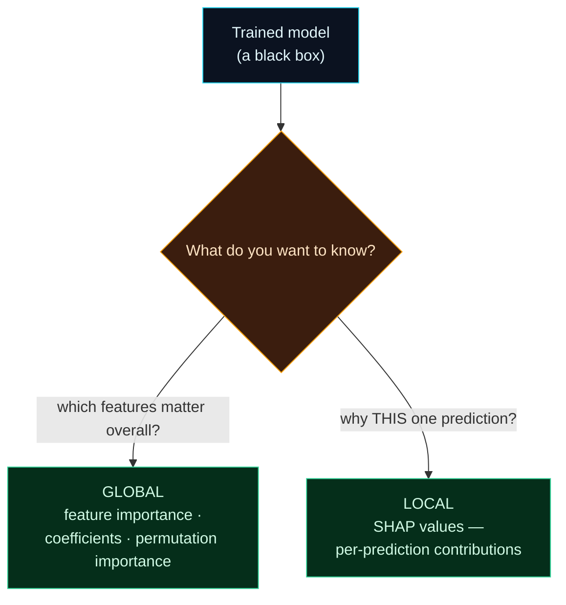

Welcome to **Day 19 of 100 Days of MLOps**. Your models make good predictions — but can you explain *why*? "The algorithm decided" is not an acceptable answer when a loan is denied, a diagnosis is flagged, or a model quietly starts behaving strangely in production. **Interpretability** — understanding *why* a model predicts what it does — has gone from a nice-to-have to a core skill, driven by trust, debugging, fairness, and regulations like the "right to an explanation."

Interpretability is also one of your most powerful **debugging** tools. It's how you catch a model that's secretly relying on a leaked feature, or ignoring the input that should matter most. Today you'll open the black box with techniques that work on *any* model.

> **A practical, hands-on look.** No heavy math. We rank what actually drives a model's predictions, in a way that works whether the model is a simple line or a complex ensemble.

By the end of today you will:

- Know the difference between **global** and **local** interpretability.
- Read a model's **feature importances**.
- Use **permutation importance** — a model-agnostic method — to see what really drives predictions.
- Know where **SHAP** fits for explaining a *single* prediction.

---

## Two questions interpretability answers

There are two different things you might want to know, and different tools answer each:



**Reading this diagram:**

On the left, the **cyan** node is your trained model — a black box that turns features into predictions. The **amber diamond** is the fork: *what do you actually want to know?* Two answers branch out, both **green** (both are useful outcomes). The left branch is **global** interpretability — "across all predictions, which features does the model rely on most?" That's what feature importances and permutation importance tell you, and it's great for understanding and debugging the model as a whole. The right branch is **local** interpretability — "for *this specific* house, why did it predict $500k?" — which breaks a single prediction into per-feature contributions, the job of **SHAP**.

The takeaway: **"which features matter in general" and "why this one prediction" are different questions with different tools.** Today we focus mainly on the global side (simple, model-agnostic, hugely useful) and point you to SHAP for the local side.

---

## Permutation importance: works on any model

The simplest built-in signals are a linear model's **coefficients** (how much price moves per unit of a scaled feature) and a tree's **`feature_importances_`**. Both are handy but model-specific. A more general, trustworthy technique is **permutation importance**, and the idea is beautifully simple:

> Take a trained model. **Shuffle one feature's values** (so it becomes random noise) and re-measure the score. If the score **drops a lot**, the model relied heavily on that feature. If the score barely changes, the model wasn't using it.

It works on **any** model — linear, tree, ensemble, neural net — because it only needs to call `predict`. And it reports importance for your **original** features (even `neighborhood`), no matter how they were transformed inside the pipeline. Create **`interpret.py`**:

```python
"""
interpret.py — Day 19 of 100 Days of MLOps.

Open the black box. Which features actually drive the model's predictions?
Permutation importance answers this for ANY model: shuffle one feature's values
and measure how much the score drops — a big drop means the model leaned on it.

Run it:  python interpret.py
"""

import pandas as pd
from sklearn.compose import ColumnTransformer
from sklearn.inspection import permutation_importance
from sklearn.model_selection import train_test_split
from sklearn.pipeline import Pipeline
from sklearn.preprocessing import OneHotEncoder, StandardScaler
from sklearn.tree import DecisionTreeRegressor

df = pd.read_csv("houses.csv")
numeric = ["size_sqft", "bedrooms", "age_years"]
categorical = ["neighborhood"]
X = df[numeric + categorical]
y = df["price"]
X_train, X_test, y_train, y_test = train_test_split(
    X, y, test_size=0.2, random_state=42
)

pipe = Pipeline([
    ("preprocess", ColumnTransformer([
        ("num", StandardScaler(), numeric),
        ("cat", OneHotEncoder(handle_unknown="ignore"), categorical),
    ])),
    ("model", DecisionTreeRegressor(max_depth=8, random_state=42)),
])
pipe.fit(X_train, y_train)
print(f"Test R²: {pipe.score(X_test, y_test):.3f}")

# Permutation importance: works on the ORIGINAL features (even 'neighborhood'),
# and on ANY model — it just measures score-drop when a feature is shuffled.
result = permutation_importance(
    pipe, X_test, y_test, n_repeats=20, random_state=42, scoring="r2"
)

print("\nFeature importance (R² drop when the feature is shuffled):")
order = result.importances_mean.argsort()[::-1]
for i in order:
    print(f"  {X.columns[i]:<16} {result.importances_mean[i]:.3f}  ± {result.importances_std[i]:.3f}")
print("\n→ Bigger drop = the model relies on it more.")
```

Run it:

```bash
python interpret.py
```

```text
Test R²: 0.908

Feature importance (R² drop when the feature is shuffled):
  size_sqft        1.556  ± 0.156
  neighborhood     0.173  ± 0.033
  age_years        0.014  ± 0.009
  bedrooms         0.006  ± 0.007
```

Now you can *explain* your model. Shuffling **`size_sqft`** collapses the score by 1.556 R² points (from 0.908 down into negative territory) — the model leans on size more than anything else. **`neighborhood`** matters clearly too (0.173). **`age_years`** and **`bedrooms`** barely move the needle. That ordering matches how house prices really work — size and location dominate — which is a good sign the model learned something real.

---

## Interpretability as a debugging tool

This ranking isn't just for explaining to stakeholders — it's how you *catch bugs*:

- **A feature you expected to matter shows ~0 importance?** Maybe it's broken (all one value after a bad clean), or the model genuinely doesn't need it.
- **A suspicious feature dominates?** That's a classic **leakage** signal (Day 12). If some ID column or a feature derived from the target tops the list, investigate — the model may be "cheating."
- **The ranking makes no domain sense?** Something upstream is wrong — bad data, a mislabelled column, a target leak.

Interpretability turns "the model scores well" into "the model scores well *for sensible reasons*" — which is what you actually need before trusting it in production.

---

## SHAP: explaining a single prediction

Permutation importance is **global** ("size matters most overall"). Often you need **local**: *why did the model price **this** house at $500k?* **SHAP** answers that by attributing a prediction to each feature — e.g. "+$120k because it's downtown, +$80k for its size, −$15k for its age." It's the leading tool for per-prediction explanations, installable with `pip install shap`.

We won't add the dependency today (it's heavier, and global importance covers most needs to start), but know it exists: when someone asks "why did the model decide *that* for *this* case?", SHAP is the answer. A one-line mental model: **permutation importance explains the model; SHAP explains a prediction.**

---

## Common errors (and how to fix them)

**1. `AttributeError: 'Pipeline' object has no attribute 'feature_importances_'`**

You asked the *pipeline* for importances, but they live on the model *step* inside it:

```text
AttributeError: 'Pipeline' object has no attribute 'feature_importances_'
```

Reach the step: `pipe.named_steps["model"].feature_importances_`. (Or sidestep the issue entirely with `permutation_importance`, which works on the whole pipeline.)

**2. Feature names don't line up with tree importances**

A tree's `feature_importances_` are in *transformed* space — after one-hot encoding, `neighborhood` becomes several columns. Mapping them back is fiddly. Permutation importance avoids this by reporting importance for your **original** columns.

**3. You ran permutation importance on the training data**

Run it on the **test set** (as above). On training data it can overstate importance for features the model overfit to; the test set tells you what actually generalises.

**4. Two correlated features both look "unimportant"**

If two features carry the same information, shuffling one doesn't hurt (the model leans on its twin), so both can look low. Importance is *per-feature given the others* — with correlated inputs, read the results with that caveat, and consider dropping duplicates.

**5. Treating importance as causation**

"Important to the model" ≠ "causes the outcome." The model found a *predictive* relationship, not necessarily a *causal* one. Don't tell stakeholders "bigger houses *cause* higher prices" based on importance alone — say the model *relies on* size to predict price.

**6. Importance values look huge / above 1**

For permutation importance scored by R², a drop can exceed 1.0 because shuffling a key feature can send R² negative. That's expected — it just means the feature is very important. Read the *ranking* and relative sizes, not the absolute number.

---

## Recap — what you now have

You can explain, not just predict:

- You know **global** ("which features matter") vs **local** ("why this prediction").
- You use **permutation importance** — model-agnostic, on original features — to rank what drives the model.
- You use interpretability to **debug** (catch leakage, broken features, nonsense rankings).
- You know **SHAP** is the tool for explaining individual predictions.

**Your cheat sheet:**

| Tool | Scope | Works on |
|------|-------|----------|
| Coefficients | global | linear models (scale first) |
| `feature_importances_` | global | tree/ensemble models |
| `permutation_importance` | global | **any** model, original features |
| SHAP | local (per-prediction) | any model (`pip install shap`) |

Golden rule: **a model you can't explain is a model you can't fully trust** — rank what drives it (permutation importance), and reach for SHAP when someone asks about one specific prediction.

---

## Coming up on Day 20

You've spent Module 2 exploring in scripts and notebooks — now we make training **operational**. **Day 20 — "Packaging a Training Run"** turns your work into a single, configurable command-line program: run `python train.py`, and it trains the model, evaluates it, and writes out a `model.joblib` plus a `metrics.json` — the exact artifacts an automated pipeline needs. It ties together everything from Module 2 and is the bridge into the reproducibility, tracking, and pipeline machinery of the modules ahead.

See the full roadmap on the [100 Days of MLOps series page](/series/100-days-mlops). See you tomorrow.
