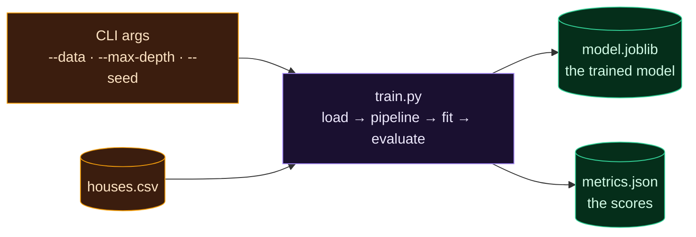

Welcome to **Day 20 of 100 Days of MLOps** — the final day of Module 2. You've learned to clean data, split it honestly, choose and tune models, handle imbalance, and explain predictions. All of it, so far, has lived in exploratory scripts you run by hand. Today we make training **operational**: we package it into a single, configurable command that produces reusable **artifacts**.

This is the hinge between "doing machine learning" and "doing MLOps." An automated pipeline can't click through a notebook — it needs to run *one command* and get back *machine-readable outputs*. By the end of today, `python train.py` will train the model, evaluate it, and write a `model.joblib` and a `metrics.json` — the exact shape everything in the coming modules (experiment tracking, DVC, CI/CD) is built to consume.

> **Module 2's capstone.** No new ML today — we package what you've built into the professional unit of work: a configurable training program that emits artifacts.

By the end of today you will:

- Turn hardcoded settings into **command-line options** with `argparse`.
- Produce the two artifacts every pipeline needs: **`model.joblib`** and **`metrics.json`**.
- Run the same program with different settings — no code edits.
- Understand why this packaging is the **bridge into automation**.

---

## From script to program

An exploratory script has its settings baked in — change the tree depth and you edit the code. A *program* takes its settings as **arguments**, so the same code runs many ways. Python's built-in **`argparse`** gives you this (plus a free `--help`) for a few lines of setup.

And a real training run doesn't just print numbers to a terminal that vanish — it writes **artifacts**: files that outlive the run and can be consumed by other tools.



**Reading this diagram:**

The **amber** nodes on the left are the **inputs**: the configuration (CLI args like `--max-depth` and `--seed`) and the data (`houses.csv`). Both flow into the **purple** node in the middle — `train.py`, the program itself, which does the familiar load → pipeline → fit → evaluate work. Out of it flow the two **green** artifacts: **`model.joblib`** (the trained model, ready to serve — Day 7) and **`metrics.json`** (the scores, in a format machines can read).

Why two outputs, and why green (our "this is the valuable result" colour)? Because these are what the rest of MLOps consumes. A deployment step needs the **model** file; a validation gate, an experiment tracker, or a dashboard needs the **metrics** file to answer "is this model good enough to ship?" The takeaway: **a packaged training run turns config + data into a model and its metrics — the two artifacts every downstream automation depends on.**

---

## Build the training program

Create **`train.py`**. It brings together everything from Module 2 — the Pipeline (Day 15), the metrics (Day 14) — behind an `argparse` interface, and writes both artifacts.

```python
"""
train.py — Day 20 of 100 Days of MLOps.

A packaged training run: one configurable command that loads data, trains the
pipeline, evaluates it, and writes two artifacts — the model (model.joblib) and
its scores (metrics.json). These are exactly what an automated pipeline needs.

Run it:  python train.py                 (defaults)
         python train.py --max-depth 3   (override a setting)
         python train.py --help          (see all options)
"""

import argparse
import json

import joblib
import pandas as pd
from sklearn.compose import ColumnTransformer
from sklearn.metrics import mean_absolute_error, r2_score, root_mean_squared_error
from sklearn.model_selection import train_test_split
from sklearn.pipeline import Pipeline
from sklearn.preprocessing import OneHotEncoder, StandardScaler
from sklearn.tree import DecisionTreeRegressor

NUMERIC = ["size_sqft", "bedrooms", "age_years"]
CATEGORICAL = ["neighborhood"]
TARGET = "price"


def build_pipeline(max_depth):
    return Pipeline([
        ("preprocess", ColumnTransformer([
            ("num", StandardScaler(), NUMERIC),
            ("cat", OneHotEncoder(handle_unknown="ignore"), CATEGORICAL),
        ])),
        ("model", DecisionTreeRegressor(max_depth=max_depth, random_state=42)),
    ])


def main():
    parser = argparse.ArgumentParser(description="Train the house-price model.")
    parser.add_argument("--data", default="houses.csv", help="input CSV")
    parser.add_argument("--model-out", default="model.joblib", help="where to save the model")
    parser.add_argument("--metrics-out", default="metrics.json", help="where to save the metrics")
    parser.add_argument("--test-size", type=float, default=0.2, help="test fraction")
    parser.add_argument("--max-depth", type=int, default=8, help="tree depth")
    parser.add_argument("--seed", type=int, default=42, help="random seed")
    args = parser.parse_args()

    df = pd.read_csv(args.data)
    X, y = df[NUMERIC + CATEGORICAL], df[TARGET]
    X_train, X_test, y_train, y_test = train_test_split(
        X, y, test_size=args.test_size, random_state=args.seed
    )

    model = build_pipeline(args.max_depth)
    model.fit(X_train, y_train)
    pred = model.predict(X_test)

    metrics = {
        "mae": round(mean_absolute_error(y_test, pred), 2),
        "rmse": round(root_mean_squared_error(y_test, pred), 2),
        "r2": round(r2_score(y_test, pred), 4),
        "n_train": len(X_train),
        "n_test": len(X_test),
        "max_depth": args.max_depth,
        "seed": args.seed,
    }

    joblib.dump(model, args.model_out)
    with open(args.metrics_out, "w") as f:
        json.dump(metrics, f, indent=2)

    print(f"Trained on {metrics['n_train']} rows, tested on {metrics['n_test']}.")
    print(f"  MAE ${metrics['mae']:,.0f}   RMSE ${metrics['rmse']:,.0f}   R² {metrics['r2']}")
    print(f"Wrote {args.model_out} and {args.metrics_out}")


if __name__ == "__main__":
    main()
```

Run it with defaults:

```bash
python train.py
```

```text
Trained on 400 rows, tested on 100.
  MAE $33,211   RMSE $42,705   R² 0.9075
Wrote model.joblib and metrics.json
```

Look at the `metrics.json` it produced — clean, machine-readable, ready for any tool to consume:

```bash
cat metrics.json
```

```text
{
  "mae": 33211.33,
  "rmse": 42704.63,
  "r2": 0.9075,
  "n_train": 400,
  "n_test": 100,
  "max_depth": 8,
  "seed": 42
}
```

Now the payoff of `argparse` — change a setting **without touching the code**:

```bash
python train.py --max-depth 3
```

```text
Trained on 400 rows, tested on 100.
  MAE $38,574   RMSE $48,330   R² 0.8815
Wrote model.joblib and metrics.json
```

A shallower tree, a worse score (0.9075 → 0.8815) — captured instantly, no editing. And you get a help screen for free:

```bash
python train.py --help
```

```text
usage: train.py [-h] [--data DATA] [--model-out MODEL_OUT]
                [--metrics-out METRICS_OUT] [--test-size TEST_SIZE]
                [--max-depth MAX_DEPTH] [--seed SEED]

Train the house-price model.

options:
  -h, --help            show this help message and exit
  --data DATA           input CSV
  --model-out MODEL_OUT
                        where to save the model
  ...
```

---

## Why this is the bridge to everything ahead

This small program is quietly a big deal, because it has the four properties automation requires:

- **Reproducible** — the `--seed` flag pins randomness (Day 10); same inputs, same model.
- **Configurable** — change data, depth, split via flags; no code edits, so it slots into experiments and pipelines.
- **Automatable** — it's *one command* with *machine-readable outputs*. A `Makefile` (Day 9), a scheduler, or a CI job can run it unattended.
- **Composable** — `metrics.json` is a contract other tools read: a validation gate can check `r2 > 0.85` before promoting the model (Day 76), a tracker can log it (Module 4), DVC can compare it across runs (Day 25).

That's exactly why we're doing this *now*, at the seam between the ML-skills module and the operational modules. From here on, we don't just train models — we run *packaged training jobs* and manage the artifacts they produce.

---

## Module 2 complete

That wraps **Module 2: Machine Learning You Can Operationalize.** Over ten days you built genuine ML competence: cleaning messy data (11), honest splits and leakage (12), classification and regression metrics (13–14), leak-proof Pipelines (15), cross-validation (16), tuning (17), imbalanced data (18), interpretability (19), and today, packaging it all into a configurable training program that emits artifacts. You now have real models *and* the discipline to evaluate and package them — the foundation the operational half of the series builds on.

---

## Common errors (and how to fix them)

**1. `train.py: error: argument --max-depth: invalid int value: 'abc'`**

You passed a value of the wrong type. `argparse` enforces the `type=int` you declared:

```text
train.py: error: argument --max-depth: invalid int value: 'abc'
```

Pass a valid integer (`--max-depth 8`). This is a *feature* — argparse validates your inputs for free.

**2. `train.py: error: unrecognized arguments: --depth 5`**

You used a flag name that isn't defined (`--depth` instead of `--max-depth`). Run `python train.py --help` to see the exact option names.

**3. `TypeError: Object of type int64 is not JSON serializable`**

You tried to `json.dump` a NumPy value (many scikit-learn/pandas results are `int64`/`float64`, not plain Python numbers):

```text
TypeError: Object of type int64 is not JSON serializable
```

Convert first — `round(value, 2)` and `int(value)`/`float(value)` return plain Python types. That's exactly why our `metrics` dict wraps everything in `round()` and `len()`.

**4. A script that `sys.exit`s with code 2 in your pipeline**

`argparse` exits with **code 2** on a bad argument. That's correct (a non-zero exit tells a pipeline the run failed) — but it means a typo in a flag will *stop* an automated job. Double-check flags in your `Makefile`/CI commands.

**5. The program ran but wrote no artifacts**

Check you actually called `joblib.dump(...)` and `json.dump(...)`, and that the output paths are writable. In a pipeline, make sure the output directory exists first (`Path(...).parent.mkdir(parents=True, exist_ok=True)`, per Day 8).

**6. `FileNotFoundError` for the input CSV in a pipeline**

The `--data` path is relative to where the command runs. Pass an absolute path, or run from the project root (Day 8's `pathlib` pattern makes this robust).

---

## Recap — what you now have

You can package training the way MLOps needs it:

- You turned settings into **`argparse` options** with a free `--help`.
- You emit two artifacts every pipeline consumes: **`model.joblib`** and **`metrics.json`**.
- You ran the same program many ways **without editing code**.
- You understand why this packaging is the **bridge into automation** — and you finished Module 2.

**Your cheat sheet:**

| Piece | Purpose |
|-------|---------|
| `argparse.ArgumentParser` | Turn settings into `--flags` (+ free `--help`) |
| `type=int` / `type=float` | Validate argument types automatically |
| `joblib.dump(model, path)` | Save the model artifact |
| `json.dump(metrics, f, indent=2)` | Save machine-readable metrics |
| `round()` / `int()` / `float()` | Make values JSON-serializable |

Golden rule: **a training run is a configurable command that emits artifacts** — reproducible, automatable, and readable by the tools downstream.

---

## Coming up on Day 21 — Module 3 begins

You can build and package a model — but can you prove which *data* produced it? **Module 3 — "Reproducibility & Versioning: Data + Code"** opens with **Day 21 — "Why Data Versioning? The Problem."** You'll see, with your own eyes, how the same training code plus silently-changed data produces a different model and nobody can tell why — the exact failure that makes data versioning essential. Then, over the module, you'll master **DVC** to version datasets and pipelines alongside Git, so any result is reproducible from a clean clone.

See the full roadmap on the [100 Days of MLOps series page](/series/100-days-mlops). See you tomorrow.
