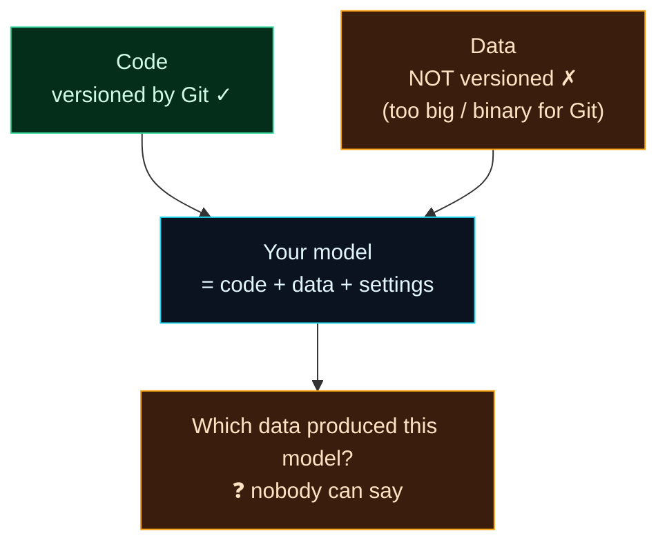

Welcome to **Day 21 of 100 Days of MLOps** — the start of **Module 3: Reproducibility & Versioning (Data + Code).** On Day 10 you learned that a machine-learning result depends on three things: **code + data + settings.** You've since versioned your code with Git (Day 4) and pinned your settings and seeds (Days 10, 20). But there's a gaping hole: **your data isn't versioned at all** — and a model depends on it just as much as on the code.

Today we don't fix that yet. First, you need to *feel the problem* — because until you've seen it bite, data versioning sounds like bureaucratic overhead. By the end of this lesson you'll have watched the same code produce a completely different model from silently-changed data, while Git cheerfully reports that nothing changed. That gap is why the rest of this module exists.

> **A "feel the pain" day.** No new tool — a short, sharp demonstration of a problem that quietly wrecks real ML projects, so the DVC solution over the next days lands with full force.

By the end of today you will:

- Understand why **Git alone can't make ML reproducible**.
- See a live demo: **same code, different data, different model** — with Git blind to it.
- Know the real-world damage this causes (unreproducible results, undebuggable regressions).
- Understand what "versioning data alongside code" needs to mean.

---

## The hole in your reproducibility

Git is brilliant at versioning **code**: small text files, meaningful line-by-line diffs, a clean history. But data is the opposite of what Git is good at — datasets are often **large** and **binary-ish**, they change constantly, and a "diff" of a million-row CSV is useless. That's exactly why, back on Day 4, your `.gitignore` *excluded* `data/` and big files. The right call — but it leaves data completely **outside version control**.

Here's the problem that creates:



**Reading this diagram:**

Two inputs feed your model. On the left, in **green**, is your **code** — Git versions it perfectly, so you can always say exactly which code you ran. On the right, in **amber**, is your **data** — and it's *not* versioned, because it's too big and binary for Git. Both flow into the **cyan** node: your model, which (as Day 10 taught) is the product of code *and* data *and* settings.

Now follow the arrow down to the **amber** question at the bottom: *which data produced this model?* Because half of the model's inputs — the data — was never versioned, **this question has no answer.** You can pin the code down to the exact commit, but if you can't pin the data, you can't reproduce the model, can't tell whether a change came from code or data, and can't roll back to a known-good dataset. Half your reproducibility is missing. That's the hole — and it's bigger than it looks, as the demo shows.

---

## See it happen

Let's make the problem undeniable. We'll use fixed code with a **fixed random seed**, so *the only thing that can change the result is the data.* Create two files.

**`make_dataset.py`** — generates the data, with a `--noise` knob standing in for "the upstream data source changed":

```python
"""make_dataset.py — generate houses.csv. --noise simulates a data source
that got messier over time (same code, different data)."""

import argparse

import numpy as np
import pandas as pd

parser = argparse.ArgumentParser()
parser.add_argument("--noise", type=float, default=25000)
args = parser.parse_args()

rng = np.random.default_rng(42)
n = 500
size_sqft = rng.integers(600, 3500, n)
bedrooms = rng.integers(1, 6, n)
age_years = rng.integers(0, 80, n)
location_score = rng.integers(1, 11, n)
price = (30000 + 140 * size_sqft + 12000 * bedrooms - 900 * age_years
         + 20000 * location_score + rng.normal(0, args.noise, n))
price = np.clip(price, 50000, None).round(-2).astype(int)

pd.DataFrame({
    "size_sqft": size_sqft, "bedrooms": bedrooms, "age_years": age_years,
    "location_score": location_score, "price": price,
}).to_csv("houses.csv", index=False)
print(f"Wrote houses.csv (noise={args.noise:.0f})")
```

**`train.py`** — fixed code, fixed seed:

```python
"""train.py — fixed code, fixed seed. Any change in the RESULT can only come
from the data changing underneath it."""

import pandas as pd
from sklearn.linear_model import LinearRegression
from sklearn.metrics import r2_score
from sklearn.model_selection import train_test_split

df = pd.read_csv("houses.csv")
features = ["size_sqft", "bedrooms", "age_years", "location_score"]
X, y = df[features], df["price"]
X_train, X_test, y_train, y_test = train_test_split(X, y, test_size=0.2, random_state=42)
model = LinearRegression().fit(X_train, y_train)
print(f"Test R²: {r2_score(y_test, model.predict(X_test)):.3f}")
```

Now put the project under Git — and, following Day 4's rule, **gitignore the data**:

```bash
git init
printf 'houses.csv\n__pycache__/\n' > .gitignore
git add make_dataset.py train.py .gitignore
git commit -m "House price training pipeline"
```

Train on the first version of the data:

```bash
python make_dataset.py --noise 25000
python train.py
```

```text
Wrote houses.csv (noise=25000)
Test R²: 0.967
```

A great model — R² **0.967**. Now imagine the upstream data source degrades (a sensor drifts, a new vendor sends messier records). The data on disk changes, but **you didn't touch a line of code**:

```bash
python make_dataset.py --noise 70000
python train.py
```

```text
Wrote houses.csv (noise=70000)
Test R²: 0.809
```

**Your model just got dramatically worse — 0.967 down to 0.809 — and the code is byte-for-byte identical.** Now ask Git what happened:

```bash
git status --short
git log --oneline
```

```text
b05bc8d House price training pipeline
```

**Git shows nothing.** `git status` is clean, the log has the same single commit — because the data is gitignored, the change that broke your model is completely invisible to version control. And the killer: try to get the good model back by checking out the code — you can't, because the *data* on disk is still the bad version:

```bash
python train.py
```

```text
Test R²: 0.809
```

There is no way, from Git alone, to recover the 0.967 model. You don't even have a record that version 1 of the data ever existed.

---

## Why this is a disaster (and why not just commit the data)

That little demo is the source of some of the most painful days in real ML work:

- **Results can't be reproduced.** "Last month the model scored 0.96." Can you rebuild it? Not without the exact data — which you didn't save.
- **Regressions are undebuggable.** The model got worse. Was it a code change or a data change? With data unversioned, you're guessing.
- **You can't roll back.** A bad data update ships; there's no "previous good dataset" to revert to.
- **Collaboration breaks.** A teammate clones your repo, runs your code, gets different numbers — because their `houses.csv` isn't yours. ("Works on my machine," data edition.)

The obvious fix — *just `git add` the data* — doesn't work either. Large files bloat the repository **permanently** (Git keeps every version forever, so a 500 MB dataset committed ten times is 5 GB of history you can never shrink), diffs of binary/huge files are meaningless, and hosts like GitHub reject files over ~100 MB outright. That's precisely why we gitignored data in the first place.

What we actually need: a way to **version data alongside code** — so each Git commit is tied to an *exact* snapshot of the data — **without** stuffing the big files into Git itself. That's exactly what **DVC** does, and it's where we go next.

---

## Common errors (and how to fix them) — the mindset version

Today's "errors" are the assumptions that cause the pain:

**1. "My results are reproducible because my code is in Git."**

Code is only *part* of the result. Without the exact data and settings, the same code produces a different model — as you just saw (0.967 vs 0.809). Reproducibility needs **code + data + settings** all pinned.

**2. "I'll just commit the dataset to Git."**

It bloats history permanently, breaks on large files, and gives useless diffs. Git is the wrong tool for data — keep data *out* of Git and version it with DVC instead (Day 22).

**3. "The model got worse — must be a code bug."**

Not necessarily. When data is unversioned, a silent data change is invisible and looks like nothing happened. Always suspect the data, and version it so you can actually check.

**4. "`git checkout` will restore everything."**

It restores tracked files (your code), **not** gitignored data. Old commit + current data ≠ old result. You need data versioning to travel back in time properly.

**5. "My teammate gets different numbers — their setup must be broken."**

More likely their *data* differs from yours. Without a shared, versioned dataset, everyone trains on a slightly different file.

**6. "I'll remember which data I used."**

You won't, and neither will anyone else. "Which dataset made this model?" must be answered by *tooling*, not memory — the whole point of the days ahead.

---

## Recap — what you now have

You've felt the problem that Module 3 solves:

- You understand why **Git versions code but not data**, and why that's a reproducibility hole.
- You saw **same code + changed data → a very different model** (0.967 → 0.809), invisible to Git.
- You know the real damage: **unreproducible results, undebuggable regressions, no rollback, broken collaboration**.
- You know that committing big data to Git is the wrong fix — you need **versioning without bloat**.

**Your cheat sheet:**

| Question | With Git alone | What you need |
|----------|----------------|---------------|
| Which code made this model? | ✅ the commit | (Git already does this) |
| Which **data** made this model? | ❌ no record | data versioning (DVC) |
| Reproduce last month's result? | ❌ data is gone | data + code pinned together |
| Roll back a bad data update? | ❌ nothing to roll back to | versioned data snapshots |

Golden rule: **code in Git is only half of reproducibility** — a model you can't tie to an exact dataset is a model you can't truly reproduce.

---

## Coming up on Day 22

Now that you feel the problem, meet the fix. **Day 22 — "Intro to DVC"** introduces Data Version Control — a tool that works *alongside* Git to version datasets and models without bloating your repo. You'll `dvc init`, track your `houses.csv` with `dvc add`, and see the clever trick at its heart: Git stores a tiny pointer file, DVC stores the actual data, and the two stay perfectly in sync — so a single `git checkout` can bring back the exact code *and* the exact data together.

See the full roadmap on the [100 Days of MLOps series page](/series/100-days-mlops). See you tomorrow.
