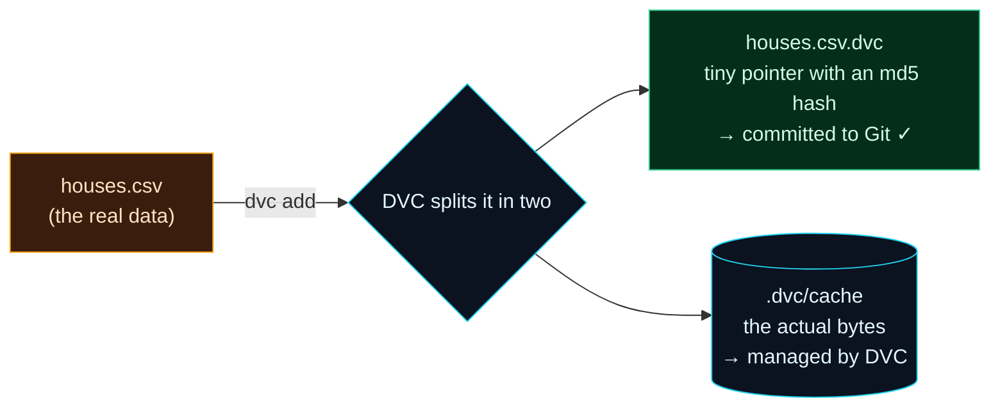

Welcome to **Day 22 of 100 Days of MLOps**. Yesterday you felt the problem in your bones: the same code produced a different model (0.967 → 0.809) because the data changed, and Git was completely blind to it. Today you meet the fix — **DVC (Data Version Control)** — and by the end you'll do the thing Day 21 said was impossible: **travel back and reproduce that lost 0.967 model exactly.**

DVC is one of the most important tools in the MLOps toolbox, and its central idea is genuinely clever: let **Git** version a tiny *pointer* to your data, while **DVC** manages the actual big files off to the side. You get Git's time-travel for your data — commits, checkouts, history — without ever bloating the repository.

> **The tool that makes ML reproducible.** DVC feels like `git` for data — the commands even rhyme (`dvc add`, `dvc checkout`). If you know Git (Day 4), you already half-know DVC.

By the end of today you will:

- Understand the **pointer + cache** trick at the heart of DVC.
- `dvc init` a project and track a dataset with `dvc add`.
- Commit a tiny **`.dvc` pointer** to Git while the data stays out of it.
- **Reproduce an exact past model** by checking out old code *and* old data together.

---

## The clever trick: pointer in Git, data in DVC

Install DVC into your environment (it's a Python package):

```bash
pip install dvc
```

Here's the idea. When you run `dvc add houses.csv`, DVC does three things: it moves the real data into a local **cache** it manages, it creates a tiny text file called **`houses.csv.dvc`** (a *pointer* containing the data's fingerprint), and it adds `houses.csv` to `.gitignore` so Git ignores the big file. You then commit the small pointer to Git.



**Reading this diagram:**

On the left, in **amber**, is your real `houses.csv` — the big file Git can't handle well. Running **`dvc add`** (the arrow) splits it into two pieces. Down one path is the **green** node: a tiny text pointer, `houses.csv.dvc`, holding just the data's md5 fingerprint and size — small enough for Git, so *this* is what you commit. Down the other path is the **cyan** cylinder: DVC's own cache, where the actual bytes live, managed by DVC and kept out of Git.

Why this is the whole game: Git now versions the **pointer** (which changes whenever the data changes, because the md5 changes), and DVC versions the **data** it points to. So a Git commit captures *exactly which version of the data* went with that code — and a checkout can bring both back together. The takeaway: **Git tracks a fingerprint of your data; DVC tracks the data itself** — and that partnership is what finally makes ML reproducible.

---

## Track your data

Start from yesterday's project (the `make_dataset.py` and `train.py` from Day 21) in a Git repo, and initialise DVC:

```bash
dvc init
```

```text
DVC initialized (created .dvc/)
```

`dvc init` sets up DVC inside your Git repo (it creates a `.dvc/` folder for config and cache). Now generate version 1 of the data and hand it to DVC:

```bash
python make_dataset.py --noise 25000
dvc add houses.csv
```

```text
To track the changes with git, run:
	git add houses.csv.dvc .gitignore
```

DVC tells you exactly what to commit to Git. Look at the pointer file it made — this tiny thing is what Git will version:

```bash
cat houses.csv.dvc
```

```text
outs:
- md5: 9bb50f19a619cb5ea0e63ce40a0ad16d
  size: 9464
  hash: md5
  path: houses.csv
```

That `md5` is the data's fingerprint. Change one number in the CSV and the md5 changes completely — which is how Git will "see" data changes through the pointer. DVC also updated `.gitignore` for you:

```bash
cat .gitignore
```

```text
/houses.csv
```

The real `houses.csv` is now git-ignored (DVC owns it); the *pointer* is what goes in Git. Commit them:

```bash
git add . && git commit -m "Track houses.csv v1 with DVC"
python train.py
```

```text
Test R²: 0.967
```

Version 1 of the data is now permanently tied to this Git commit.

---

## Version a change — and then time-travel

Now the upstream data degrades again. Update it, re-`dvc add` (which refreshes the pointer's md5), and commit:

```bash
python make_dataset.py --noise 70000
dvc add houses.csv
git add . && git commit -m "Update houses.csv to v2 (noisier)"
python train.py
```

```text
Test R²: 0.809
```

Your history now has two commits, each pinned to an exact dataset:

```bash
git log --oneline
```

```text
8df92ce Update houses.csv to v2 (noisier)
7a4fdc8 Track houses.csv v1 with DVC
```

Here's the moment Day 21 said was impossible. Go back to the v1 commit — and crucially, run **`dvc checkout`** to bring the *data* back in sync with the code:

```bash
git checkout HEAD~1
dvc checkout
python train.py
```

```text
M       houses.csv
Test R²: 0.967
```

**The 0.967 model is back.** `git checkout` restored the old *code and old pointer*; `dvc checkout` read that pointer and pulled the matching *data* out of the cache (that `M houses.csv` line means it restored the file). Code and data traveled back together. Return to the latest and the data follows:

```bash
git checkout main && dvc checkout   # use 'master' if that's your branch
python train.py
```

```text
Test R²: 0.809
```

That is the entire promise of data versioning, delivered: **any commit gives you the exact code *and* the exact data — so any result is reproducible.** The pairing to remember is `git checkout` (code + pointer) followed by `dvc checkout` (the data the pointer names).

---

## Common errors (and how to fix them)

**1. `ERROR: you are not inside of a DVC repository`**

You ran a `dvc` command before initialising DVC (or outside the project):

```text
ERROR: you are not inside of a DVC repository (checked up to mount point '/')
```

Run `dvc init` once, inside your Git repo, first. (DVC needs a Git repo to live in — `git init` before `dvc init`.)

**2. `output 'd.csv' is already tracked by SCM (Git)`**

You tried to `dvc add` a file Git already tracks. DVC won't fight Git over the same file. It tells you the fix:

```text
To stop tracking from Git:
    git rm -r --cached 'd.csv'
    git commit -m "stop tracking d.csv"
```

Untrack it from Git, then `dvc add` it — now DVC owns the data and Git owns the pointer.

**3. You did `git checkout` but the data didn't change**

`git checkout` only restores the *pointer*. You must follow it with **`dvc checkout`** to sync the actual data to that pointer. Get in the habit: `git checkout … && dvc checkout`.

**4. You committed the big data file to Git anyway**

If `houses.csv` shows up in `git status` as tracked, DVC's `.gitignore` entry got removed or the file was added before DVC. Untrack it (`git rm --cached houses.csv`), make sure it's in `.gitignore`, and `dvc add` it.

**5. `dvc checkout` says the data is missing**

Your cache doesn't have that version's bytes — common after cloning a repo (you get the pointers but not the data). That's what **remotes** are for, and it's exactly Day 23. On your own machine, the cache has everything you `dvc add`ed.

**6. You forgot to `dvc add` after changing the data**

Then the pointer's md5 is stale — it still describes the old data. Always `dvc add` after the data changes (just like `git add` after code changes), so the pointer and the data agree before you commit.

---

## Recap — what you now have

You can version data like code:

- You understand the **pointer + cache** trick — Git tracks `houses.csv.dvc`, DVC tracks the bytes.
- You can **`dvc init`** and **`dvc add`** a dataset, committing only the tiny pointer to Git.
- You **reproduced an exact past model** (0.967) with `git checkout` + `dvc checkout`.
- You solved, hands-on, the exact problem from Day 21.

**Your cheat sheet:**

| Command | What it does |
|---------|--------------|
| `pip install dvc` | Install DVC |
| `dvc init` | Set up DVC in a Git repo |
| `dvc add data.csv` | Track data with DVC (makes `data.csv.dvc`, gitignores data) |
| `git add data.csv.dvc .gitignore` | Commit the pointer, not the data |
| `git checkout <commit>` + `dvc checkout` | Restore exact code **and** data together |

Golden rule: **commit the `.dvc` pointer, let DVC hold the data** — and always pair `git checkout` with `dvc checkout` to time-travel code and data as one.

---

## Coming up on Day 23

Your data versions live in a local cache — but a teammate who clones your repo gets the pointers with **no data behind them**. **Day 23 — "DVC Remotes (Local)"** fixes that: you'll set up a DVC **remote** (a shared storage location, which we'll host locally), `dvc push` your data to it, and simulate a teammate who `dvc pull`s to get the exact datasets your pointers reference. It's `git push`/`git pull`, but for data — the piece that makes versioned data actually shareable.

See the full roadmap on the [100 Days of MLOps series page](/series/100-days-mlops). See you tomorrow.
