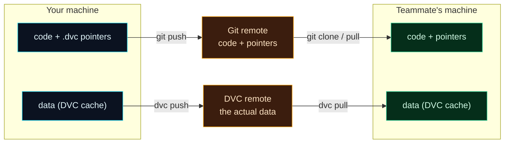

Welcome to **Day 23 of 100 Days of MLOps**. Yesterday DVC gave you time-travel for your data — on *your* machine. But there's a catch you may have spotted: your versioned data lives in a local cache. If a teammate clones your Git repo, they get the tiny `.dvc` pointers with **no actual data behind them**. Today we close that gap with **DVC remotes** — shared storage for data that works exactly like `git push` and `git pull`, but for datasets.

This is the piece that turns "reproducible on my laptop" into "reproducible for the whole team, forever." A pointer that references data nobody can fetch is a dead end; a remote is what makes versioned data genuinely *shareable*.

> **git push/pull, for data.** If Day 22 felt like `git` for data, remotes complete the analogy: a remote is data's equivalent of GitHub. Same mental model, new command prefix.

By the end of today you will:

- Understand what a **DVC remote** is and why you need one.
- Configure a **local remote** and `dvc push` your data to it.
- See the **two-remote picture**: Git for code + pointers, DVC for data.
- Simulate a **teammate** who clones and `dvc pull`s to get the exact datasets.

---

## Two remotes, one shared truth

Your code has a home to share it from — a Git remote (GitHub). Your data needs the same: a **DVC remote**. It's just a storage location DVC can upload to and download from. In the real world that's cloud storage (S3, Google Cloud Storage, Azure, an SSH server); to stay 100% local, we'll use a **folder** as our remote — the mechanics are identical, only the URL changes.

So a fully shareable ML project has **two** remotes working together:



**Reading this diagram:**

On the left is **your machine** (cyan), holding two things: your code with the `.dvc` pointers, and your actual data in DVC's cache. Notice they travel through **two different remotes** (the amber nodes in the middle). Your **code and pointers** go up via `git push` to the **Git remote**; your **data** goes up via `dvc push` to the **DVC remote**. Two commands, two destinations — but they're linked, because the pointer in Git names exactly the data version sitting in the DVC remote.

On the right is your **teammate's machine** (green). They run `git clone` (or `git pull`) to get the code and pointers, then `dvc pull` to fetch the matching data. Because the pointer's md5 tells DVC precisely which bytes to download, they end up with the **identical** code *and* data you have. The takeaway: **share code through Git, share data through a DVC remote** — and the pointer is the thread that keeps them in sync across the whole team.

---

## Set up a remote and push

Starting from a DVC-tracked project (Day 22), add a remote. We point it at a local folder standing in for shared storage; `-d` makes it the **default**:

```bash
dvc remote add -d storage /path/to/dvc-storage
```

```text
Setting 'storage' as a default remote.
```

This writes the remote into `.dvc/config` — which you **commit to Git**, so everyone who clones inherits the same remote automatically:

```bash
git add .dvc/config && git commit -m "Configure DVC remote"
cat .dvc/config
```

```text
[core]
    remote = storage
['remote "storage"']
    url = /path/to/dvc-storage
```

Now upload your data to it:

```bash
dvc push
```

```text
1 file pushed
```

The data now lives in the remote, stored by its fingerprint — the same md5 you saw in the pointer yesterday:

```bash
find /path/to/dvc-storage -type f
```

```text
/path/to/dvc-storage/files/md5/9b/b50f19a619cb5ea0e63ce40a0ad16d
```

DVC stores data by content hash (not filename), which is how it deduplicates and verifies integrity. Your data is now safely in shared storage, ready for anyone to fetch.

> **In production, only the URL changes.** Swap the folder path for `s3://my-bucket/dvc` (with `pip install "dvc[s3]"`) or a GCS/SSH URL, and every command below is identical. The local folder is a perfect stand-in for learning — and genuinely useful for backing up to an external drive or NAS.

---

## Be the teammate: clone and pull

Let's prove it works by playing a teammate who's never seen your data. Clone the repo into a fresh folder:

```bash
git clone /path/to/project teammate
cd teammate
ls
```

```text
houses.csv.dvc
make_dataset.py
train.py
```

Notice what's there: the **pointer** (`houses.csv.dvc`) and the code — but **no `houses.csv`**. Git carried the pointer, not the data. So training fails, exactly as Day 22 warned:

```bash
python train.py
```

```text
FileNotFoundError: [Errno 2] No such file or directory: 'houses.csv'
```

Now fetch the data from the remote the pointer references:

```bash
dvc pull
```

```text
A       houses.csv
1 file fetched and 1 file added
```

The `A houses.csv` means DVC *added* the file — pulled it out of the remote and into place. Look again, and now train:

```bash
ls
python train.py
```

```text
houses.csv  houses.csv.dvc  make_dataset.py  train.py
Test R²: 0.967
```

**The teammate now has your exact data and gets your exact result — 0.967.** Code came from Git, data came from the DVC remote, and the pointer guaranteed they matched. That's collaborative, reproducible ML.

---

## The daily rhythm

From here, sharing an ML project is two pairs of commands:

- **After you change things:** `git push` (code + pointers) **and** `dvc push` (data).
- **To sync up:** `git pull` (code + pointers) **and** `dvc pull` (data).

Same muscle memory as Git — you just run the `dvc` twin alongside each `git` command so code and data stay together.

---

## Common errors (and how to fix them)

**1. `config file error: no remote specified` (or `dvc push` does nothing useful)**

You have no default remote. Add one with `dvc remote add -d <name> <url>`, commit `.dvc/config`, then `dvc push`.

**2. `FileNotFoundError` after cloning a repo**

You cloned the code and pointers but haven't fetched the data. Run **`dvc pull`** to download the datasets the pointers reference. (Getting the pointer is not getting the data.)

**3. `dvc pull` fails or finds nothing**

Either the data was never `dvc push`ed to the remote, or the remote URL is wrong/unreachable. Confirm the data is in the remote (someone ran `dvc push`), and check `dvc remote list` / `.dvc/config` for the right URL.

**4. Teammate has a different remote path**

For a *local folder* remote, the path in `.dvc/config` is machine-specific — fine for one machine, but two people need a shared location (a network drive, or real cloud storage). This is why production uses S3/GCS: one URL everyone can reach.

**5. You pushed to Git but forgot to `dvc push`**

Teammates get pointers to data that isn't in the remote, so their `dvc pull` fails. Always pair `git push` with `dvc push` — the pointer is worthless without the bytes behind it.

**6. `ERROR: unsupported URL type` when adding a cloud remote**

The backend package isn't installed. Cloud remotes need extras: `pip install "dvc[s3]"` (or `[gs]`, `[azure]`, `[ssh]`). Local folder remotes need nothing extra.

---

## Recap — what you now have

Your versioned data is now shareable:

- You understand a **DVC remote** is shared storage for data — `git push/pull` for datasets.
- You configured a **local remote**, `dvc push`ed data, and saw it stored by md5.
- You know the **two-remote model**: Git for code + pointers, DVC for data.
- You played a **teammate** who cloned and `dvc pull`ed to reproduce your exact result.

**Your cheat sheet:**

| Command | What it does |
|---------|--------------|
| `dvc remote add -d storage <url>` | Set a default remote (folder, S3, GCS, SSH…) |
| `dvc push` | Upload data to the remote |
| `dvc pull` | Download data from the remote |
| `git push` + `dvc push` | Share code+pointers and data |
| `git clone/pull` + `dvc pull` | Get code+pointers and data |

Golden rule: **code and data have separate remotes** — push and pull both, and the pointer keeps them in lockstep for everyone.

---

## Coming up on Day 24

You can version and share data and models — but you're still running `make_dataset.py` then `train.py` by hand, and nothing records how they connect. **Day 24 — "DVC Pipelines"** turns those steps into a declared, reproducible **pipeline** (`dvc.yaml`): DVC learns that training *depends on* the data and the code, tracks the dependencies, and can rebuild the whole chain — skipping stages whose inputs haven't changed. It's `make` (Day 9) supercharged with data-awareness, and the backbone of reproducible ML workflows.

See the full roadmap on the [100 Days of MLOps series page](/series/100-days-mlops). See you tomorrow.
