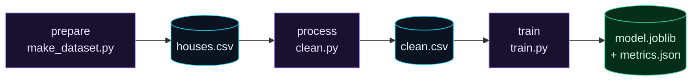

Welcome to **Day 24 of 100 Days of MLOps**. You can now version and share data and models. But look at how you actually *run* things: `python make_dataset.py`, then `python clean.py`, then `python train.py` — by hand, in the right order, hoping you didn't skip a step or forget to re-run something after a change. Nothing records how those steps connect. Today we fix that with **DVC pipelines**: you *declare* your workflow once, and DVC runs it reproducibly, in the right order, rebuilding only what actually needs rebuilding.

If Day 9's `make` felt powerful, this is its data-aware big sibling. A DVC pipeline understands that training *depends on* the cleaned data, which *depends on* the raw data — so it can skip stages whose inputs are unchanged, and it records the exact version of every input and output so the whole chain is reproducible.

> **The backbone of reproducible ML.** Every serious MLOps project has a declared pipeline. Once you have one, "reproduce the model" becomes a single command: `dvc repro`.

By the end of today you will:

- Declare a multi-stage workflow in **`dvc.yaml`** (deps → cmd → outs).
- Run the whole pipeline reproducibly with **`dvc repro`**.
- Watch DVC **skip unchanged stages** and rebuild only what changed.
- Understand the **`dvc.lock`** file that makes runs reproducible.

---

## A pipeline is stages, dependencies, and outputs

A DVC pipeline is a list of **stages** written in a file called **`dvc.yaml`**. Each stage declares three things:

- **`cmd`** — the command to run (e.g. `python train.py`).
- **`deps`** — its dependencies: the input files it needs (data *and* code).
- **`outs`** — the outputs it produces.

From those declarations, DVC builds a **dependency graph** (a DAG) — it knows each stage's inputs and outputs, so it knows the order to run them and which ones a change affects.



**Reading this diagram:**

Read left to right — it's a chain. The **purple** nodes are the three **stages** (each a script): `prepare`, `process`, `train`. Between them are the **cyan** data files that flow from one stage into the next: `prepare` produces `houses.csv`, which `process` reads to produce `clean.csv`, which `train` reads to produce the **green** final artifacts (`model.joblib` and `metrics.json`).

The arrows *are* the dependencies, and they're the whole point. Because DVC knows `train` depends on `clean.csv`, and `clean.csv` comes from `process`, and so on, it can do two clever things: run the stages in the **correct order** automatically, and — when something changes — figure out exactly **which stages are affected** and rebuild *only those*. Change `train.py` and only `train` re-runs; the upstream data stages are untouched. The takeaway: **declaring the graph once lets DVC reproduce your whole workflow intelligently** — in order, and without wasting work.

---

## Declare the pipeline

With your three scripts in a DVC-initialised repo, create **`dvc.yaml`**:

```yaml
stages:
  prepare:
    cmd: python make_dataset.py
    deps:
      - make_dataset.py
    outs:
      - houses.csv
  process:
    cmd: python clean.py
    deps:
      - clean.py
      - houses.csv
    outs:
      - clean.csv
  train:
    cmd: python train.py
    deps:
      - train.py
      - clean.csv
    outs:
      - model.joblib
    metrics:
      - metrics.json:
          cache: false
```

Read it top to bottom and you can *see* the chain: `process` lists `houses.csv` in its `deps` (which `prepare` produces in its `outs`), and `train` lists `clean.csv` (which `process` produces). That overlap is how DVC links the stages. Note the last stage marks `metrics.json` as a **metric** with `cache: false` — that keeps the small metrics file *in Git* (not the DVC cache) so you can read and compare it directly, which we'll use tomorrow.

You can view the graph DVC inferred:

```bash
dvc dag
```

```text
+---------+
| prepare |
+---------+
      *
+---------+
| process |
+---------+
      *
 +-------+
 | train |
 +-------+
```

---

## Run it with `dvc repro`

One command runs the whole thing, in dependency order:

```bash
dvc repro
```

```text
Running stage 'prepare':
> python make_dataset.py
prepare: wrote houses.csv (520 rows)
Generating lock file 'dvc.lock'

Running stage 'process':
> python clean.py
process: 520 -> 500 rows after dedup, wrote clean.csv

Running stage 'train':
> python train.py
train: R2=0.9668, wrote model.joblib + metrics.json
```

DVC ran all three stages in order and created a **`dvc.lock`** file. That lock file records the exact md5 fingerprint of every dependency and output — it's the snapshot that makes the run reproducible (commit `dvc.yaml` *and* `dvc.lock` to Git). Now the magic. Run it again without changing anything:

```bash
dvc repro
```

```text
Stage 'prepare' didn't change, skipping
Stage 'process' didn't change, skipping
Stage 'train' didn't change, skipping
Data and pipelines are up to date.
```

**Nothing re-ran** — DVC compared the current fingerprints to `dvc.lock`, saw everything matched, and skipped it all. Now change *only* the training code and reproduce:

```bash
# (edit train.py — tweak anything)
dvc repro
```

```text
Stage 'prepare' didn't change, skipping
Stage 'process' didn't change, skipping
Running stage 'train':
> python train.py
train: R2=0.9668, wrote model.joblib + metrics.json
```

This is the payoff. DVC re-ran **only `train`** — it knew `prepare` and `process` were unaffected because their inputs hadn't changed, so it skipped them. On a real pipeline where "prepare" downloads gigabytes and "process" takes twenty minutes, skipping unchanged stages turns an hour into seconds. DVC gives you `make`-style dependency tracking (Day 9), but *aware of your data*, and with everything fingerprinted for reproducibility.

---

## Common errors (and how to fix them)

**1. `ERROR: failed to reproduce '<stage>': output '<file>' does not exist`**

Your stage declared an `outs` file that the command didn't actually create:

```text
ERROR: failed to reproduce 'broken': output 'result.csv' does not exist
```

Make sure the command really writes every file listed in `outs` (right filename, right folder), or remove the ones it doesn't produce.

**2. `dvc.yaml` YAML errors (bad indentation)**

YAML is whitespace-sensitive — `deps`/`outs` lists must be indented consistently with spaces (never tabs). If DVC complains about parsing, check your indentation matches the example exactly.

**3. A stage re-runs every time even when nothing changed**

Something it depends on *is* changing — often an output written into a folder that's also a dependency, or a non-deterministic script (no fixed seed — Day 10). Pin randomness, and make sure a stage doesn't depend on its own outputs.

**4. `output 'houses.csv' is already tracked by SCM (Git)`**

A pipeline output can't also be tracked by Git — DVC manages `outs`. Untrack it (`git rm --cached houses.csv`), then `dvc repro`.

**5. Circular dependency between stages**

Stage A depends on B's output and B depends on A's — DVC can't order that. Redesign so the graph flows one direction (a DAG has no cycles).

**6. You committed `dvc.yaml` but not `dvc.lock`**

Then a teammate's `dvc repro` can't verify exact versions and may re-run everything. Always commit **both** `dvc.yaml` (the recipe) and `dvc.lock` (the exact fingerprints).

---

## Recap — what you now have

Your workflow is now a declared, reproducible pipeline:

- You declared **stages** (`cmd`, `deps`, `outs`) in **`dvc.yaml`** and saw the **DAG**.
- You ran the whole chain with **`dvc repro`**, in the right order.
- You watched DVC **skip unchanged stages** and rebuild only what changed.
- You understand **`dvc.lock`** as the fingerprinted snapshot that makes runs reproducible.

**Your cheat sheet:**

| Piece | Purpose |
|-------|---------|
| `dvc.yaml` | Declares stages: `cmd`, `deps`, `outs` |
| `dvc dag` | Show the pipeline's dependency graph |
| `dvc repro` | Run the pipeline; skip unchanged stages |
| `dvc.lock` | Exact fingerprints of every dep/out (commit it) |
| `metrics: cache: false` | Keep a small metrics file in Git, not the cache |

Golden rule: **declare the pipeline once, then `dvc repro`** — DVC runs stages in order and rebuilds only what changed, with every input and output fingerprinted.

---

## Coming up on Day 25

Your pipeline runs — now let's use it to *experiment*. **Day 25 — "Reproducing & Comparing Runs"** adds a **`params.yaml`** file so your settings (test size, model depth) live in one declared place your pipeline depends on. Then, when you change a parameter and `dvc repro`, DVC re-runs only what's affected — and `dvc params diff` and `dvc metrics diff` show you *exactly* how the change moved your scores. It's the reproducible experimentation loop that closes out Module 3.

See the full roadmap on the [100 Days of MLOps series page](/series/100-days-mlops). See you tomorrow.
