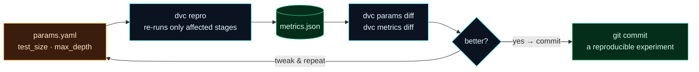

Welcome to **Day 25 of 100 Days of MLOps**. You have a reproducible pipeline (Day 24). Now let's use it the way you actually work: **experimenting.** You'll want to ask "what if the tree were shallower?" or "what if the test set were bigger?" and see how the answer moves your metrics — *reproducibly*, with a full record of what you tried and what it did. Today you'll build exactly that loop with DVC's **parameters** and its **diff** commands.

This closes the reproducibility story that Module 3 has been telling. By the end, changing one setting and seeing its precise effect on your scores — with the whole thing versioned so you can reproduce or revert any experiment — will be a single, clean cycle.

> **Reproducible experimentation, lightweight.** This is experiment tracking's simple, Git-native form. (Module 4 brings MLflow for when you run hundreds of experiments — but this DVC loop is perfect, and free, right now.)

By the end of today you will:

- Move settings into a **`params.yaml`** your pipeline depends on.
- Change a parameter and have **`dvc repro`** rebuild only what's affected.
- Use **`dvc params diff`** and **`dvc metrics diff`** to see exactly what changed and how scores moved.
- Turn each experiment into a **reproducible, committed** record.

---

## Parameters: settings your pipeline watches

On Day 8 you put settings in a config file so they weren't scattered through the code. DVC takes this one step further: put your experiment settings in **`params.yaml`**, and tell a pipeline stage it **depends on** those params. Now DVC treats a parameter change exactly like a code or data change — it knows to re-run the affected stage.



**Reading this diagram:**

It's a loop, read clockwise. You start at the **amber** node — `params.yaml`, your knobs (test size, tree depth). Change a value and run **`dvc repro`** (cyan): because the pipeline *depends on* those params, DVC re-runs only the stages the change touches, and writes fresh **`metrics.json`** (green). Then the **diff** step (cyan) — `dvc params diff` and `dvc metrics diff` — shows you precisely *what setting changed* and *how the scores moved*. That feeds the **decision** diamond: better or not?

From there, two arrows. If it's not better (or you're still exploring), you loop back to `params.yaml` and tweak again. If it's a keeper, you `git commit` — turning that experiment into a permanent, **reproducible** record (green): the params, the code, the data pointers, and the metrics, all captured together. The takeaway: **params + repro + diff + commit is the reproducible experiment loop** — every trial is measured and recoverable, never lost or guessed at.

---

## Wire up params

Create **`params.yaml`** with your settings:

```yaml
train:
  test_size: 0.2
  max_depth: 8
```

Have `train.py` read them (a few lines of `yaml`):

```python
import yaml
params = yaml.safe_load(open("params.yaml"))["train"]
# ... use params["test_size"] and params["max_depth"] ...
```

And in **`dvc.yaml`**, declare that the `train` stage depends on those params:

```yaml
  train:
    cmd: python train.py
    deps:
      - train.py
      - houses.csv
    params:
      - train.test_size
      - train.max_depth
    outs:
      - model.joblib
    metrics:
      - metrics.json:
          cache: false
```

That `params:` block is the key — it tells DVC "if either of these values changes, this stage is out of date." Run the baseline and commit it so you have something to compare against:

```bash
dvc repro
cat metrics.json
```

```text
{
  "mae": 33046.41,
  "r2": 0.9143
}
```

```bash
git add -A && git commit -m "Baseline max_depth=8"
```

---

## Experiment: change one knob, measure the effect

Now run an experiment. Change `max_depth` from 8 to 3 in `params.yaml`, and reproduce:

```bash
# edit params.yaml: max_depth: 3
dvc repro
```

```text
Stage 'prepare' didn't change, skipping
Running stage 'train':
trained max_depth=3
```

Notice DVC **skipped `prepare`** (the data didn't change) and re-ran only `train` — because that's the only stage that depends on `max_depth`. Now the two commands that make this a real experiment loop. First, *what* did you change?

```bash
dvc params diff
```

```text
Path         Param            HEAD    workspace
params.yaml  train.max_depth  8       3
```

And *how did it affect the scores?* — comparing your committed baseline (`HEAD`) to the current run (`workspace`):

```bash
dvc metrics diff
```

```text
Path          Metric    HEAD      workspace    Change
metrics.json  mae       33046.41  49573.85     16527.44
metrics.json  r2        0.9143    0.8231       -0.0912
```

There it is, quantified exactly: shrinking `max_depth` to 3 **raised MAE by $16,527 and dropped R² by 0.0912.** A clearly worse model — and you know it precisely, not by vibes. If you liked a result, `git commit` it and that experiment (params + code + data pointers + metrics) is permanently reproducible; if not, revert `params.yaml` and try another. That's disciplined experimentation.

> **Comparing across history.** `dvc metrics diff` defaults to "last commit vs now," but you can compare any two points: `dvc metrics diff HEAD~2 HEAD` shows how metrics moved over the last two commits. Because every experiment is a commit, you get a complete, navigable history of what you tried and what it scored.

---

## Module 3, nearly there

Step back and see what you've built across this module. You started (Day 21) unable to answer "which data made this model?" Now you can version data and models with DVC (22), share them through remotes (23), express your whole workflow as a reproducible pipeline (24), and run measured, recoverable experiments (25). Any result you produce can be reproduced from a clean clone — the reproducibility promise from Day 10, fully delivered for data as well as code. A few days remain in the module to tighten configuration and packaging, then a capstone that ties it all together.

---

## Common errors (and how to fix them)

**1. You changed a parameter but `dvc repro` says "didn't change"**

The parameter isn't listed in that stage's `params:` block, so DVC isn't watching it. Add it under `params:` in `dvc.yaml` (e.g. `- train.max_depth`), then reproduce.

**2. `dvc metrics diff` shows nothing / "failed to load metrics"**

Usually a malformed `dvc.yaml`/`metrics.json`, or no committed baseline to compare against. Make sure `metrics.json` is declared under `metrics:` (with `cache: false` so it's in Git), your YAML indentation is clean (spaces, not tabs), and you've committed at least one run.

**3. `params.yaml` key not found**

The `params:` names in `dvc.yaml` use dotted paths into `params.yaml` — `train.max_depth` means the `max_depth` key under `train:`. Make sure the structure in `params.yaml` matches the dotted names exactly.

**4. The diff compares the wrong things**

`dvc metrics diff` with no arguments compares your last commit to the working tree. To compare specific points, pass revisions: `dvc metrics diff <rev1> <rev2>`. If you haven't committed the baseline, there's nothing to diff against.

**5. `metrics.json` keeps disappearing from Git**

You forgot `cache: false`. Without it, DVC caches the metrics file (and gitignores it), so `dvc metrics diff` can't read it across commits. Mark metrics with `cache: false` to keep them in Git.

**6. Non-reproducible experiments (results wobble)**

An unfixed random seed (Day 10) means two runs of the *same* params give different metrics, so your diffs are noise. Pin every seed so a parameter change is the *only* thing that moves the score.

---

## Recap — what you now have

You can experiment reproducibly:

- You moved settings into **`params.yaml`** and made your pipeline **depend on** them.
- Changing a param triggers **`dvc repro`** to rebuild only the affected stage.
- **`dvc params diff`** and **`dvc metrics diff`** show exactly what changed and how scores moved (R² −0.0912).
- Each experiment is a **committed, reproducible** record you can revisit or revert.

**Your cheat sheet:**

| Command | What it does |
|---------|--------------|
| `params.yaml` + `params:` in `dvc.yaml` | Make the pipeline depend on settings |
| `dvc repro` | Re-run stages affected by a param change |
| `dvc params diff` | Show which parameters changed |
| `dvc metrics diff` | Show how metrics moved (with `Change`) |
| `dvc metrics diff <rev1> <rev2>` | Compare any two points in history |

Golden rule: **change one knob in `params.yaml`, `dvc repro`, then diff** — every experiment measured, versioned, and reproducible.

---

## Coming up on Day 26

Your settings live in `params.yaml`, but real projects grow many configs — different environments, model variants, experiment sweeps — and hardcoded or copy-pasted settings become a mess. **Day 26 — "Config Management with YAML & Hydra"** brings order: structured configuration you can compose and override from the command line, so you can run the same pipeline a dozen ways without editing a single file. It's how professional ML projects stay configurable as they scale.

See the full roadmap on the [100 Days of MLOps series page](/series/100-days-mlops). See you tomorrow.
