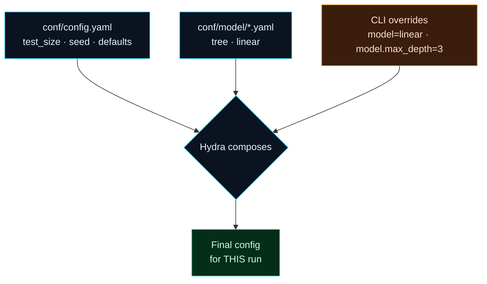

Welcome to **Day 26 of 100 Days of MLOps**. On Day 25 you put settings in a `params.yaml` — a big step up from hardcoding. But real projects outgrow a single flat file fast: you want a *dev* config and a *prod* config, several model variants to swap between, and the ability to run a quick experiment with a different setting *without editing any file*. Copy-pasting configs and commenting lines in and out is how projects descend into chaos. Today you'll learn **Hydra**, the tool that keeps configuration clean and composable as a project scales.

Hydra is used across serious ML codebases because it does three things exceptionally well: it lets you **compose** configuration from reusable pieces, **override** anything from the command line, and **sweep** over many settings in one command. Once you've used it, hardcoded settings feel like a step back in time.

> **Builds on Day 25's `params.yaml`.** Think of Hydra as `params.yaml` grown up — structured, layered, and driveable from the terminal. It complements DVC rather than replacing it.

By the end of today you will:

- Structure configuration into a base file plus reusable **config groups**.
- Load config into your program with **`@hydra.main`**.
- **Override** any setting from the command line — no file edits.
- **Swap whole variants** and **sweep** settings with one command.

---

## Compose, override, sweep

Hydra's core idea: your configuration is *composed* from small YAML files, and anything can be *overridden* at run time from the command line. A base config pulls in **config groups** (a folder of interchangeable options — e.g. different models), and CLI arguments layer on top.



**Reading this diagram:**

Three sources feed into Hydra's composition step (the diamond). The **cyan** nodes are your files on disk: the **base config** (`conf/config.yaml`, holding shared settings like `test_size` and `seed`) and a **config group** (`conf/model/`, a folder of interchangeable model definitions — `tree.yaml`, `linear.yaml`). The **amber** node is different — it's the **command line**, where you type overrides at run time *without touching any file*.

All three merge in the **compose** step into the single **green** node: the final config for *this specific run*. The order matters — the base sets defaults, the chosen group fills in a variant, and CLI overrides win last. So the same code can run as "tree with depth 8" today and "linear model" tomorrow, or "tree with depth 3" for one quick test — just by changing what you type, never by editing files. The takeaway: **configuration becomes something you assemble and override, not something you hardcode** — which is what keeps a growing project manageable.

---

## Set it up

Install Hydra (`pip install hydra-core`), then create this structure:

```text
conf/
├── config.yaml
└── model/
    ├── tree.yaml
    └── linear.yaml
```

**`conf/config.yaml`** — the base. Its `defaults` list says "use the `tree` model unless told otherwise":

```yaml
defaults:
  - model: tree
  - _self_

data: houses.csv
test_size: 0.2
seed: 42
```

**`conf/model/tree.yaml`** and **`conf/model/linear.yaml`** — the config group (two interchangeable model variants):

```yaml
# conf/model/tree.yaml
name: tree
max_depth: 8
```

```yaml
# conf/model/linear.yaml
name: linear
```

Now **`train.py`**, driven by Hydra's decorator:

```python
import hydra
from hydra.utils import to_absolute_path
from omegaconf import DictConfig, OmegaConf
import pandas as pd
from sklearn.linear_model import LinearRegression
from sklearn.tree import DecisionTreeRegressor
from sklearn.metrics import r2_score
from sklearn.model_selection import train_test_split


@hydra.main(version_base=None, config_path="conf", config_name="config")
def main(cfg: DictConfig):
    print("Resolved config for this run:")
    print(OmegaConf.to_yaml(cfg))

    df = pd.read_csv(to_absolute_path(cfg.data))   # data path relative to original dir
    feats = ["size_sqft", "bedrooms", "age_years", "location_score"]
    Xtr, Xte, ytr, yte = train_test_split(df[feats], df["price"],
                                          test_size=cfg.test_size, random_state=cfg.seed)
    if cfg.model.name == "tree":
        model = DecisionTreeRegressor(max_depth=cfg.model.max_depth, random_state=cfg.seed)
    else:
        model = LinearRegression()
    model.fit(Xtr, ytr)
    print(f">>> model={cfg.model.name}  R2={r2_score(yte, model.predict(Xte)):.4f}")


if __name__ == "__main__":
    main()
```

The `@hydra.main` decorator loads and composes the config, then hands your function a ready-to-use `cfg` object. (That `to_absolute_path` matters — more on it below.)

---

## Run it four ways — without editing a file

**1. Defaults.** Just run it; Hydra prints the composed config and trains:

```bash
python train.py
```

```text
Resolved config for this run:
model:
  name: tree
  max_depth: 8
data: houses.csv
test_size: 0.2
seed: 42

>>> model=tree  R2=0.9143
```

**2. Override one setting from the CLI** — no file touched:

```bash
python train.py model.max_depth=3
```

```text
>>> model=tree  R2=0.8231
```

**3. Swap the whole model variant** by selecting a different group option:

```bash
python train.py model=linear
```

```text
>>> model=linear  R2=0.9668
```

**4. Sweep several values in one command** with `--multirun`:

```bash
python train.py --multirun model.max_depth=3,8,12
```

```text
[HYDRA] Launching 3 jobs locally
[HYDRA] 	#0 : model.max_depth=3
>>> model=tree  R2=0.8231
[HYDRA] 	#1 : model.max_depth=8
>>> model=tree  R2=0.9143
[HYDRA] 	#2 : model.max_depth=12
>>> model=tree  R2=0.8903
```

That last one is the killer feature: **one command ran three experiments** (depths 3, 8, 12 → R² 0.8231, 0.9143, 0.8903) — no loops, no editing, no copy-paste. This is how you explore a config space cleanly.

---

## The working-directory gotcha

There's one Hydra behaviour that trips up everyone: **Hydra changes the working directory** for each run (into an `outputs/` folder), so each run's logs and artifacts are neatly isolated. Great for outputs — but it means a relative path like `houses.csv` now points somewhere unexpected. That's why `train.py` wraps the data path in **`to_absolute_path(cfg.data)`**, which resolves it against the folder you *launched from*. Forget it, and you'll get a `FileNotFoundError` for a file that's plainly right there.

---

## Hydra and DVC together

These tools are partners, not rivals. **DVC** versions your data, pipelines and metrics and reproduces runs (Days 22–25). **Hydra** manages the *configuration landscape* — variants, environments, overrides, sweeps. A simple project is fine with just `params.yaml` + DVC; a project with many models, environments, and experiments reaches for Hydra to keep the config clean. You can even have your DVC pipeline call a Hydra-configured script. Use `params.yaml` when settings are few and flat; reach for Hydra when configuration itself becomes complex.

---

## Common errors (and how to fix them)

**1. `Could not override 'model.maxdepth'. Key 'maxdepth' is not in struct`**

You overrode a key that doesn't exist — usually a typo:

```text
Could not override 'model.maxdepth'.
Key 'maxdepth' is not in struct
```

Hydra protects you from silent typos by rejecting unknown keys. Use the exact name from your config (`model.max_depth`, not `maxdepth`).

**2. `FileNotFoundError` for a file that clearly exists**

Hydra changed the working directory. Wrap file paths in `hydra.utils.to_absolute_path(...)` (or use `get_original_cwd()`) so they resolve against where you launched the command, not Hydra's per-run output folder.

**3. `Could not find 'model/xyz'` (config group not found)**

You selected a group option that has no file. `model=linear` needs `conf/model/linear.yaml` to exist. Check the filename in the group folder matches what you typed.

**4. `Cannot find primary config 'config'`**

Hydra can't find your config. Confirm `config_path="conf"` points to the folder and `config_name="config"` matches `conf/config.yaml`, and that you run from the project root.

**5. `_self_` in the wrong place changes the result**

The `defaults` list order matters: `_self_` decides whether your base file's values override the groups or vice-versa. Keep `_self_` last (as above) so your base config's explicit values win, unless you specifically want otherwise.

**6. Overriding a string that Hydra reads as another type**

`key=true` becomes a boolean, `key=3` an int. To force a string, quote it: `key='3'`. Watch this when a value like a version number should stay text.

---

## Recap — what you now have

You can manage configuration like a professional:

- You structured config into a **base file + reusable config groups**.
- You load it with **`@hydra.main`** and get a clean `cfg` object.
- You **override** any setting, **swap** whole variants, and **sweep** with `--multirun` — all from the CLI, no file edits.
- You know the **working-directory gotcha** and how Hydra complements DVC.

**Your cheat sheet:**

| Action | Command |
|--------|---------|
| Run with defaults | `python train.py` |
| Override a value | `python train.py model.max_depth=3` |
| Swap a config group | `python train.py model=linear` |
| Sweep values | `python train.py --multirun model.max_depth=3,8,12` |
| Fix file paths | `to_absolute_path(cfg.data)` |

Golden rule: **compose config from small pieces and override from the CLI** — never hardcode, never copy-paste a config file.

---

## Coming up on Day 27

You've pinned your code, data, and config — but there's one more thing that silently changes results: the **environment** itself. A different Python or library version can shift your numbers even with everything else identical (remember Day 7's version trap). **Day 27 — "Environment Reproducibility"** locks it down: pinned dependencies, and then the ultimate proof — rebuilding your whole project inside a fresh **Docker** container and getting the exact same result, so "works on my machine" becomes "works on *every* machine."

See the full roadmap on the [100 Days of MLOps series page](/series/100-days-mlops). See you tomorrow.
