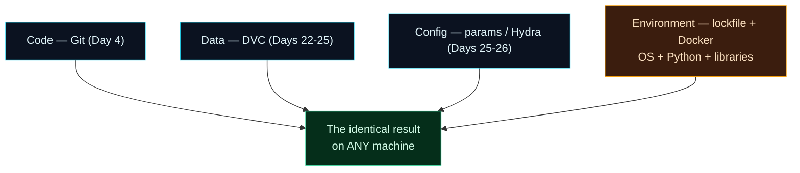

Welcome to **Day 27 of 100 Days of MLOps**. You've now pinned your **code** (Git), your **data** (DVC), and your **config** (params/Hydra). But there's one input still lurking that can silently change your results: **the environment itself** — the exact Python version, the library versions, and even the operating system. Remember Day 7's version trap? The *same* model file behaved differently under a different scikit-learn. Today we lock the environment down, and prove it.

We'll do it in two levels. First, **pinned dependencies** — and we'll *prove* they work by rebuilding the environment from scratch and getting a byte-identical result. Then **Docker**, which packages the whole operating system plus Python plus your libraries into a portable container, so your project runs identically on *any* machine — turning "works on my machine" into "works on every machine."

> **The last piece of the reproducibility puzzle.** Code, data, config, and now environment — pin all four and a result is truly reproducible, anywhere, forever.

By the end of today you will:

- Understand why pinned **top-level** dependencies aren't quite enough.
- Rebuild your environment from a **lockfile** and confirm an identical result.
- Package the whole environment — OS, Python, libraries — into a **Docker image**.
- Know why containers are the gold standard for reproducible (and later, deployable) ML.

---

## Four things to pin

A result is only as reproducible as its *least* controlled input. You've locked three; the environment is the fourth.



**Reading this diagram:**

Four inputs feed the model, and all four must be pinned for a result to be reproducible. Three are already handled (the **cyan** nodes): **code** in Git, **data** in DVC, **config** in params/Hydra. The fourth — the **amber** node, today's focus — is the **environment**: the operating system, the Python interpreter, and every library version. It's amber because it's the one people forget, and it silently breaks reproducibility (Day 7).

All four arrows converge on the **green** node: *the identical result on any machine*. And that's the crucial word — **any machine**. Pinning the first three gets you reproducibility on *your* setup; pinning the environment too is what makes it portable to a teammate's laptop, a CI server, or a production box. The takeaway: **reproducibility is only complete when the environment is pinned as well** — and Docker is how you pin it all the way down to the OS.

---

## Level 1: pin dependencies, then prove it

You already know `requirements.txt` with `==` versions (Day 3). Here's the project's, acting as our **lockfile**:

```text
numpy==2.5.1
pandas==3.0.3
scikit-learn==1.9.0
```

A quick, deterministic `train.py` that also prints its environment:

```python
import platform, sklearn, pandas as pd
from sklearn.linear_model import LinearRegression
from sklearn.metrics import r2_score
from sklearn.model_selection import train_test_split
print(f"Python {platform.python_version()} | scikit-learn {sklearn.__version__}")
df = pd.read_csv("houses.csv")
feats = ["size_sqft", "bedrooms", "age_years", "location_score"]
Xtr, Xte, ytr, yte = train_test_split(df[feats], df["price"], test_size=0.2, random_state=42)
m = LinearRegression().fit(Xtr, ytr)
print(f">>> R2 = {r2_score(yte, m.predict(Xte)):.6f}")
```

Run it in your normal environment:

```text
Python 3.12.4 | scikit-learn 1.9.0
>>> R2 = 0.966841
```

Now the real test of a lockfile: **throw the environment away and rebuild it from the file alone.** Create a brand-new, empty virtual environment, install only from `requirements.txt`, and run again:

```bash
python3 -m venv /tmp/fresh-env
source /tmp/fresh-env/bin/activate      # Windows: \tmp\fresh-env\Scripts\Activate.ps1
pip install -r requirements.txt
python train.py
```

```text
Python 3.12.4 | scikit-learn 1.9.0
>>> R2 = 0.966841
```

**Exactly the same result — `R2 = 0.966841` — from an environment rebuilt from nothing but the lockfile.** That's what pinned dependencies buy you: anyone with your `requirements.txt` reconstructs your exact library set and gets your exact model.

> **A caveat worth knowing.** Pinning your *top-level* packages (numpy, pandas, scikit-learn) is good, but each of those pulls in *its own* dependencies (scipy, joblib…). For airtight locking, capture the **whole** tree — `pip freeze > requirements.txt` records every transitive package too, and tools like **pip-tools**, **Poetry**, or **uv** generate full lockfiles with hashes. Pin the complete tree and even a transitive update can't surprise you.

---

## Level 2: Docker — pin the whole machine

A lockfile pins your *Python packages*, but the rest of the environment still comes from the host: which Python build, which system libraries, which OS. That's usually fine between similar machines — and occasionally the source of a maddening "works for me, not for you." **Docker** removes the doubt entirely by packaging the **operating system, the Python interpreter, and your libraries** into a single portable image that runs the same everywhere.

You describe the environment in a **`Dockerfile`**:

```dockerfile
FROM python:3.12-slim
WORKDIR /app
COPY requirements.txt .
RUN pip install --no-cache-dir -r requirements.txt
COPY . .
RUN python make_dataset.py
CMD ["python", "train.py"]
```

Read it top to bottom: start from a slim, official **Python 3.12** base image (that pins the OS *and* Python), install your pinned libraries, copy in the project, generate the data, and set the default command to train. Two commands build and run it:

```bash
docker build -t house-train .
docker run --rm house-train
```

```text
>>> R2 = 0.966841
```

The container prints the **same `R2 = 0.966841`** — but this time it came from a completely self-contained environment: its own OS, its own Python, its own libraries, none of them borrowed from your machine. Hand that image to anyone — a teammate, a CI runner, a cloud server — and they get the identical result without installing a single thing. (One note: copying `requirements.txt` and installing *before* copying the rest of the code, as above, lets Docker cache the slow install step so rebuilds are fast when only your code changes.)

> **Why we care beyond reproducibility.** This same container is how you'll *ship* a model later. Module 6 wraps a model service in a Docker image; Module 9 runs those images on Kubernetes. Learning to containerise your environment now pays off across the entire back half of the series — reproducibility and deployability are the same skill.

---

## Common errors (and how to fix them)

**1. "It reproduces for me but not for my teammate" — unpinned dependencies**

Someone's `requirements.txt` has loose versions (`pandas` instead of `pandas==3.0.3`), so they installed a different version. Pin exact versions with `==`, and ideally freeze the full tree (`pip freeze`) so transitive packages match too.

**2. A transitive dependency changed and broke things**

You pinned top-level packages but not their dependencies. A sub-dependency updated and shifted behaviour. Use a full lockfile (`pip freeze`, pip-tools, Poetry, or uv) that pins *every* package.

**3. `docker build` hangs or fails at the base image**

Docker needs to download the base image (`python:3.12-slim`) the first time, which requires network access and the Docker engine running. Make sure Docker Desktop is started (Day 1) and you're online; the first build is slower while it pulls the image, then it's cached.

**4. The Docker build reinstalls everything on every code change**

You copied all your code *before* installing dependencies, so any code edit invalidates the cached install layer. Copy `requirements.txt` and `pip install` *first*, then `COPY . .` — that's the ordering in the Dockerfile above.

**5. `ModuleNotFoundError` inside the container**

A library your code needs isn't in `requirements.txt`, so it never got installed in the image. Add it, rebuild. The container only has what the Dockerfile installs — nothing from your host leaks in (that's the point).

**6. Different result on a GPU / different CPU**

Some low-level math libraries produce tiny numerical differences across hardware, even with identical versions (recall Day 10's determinism caveat). For classic scikit-learn on CPU you'll match exactly; for GPU/deep-learning workloads, aim for "reproducible within tolerance" and lean on the pinned environment.

---

## Recap — what you now have

Your environment is now pinned and portable:

- You understand the environment is the **fourth input** to reproducibility (after code, data, config).
- You **rebuilt your environment from a lockfile** and got the identical result (`R2 = 0.966841`).
- You know a full lockfile pins **transitive** dependencies, not just top-level ones.
- You can package the whole environment — **OS + Python + libraries** — into a **Docker image**.

**Your cheat sheet:**

| Level | Tool | Pins |
|-------|------|------|
| Top-level deps | `requirements.txt` with `==` | your direct libraries |
| Full lockfile | `pip freeze` / pip-tools / Poetry / uv | every package (incl. transitive) |
| Whole environment | `Dockerfile` + `docker build/run` | OS + Python + libraries |
| Proof it works | rebuild from scratch → same result | reproducibility, verified |

Golden rule: **pin all four inputs — code, data, config, and environment** — and prove it by rebuilding from scratch and getting the same number.

---

## Coming up on Day 28

You've versioned data and models locally with DVC. Now let's treat them as first-class, retrievable **artifacts**. **Day 28 — "Versioned Data & Model Artifacts"** shows how to tag meaningful versions and pull *a specific past version* of a dataset or model back on demand — even into a different project — with `dvc get` and `dvc import`. It's how teams share and reuse exact data and model versions across an organisation, the bridge from "my repo can reproduce it" to "anyone can grab version 3 of the model."

See the full roadmap on the [100 Days of MLOps series page](/series/100-days-mlops). See you tomorrow.
