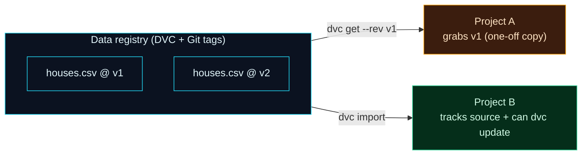

Welcome to **Day 28 of 100 Days of MLOps**. You can version data and models inside your own project (Days 22–25) and reproduce them. But real teams need one more thing: to grab **a specific version of a dataset or model from one project into another.** "Give me version 2 of the training data." "Load the model tagged `v3` into the serving app." Today you'll learn to tag meaningful versions and pull exactly the one you want — turning your versioned files into first-class, retrievable **artifacts**.

This is the leap from "*my* repo can reproduce it" to "*anyone* can grab version 3 of the model." It's how organisations build **data registries** and **model registries**: central places that hold versioned artifacts, which every project pulls from — with full lineage back to the source.

> **Builds on DVC (Days 22–25).** You already version data; today you make those versions *nameable* (Git tags) and *fetchable from anywhere* (`dvc get` / `dvc import`).

By the end of today you will:

- **Tag** meaningful versions of your data/models with Git tags.
- Pull a specific version into another project with **`dvc get`** (one-off).
- Track a dependency on a source artifact with **`dvc import`** (with lineage + `dvc update`).
- Understand the **data/model registry** pattern.

---

## Name your versions, then fetch them anywhere

Two ideas combine here. First, **Git tags** give a version a memorable name: `git tag v1` marks a commit as "version 1." Because DVC ties each commit to an exact dataset (Day 22), tagging a commit effectively tags *that version of the data*. Second, DVC can reach *into another repo* and pull a file at a specific tag — you don't clone the whole thing.



**Reading this diagram:**

On the left, in **cyan**, is a **data registry** — a DVC repo whose Git tags mark meaningful versions (`v1`, `v2`) of `houses.csv`. On the right are two consuming projects, and they pull from the registry two different ways. **Project A** (amber) uses **`dvc get --rev v1`**: a plain one-off *copy* of exactly version 1 — take the file and go, no strings attached. **Project B** (green) uses **`dvc import`**: it copies the file *and* records where it came from, creating a tracked dependency with **lineage** — so later a single `dvc update` fetches a newer version, and the project always knows which source artifact it's built on.

The takeaway is the choice between them: **`dvc get` = "just give me a copy of this version"; `dvc import` = "I depend on this artifact, keep the link."** Both let one project reuse another's exact, versioned data or models — the foundation of sharing artifacts across a team.

---

## Set up a registry with tagged versions

In a DVC repo (with a remote configured, Day 23), create version 1 of the data, commit it, and **tag** it:

```bash
python make_dataset.py --noise 25000
dvc add houses.csv
git add -A && git commit -m "houses v1"
git tag v1
dvc push
```

Then produce a second version and tag it too:

```bash
python make_dataset.py --noise 70000
dvc add houses.csv
git add -A && git commit -m "houses v2"
git tag v2
dvc push
```

You now have a registry with two named versions:

```bash
git tag
```

```text
v1
v2
```

---

## `dvc get`: grab a specific version

From *any* other folder, pull an exact version by tag — no clone, no tracking:

```bash
dvc get /path/to/registry houses.csv --rev v1 -o houses_v1.csv
dvc get /path/to/registry houses.csv --rev v2 -o houses_v2.csv
```

Compare the same row in each — the price differs, proving they're genuinely different versions:

```text
v1: 858,1,64,6,206000  |  v2: 858,1,64,6,172600
```

`dvc get` is like `wget` for DVC-tracked data: it fetches a file (from a local path or a remote Git URL like GitHub) at whatever revision you name. It's perfect for a one-off — "I just need version 1 of that dataset" — but the copy is disconnected; your project doesn't record where it came from.

---

## `dvc import`: grab it *and* keep the link

When your project genuinely **depends** on an artifact, import it instead. This downloads the file *and* leaves a `.dvc` pointer that remembers the source:

```bash
dvc import /path/to/registry houses.csv -o houses.csv
```

```text
Importing 'houses.csv (/path/to/registry)' -> 'houses.csv'
```

Look at the pointer it created — it records the **source repo and the exact source revision** (lineage):

```bash
cat houses.csv.dvc
```

```text
- path: houses.csv
  repo:
    url: /path/to/registry
    rev_lock: 668d6d64394488660e70243711964883882afcd3
  path: houses.csv
```

That `rev_lock` pins the precise source commit, so you always know *exactly* which version of the upstream data your project is built on. And because the link is tracked, when the registry publishes a new version you fetch it with one command:

```bash
dvc update houses.csv.dvc
```

```text
'houses.csv.dvc' didn't change, skipping
```

(Here there's nothing newer, so it skips.) That's the difference in a nutshell: **`get` is a snapshot; `import` is a living, updatable dependency with a paper trail.**

---

## This works for models too — the registry pattern

Everything here applies to **models**, not just data. A team keeps a **model registry** — a DVC repo of tagged model versions — and a serving project `dvc import`s the model tagged `production`. When a better model is promoted and re-tagged, the serving project runs `dvc update` to pick it up, with full lineage back to the training run that produced it. That's the "data/model registry" pattern, and it's how exact artifacts are shared across an organisation.

> **Where this goes next.** DVC gives you a Git-native registry that's perfect for many teams. In **Module 4**, MLflow's **Model Registry** does the same job with a UI, stages (Staging → Production), and richer metadata — for when you're managing many models and want a dashboard. Same concept, heavier tool.

---

## Common errors (and how to fix them)

**1. `ERROR: failed to get 'houses.csv' from '<repo>' - unknown Git revision 'v99'`**

You asked for a tag or commit that doesn't exist:

```text
ERROR: failed to get 'houses.csv' - unknown Git revision 'v99'
```

Check the available versions in the source (`git tag` / `git log`) and use one that exists (`--rev v2`).

**2. `unexpected error - ['nonexistent.csv']`**

The path you asked for isn't tracked in the source repo. Confirm the exact file/dir path exists there (and is DVC- or Git-tracked) before `dvc get`/`dvc import`.

**3. `dvc update` says "no such file" / does nothing useful**

`dvc update` only works on a pointer created by `dvc import`. If you used `dvc get`, there's no tracked link to update — re-`get` the newer version, or use `dvc import` next time if you need updates.

**4. Import fails to fetch the data**

The source repo's data must be reachable — pushed to a remote (Day 23) or available in an accessible local path. If the registry never ran `dvc push`, the bytes aren't in the remote to fetch.

**5. You tagged the code but the data didn't "version"**

Tags name *commits*. Make sure you `dvc add` the changed data and commit the updated `.dvc` pointer *before* tagging, so the tag points at a commit that references the right data version.

**6. Using `dvc get` when you really wanted a tracked dependency**

If you'll need to pull updates or trace lineage, use `dvc import`, not `dvc get`. A plain `get` copy has no record of its origin — six months later, no one can tell which version it was.

---

## Recap — what you now have

Your data and models are now shareable, versioned artifacts:

- You **tag** meaningful versions with Git tags (`v1`, `v2`).
- You pull an exact version with **`dvc get --rev`** (one-off copy).
- You track a dependency with **`dvc import`** — lineage (`rev_lock`) plus `dvc update`.
- You understand the **data/model registry** pattern for sharing artifacts across projects.

**Your cheat sheet:**

| Command | What it does |
|---------|--------------|
| `git tag v1` | Name the current version |
| `dvc get <repo> <path> --rev v1 -o out` | One-off copy of a specific version |
| `dvc import <repo> <path>` | Copy **+** track the source (lineage) |
| `dvc update <file>.dvc` | Pull the latest version of an imported artifact |
| `cat <file>.dvc` | See the source repo + `rev_lock` |

Golden rule: **`get` for a snapshot, `import` for a dependency** — and tag versions so "grab version 3" is a real, repeatable request.

---

## Coming up on Day 29

You've assembled a whole toolkit — project structure, DVC, pipelines, config, environments, artifacts. Starting your *next* project from a blank folder means recreating all of it by hand. **Day 29 — "Project Templates"** fixes that: you'll build a reusable ML project template (with `cookiecutter`) so a single command scaffolds a new project with the structure, config, DVC setup, and conventions already in place — so every project starts consistent, and best practices are the default, not an afterthought.

See the full roadmap on the [100 Days of MLOps series page](/series/100-days-mlops). See you tomorrow.
