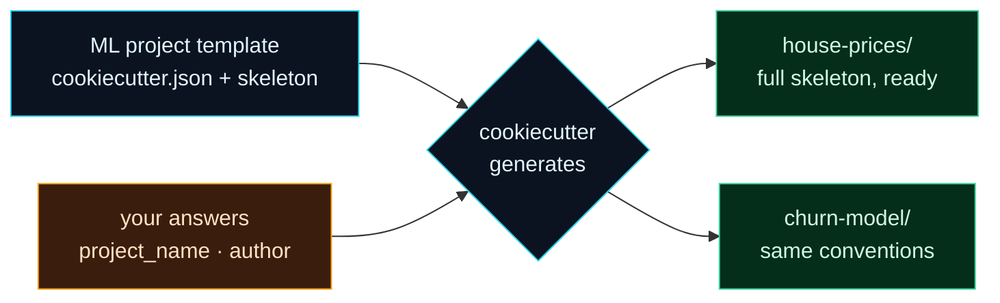

Welcome to **Day 29 of 100 Days of MLOps**. Over this module you've assembled a serious toolkit: a clean `src/` layout, `config`/`params`, DVC setup, `.gitignore`, a README, sensible conventions. But here's the friction — every *new* project starts from an empty folder, and recreating all of that by hand is slow, boring, and inconsistent (you'll forget the `.gitignore` one day, skip DVC init another). Today we fix that with **project templates**: one command scaffolds a brand-new project with everything already in place.

This is a small tool with an outsized payoff. When starting a project *correctly* is a single command, everyone does it — best practices become the **default**, not an afterthought you bolt on later (or never). It's how teams keep dozens of ML projects consistent and navigable.

> **The tool: `cookiecutter`.** It generates a project from a template you design, filling in the blanks (project name, author, settings) from a few prompts.

By the end of today you will:

- Understand how a **cookiecutter template** works (variables + placeholders).
- Build a reusable **ML project template** with your standard skeleton.
- Scaffold a fresh project from it with **one command**.
- Know why templating makes good practices the default.

---

## How a template works

A cookiecutter template is a folder with two parts: a **`cookiecutter.json`** listing the variables (and their defaults), and a specially-named directory **`{{cookiecutter.project_slug}}/`** containing your project skeleton, where files use **`{{ cookiecutter.variable }}`** placeholders. When you run cookiecutter, it asks for the variables, then copies the skeleton with every placeholder filled in.



**Reading this diagram:**

On the left, in **cyan**, is your **template** — written once: the `cookiecutter.json` plus the skeleton with placeholders. It flows into the **generate** step (also cyan), which also takes in the **amber** node: *your answers* (project name, author, and so on) supplied at run time. cookiecutter combines the two — skeleton plus answers — and produces the **green** outputs on the right: fully-formed new projects (`house-prices/`, `churn-model/`), each with the identical structure and conventions but their own filled-in details.

The point is the fan-out on the right: **one template generates any number of consistent projects.** Every project you start this way already has the `src/` layout, the config, the `.gitignore`, the README — so nobody forgets a step and no two projects drift apart. The takeaway: **a template turns "set up a project correctly" into one command** — which is exactly how best practices become automatic instead of optional.

---

## Build the template

Install cookiecutter (`pip install cookiecutter`), then create this structure. Note the literally-named folder `{{cookiecutter.project_slug}}` — cookiecutter renames it using your answer:

```text
ml-template/
├── cookiecutter.json
└── {{cookiecutter.project_slug}}/
    ├── README.md
    ├── requirements.txt
    ├── .gitignore
    ├── params.yaml
    └── src/
        ├── __init__.py
        └── train.py
```

**`cookiecutter.json`** — the variables. Notice `project_slug` is *computed* from `project_name`:

```json
{
  "project_name": "My ML Project",
  "project_slug": "{{ cookiecutter.project_name.lower().replace(' ', '-') }}",
  "author": "Your Name",
  "python_version": "3.12"
}
```

The skeleton files use placeholders that get filled in. For example, **`{{cookiecutter.project_slug}}/README.md`**:

```markdown
# {{ cookiecutter.project_name }}

By {{ cookiecutter.author }}. Python {{ cookiecutter.python_version }}.

## Setup
    python3 -m venv .venv && source .venv/bin/activate
    pip install -r requirements.txt
```

And **`{{cookiecutter.project_slug}}/src/train.py`**:

```python
"""Training entrypoint for {{ cookiecutter.project_name }}."""

def main():
    print("Train {{ cookiecutter.project_name }} here.")


if __name__ == "__main__":
    main()
```

Fill the rest of the skeleton (`requirements.txt`, `.gitignore`, `params.yaml`, `src/__init__.py`) with your standard content — the same conventions you've built all module. This template *is* your accumulated best practice, captured once.

---

## Scaffold a new project in one command

Now generate a project from the template. cookiecutter normally prompts interactively; here we pass answers directly with `--no-input` so it's scriptable:

```bash
cookiecutter ml-template --no-input project_name="House Prices" author="Vishwas" -o generated
```

Look what it produced:

```bash
find generated -type f
```

```text
house-prices/requirements.txt
house-prices/params.yaml
house-prices/README.md
house-prices/.gitignore
house-prices/src/__init__.py
house-prices/src/train.py
```

The folder is named **`house-prices`** — cookiecutter computed that slug from "House Prices" automatically. And every placeholder is filled in. The README:

```text
# House Prices

By Vishwas. Python 3.12.

## Setup
    python3 -m venv .venv && source .venv/bin/activate
    pip install -r requirements.txt
```

And `src/train.py` has the name baked in too: `"""Training entrypoint for House Prices."""`. **One command produced a complete, correctly-structured project** — no copying, no forgetting a file, no inconsistency. Run it interactively (`cookiecutter ml-template`) and it prompts you for each value with the defaults from `cookiecutter.json`.

> **You don't have to start from scratch.** Excellent community templates exist — the most popular is **cookiecutter-data-science** (`cookiecutter -c v2 gh:drivendataorg/cookiecutter-data-science`), a battle-tested ML/DS project layout. Start from one and adapt it to your team's conventions, or build your own like we did here.

---

## Common errors (and how to fix them)

**1. `A valid repository for "./..." could not be found`**

cookiecutter can't find a template at that path (or URL):

```text
A valid repository for "./does-not-exist" could not be found
```

Point it at the template folder that *contains* `cookiecutter.json` (not the inner `{{cookiecutter.project_slug}}` folder), or a Git URL like `gh:user/repo`.

**2. `Error: "generated/house-prices" directory already exists`**

You generated into a spot that's already there. cookiecutter won't overwrite by default. Delete the old folder, choose a different output dir (`-o`), or pass `--overwrite-if-exists` if you really mean to replace it.

**3. Placeholders come out literally (`{{ cookiecutter.project_name }}` in the file)**

The file wasn't rendered as a template — usually because it's *outside* the `{{cookiecutter.project_slug}}/` folder, or you referenced a variable that isn't in `cookiecutter.json`. Keep skeleton files inside the templated folder and make sure every `{{ cookiecutter.x }}` name exists in the JSON.

**4. `TemplateSyntaxError`**

A `{{ }}` expression has a typo (cookiecutter uses Jinja2 under the hood). Check the placeholder syntax — `{{ cookiecutter.author }}`, spaces optional, but the `cookiecutter.` prefix and a valid variable name are required.

**5. The `{{cookiecutter.project_slug}}` folder didn't get renamed**

You named the folder something else. The *directory* must be literally `{{cookiecutter.project_slug}}` (or another variable) for cookiecutter to rename it from your answers.

**6. Interactive prompts hang in a script / CI**

cookiecutter waits for input by default. In automation, pass `--no-input` and supply values on the command line (as above), so it never blocks.

---

## Recap — what you now have

You can start every project the right way, instantly:

- You understand a **cookiecutter template**: `cookiecutter.json` + a `{{cookiecutter.project_slug}}/` skeleton with placeholders.
- You built a reusable **ML project template** capturing your conventions.
- You **scaffolded a fresh project in one command**, with every placeholder filled in.
- You know templating makes good practices the **default**, and that ready-made templates exist.

**Your cheat sheet:**

| Piece | Purpose |
|-------|---------|
| `cookiecutter.json` | Template variables + defaults |
| `{{cookiecutter.project_slug}}/` | The skeleton folder (renamed on generate) |
| `{{ cookiecutter.var }}` | Placeholder inside files |
| `cookiecutter ml-template` | Generate a project (prompts you) |
| `cookiecutter ... --no-input key=val` | Generate non-interactively |

Golden rule: **capture your project conventions once in a template** — then every new project starts consistent, complete, and correct with one command.

---

## Coming up on Day 30 — Module 3 finale

Time to bring the whole module together and *prove* it. **Day 30 — "Capstone: A Fully Reproducible Project"** ties Days 21–29 into one clean, versioned project — code in Git, data and models in DVC with a remote, a `dvc repro` pipeline, params, and pinned environment. Then the ultimate test: from a clean clone, `dvc pull` + `dvc repro` rebuilds the **exact** model and metrics from nothing but the repo — the reproducibility promise of this entire module, delivered end to end and verified with your own eyes.

See the full roadmap on the [100 Days of MLOps series page](/series/100-days-mlops). See you tomorrow.
