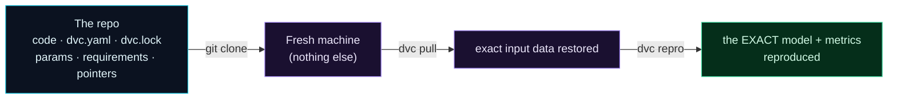

Welcome to **Day 30 of 100 Days of MLOps** — the finale of **Module 3**. Nine days ago (Day 21) you watched a nightmare: the same code produced a different model because the data silently changed, and nobody could reproduce or even *notice* it. Since then you've learned every tool needed to make that impossible. Today we assemble them into **one clean, fully reproducible project** and put it to the ultimate test: **from a fresh clone with nothing else, rebuild the exact same model and metrics.**

This is the moment the whole module pays off. When you can hand someone a repo and say "clone this, run two commands, and you'll get my *exact* model," you've achieved something most ML projects never do. Let's prove it end to end.

> **A capstone — no new tools, just the payoff.** We combine Git, DVC + remote, a `dvc repro` pipeline, params, and a pinned environment, then verify reproducibility with our own eyes.

By the end of today you will:

- Assemble a project where **all four inputs are pinned**: code, data, config, environment.
- Run the reproducibility test: **fresh clone → `dvc pull` → `dvc repro` → identical result**.
- Have a concrete **reproducibility checklist** for every future project.
- Complete Module 3.

---

## The reproducible project

The project pulls together everything from this module. Here's what's in it, and crucially, *how each piece is stored*:

| File | Role | Stored in |
|------|------|-----------|
| `make_dataset.py`, `train.py` | code | **Git** (Day 4) |
| `dvc.yaml` | the pipeline (Day 24) | **Git** |
| `dvc.lock` | exact fingerprints of every stage | **Git** |
| `params.yaml` | settings (Day 25) | **Git** |
| `requirements.txt` | pinned environment (Day 27) | **Git** |
| `houses.csv`, `model.joblib` | data + model | **DVC** (cache + remote, Days 22–23) |
| `metrics.json` | scores | **Git** (`cache: false`, Day 24) |

That split is the whole trick: **Git holds everything small and text (code, pipeline, config, fingerprints, metrics); DVC holds everything big (data, model), with a remote so it's fetchable.** Together they capture the *complete* recipe. Run the pipeline once in the original project:

```bash
dvc repro
```

```text
Running stage 'prepare':
prepare: wrote houses.csv
Running stage 'train':
train: wrote model.joblib + metrics.json
```

```text
{
  "mae": 19529.5,
  "r2": 0.9668
}
```

Then commit the code, pipeline, lock and pointers to Git, push the data to the DVC remote, and tag the version:

```bash
git add -A && git commit -m "Reproducible house-price project"
git tag v1.0
dvc push
```

Everything that defines this model is now captured — the small stuff in Git, the big stuff in the DVC remote.

---

## The ultimate test: reproduce from a clean clone

Now we prove it. We'll act as a brand-new machine that has *only* the repo — no data, no model, nothing.



**Reading this diagram:**

On the left, in **cyan**, is **the repo** — everything Git tracks: code, the pipeline, the lock file, params, requirements, and the DVC pointers. A **`git clone`** lands it on a **fresh machine** (purple) that has *nothing else* — no dataset, no trained model. Then two commands do the work: **`dvc pull`** (purple) reads the pointers and pulls the exact input data from the remote, and **`dvc repro`** (leading to the **green** node) re-runs the pipeline to rebuild the model and metrics.

The green node is the whole point: **the exact model and metrics, reproduced** — from nothing but a clone and two commands. No "email me the data," no "which version were you using," no guessing. Follow the arrows and you're watching Day 21's nightmare become impossible. The takeaway: **a properly versioned project reconstructs itself completely from its repo** — that's what reproducibility actually means, made concrete.

Let's run it. Clone into a fresh folder and look at what's there:

```bash
git clone project fresh
cd fresh
ls
```

```text
dvc.lock  dvc.yaml  make_dataset.py  metrics.json  params.yaml  requirements.txt  train.py
```

Notice: **no `houses.csv`, no `model.joblib`** — Git carried only the pointers. Pull the data from the remote:

```bash
dvc pull
```

```text
2 files fetched and 2 files added
```

Now rebuild the whole pipeline from scratch (the `-f` forces a full re-run, so we're genuinely *rebuilding*, not restoring a cached result):

```bash
dvc repro -f
```

```text
Running stage 'prepare':
prepare: wrote houses.csv
Running stage 'train':
train: wrote model.joblib + metrics.json
```

And the moment of truth — the metrics from this clean-clone rebuild:

```text
{
  "mae": 19529.5,
  "r2": 0.9668
}
```

**Identical.** `mae 19529.5`, `r2 0.9668` — exactly what the original produced. A `diff` against the original `metrics.json` confirms it byte-for-byte. From a fresh machine with nothing but the repo, two commands rebuilt your *exact* model. That is reproducibility, delivered.

---

## Your reproducibility checklist

This is the takeaway you'll carry into every future project. A model is fully reproducible when **all four inputs are pinned**:

- ✅ **Code** — committed to Git (Day 4).
- ✅ **Data** — versioned with DVC, pushed to a remote (Days 22–23).
- ✅ **Config** — in `params.yaml` / Hydra, tracked in Git (Days 25–26).
- ✅ **Environment** — pinned in `requirements.txt` (Day 27).

Plus the glue that ties them together:

- ✅ **Pipeline** — declared in `dvc.yaml`, fingerprinted in `dvc.lock` (Day 24).
- ✅ **Determinism** — seeds fixed so runs match (Day 10).

Miss any one and reproducibility quietly breaks. Hit them all and you get what you just witnessed: one clone, two commands, the exact model — for a teammate, a CI server, or you in a year's time.

---

## Module 3 complete

That's a wrap on **Module 3: Reproducibility & Versioning (Data + Code).** You went from Day 21's unanswerable "which data made this model?" to a project that rebuilds itself perfectly from a clean clone. Along the way: DVC for versioning data and models (22), remotes for sharing (23), pipelines for reproducible workflows (24), params for experiments (25), Hydra for configuration (26), Docker/lockfiles for environments (27), artifacts and registries (28), and templates for consistency (29). Your work is now trustworthy — the bedrock everything operational builds on.

---

## Common errors (and how to fix them)

**1. `dvc pull` on the clone fetches nothing / fails**

The data was never pushed to the remote, or the remote isn't reachable. In the original project, run `dvc push` after committing, and confirm `.dvc/config` (committed to Git) points at a remote the clone can access.

**2. `dvc repro` re-runs everything / results differ on the clone**

Either `dvc.lock` wasn't committed (so DVC can't verify fingerprints), or the environment differs. Commit **both** `dvc.yaml` and `dvc.lock`, and have the clone install the pinned `requirements.txt` first (Day 27).

**3. The clone's metrics differ slightly**

Almost always an unpinned seed (Day 10) or a different library version (Day 27). Fix the seed everywhere and rebuild the environment from `requirements.txt` so the run is deterministic.

**4. `git clone` works but there's no data and no way to get it**

You committed code but forgot the DVC side. Reproducibility needs *both*: Git for code/pointers **and** `dvc push` for the data behind those pointers.

**5. `metrics.json` is missing on the clone**

If it's a DVC output without `cache: false`, it's not in Git — you'd need `dvc pull` to get it, or it's regenerated by `dvc repro`. Marking metrics `cache: false` keeps them in Git so they're visible immediately.

**6. "It reproduced last month but not today"**

A dependency drifted. This is why the environment is pinned — reinstall from the exact `requirements.txt` (or a full lockfile), and the run matches again.

---

## Recap — what you now have

You can build a project that reproduces itself, and you proved it:

- You assembled a project pinning **all four inputs** (code, data, config, environment) plus the pipeline glue.
- You ran the ultimate test — **fresh clone → `dvc pull` → `dvc repro`** — and got the **identical** model and metrics.
- You have a concrete **reproducibility checklist** for every project.
- You completed Module 3.

**Your cheat sheet — reproduce any project:**

| Step | Command |
|------|---------|
| Get the repo | `git clone <repo>` |
| Match the environment | `pip install -r requirements.txt` |
| Restore the data | `dvc pull` |
| Rebuild the model | `dvc repro` |
| Verify | compare `metrics.json` |

Golden rule: **a project is reproducible only when a clean clone rebuilds it exactly** — pin all four inputs, and prove it the way you did today.

---

## Coming up on Day 31 — Module 4 begins

Your work is reproducible — now let's make it *organised at scale*. When you run dozens or hundreds of experiments, DVC's diffs aren't enough; you need a proper system to track and compare them all. **Module 4 — "Experiment Tracking with MLflow"** opens with **Day 31 — "Why Experiment Tracking?"**, where you'll feel the pain of managing many runs by hand (the spreadsheet-of-doom) before meeting the tool built to end it. From reproducing *one* result, we move to comparing *hundreds*.

See the full roadmap on the [100 Days of MLOps series page](/series/100-days-mlops). See you tomorrow.
