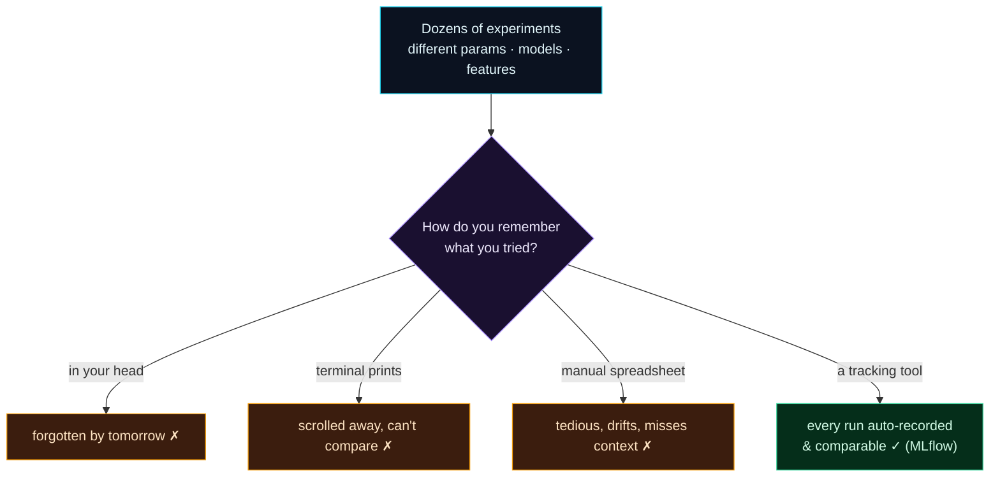

Welcome to **Day 31 of 100 Days of MLOps** — the start of **Module 4: Experiment Tracking with MLflow.** Module 3 taught you to reproduce *one* result perfectly. But real machine learning isn't one result — it's **dozens or hundreds of experiments**: different models, different hyperparameters, different feature sets, run over days and weeks. And a new problem appears: **how do you keep track of it all?** Which run scored best? What exact settings produced it? Can you get that model back?

Today, like Day 21 before data versioning, we *feel the pain* before meeting the cure. You'll run a batch of experiments the way most people start — printing to the terminal, then a hand-kept spreadsheet — and watch both fall apart. By the end you'll understand exactly why every serious ML team uses an experiment tracker.

> **A "feel the pain" day.** No new tool yet — just an honest look at how quickly manual experiment-tracking collapses, so tomorrow's MLflow lands with full force.

By the end of today you will:

- See why **memory, prints, and spreadsheets** don't scale for experiments.
- Understand what an experiment tracker must capture (params, metrics, **and context**).
- Feel the "which experiment made this model?" problem first-hand.
- Be ready for the tool built to solve it.

---

## The problem: too many experiments to remember

On Day 17 you tuned a model — that was a taste of running many configurations. Real projects do this constantly: *try depth 8, now depth 12; add a feature; swap to a random forest; change the test split; retune.* Each run produces a score. After an afternoon you've done twenty of them. Now answer these:

- Which run scored best?
- What were its *exact* settings?
- Can you rebuild that specific model?

If your tracking is informal, you can't — and that's a genuine crisis. Here's how people try, and why each fails:



**Reading this diagram:**

At the top, in **cyan**, is the reality: **dozens of experiments**. They flow into the **purple** question every practitioner hits — *how do you remember what you tried?* Three of the four branches are **amber** — the failing manual approaches. Keeping it **in your head** is gone by tomorrow. **Terminal prints** scroll away and can't be compared across sessions. A **manual spreadsheet** technically works but is tedious, drifts out of sync, and quietly misses crucial context.

Only the last branch is **green**: a proper **tracking tool** that auto-records every run and makes them comparable — which is MLflow, and the rest of this module. The takeaway: **experiment tracking isn't optional bookkeeping — it's the only branch that scales.** Let's prove the amber branches really do fail.

---

## Pain #1: the terminal wall

Here's the most common approach — a loop that prints each result. Create `experiments.py`:

```python
"""Run several experiments by hand — and watch tracking fall apart."""
import pandas as pd
from sklearn.tree import DecisionTreeRegressor
from sklearn.metrics import r2_score
from sklearn.model_selection import train_test_split

df = pd.read_csv("houses.csv")
feats = ["size_sqft", "bedrooms", "age_years", "location_score"]
X, y = df[feats], df["price"]
Xtr, Xte, ytr, yte = train_test_split(X, y, test_size=0.2, random_state=42)

for depth in [3, 5, 8, 12, None]:
    m = DecisionTreeRegressor(max_depth=depth, random_state=42).fit(Xtr, ytr)
    r2 = r2_score(yte, m.predict(Xte))
    print(f"max_depth={depth} -> R2={r2:.4f}")
```

```bash
python experiments.py
```

```text
max_depth=3 -> R2=0.8231
max_depth=5 -> R2=0.9021
max_depth=8 -> R2=0.9143
max_depth=12 -> R2=0.8903
max_depth=None -> R2=0.8908
```

Five runs and it's *already* getting hard — you have to squint to see that `max_depth=8` won. Now imagine this is run #26 through #30 in a terminal that's scrolled through fifty other lines, from a session two days ago. The winning number is *somewhere* up there. And the model itself? Gone — the script didn't save any of them. Prints don't persist, don't compare, and don't keep the model.

---

## Pain #2: the spreadsheet of doom

So you get disciplined and log to a CSV by hand. Create `manual_tracking.py`:

```python
"""The 'spreadsheet of doom': log experiments to a CSV by hand."""
import csv
import pandas as pd
from sklearn.tree import DecisionTreeRegressor
from sklearn.metrics import mean_absolute_error, r2_score
from sklearn.model_selection import train_test_split

df = pd.read_csv("houses.csv")
feats = ["size_sqft", "bedrooms", "age_years", "location_score"]
Xtr, Xte, ytr, yte = train_test_split(df[feats], df["price"], test_size=0.2, random_state=42)

rows = []
for depth in [3, 5, 8, 12]:
    m = DecisionTreeRegressor(max_depth=depth, random_state=42).fit(Xtr, ytr)
    pred = m.predict(Xte)
    # You must remember to record EVERY param and EVERY metric, by hand...
    rows.append({
        "max_depth": depth,
        "r2": round(r2_score(yte, pred), 4),
        "mae": round(mean_absolute_error(yte, pred), 2),
    })

with open("results.csv", "w", newline="") as f:
    w = csv.DictWriter(f, fieldnames=rows[0].keys())
    w.writeheader(); w.writerows(rows)
print("wrote results.csv")
```

```bash
python manual_tracking.py
cat results.csv
```

```text
max_depth,r2,mae
3,0.8231,49573.85
5,0.9021,36535.72
8,0.9143,33046.41
12,0.8903,36811.2
```

Better — now it persists and you can sort it. But look closely at what this "spreadsheet" is **missing**, and why it's a trap:

- **It only records what you remembered to log.** Notice the seed, the `test_size`, the feature list — none are in the file. Change one of those next week and your rows become *incomparable*, and you won't even know.
- **It doesn't save the models.** You can see `max_depth=8` won, but the actual `model.joblib` for that run is gone. You'd have to retrain to get it back (and hope nothing else changed).
- **No context.** No timestamp, no code version, no environment, no note about *why* you ran it. Six months later, "which experiment made the model we deployed?" is unanswerable — the exact reproducibility crisis of Day 21, now for experiments.
- **It's manual, so it drifts.** Add a parameter and you must remember to add a column; forget once and a row is useless. Copy-paste a metric into the wrong cell and you've silently corrupted your record.

This is the **spreadsheet of doom**: it feels like tracking, but it's fragile bookkeeping that breaks exactly when you have enough experiments to need it.

---

## What we actually need

The lesson is clear: experiment tracking has to be **automatic and complete.** For *every* run, without manual effort, we want to capture:

- the **parameters** (every setting, not just the ones you remembered),
- the **metrics** (all of them),
- the **artifacts** (the trained model, plots, reports),
- and the **context** (time, code version, environment),

…all stored in one queryable place where you can **compare runs, sort by any metric, and pull back the exact model** any run produced. That's precisely what **MLflow** does — and it's where we go tomorrow. Today's pain is the reason it exists.

---

## Common errors (and how to fix them) — the mindset version

Today's "errors" are the habits that guarantee lost work:

**1. "I'll remember which settings worked."**

You won't — not past a handful of runs, and definitely not next week. Human memory is not an experiment log. Record everything, automatically.

**2. "The results are in my terminal."**

Until you close it, or it scrolls past, or you run the next batch. Prints are for watching, not for records. They don't persist or compare.

**3. "My spreadsheet has it covered."**

Manual spreadsheets miss context, drift out of sync, and invite copy-paste errors. They also never contain the *model* — only numbers about it.

**4. "I logged the metrics."**

Metrics without the exact params, seed, data version, and the model file are only half a record. You can't reproduce or deploy a row of numbers.

**5. "I'll match the model file to the run later."**

Without an automatic link between a run and its artifacts, "which model was run #17?" becomes guesswork. The link must be recorded at run time.

**6. "Tracking is overhead I'll add later."**

The runs you don't track are gone forever — you can't retroactively log an experiment you've already lost. Track from the first run.

---

## Recap — what you now have

You've felt the problem experiment tracking solves:

- You saw **prints** scroll away and **spreadsheets** drift — neither scales past a few runs.
- You know a real record needs **params + metrics + artifacts + context**, automatically.
- You felt the "**which experiment made this model?**" crisis — Day 21's problem, for experiments.
- You're ready for the tool built to end it.

**Your cheat sheet:**

| Approach | Fails because… |
|----------|----------------|
| In your head | forgotten immediately |
| Terminal prints | don't persist or compare; no model saved |
| Manual spreadsheet | tedious, drifts, misses context, no artifacts |
| **Automatic tracker** | **records everything, queryable, keeps the model** ✓ |

Golden rule: **the experiments you don't track are lost** — track params, metrics, artifacts, and context automatically, from run one.

---

## Coming up on Day 32

Meet the cure. **Day 32 — "MLflow Tracking Basics"** introduces MLflow, the standard open-source experiment tracker. With a few lines — `mlflow.log_param`, `mlflow.log_metric`, `mlflow.log_artifact` — every run records itself completely: parameters, metrics, the model, and context, all stored automatically. Then you'll open the **MLflow UI** in your browser and see your experiments laid out as a proper, sortable table — the spreadsheet of doom replaced by a system that actually works.

See the full roadmap on the [100 Days of MLOps series page](/series/100-days-mlops). See you tomorrow.
