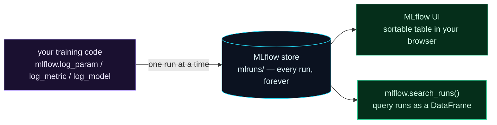

Welcome to **Day 32 of 100 Days of MLOps**. Yesterday you felt the pain: prints scroll away, spreadsheets drift, and "which experiment made this model?" becomes unanswerable. Today you meet the cure — **MLflow**, the most widely used open-source experiment tracker. With just a few lines added to your training code, *every* run records itself **completely and automatically**: its parameters, its metrics, the trained model, and its context. No manual bookkeeping, nothing forgotten.

MLflow is a cornerstone MLOps tool, and its tracking API is refreshingly simple — you'll have it working in minutes. By the end of today, your experiments will live in a proper, queryable store you can sort, compare, and pull exact models from, all viewable in a clean web UI.

> **The spreadsheet of doom, deleted.** Everything Day 31 struggled to track by hand, MLflow captures for free — and keeps the model too.

By the end of today you will:

- Instrument training with **`log_param`**, **`log_metric`**, and **`log_model`**.
- Have every run **recorded automatically** in MLflow's store.
- **Query** your runs as a sortable table with `mlflow.search_runs`.
- Open the **MLflow UI** in your browser.

---

## How MLflow tracking works

The idea is simple: wrap each experiment in a **run**, and inside it, *log* the things you care about. MLflow saves them to a local store (a `mlruns/` folder it manages), and you view or query them afterward.



**Reading this diagram:**

On the left, in **purple**, is **your training code** — the same code as always, plus a few `mlflow.log_*` calls. Each experiment runs and logs itself into the **cyan store** in the middle (`mlruns/`), which MLflow creates and manages automatically. Crucially, this store keeps *every* run — params, metrics, the model, and context — permanently, so nothing scrolls away.

From that one store, two **green** paths let you use what's recorded: the **MLflow UI**, a browser view where runs appear as a sortable table you can click into and compare, and **`mlflow.search_runs()`**, which hands you the same data as a pandas DataFrame to query in code. The takeaway: **you log once, and the run is captured completely and permanently** — then view it however suits you. Compare this to yesterday's diagram, where every manual branch failed; here, the single green store is the branch that works.

---

## Instrument your training

Install MLflow (`pip install mlflow`), then take yesterday's experiments and add logging. Create `track.py`:

```python
"""track.py — Day 32: log every experiment to MLflow automatically."""
import mlflow, mlflow.sklearn
import pandas as pd
from sklearn.tree import DecisionTreeRegressor
from sklearn.metrics import mean_absolute_error, r2_score
from sklearn.model_selection import train_test_split

df = pd.read_csv("houses.csv")
feats = ["size_sqft", "bedrooms", "age_years", "location_score"]
SEED, TEST_SIZE = 42, 0.2
Xtr, Xte, ytr, yte = train_test_split(df[feats], df["price"], test_size=TEST_SIZE, random_state=SEED)

mlflow.set_experiment("house-prices")

for depth in [3, 5, 8, 12]:
    with mlflow.start_run():
        model = DecisionTreeRegressor(max_depth=depth, random_state=SEED).fit(Xtr, ytr)
        pred = model.predict(Xte)

        mlflow.log_param("max_depth", depth)          # the settings
        mlflow.log_param("test_size", TEST_SIZE)
        mlflow.log_param("seed", SEED)
        mlflow.log_metric("r2", r2_score(yte, pred))  # the metrics
        mlflow.log_metric("mae", mean_absolute_error(yte, pred))
        mlflow.sklearn.log_model(model, name="model") # the model itself
        print(f"logged run: max_depth={depth}")
```

The pieces:

- **`mlflow.set_experiment("house-prices")`** groups related runs under a named experiment.
- **`with mlflow.start_run():`** opens a run — everything logged inside belongs to it.
- **`log_param`** records settings, **`log_metric`** records scores, and **`mlflow.sklearn.log_model`** saves the actual trained model as an artifact of the run.

Run it:

```bash
python track.py
```

```text
logged run: max_depth=3
logged run: max_depth=5
logged run: max_depth=8
logged run: max_depth=12
```

That's it — four fully-recorded experiments. MLflow created a `mlruns/` folder holding each run's params, metrics, **and** the trained model, all tied to a unique run ID. (Add `mlruns/` to your `.gitignore` — it's local tracking data, not source.)

---

## Query your runs — the automatic spreadsheet

Remember yesterday's fragile CSV? Here's MLflow's version, generated for free. `mlflow.search_runs` returns every run as a pandas DataFrame:

```python
import mlflow
runs = mlflow.search_runs(experiment_names=["house-prices"])
cols = ["params.max_depth", "metrics.r2", "metrics.mae", "run_id"]
print(runs[cols].sort_values("metrics.r2", ascending=False).to_string(index=False))
```

```text
params.max_depth  metrics.r2  metrics.mae                           run_id
               8    0.914317 33046.407143 ee24e0a74464409289020736ddfa2878
               5    0.902133 36535.723212 3867af1c53bf40649f7b18eaf2c9882f
              12    0.890315 36811.200000 1fc9a50b46bc4240beb23442e902d5ea
               3    0.823142 49573.845339 e5310335c0c047e794761863c5a78e6f
```

Sorted by R², `max_depth=8` is the clear winner (0.9143) — and unlike the manual spreadsheet, this is **complete and automatic**: every param is there, every metric, and that `run_id` is a live link to the run's saved model. "Which experiment made this model, and what were its exact settings?" now has an instant answer. You never wrote a single line of bookkeeping.

---

## Open the MLflow UI

The DataFrame is handy in code, but MLflow also ships a browser UI. From your project folder:

```bash
mlflow ui
```

It starts a local web server (nothing goes online) — open **http://localhost:5000** in your browser. You'll see your `house-prices` experiment with all four runs as a sortable table: click any column header to sort by it, click a run to see its full params, metrics, and artifacts (including the saved model you can download), and tick several runs to **compare** them side by side. Press `Ctrl+C` in the terminal to stop the server. This UI is where experiment tracking really clicks — and tomorrow (Day 33) we'll use it to compare runs properly.

---

## Common errors (and how to fix them)

**1. `MlflowException: Invalid value "high" ... Please specify value as a valid double`**

You passed a non-numeric value to `log_metric`:

```text
MlflowException: Invalid value "high" for parameter 'value' supplied.
Please specify value as a valid double (64-bit floating point)
```

Metrics must be numbers. Use `log_metric("r2", 0.91)` for numeric scores; use `log_param` for text/categorical settings like a model name.

**2. All your runs land in a "Default" experiment**

You forgot `mlflow.set_experiment("...")`. Set it once before your runs so they're grouped under a meaningful name instead of the catch-all default.

**3. Runs pile up / nest unexpectedly**

You didn't close a run, or called `start_run()` inside another. Use the `with mlflow.start_run():` context (as above) so each run opens and closes cleanly, one per experiment.

**4. `mlflow: command not found` when starting the UI**

MLflow isn't installed in your active environment. Activate your venv and `pip install mlflow`, then run `mlflow ui`.

**5. `Port 5000 is already in use`**

Something else is using the default port (on macOS, AirPlay Receiver is a common culprit). Start the UI on another port: `mlflow ui --port 5001`.

**6. `mlruns/` got committed to Git**

It's local tracking data, sometimes large, and shouldn't be in source control. Add `mlruns/` to `.gitignore` (and untrack it with `git rm -r --cached mlruns` if already committed). For team sharing, use a remote tracking server (Day 39).

---

## Recap — what you now have

You have real, automatic experiment tracking:

- You instrument training with **`log_param`**, **`log_metric`**, and **`log_model`** — a few lines.
- Every run is **recorded completely and automatically** in MLflow's store.
- You **query** runs as a sortable DataFrame with `mlflow.search_runs`.
- You can open the **MLflow UI** to browse, sort, and compare runs, and download saved models.

**Your cheat sheet:**

| Call | Records |
|------|---------|
| `mlflow.set_experiment("name")` | groups runs under an experiment |
| `with mlflow.start_run():` | one run (open/close cleanly) |
| `mlflow.log_param("k", v)` | a setting |
| `mlflow.log_metric("k", v)` | a numeric score |
| `mlflow.sklearn.log_model(m, name="model")` | the trained model |
| `mlflow ui` | browse runs at localhost:5000 |

Golden rule: **wrap each experiment in a run and log its params, metrics, and model** — MLflow keeps the complete, queryable record so you never lose an experiment again.

---

## Coming up on Day 33

You're logging runs — now let's *use* them to make decisions. **Day 33 — "Comparing Runs in the MLflow UI"** goes deep on the UI's real superpower: running a batch of experiments and comparing them visually — sorting by any metric, plotting one metric against a parameter, and reading which settings actually drive performance. It's how you turn a pile of runs into a confident "this is the model to ship."

See the full roadmap on the [100 Days of MLOps series page](/series/100-days-mlops). See you tomorrow.
