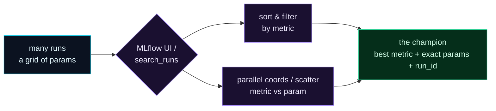

Welcome to **Day 33 of 100 Days of MLOps**. You can log experiments (Day 32) — but logging is only half the value. The real payoff is **comparison**: turning a pile of runs into a confident decision about *which model to ship*. Today you'll run a whole grid of experiments and compare them properly — sorting by any metric, filtering to the good ones, and reading which settings actually drive performance — both in the MLflow UI and programmatically.

This is where experiment tracking stops being bookkeeping and becomes a decision tool. Instead of squinting at a terminal, you'll see all your runs laid out, spot the champion instantly, and know its exact settings — the run you can then reproduce and deploy.

> **From "I logged my runs" to "I chose the best one, and I know why."** Comparison is the point of tracking.

By the end of today you will:

- Run a **grid** of experiments and log them all.
- **Compare** runs — sort, filter, and read the trends.
- Identify the **champion** run and its exact parameters and `run_id`.
- Use the MLflow UI's visual comparison and the `search_runs` query API.

---

## From a pile of runs to a decision

The whole workflow of comparison funnels many runs down to one confident choice:



**Reading this diagram:**

On the left, in **cyan**, are your **many runs** — a grid of parameter combinations, all logged. They flow into the **purple** comparison tools: the MLflow UI (or `search_runs` in code). From there, two purple activities help you make sense of them: **sort & filter** by a metric (jump the best to the top, hide the also-rans) and **plot** — parallel coordinates and scatter — to *see* which parameters drive the metric.

Both paths converge on the **green** node: **the champion** — the single best run, with its exact parameters *and* its `run_id`. Green, as always, marks the trustworthy outcome, and here it's a decision you can act on: reproduce that run and ship its saved model. The takeaway: **comparison is a funnel** — dozens of runs in, one confident, reproducible choice out.

---

## Run a grid, then compare

Comparison is only interesting with enough runs to compare, so let's sweep two hyperparameters at once. Create `compare.py`:

```python
"""compare.py — Day 33: run a GRID of experiments to compare in MLflow."""
import mlflow
import pandas as pd
from sklearn.tree import DecisionTreeRegressor
from sklearn.metrics import r2_score
from sklearn.model_selection import train_test_split

df = pd.read_csv("houses.csv")
feats = ["size_sqft", "bedrooms", "age_years", "location_score"]
Xtr, Xte, ytr, yte = train_test_split(df[feats], df["price"], test_size=0.2, random_state=42)

mlflow.set_experiment("house-prices-grid")
for depth in [3, 5, 8, 12]:
    for leaf in [1, 5, 20]:
        with mlflow.start_run():
            m = DecisionTreeRegressor(max_depth=depth, min_samples_leaf=leaf,
                                      random_state=42).fit(Xtr, ytr)
            mlflow.log_param("max_depth", depth)
            mlflow.log_param("min_samples_leaf", leaf)
            mlflow.log_metric("r2", r2_score(yte, m.predict(Xte)))
print("ran 12 experiments (4 depths x 3 leaf sizes)")
```

```bash
python compare.py
```

```text
ran 12 experiments (4 depths x 3 leaf sizes)
```

Twelve runs, all logged. Now — which is best, and *why*?

---

## Compare in the UI

Start the UI and open the experiment:

```bash
mlflow ui        # then open http://localhost:5000
```

Click into **house-prices-grid** and you'll see all twelve runs as a table. The comparison tools that matter:

- **Sort** by clicking the `r2` column header — the best run jumps to the top.
- **Filter** with the search box (e.g. `metrics.r2 > 0.91`) to hide the also-rans.
- **Select** several runs (tick their boxes) and hit **Compare** to open the comparison view, which includes a **parallel-coordinates plot** (each run is a line threading through its param and metric values — you *see* which settings lead to high R²) and **scatter plots** (put `min_samples_leaf` on the x-axis and `r2` on the y-axis to read a trend at a glance).

Those plots are the superpower: with a dozen runs you can eyeball the winner, but with a hundred you *need* to see the shape of what's working. Let's read the same thing in code so we have it concretely.

---

## Compare (and pick the champion) in code

`search_runs` gives you the whole comparison as a DataFrame, sorted however you like:

```python
import mlflow
runs = mlflow.search_runs(experiment_names=["house-prices-grid"],
                          order_by=["metrics.r2 DESC"])
print(runs[["params.max_depth", "params.min_samples_leaf", "metrics.r2"]].head(6).to_string(index=False))

best = runs.iloc[0]
print(f"CHAMPION: max_depth={best['params.max_depth']}, "
      f"min_samples_leaf={best['params.min_samples_leaf']} -> R2={best['metrics.r2']:.4f}")
print(f"  run_id: {best['run_id']}")
```

```text
params.max_depth params.min_samples_leaf  metrics.r2
              12                       5    0.920198
               8                       5    0.920198
               8                       1    0.914317
               5                       1    0.902133
               5                       5    0.894092
              12                       1    0.890315

CHAMPION: max_depth=12, min_samples_leaf=5 -> R2=0.9202
  run_id: 7d02c97fb771402a854e84b9ec6da304
```

Now *read* it. The champion is `max_depth=12, min_samples_leaf=5` at R² **0.9202** — but look at the pattern, not just the top row: **the two best runs both have `min_samples_leaf=5`**, and `leaf=5` even lets the deepest tree (12) match the depth-8 tree. That's the insight the parallel-coordinates plot would show at a glance: `min_samples_leaf` is doing real work here, regularising the deep trees. Comparison isn't just "who won" — it's "what *drives* winning," which tells you where to search next.

And you can filter to just the contenders:

```python
runs = mlflow.search_runs(experiment_names=["house-prices-grid"],
                          filter_string="metrics.r2 > 0.91",
                          order_by=["metrics.r2 DESC"])
```

```text
params.max_depth params.min_samples_leaf  metrics.r2
              12                       5    0.920198
               8                       5    0.920198
               8                       1    0.914317
```

Three runs clear 0.91 — a short list to reproduce and validate. Crucially, the champion's `run_id` is a handle to its **saved model** (Day 32) and exact settings: no retraining, no guessing which model was best. That's the whole point of comparison — it ends in a confident, reproducible choice.

---

## Common errors (and how to fix them)

**1. `MlflowException: Invalid clause(s) in filter string`**

Your filter query is malformed:

```text
MlflowException: Invalid clause(s) in filter string: 'r2', 'is', 'great'
```

Use MLflow's filter syntax with `metrics.`/`params.` prefixes and real operators: `filter_string="metrics.r2 > 0.91"` or `params.max_depth = '8'` (param values are strings, so quote them).

**2. You're comparing runs from different experiments**

Runs only compare meaningfully within the same experiment (same task/metric). If numbers look nonsensical, check you're not mixing `house-prices` and `house-prices-grid` — pass the right `experiment_names`.

**3. Too many runs to eyeball**

That's exactly when the UI's **parallel-coordinates and scatter plots** earn their keep — don't scroll a 200-row table, plot metric against the parameter you're studying and read the trend.

**4. Sorting the wrong direction**

For R² higher is better; for MAE/RMSE lower is better (Day 14). Set `order_by=["metrics.r2 DESC"]` or `["metrics.mae ASC"]` accordingly, and don't crown a "best" run by the wrong direction.

**5. Runs are hard to tell apart**

If every run looks the same in the list, add a `mlflow.set_tag("note", "...")` or a run name so you can recognise *why* you ran each. Future-you will thank you.

**6. The champion looks great but doesn't generalise**

A single validation split can flatter one run by luck (Day 16). For a high-stakes choice, compare runs on **cross-validated** scores, not one split — log the CV mean as your metric.

---

## Recap — what you now have

You can turn many runs into one confident decision:

- You ran a **grid** of experiments and logged them all.
- You **compared** them — sorting, filtering, and reading trends — in the UI and with `search_runs`.
- You identified the **champion** (max_depth=12, min_samples_leaf=5 → R² 0.9202) and its `run_id`.
- You learned to read *what drives* performance, not just who won.

**Your cheat sheet:**

| Task | How |
|------|-----|
| See all runs | `mlflow ui` → localhost:5000 |
| Sort by metric | click a column / `order_by=["metrics.r2 DESC"]` |
| Filter runs | search box / `filter_string="metrics.r2 > 0.91"` |
| Visual compare | select runs → **Compare** → parallel coords / scatter |
| Get the champion | `search_runs(order_by=...).iloc[0]` → params + `run_id` |

Golden rule: **comparison ends in a reproducible choice** — find the champion *and* what drives it, and keep its `run_id` to pull back the exact model.

---

## Coming up on Day 34

Logging every param and metric by hand is a lot of `log_*` calls — and easy to forget one. **Day 34 — "Autologging"** shows MLflow's magic trick: a single line, `mlflow.autolog()`, that automatically captures parameters, metrics, and the model for you, with **no** manual logging calls. You'll see how much boilerplate it removes, when to prefer it over manual logging, and how the two combine — the fastest way to make every experiment self-documenting.

See the full roadmap on the [100 Days of MLOps series page](/series/100-days-mlops). See you tomorrow.
