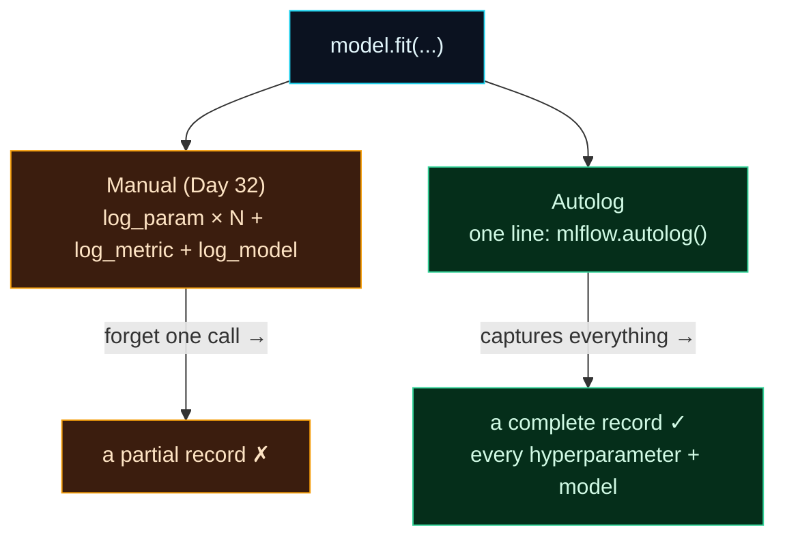

Welcome to **Day 34 of 100 Days of MLOps**. On Day 32 you logged experiments by hand — a `log_param` here, a `log_metric` there. It works, but it's tedious, and the danger is obvious: forget one `log_param` and your record is silently incomplete. Today you meet MLflow's magic trick — **autologging** — which captures parameters, metrics, and the model **automatically**, from a single line, with nothing to forget.

Autolog is how most people actually use MLflow day to day. It makes every experiment self-documenting for almost zero effort. There's one important subtlety to understand (it logs *training* metrics, not your test score) — get that right and you'll reach for autolog on every project.

> **One line replaces a dozen.** `mlflow.autolog()` turns "remember to log everything" into "everything is logged."

By the end of today you will:

- Enable **autologging** with one line and capture everything automatically.
- See it record **more** than you'd log by hand (every hyperparameter, the model).
- Understand the key gotcha: autolog logs **training** metrics, not test.
- **Combine** autolog with a manual metric for the best of both.

---

## Manual vs. automatic

Recording a training run can happen two ways, and the difference is effort versus completeness:



**Reading this diagram:**

At the top, in **cyan**, is the thing you're recording: a `model.fit(...)`. Two paths capture it. The **amber** path is **manual logging** — you write a `log_param` for each setting, a `log_metric` for each score, a `log_model` call. It works, but it depends on *you* remembering every call, and the arrow shows the failure mode: forget one and you get a **partial record**. The **green** path is **autolog** — one line, `mlflow.autolog()`, and MLflow inspects the `fit()` and records everything itself, giving a **complete record** every time.

The contrast is effort *and* reliability: manual is more typing *and* more error-prone; autolog is one line *and* captures more than you'd think to log by hand (every hyperparameter, not just the two you care about). The takeaway: **autolog makes complete tracking the default** — you can't forget a call you never had to write.

---

## Turn it on

Autolog is one line, placed *before* you train. Create `autolog.py`:

```python
"""autolog.py — Day 34: one line captures everything, no manual log_* calls."""
import mlflow
import pandas as pd
from sklearn.tree import DecisionTreeRegressor
from sklearn.metrics import r2_score
from sklearn.model_selection import train_test_split

df = pd.read_csv("houses.csv")
feats = ["size_sqft", "bedrooms", "age_years", "location_score"]
Xtr, Xte, ytr, yte = train_test_split(df[feats], df["price"], test_size=0.2, random_state=42)

mlflow.sklearn.autolog()            # <-- the one magic line
mlflow.set_experiment("house-prices-autolog")

with mlflow.start_run():
    model = DecisionTreeRegressor(max_depth=8, min_samples_leaf=5, random_state=42)
    model.fit(Xtr, ytr)             # autolog captures params + training metrics + the model
    # autolog logs TRAINING metrics; log your own TEST metric manually:
    mlflow.log_metric("test_r2", r2_score(yte, model.predict(Xte)))
    print("trained — autolog captured the rest")
```

```bash
python autolog.py
```

```text
trained — autolog captured the rest
```

Notice there are **no `log_param` calls at all** — yet look what got recorded:

```python
import mlflow
r = mlflow.search_runs(experiment_names=["house-prices-autolog"]).iloc[0]
params = sorted(c for c in r.index if c.startswith("params."))
print(f"autolog captured {len(params)} params automatically")
```

```text
autolog captured 12 params automatically, including:
  ccp_alpha = 0.0
  criterion = squared_error
  max_depth = 8
  max_features = None
  max_leaf_nodes = None
  min_impurity_decrease = 0.0
  min_samples_leaf = 5
  min_samples_split = 2
  min_weight_fraction_leaf = 0.0
  monotonic_cst = None
  ...
```

Autolog recorded **all 12** of the model's hyperparameters — not just the `max_depth` and `min_samples_leaf` you'd have bothered to log by hand, but every default too (`criterion`, `ccp_alpha`, and the rest). It also saved the **trained model** and a set of training metrics, automatically. That completeness matters: six months from now, "what was `min_samples_split` on that run?" has an answer you never had to think about.

---

## The one gotcha: training metrics, not test

Here's the subtlety that trips people up. Autolog computes its metrics on the data you passed to `fit()` — the **training** set. Look at what it logged versus your manual test metric:

```text
training_r2_score = 0.9582     ← autolog, on the TRAINING data
test_r2           = 0.9202     ← you logged this, on the held-out TEST data
```

The auto-logged `training_r2_score` (**0.9582**) is *higher* than your real `test_r2` (**0.9202**) — that gap is the model doing better on data it has seen than on data it hasn't (a touch of overfitting, exactly what Day 16 taught you to watch). **If you mistook `training_score` for real performance, you'd overstate your model.** So the rule is:

> Autolog captures params, the model, and **training** metrics for free. Your honest evaluation on the **test set** is still yours to log — do it with a manual `log_metric("test_r2", ...)` inside the run.

That's the best-of-both pattern, and it's exactly what `autolog.py` does: let autolog handle the boilerplate (params, model, training metrics), and add the one metric that actually decides things — your test score.

---

## Autolog works beyond scikit-learn

`mlflow.sklearn.autolog()` targets scikit-learn, but the plain **`mlflow.autolog()`** turns on autologging for *every* supported library it detects — scikit-learn, XGBoost, LightGBM, PyTorch, TensorFlow/Keras, and more. Same one line, same payoff, whatever framework you train with. For most projects, calling `mlflow.autolog()` once at the top is the fastest route to complete, self-documenting experiments.

---

## Common errors (and how to fix them)

**1. Mistaking `training_score` for test performance**

Autolog's metrics are on the training data. `training_r2_score = 0.9582` is *not* how the model does on new data (`test_r2 = 0.9202` here). Always log and judge by your **held-out test** metric, not the auto-logged training one.

**2. Autolog captured nothing**

You called `mlflow.autolog()` *after* `fit()`, or the training happened outside a run. Enable autolog **before** training, and keep `fit()` inside `with mlflow.start_run():`.

**3. Your test metric isn't there**

Autolog doesn't know about your test set — it only sees `fit()`. Add `mlflow.log_metric("test_r2", ...)` manually inside the run for evaluation on held-out data.

**4. Too many nested / duplicate runs from autolog**

Some estimators (like `GridSearchCV`) create child runs when autologged. That's usually helpful, but if it's noisy, disable it with `mlflow.sklearn.autolog(max_tuning_runs=0)` or turn off with `mlflow.autolog(disable=True)`.

**5. A flood of warnings on `fit()`**

Autolog inspects your model and sometimes warns about incompatible options; these are usually harmless. If they clutter output, they don't affect what's logged — check `search_runs` to confirm the run recorded correctly.

**6. Autolog logs a model you didn't want saved**

It saves the fitted model by default (great for reproducibility, but it takes space). To skip it, `mlflow.sklearn.autolog(log_models=False)`.

---

## Recap — what you now have

You can make every experiment self-documenting with one line:

- You enable **autolog** (`mlflow.autolog()` / `mlflow.sklearn.autolog()`) and capture params, metrics, and model automatically.
- Autolog records **more than manual** — every hyperparameter, the model — with no `log_*` calls.
- You know the gotcha: autolog logs **training** metrics (0.9582), not your test score (0.9202).
- You **combine** autolog with a manual `test_r2` for the honest, complete record.

**Your cheat sheet:**

| Call | Effect |
|------|--------|
| `mlflow.autolog()` | Autolog for all detected libraries |
| `mlflow.sklearn.autolog()` | Autolog for scikit-learn |
| *(no `log_param` needed)* | every hyperparameter captured automatically |
| `mlflow.log_metric("test_r2", ...)` | add your held-out test metric (autolog logs training) |
| `autolog(log_models=False)` | don't auto-save the model |

Golden rule: **autolog the boilerplate, log your test metric by hand** — one line captures everything a run needs, plus the honest score that autolog can't know.

---

## Coming up on Day 35

You're saving params, metrics, and the model — but a run's story often includes *more*: a confusion-matrix plot, a metrics report, and a **model signature** that records exactly what inputs it expects. **Day 35 — "Logging Models & Artifacts"** shows how to attach these to a run — logging figures and files as artifacts, and saving a model *with its signature* so anyone who loads it knows its expected inputs and outputs. It's what turns a tracked run into a genuinely deployable model package.

See the full roadmap on the [100 Days of MLOps series page](/series/100-days-mlops). See you tomorrow.
