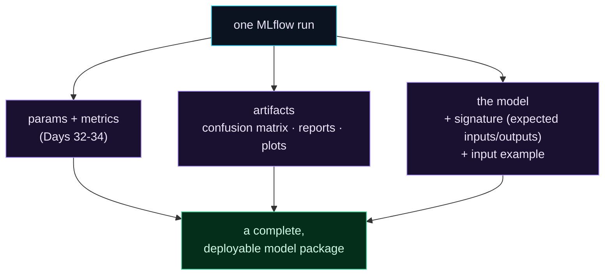

Welcome to **Day 35 of 100 Days of MLOps**. You're logging params, metrics, and the model. But a run's real story often needs more: the **plot** that shows how the model behaves (a confusion matrix), a report, and — crucially — a **model signature** that records exactly what inputs the model expects and what it returns. Today you'll attach all of this to a run, and turn a tracked experiment into a genuinely **deployable model package**.

The signature is the star. It's the model's *contract*: with it, anyone who loads the model knows precisely how to call it — and the model will *reject* malformed inputs instead of silently producing garbage. That single feature prevents a whole class of production disasters, and it's the bridge from "I tracked a model" to "I can safely serve this model" (Module 6).

> **From a logged model to a self-describing package.** Artifacts explain the run; the signature makes the model safe to hand off.

By the end of today you will:

- Log **plots and files** as artifacts with `log_figure` / `log_artifact`.
- Save a model **with a signature** and an input example.
- See the signature **reject bad inputs** — a real safety net.
- Understand why this makes a run a deployable package.

---

## A run is more than numbers

Think of a run as a package. Params and metrics are the label; but a complete package also carries the visuals that explain it and a model that describes itself.



**Reading this diagram:**

At the top, in **cyan**, is **one MLflow run**. Three things hang off it, all **purple**: the **params + metrics** you already log (Days 32–34); the **artifacts** — plots like a confusion matrix, reports, any file that helps explain the run; and the **model** itself, now enriched with a **signature** (its expected inputs and outputs) and an **input example**.

All three feed into the **green** node on the way down: **a complete, deployable model package.** That's the shift today makes — a run stops being just "a row of numbers" and becomes a self-contained bundle you could hand to a serving system: here's the model, here's proof of how it performs (the plot), and here's exactly how to call it (the signature). The takeaway: **log the visuals *and* the contract, and a tracked run becomes something you can actually deploy.**

---

## Log a plot and a signed model

Create `artifacts.py`. We'll train a classifier, log a **confusion-matrix plot**, and save the model **with a signature**:

```python
"""artifacts.py — Day 35: log a plot artifact + the model WITH a signature."""
import matplotlib
matplotlib.use("Agg")               # headless backend for scripts
import matplotlib.pyplot as plt
import mlflow, mlflow.sklearn
import pandas as pd
from mlflow.models import infer_signature
from sklearn.metrics import ConfusionMatrixDisplay, accuracy_score
from sklearn.model_selection import train_test_split
from sklearn.tree import DecisionTreeClassifier

df = pd.read_csv("houses.csv")
df["is_expensive"] = (df["price"] > df["price"].median()).astype(int)
feats = ["size_sqft", "bedrooms", "age_years", "location_score"]
X, y = df[feats], df["is_expensive"]
Xtr, Xte, ytr, yte = train_test_split(X, y, test_size=0.2, random_state=42, stratify=y)

mlflow.set_experiment("house-prices-artifacts")
with mlflow.start_run():
    model = DecisionTreeClassifier(max_depth=5, random_state=42).fit(Xtr, ytr)
    preds = model.predict(Xte)
    mlflow.log_metric("accuracy", accuracy_score(yte, preds))

    # 1) log a PLOT as an artifact
    fig, ax = plt.subplots()
    ConfusionMatrixDisplay.from_predictions(yte, preds, ax=ax)
    mlflow.log_figure(fig, "confusion_matrix.png")

    # 2) log the MODEL with a SIGNATURE (what inputs/outputs it expects)
    signature = infer_signature(Xte, preds)
    mlflow.sklearn.log_model(model, name="model", signature=signature,
                             input_example=Xte.head(2))
    print("logged: accuracy metric, confusion_matrix.png, model + signature")
    print("\nModel signature:")
    print(signature)
```

```bash
python artifacts.py
```

```text
logged: accuracy metric, confusion_matrix.png, model + signature

Model signature:
inputs:
  ['size_sqft': long (required), 'bedrooms': long (required), 'age_years': long (required), 'location_score': long (required)]
outputs:
  [Tensor('int64', (-1,))]
```

Two new tools did the work. **`mlflow.log_figure(fig, "confusion_matrix.png")`** attaches a matplotlib figure to the run as an artifact (use `mlflow.log_artifact("path")` for a file that already exists on disk, like a saved CSV report). And **`infer_signature(Xte, preds)`** inspects your inputs and predictions to build the **signature** you see printed: the model expects four named `long` columns and returns an `int64`. Passing `input_example` stores a couple of sample rows too. That confusion-matrix PNG now lives in the run (viewable in the UI), and the model carries its own contract.

---

## The signature is a safety net

Here's why the signature is more than documentation. When you load the model and call it, MLflow **enforces** the signature — it checks your inputs match. Loaded correctly, it just works:

```python
import mlflow, pandas as pd
model = mlflow.pyfunc.load_model(f"runs:/{run_id}/model")
model.predict(pd.DataFrame([{"size_sqft": 2000, "bedrooms": 4, "age_years": 5, "location_score": 8}]))
# -> 1  (expensive)
```

But send it the *wrong* inputs — say you forget `location_score` — and instead of silently returning a nonsense prediction, it **stops you**:

```text
mlflow.exceptions.MlflowException: Failed to enforce schema ...
Error: Model is missing inputs ['location_score'].
```

That's the safety net. In a live service, a caller sending malformed data is a real and common failure — and *without* a signature, the model might quietly predict on garbage and no one would notice. *With* one, it fails loudly and clearly, naming the missing field. This is exactly the kind of guardrail that makes a model safe to deploy, which is why we log signatures from now on — and why Module 6's serving layer relies on them.

---

## Common errors (and how to fix them)

**1. `MlflowException: Failed to enforce schema ... Model is missing inputs [...]`**

The data you're predicting on doesn't match the model's signature — a missing, extra, or wrongly-typed column:

```text
Error: Model is missing inputs ['location_score'].
```

That's the signature doing its job. Send inputs with exactly the expected columns (names and types). It's protecting you from a silently-wrong prediction.

**2. Your plot doesn't save / the script errors on a display**

In a script (no notebook), matplotlib needs a headless backend. Set `matplotlib.use("Agg")` *before* importing `pyplot`, as in `artifacts.py`, then `mlflow.log_figure(fig, "name.png")`.

**3. You logged a model with no signature**

Then there's no schema enforcement — the model will accept anything and may predict on bad data. Always pass `signature=infer_signature(X, preds)` (and an `input_example`) to `log_model`.

**4. `log_artifact` can't find the file**

`mlflow.log_artifact("path")` logs a file that already exists on disk — save your figure/report first, then log it. To log a matplotlib figure directly without saving, use `mlflow.log_figure(fig, "name.png")` instead.

**5. `infer_signature` gives an odd schema**

It infers types from the data you pass. If a numeric column is accidentally text (Day 11), the signature reflects that. Clean your data first so the inferred types are correct.

**6. The model won't load with `runs:/<id>/model`**

Check the artifact path/name you logged under (here it's `model`) matches what you load, and that the `run_id` is right (`mlflow.search_runs(...)`).

---

## Recap — what you now have

Your runs are now complete, deployable packages:

- You log **plots and files** as artifacts (`log_figure`, `log_artifact`).
- You save a model **with a signature** and an input example.
- You saw the signature **reject malformed inputs** — a real production guardrail.
- You understand this turns a tracked run into a **deployable model package**.

**Your cheat sheet:**

| Call | Logs |
|------|------|
| `mlflow.log_figure(fig, "plot.png")` | a matplotlib figure as an artifact |
| `mlflow.log_artifact("report.csv")` | an existing file |
| `infer_signature(X, preds)` | the model's input/output schema |
| `log_model(m, name="model", signature=..., input_example=...)` | model + contract |
| *(enforced on load)* | bad inputs are rejected, not guessed |

Golden rule: **log the plots and log the signature** — a run should explain itself *and* ship a model that knows exactly how it's meant to be called.

---

## Coming up on Day 36

You've tuned models (Day 17) and tracked runs (Days 32–35) — now combine them. **Day 36 — "Hyperparameter Tuning, Tracked (Optuna + MLflow)"** introduces Optuna, a smart tuning library that searches hyperparameters far more efficiently than a brute-force grid, and wires every trial into MLflow so the whole search is recorded and comparable. You'll run a real study, watch each trial log itself, and pull out the best configuration — automated tuning with a complete, browsable history.

See the full roadmap on the [100 Days of MLOps series page](/series/100-days-mlops). See you tomorrow.
