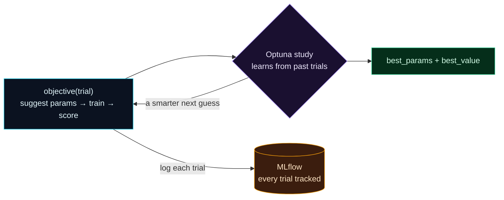

Welcome to **Day 36 of 100 Days of MLOps**. On Day 17 you tuned a model with `GridSearchCV` — which tries *every* combination in a grid, blindly, whether or not a region looks promising. That works for small grids, but it's wasteful and it can only test the exact points you list. Today you meet a smarter approach: **Optuna**, which *learns* from the trials it has already run to decide what to try next, searches *continuous* ranges, and finds strong hyperparameters in far fewer attempts. And you'll wire every trial into **MLflow**, so the whole search is tracked, comparable, and reproducible.

This is the natural marriage of the two skills you've built — tuning (Day 17) and tracking (Days 31–35). Optuna finds the best configuration; MLflow keeps the complete, browsable record of how it got there.

> **Smart search, fully recorded.** Optuna decides *what* to try; MLflow remembers *everything* it tried.

By the end of today you will:

- Understand why **adaptive** search beats a brute-force grid.
- Write an Optuna **objective** and run a **study**.
- **Log every trial** to MLflow so the search is tracked.
- Pull out the **best parameters** with a complete history behind them.

---

## Grid search vs. Optuna

Grid search is exhaustive and dumb: give it `max_depth ∈ {3,5,8}` and `min_samples_leaf ∈ {1,5,20}` and it dutifully tries all nine, spending equal effort on terrible and promising combinations alike. Add a third hyperparameter and the grid explodes.

**Optuna** works differently. You define a *range* for each hyperparameter, and Optuna runs **trials**: each trial picks values, gets scored, and — crucially — Optuna uses the scores of *past* trials to make its *next* guess smarter, homing in on the regions that work. It also explores **continuous** ranges, not just the handful of points you'd list in a grid.



**Reading this diagram:**

On the left, in **cyan**, is the **objective** — a function that suggests hyperparameter values, trains a model, and returns a score. It feeds the **purple study**, Optuna's brain, which *learns from every past trial*. Follow the arrow looping back from the study to the objective: that's the key difference from grid search — the study uses what it has learned to make **a smarter next guess**, so each trial is better-targeted than the last, not a blind grid point.

Two more arrows complete the picture. Each trial also logs itself to **MLflow** (the amber store), so the *entire* search — every trial's params and score — is recorded and browsable. And the study emits the **green** result: `best_params` and `best_value`. The takeaway: **Optuna is a feedback loop that gets smarter as it goes, and MLflow captures the whole journey** — you get both the best answer and a complete record of how it was found.

---

## Write an objective and run a study

Install Optuna (`pip install optuna`), then create `optuna_tune.py`. The heart is the `objective` function: it *suggests* values, scores them (with cross-validation for honesty — Day 16), logs the trial to MLflow, and returns the score.

```python
"""optuna_tune.py — Day 36: smart tuning with Optuna, every trial in MLflow."""
import mlflow, optuna
import pandas as pd
from sklearn.model_selection import cross_val_score
from sklearn.tree import DecisionTreeRegressor

optuna.logging.set_verbosity(optuna.logging.WARNING)
df = pd.read_csv("houses.csv")
feats = ["size_sqft", "bedrooms", "age_years", "location_score"]
X, y = df[feats], df["price"]
mlflow.set_experiment("house-prices-optuna")


def objective(trial):
    # Optuna SUGGESTS values (from ranges, not a fixed grid) and learns what works.
    max_depth = trial.suggest_int("max_depth", 2, 20)
    min_samples_leaf = trial.suggest_int("min_samples_leaf", 1, 40)
    model = DecisionTreeRegressor(max_depth=max_depth,
                                  min_samples_leaf=min_samples_leaf, random_state=42)
    score = cross_val_score(model, X, y, cv=5, scoring="r2").mean()

    with mlflow.start_run():                 # log every trial to MLflow
        mlflow.log_params({"max_depth": max_depth, "min_samples_leaf": min_samples_leaf})
        mlflow.log_metric("cv_r2", score)
    return score


study = optuna.create_study(direction="maximize")
study.optimize(objective, n_trials=25)

print(f"Best CV R2:      {study.best_value:.4f}")
print(f"Best parameters: {study.best_params}")
```

The key calls: **`trial.suggest_int("max_depth", 2, 20)`** lets Optuna pick any depth in that *range*; **`create_study(direction="maximize")`** says "bigger score is better" (use `"minimize"` for an error metric); **`study.optimize(objective, n_trials=25)`** runs 25 trials, each smarter than a blind guess. Run it:

```bash
python optuna_tune.py
```

```text
Best CV R2:      0.8955
Best parameters: {'max_depth': 18, 'min_samples_leaf': 3}
```

In 25 trials — searching *continuous* ranges of depth (2–20) and leaf size (1–40), a space a grid could never cover exhaustively — Optuna found a strong configuration, and its scores are honest 5-fold cross-validated R² (Day 16), not a lucky single split.

---

## The whole search is tracked

Because every trial logged itself, MLflow now holds the complete search — 25 runs you can sort, filter, and browse:

```python
import mlflow
runs = mlflow.search_runs(experiment_names=["house-prices-optuna"], order_by=["metrics.cv_r2 DESC"])
print(f"trials tracked: {len(runs)}")
print(runs[["params.max_depth", "params.min_samples_leaf", "metrics.cv_r2"]].head(4).to_string(index=False))
```

```text
trials tracked: 25
params.max_depth params.min_samples_leaf  metrics.cv_r2
              18                       3       0.895519
              17                       5       0.891498
              15                       4       0.890088
              17                       4       0.890088
```

Look at the top trials — they cluster around `max_depth 15–18` and small `min_samples_leaf`. That's Optuna's learning made visible: it *concentrated* its trials in the promising region rather than wasting them elsewhere. Open the MLflow UI and you can plot `cv_r2` against each parameter to *see* the search converge. You get the best config **and** the full, reproducible story of how it was found — the exact combination of today's two tools.

**Optuna vs grid search, at a glance:**

| | Grid search (Day 17) | Optuna |
|---|---|---|
| Strategy | try every combination | learn from past trials |
| Search space | fixed discrete points | continuous ranges |
| Efficiency | wasteful; explodes with more params | focuses effort; scales better |
| Best for | a few params, small grids | many params, larger spaces |

---

## Common errors (and how to fix them)

**1. `Trial failed ... The value None could not be cast to float`**

Your objective didn't **return** a score:

```text
Trial 0 failed with value None.
```

The `objective` must `return` a number (the metric Optuna optimizes). Make sure the last line returns your score, not `None`.

**2. Optuna is optimizing in the wrong direction**

You set `direction` wrong. Use `create_study(direction="maximize")` for scores where higher is better (R², accuracy) and `"minimize"` for errors (MAE, RMSE). Getting this backwards makes Optuna chase the *worst* configs.

**3. `suggest_*` name doesn't match how you use it**

The string in `trial.suggest_int("max_depth", ...)` is the parameter's key — it must be consistent, and each distinct hyperparameter needs a unique name. Reusing a name for two different things confuses the study.

**4. Trials aren't showing up in MLflow**

You didn't wrap the logging in a run, or forgot `mlflow.set_experiment`. Log inside `with mlflow.start_run():` within the objective (as above), and set the experiment once at the top.

**5. Too few trials to converge**

Optuna needs enough trials to learn the landscape. A handful barely beats random; give it a few dozen (or more for big spaces). If results look no better than random, increase `n_trials`.

**6. Tuning on a single split instead of CV**

Optimizing a single train/test split can overfit to that split's luck (Day 16). Score each trial with `cross_val_score` (as we do) so the "best" config is genuinely best, not lucky.

---

## Recap — what you now have

You can tune smart and keep the whole record:

- You understand why **Optuna's adaptive search** beats a brute-force grid (learns, uses continuous ranges).
- You wrote an **objective** and ran a **study** with `study.optimize`.
- You **logged every trial to MLflow** — the full search is tracked and comparable.
- You pulled the **best parameters** (CV R² 0.8955) with a complete history behind them.

**Your cheat sheet:**

| Piece | Code |
|-------|------|
| Suggest a value | `trial.suggest_int("max_depth", 2, 20)` / `suggest_float(...)` |
| Create a study | `optuna.create_study(direction="maximize")` |
| Run the search | `study.optimize(objective, n_trials=25)` |
| Best result | `study.best_params`, `study.best_value` |
| Track it | log params + score inside `with mlflow.start_run():` |

Golden rule: **let Optuna search smartly and MLflow remember everything** — return a real score from the objective, use CV, and log every trial.

---

## Coming up on Day 37

Your training code works on *your* machine — but "just run my script" hides a dozen assumptions (which entry point, which dependencies, which parameters). **Day 37 — "MLflow Projects"** packages your code into a self-describing, runnable unit: an `MLproject` file declares the entry points, parameters, and environment, so anyone can run your training with one command — `mlflow run .` — and get it working reproducibly, without you explaining a thing. It's how you make training portable and shareable.

See the full roadmap on the [100 Days of MLOps series page](/series/100-days-mlops). See you tomorrow.
