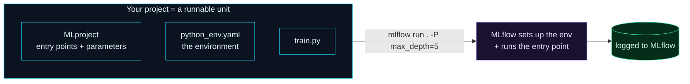

Welcome to **Day 37 of 100 Days of MLOps**. You can train, tune, and track — but how does someone *else* run your training? "Just run `train.py`" quietly assumes they know the entry point, the parameters it expects, and the exact environment it needs. That's a recipe for "it doesn't work on my machine." Today you'll fix it with **MLflow Projects**: a small `MLproject` file that turns your code into a **self-describing, runnable unit** anyone can execute with one command — `mlflow run .` — reproducibly, and even directly from a Git URL.

This is packaging for *training* (Module 6 will package the *model* for serving). It ties together everything so far — your code, its parameters, and its pinned environment (Day 27) — into something portable and shareable, with runs tracked automatically.

> **One file makes training portable.** Declare the entry points, parameters, and environment once; then `mlflow run` handles the rest.

By the end of today you will:

- Write an **`MLproject`** file declaring entry points, parameters, and environment.
- Run your training with **`mlflow run . -P param=value`**.
- Understand how MLflow sets up the **environment** for a reproducible run.
- Know you can run a project **straight from a Git URL**.

---

## A project is code + parameters + environment

An MLflow Project is just a folder with an **`MLproject`** file that answers the three questions "just run my script" leaves open: **how** do I run it (entry points and their commands), **what** can I configure (parameters, with types and defaults), and **in what environment** (a declared Python env).



**Reading this diagram:**

On the left, the **cyan box** is your project — but now it's a *runnable unit*, not just loose files. Inside are three things: the **`MLproject`** file (the entry points and parameters), the **`python_env.yaml`** (the environment to run in), and your **code**. Together they make the project self-describing: it carries its own instructions for how to run.

The arrow shows the payoff: **`mlflow run . -P max_depth=5`** — one command. MLflow reads the `MLproject`, sets up the declared environment, and runs the entry point with the parameter you passed (the **purple** step). The result flows to the **green** node: the run is logged to MLflow automatically. The takeaway: **package the how, what, and where-to-run into one file, and training becomes a single reproducible command** — no README of setup steps, no "works on my machine."

---

## Build a project

Create three small files alongside your `train.py`. First, the **`MLproject`** file (no extension) — it declares an entry point named `main`, a `max_depth` parameter, and the command to run:

```yaml
name: house-prices
python_env: python_env.yaml

entry_points:
  main:
    parameters:
      max_depth: {type: int, default: 8}
    command: "python train.py --max-depth {max_depth}"
```

The **`python_env.yaml`** declares the environment MLflow should build (mirroring Day 27's pinning):

```yaml
python: "3.12"
build_dependencies:
  - pip
dependencies:
  - -r requirements.txt
```

And your `train.py` just reads the parameter and logs its run (nothing new — it's your normal training script with `argparse`):

```python
"""train.py — the entry point run by 'mlflow run .'"""
import argparse, mlflow, pandas as pd
from sklearn.tree import DecisionTreeRegressor
from sklearn.metrics import r2_score
from sklearn.model_selection import train_test_split

p = argparse.ArgumentParser(); p.add_argument("--max-depth", type=int, default=8)
args = p.parse_args()

df = pd.read_csv("houses.csv")
feats = ["size_sqft", "bedrooms", "age_years", "location_score"]
Xtr, Xte, ytr, yte = train_test_split(df[feats], df["price"], test_size=0.2, random_state=42)
m = DecisionTreeRegressor(max_depth=args.max_depth, random_state=42).fit(Xtr, ytr)
r2 = r2_score(yte, m.predict(Xte))
mlflow.log_param("max_depth", args.max_depth)
mlflow.log_metric("r2", r2)
print(f"trained max_depth={args.max_depth} -> R2={r2:.4f}")
```

---

## Run it with one command

Now anyone can run your training without knowing its internals. The `-P` flag passes parameters declared in the `MLproject`:

```bash
mlflow run . -P max_depth=5 --env-manager local
```

```text
INFO mlflow.projects.backend.local: === Running command 'python train.py --max-depth 5' in run with ID '5f7fcb46489c44908a1b18d39e8aec6e' ===
trained max_depth=5 -> R2=0.9021
INFO mlflow.projects: === Run (ID '5f7fcb46489c44908a1b18d39e8aec6e') succeeded ===
```

Watch what MLflow did: it read the `MLproject`, substituted `max_depth=5` into the command, ran the entry point **inside a tracked run** (that run ID), and reported success. Change the parameter and run again — same command, different config:

```bash
mlflow run . -P max_depth=12 --env-manager local
```

```text
trained max_depth=12 -> R2=0.8903
```

No editing code, no explaining the entry point — the project *is* the interface.

> **The environment flag.** `--env-manager local` runs in your *current* environment (fast, great for iterating). Drop it and MLflow will **build the environment from `python_env.yaml`** in isolation — slower the first time, but it guarantees the run uses exactly the declared Python and dependencies (Day 27's reproducibility, automated). Use `local` while developing; use the declared env for a clean, reproducible run.

---

## Run a project straight from Git

Here's the portability payoff. Because the project is self-describing, MLflow can run one **directly from a Git URL** — no clone, no manual setup:

```bash
mlflow run https://github.com/someuser/their-project -P max_depth=8
```

MLflow fetches the repo, reads its `MLproject`, builds the environment, and runs the entry point — reproducibly, on your machine, in one line. That's the whole point: an MLflow Project is training you can hand to *anyone* (or any CI system, or a scheduler) as a single command.

---

## Common errors (and how to fix them)

**1. `train.py: error: unrecognized arguments: --bogus 1`**

You passed a parameter the entry point doesn't handle:

```text
train.py: error: unrecognized arguments: --bogus 1
```

MLflow forwards parameters to the command, and your script's `argparse` rejects unknown ones. Pass only parameters your entry point declares/accepts (check the `MLproject` and the script's arguments).

**2. `Could not find MLproject file`**

You ran `mlflow run` in a folder without an `MLproject`. Make sure the file is named exactly `MLproject` (no extension) and you're pointing at the folder that contains it (`mlflow run .`).

**3. Environment setup is slow or fails**

Building the declared env downloads and installs dependencies the first time. For quick iteration use `--env-manager local` (your current env); for a clean run, ensure `python_env.yaml`/`requirements.txt` are valid so MLflow can build it.

**4. `Parameter not found` / a `{param}` isn't substituted**

The parameter in the `command` (`{max_depth}`) must match a name under `parameters:` in the `MLproject`. Mismatched names leave the placeholder unfilled — keep them identical.

**5. Wrong entry point**

`mlflow run .` uses the `main` entry point by default. If you defined others, select one with `-e <name>`. A typo in the entry-point name will fail to find it.

**6. The command can't find your data/files**

MLflow runs the command from the project directory. Use paths relative to the project root (or absolute), and make sure required data is present (or fetched by the entry point) — the same path discipline as Day 8.

---

## Recap — what you now have

Your training is now a portable, one-command unit:

- You wrote an **`MLproject`** declaring entry points, parameters, and environment.
- You ran training with **`mlflow run . -P max_depth=5`** — parameterized and tracked.
- You know MLflow can **build the declared environment** for a fully reproducible run.
- You can run a project **straight from a Git URL** — no clone, no setup.

**Your cheat sheet:**

| Piece | Purpose |
|-------|---------|
| `MLproject` | declares entry points, parameters, environment |
| `python_env.yaml` | the environment MLflow builds |
| `mlflow run . -P k=v` | run an entry point with a parameter |
| `--env-manager local` | run in the current env (fast) vs. build a clean one |
| `mlflow run <git-url>` | run someone's project directly |

Golden rule: **package training as an MLflow Project** — one file makes it self-describing, so anyone runs it reproducibly with a single command.

---

## Coming up on Day 38

You're generating a lot of runs — across tuning studies, model types, and experiments. Without structure, the MLflow UI becomes its own kind of mess. **Day 38 — "Organizing Experiments"** brings order: naming runs, adding **tags** to label and filter them, and using **nested runs** to group a parent experiment with its child trials (like a whole tuning sweep under one heading). It's how you keep hundreds of runs navigable instead of a flat, unsearchable pile.

See the full roadmap on the [100 Days of MLOps series page](/series/100-days-mlops). See you tomorrow.
