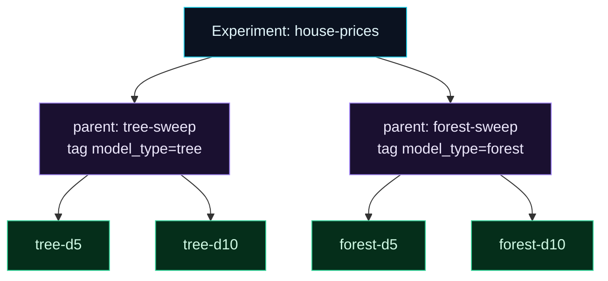

Welcome to **Day 38 of 100 Days of MLOps**. You're logging a lot now — tuning studies, model families, quick experiments — and a new problem appears: the MLflow UI fills up with a flat list of runs with random names, and finding anything becomes a chore. Today you'll bring order with three simple tools: **human-readable run names**, **tags** you can filter by, and **nested runs** that group related runs under a parent. It's the difference between a searchable system and an unsearchable pile.

This is housekeeping that pays off enormously at scale. When you have three hundred runs, "which ones were random forests?" and "which sweep did this trial belong to?" must be one click away — and these three features make them exactly that.

> **Structure turns a pile of runs into a navigable system.** Name them, label them, group them.

By the end of today you will:

- Give runs **meaningful names** instead of random hex.
- Add **tags** and filter runs by them.
- Use **nested runs** to group a sweep or model family under a parent.
- Keep hundreds of runs organised and searchable.

---

## Three tools for order

A run has three organising handles. A **name** makes it recognisable at a glance. A **tag** is a label (like `model_type=forest`) you can filter on. And **nesting** puts child runs under a parent, so a whole sweep collapses into one heading. Used together, they give your experiments a shape:



**Reading this diagram:**

At the top, in **cyan**, is the **experiment** — the top-level grouping (Day 32). Under it sit two **purple parent runs**: `tree-sweep` and `forest-sweep`, each labelled with a **tag** (`model_type=tree`/`forest`). Below each parent hang its **green child runs** — the individual variants (`tree-d5`, `forest-d10`, and so on).

Two kinds of structure are working here at once. **Nesting** (the vertical parent→child links) groups each family's runs under one heading, so the UI shows a tidy collapsible tree instead of six loose rows. **Tags** (the labels on the parents and children) cut *across* the tree — filter `model_type = 'forest'` and you instantly get just the forest runs, wherever they sit. The takeaway: **nesting groups, tags filter, names identify** — combine the three and even hundreds of runs stay easy to navigate.

---

## Build an organised comparison

Let's compare two model *families* — decision trees and random forests — with each family as a parent sweep containing its variants. Create `organize.py`:

```python
"""organize.py — Day 38: run names, tags, and nested runs to keep order."""
import mlflow, pandas as pd
from sklearn.ensemble import RandomForestRegressor
from sklearn.metrics import r2_score
from sklearn.model_selection import train_test_split
from sklearn.tree import DecisionTreeRegressor

df = pd.read_csv("houses.csv")
feats = ["size_sqft", "bedrooms", "age_years", "location_score"]
Xtr, Xte, ytr, yte = train_test_split(df[feats], df["price"], test_size=0.2, random_state=42)

mlflow.set_experiment("house-prices-organized")
families = {"tree": DecisionTreeRegressor, "forest": RandomForestRegressor}

for name, Model in families.items():
    # a PARENT run groups this family's sweep under one heading
    with mlflow.start_run(run_name=f"{name}-sweep"):
        mlflow.set_tag("model_type", name)
        for depth in [5, 10]:
            # a NESTED child run for each variant
            with mlflow.start_run(run_name=f"{name}-d{depth}", nested=True):
                mlflow.set_tag("model_type", name)          # tag = label to filter by
                m = Model(max_depth=depth, random_state=42).fit(Xtr, ytr)
                mlflow.log_param("max_depth", depth)
                mlflow.log_metric("r2", r2_score(yte, m.predict(Xte)))
print("logged 2 parent sweeps, each with 2 nested child runs")
```

The three tools in action: **`run_name=`** names each run; **`mlflow.set_tag("model_type", name)`** labels it; and the inner **`start_run(..., nested=True)`** makes each variant a *child* of the family's parent run. Run it:

```bash
python organize.py
```

```text
logged 2 parent sweeps, each with 2 nested child runs
```

---

## See the structure

The runs now form a tidy tree — parents grouping their children:

```text
    PARENT: forest-sweep   (sweep group)
  └─ child: forest-d10     r2=0.9407
  └─ child: forest-d5      r2=0.9171
    PARENT: tree-sweep     (sweep group)
  └─ child: tree-d10       r2=0.9033
  └─ child: tree-d5        r2=0.9021
```

In the MLflow UI this shows as two collapsible parent rows — click a family to expand its variants. Much better than six anonymous rows. (As a bonus, the structure makes the result obvious: the random forests clearly beat the trees, topping out at R² **0.9407**.)

And **tags** let you slice across the whole experiment. Want just the forest runs?

```python
import mlflow
runs = mlflow.search_runs(experiment_names=["house-prices-organized"],
                          filter_string="tags.model_type = 'forest'",
                          order_by=["metrics.r2 DESC"])
print(runs[["tags.mlflow.runName", "params.max_depth", "metrics.r2"]].to_string(index=False))
```

```text
tags.mlflow.runName params.max_depth  metrics.r2
         forest-d10               10    0.940657
          forest-d5                5    0.917135
```

One tag filter and the trees vanish — only forests remain. Tags are the key to navigating at scale: label runs by anything that matters (`model_type`, `dataset_version`, `stage=candidate`, who ran it), and filter to exactly the slice you need. Names, nesting, and tags together are what keep a large project's runs from becoming an unsearchable heap.

---

## Common errors (and how to fix them)

**1. `Exception: Run with UUID ... is already active`**

You called `start_run()` while another run was still open:

```text
Run ... is already active. To start a new run, first end the current run with
mlflow.end_run(). To start a nested run, call start_run with nested=True
```

The message tells you the two fixes: end the current run first, or — to group runs — open the inner one with `start_run(nested=True)`, as in `organize.py`.

**2. Tags aren't filtering**

Filter syntax needs the `tags.` prefix and quoted values: `filter_string="tags.model_type = 'forest'"`. Also check you actually `set_tag` on the runs you're filtering (tag both parent and children if you want to catch both).

**3. Runs all have random names**

You didn't pass `run_name=`. Give each run a meaningful name (`start_run(run_name="forest-d10")`) so you can recognise it in the UI and in `search_runs` results.

**4. Nested runs show up flat, not grouped**

You opened the children *outside* the parent's `with` block, so they aren't nested under it. Keep the child `start_run(nested=True)` calls *inside* the parent run's context.

**5. Tags vs. params confusion**

Use **params** for things the model was configured with (`max_depth`), and **tags** for organisational labels (`model_type`, `stage`). Filtering uses `params.` or `tags.` accordingly — mixing them up makes queries miss.

**6. Too many tiny experiments instead of tags**

Don't spin up a new *experiment* for every variation — that fragments your runs. Keep related work in one experiment and use **tags** to distinguish variants; experiments are for genuinely separate tasks.

---

## Recap — what you now have

Your runs are organised and searchable at scale:

- You give runs **meaningful names** with `run_name=`.
- You **tag** runs and **filter** by tag (`tags.model_type = 'forest'`).
- You use **nested runs** to group a sweep/family under a parent.
- You can keep **hundreds of runs** navigable — group, label, identify.

**Your cheat sheet:**

| Tool | Code | Use |
|------|------|-----|
| Name | `start_run(run_name="forest-d10")` | recognise a run |
| Tag | `mlflow.set_tag("model_type", "forest")` | label for filtering |
| Filter | `filter_string="tags.model_type = 'forest'"` | slice by tag |
| Nest | `start_run(nested=True)` inside a parent | group children |

Golden rule: **name, tag, and nest** — meaningful names to identify, tags to filter, nesting to group, so scale never turns your runs into a mess.

---

## Coming up on Day 39

So far MLflow has been saving runs into a local `mlruns/` folder on *your* machine — which means only you can see them. **Day 39 — "A Local Tracking Server"** stands up a proper MLflow **tracking server** (backed by a database and an artifact store) that multiple people or scripts can log to and view in one shared place. You'll run the server, point your training at it, and see your runs land in a central location — the step from "tracking on my laptop" to "tracking the team can share."

See the full roadmap on the [100 Days of MLOps series page](/series/100-days-mlops). See you tomorrow.
