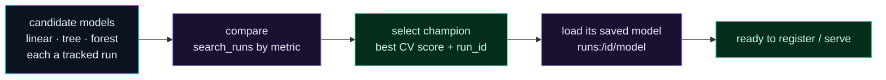

Welcome to **Day 40 of 100 Days of MLOps** — the finale of **Module 4**. You've learned every piece of experiment tracking: logging, comparing, autologging, artifacts, tuning, projects, organising, and a server. Today we assemble them into the loop you'll actually run on every project: **explore a set of candidates, compare them honestly, and programmatically pick the champion** — the single best model, fully specified and ready to hand off.

This is what experiment tracking is *for*. Not bookkeeping for its own sake, but a repeatable path from "I have several ideas" to "this is the model we're shipping, here's its exact configuration, and here's the saved artifact." By the end you'll have that whole workflow in one clean script.

> **The payoff of Module 4.** Explore many, choose one, keep the complete record — as code you can re-run any time.

By the end of today you will:

- Run a set of **tracked candidate models** in one experiment.
- **Compare** them on an honest metric and **select the champion** programmatically.
- **Load the champion's saved model** by its run ID, ready to use.
- Complete Module 4 with a reusable experimentation workflow.

---

## The experimentation loop

Every model-selection effort follows the same four steps, and tracking makes each one clean:



**Reading this diagram:**

Left to right, it's a pipeline. On the left, in **cyan**, are your **candidate models** — a linear model, a tree, a forest — each run as a *tracked* experiment so its params, metrics, and saved model are recorded. They flow into **compare** (purple): `search_runs` orders them by an honest metric. That produces the **green champion** — the single best run, identified by its metric *and* its `run_id`.

The last two steps are the handoff. From the champion's `run_id` you **load its saved model** (`runs:/id/model`, purple) — no retraining, exactly the model that won — and it arrives at the **green handoff** node: ready to register or serve. The takeaway: **tracking turns model selection into a clean, automatic pipeline** — explore, compare, select, load — ending in a specific, reproducible model you can act on, not a vague "the forest seemed good."

---

## Build the workflow

Create `workflow.py`. It runs three candidate model families as tracked runs, selects the champion by cross-validated R² (honest — Day 16), and loads the winner's saved model:

```python
"""workflow.py — Day 40: the full loop — explore, compare, select a champion."""
import mlflow, mlflow.sklearn, pandas as pd
from mlflow.models import infer_signature
from sklearn.ensemble import RandomForestRegressor
from sklearn.linear_model import LinearRegression
from sklearn.metrics import r2_score
from sklearn.model_selection import cross_val_score, train_test_split
from sklearn.tree import DecisionTreeRegressor

df = pd.read_csv("houses.csv")
feats = ["size_sqft", "bedrooms", "age_years", "location_score"]
X, y = df[feats], df["price"]
Xtr, Xte, ytr, yte = train_test_split(X, y, test_size=0.2, random_state=42)

mlflow.set_experiment("house-prices-workflow")
candidates = {
    "linear": LinearRegression(),
    "tree": DecisionTreeRegressor(max_depth=8, random_state=42),
    "forest": RandomForestRegressor(n_estimators=100, random_state=42),
}

# 1. EXPLORE — run each candidate as a tracked run
for name, model in candidates.items():
    with mlflow.start_run(run_name=name):
        mlflow.set_tag("model_type", name)
        cv_r2 = cross_val_score(model, X, y, cv=5, scoring="r2").mean()   # honest selection metric
        model.fit(Xtr, ytr)
        mlflow.log_metric("cv_r2", cv_r2)
        mlflow.log_metric("test_r2", r2_score(yte, model.predict(Xte)))
        mlflow.sklearn.log_model(model, name="model",
                                 signature=infer_signature(Xte, model.predict(Xte)))
        print(f"  ran {name}: cv_r2={cv_r2:.4f}")

# 2. COMPARE + 3. SELECT the champion (best CV score)
runs = mlflow.search_runs(experiment_names=["house-prices-workflow"],
                          order_by=["metrics.cv_r2 DESC"])
champ = runs.iloc[0]
print(f"\nCHAMPION: {champ['tags.mlflow.runName']} "
      f"(cv_r2={champ['metrics.cv_r2']:.4f}, test_r2={champ['metrics.test_r2']:.4f})")

# 4. HAND OFF — load the champion's saved model and use it
model = mlflow.pyfunc.load_model(f"runs:/{champ['run_id']}/model")
pred = model.predict(pd.DataFrame([{"size_sqft":2000,"bedrooms":4,"age_years":5,"location_score":8}]))
print(f"champion predicts a sample house at: ${pred[0]:,.0f}")
print(f"champion run_id (ready to register/serve): {champ['run_id']}")
```

Every technique from the module is here: tracked runs (Day 32), tags (Day 38), an honest CV metric (Day 16), logged models with signatures (Day 35), programmatic comparison (Day 33), and loading a model by run ID. Run it:

```bash
python workflow.py
```

```text
  ran linear: cv_r2=0.9643
  ran tree: cv_r2=0.8856
  ran forest: cv_r2=0.9371

CHAMPION: linear (cv_r2=0.9643, test_r2=0.9668)
champion predicts a sample house at: $511,580
champion run_id (ready to register/serve): dd7246cedc3f44cd81390635361aad2a
```

---

## Read the result — and the lesson

The workflow ran three candidates, compared them on cross-validated R², and crowned a champion — **and the champion is the humble `LinearRegression`** (cv_r2 **0.9643**), beating the fancy random forest (0.9371) and the tree (0.8856). That's a genuinely important MLOps lesson: **the right model for the data wins, not the most complex one.** Our house prices really *are* a linear combination of the features (that's how we built them), so a linear model fits best — a reminder to always compare against simple baselines rather than assuming the sophisticated model is better.

And notice what you *end with*: not a vague impression, but a fully-specified champion — its exact configuration is logged, its cross-validated and test scores are recorded, and its `run_id` is a handle to the **saved model** you just loaded and used ($511,580 for the sample house). That champion is ready to be **registered** and **served** — exactly where the next modules go. This is tracking delivering its whole promise: explore many, choose one confidently, and walk away with the exact, reproducible model.

---

## Module 4 complete

That's a wrap on **Module 4: Experiment Tracking with MLflow.** You went from the spreadsheet-of-doom (Day 31) to a complete experimentation workflow. Along the way: logging runs (32), comparing them (33), autologging (34), artifacts and signatures (35), smart tuning with Optuna (36), packaging as MLflow Projects (37), organising with tags and nesting (38), and a shared tracking server (39). You can now run experiments at scale *and* turn them into confident, reproducible decisions — the discipline that separates tinkering from real ML engineering.

---

## Common errors (and how to fix them)

**1. You selected the champion by the wrong metric**

Picking by *training* score (Day 34) or a single-split score (Day 16) can crown a lucky or overfit model. Select on an honest metric — cross-validated, on held-out data — as `cv_r2` here. And sort the right direction (`DESC` for R², `ASC` for error).

**2. `champion` model won't load**

You selected a run whose model wasn't logged, or the artifact name doesn't match. Make sure every candidate calls `log_model(..., name="model")`, and load with the same name: `runs:/{run_id}/model`.

**3. The champion changes every run**

Unpinned randomness (Day 10). Fix seeds on the models *and* the split so the comparison — and therefore the champion — is reproducible.

**4. Comparing candidates that aren't comparable**

If two runs used different data, features, or metrics, the "winner" is meaningless. Keep all candidates on the same data and the same selection metric within one experiment.

**5. Best CV score but poor real-world performance**

CV estimates generalisation, but if your data has leakage (Day 12) even CV lies. Make sure preprocessing is inside a pipeline and no target info leaks into features before trusting the champion.

**6. You picked the fanciest model on principle**

Don't. As today showed, a simple model can win. Always include a simple baseline in your candidates and let the honest metric decide.

---

## Recap — what you now have

You have the complete experimentation workflow:

- You ran **tracked candidates** and compared them on an honest CV metric.
- You **selected the champion** programmatically (best `cv_r2` + its `run_id`).
- You **loaded the champion's saved model** and used it — ready to register/serve.
- You completed Module 4 and learned that **the right model wins, not the fanciest**.

**Your cheat sheet — the loop:**

| Step | How |
|------|-----|
| Explore | run each candidate in `with mlflow.start_run():`, log CV metric + model |
| Compare | `search_runs(order_by=["metrics.cv_r2 DESC"])` |
| Select | `runs.iloc[0]` → champion + `run_id` |
| Hand off | `mlflow.pyfunc.load_model(f"runs:/{run_id}/model")` |

Golden rule: **explore many, select on an honest metric, keep the record** — end with a specific, reproducible champion, not a hunch.

---

## Coming up on Day 41 — Module 5 begins

Your models are only as good as the data feeding them — and so far you've trusted your data more than you should. **Module 5 — "Data Quality, Validation & Feature Stores"** opens with **Day 41 — "Why Data Validation Matters,"** where you'll see how a single bad batch of data silently poisons a model that looks perfectly healthy, and why catching bad data *before* it reaches training is one of the highest-leverage things you can do in MLOps. From tracking models, we turn to guarding the data.

See the full roadmap on the [100 Days of MLOps series page](/series/100-days-mlops). See you tomorrow.
