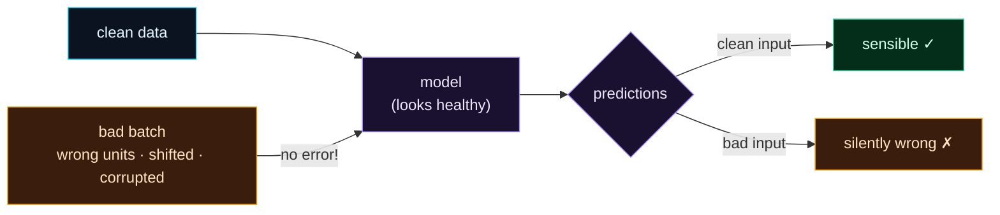

Welcome to **Day 41 of 100 Days of MLOps** — the start of **Module 5: Data Quality, Validation & Feature Stores.** You've spent four modules building, versioning, and tracking *models*. But a model is only ever as good as the **data** feeding it — and here's the uncomfortable truth we've been ignoring: we've trusted our data far more than we should. A model can be perfect and still produce garbage, because *the data* going in was quietly broken.

The scary part is how *silent* it is. Bad data rarely crashes anything — it flows straight through, the code runs fine, the numbers look plausible, and the model confidently outputs nonsense. Today, like Days 21 and 31 before their modules, you'll *feel* that pain: watch one mis-recorded batch poison a healthy model with **no error at all**. That's why data validation exists.

> **A "feel the pain" day.** No new tool — a stark demonstration that bad data is invisible until you check for it, so the validation tools ahead land with full force.

By the end of today you will:

- Understand why bad data is **silent** — it doesn't crash, it corrupts.
- See a mis-recorded batch produce **garbage predictions with no error**.
- Know the common ways data goes bad in real pipelines.
- Understand what "validating data" actually needs to check.

---

## Bad data doesn't announce itself

When code has a bug, you usually get an exception — a stack trace, a red error, *something*. Data bugs are worse, because data that is *wrong* is often still perfectly *valid*: right type, no nulls, plausible numbers. So it sails through every check your code happens to do and lands in your model, which dutifully makes predictions from it.



**Reading this diagram:**

Two data sources feed the **purple model**. From the top, **clean data** (cyan) produces the **green "sensible ✓"** predictions — the happy path you assume. But look at the bottom arrow: a **bad batch** (amber) — wrong units, a shifted distribution, corrupted values — flows into the *same* model, and the arrow is labelled **"no error!"** That's the whole point: nothing stops it. The model processes the bad batch exactly as willingly as the good one.

The predictions split at the diamond. Good input → sensible output. Bad input → the **amber "silently wrong ✗"** node: predictions that are *plausible-looking but completely wrong*, with no crash, no warning, no red flag. The takeaway: **a model can't tell good data from bad — it just computes.** Catching the bad batch is *your* job, and it has to happen *before* the data reaches the model. Let's watch it happen.

---

## Watch a batch poison a model

Here's a realistic disaster: a new batch of house data arrives, but upstream, someone recorded `size_sqft` in square **metres** instead of square **feet** — a subtle unit bug. The numbers are still positive integers, still a valid column. Create `make_batches.py`:

```python
"""make_batches.py — a clean batch, and a 'new batch' with a silent corruption."""
import numpy as np, pandas as pd
rng = np.random.default_rng(42); n = 500

def houses(seed):
    r = np.random.default_rng(seed); m = 200
    df = pd.DataFrame({"size_sqft": r.integers(600,3500,m), "bedrooms": r.integers(1,6,m),
        "age_years": r.integers(0,80,m), "location_score": r.integers(1,11,m)})
    df["price"] = (30000+140*df.size_sqft+12000*df.bedrooms-900*df.age_years
                   +20000*df.location_score+r.normal(0,25000,m)).clip(50000).round(-2).astype(int)
    return df

# clean training data
train = pd.DataFrame({"size_sqft": rng.integers(600,3500,n), "bedrooms": rng.integers(1,6,n),
    "age_years": rng.integers(0,80,n), "location_score": rng.integers(1,11,n)})
train["price"] = (30000+140*train.size_sqft+12000*train.bedrooms-900*train.age_years
                  +20000*train.location_score+rng.normal(0,25000,n)).clip(50000).round(-2).astype(int)
train.to_csv("train.csv", index=False)

# a NEW incoming batch — but 'size_sqft' was accidentally recorded in square METRES
new = houses(7)
new["size_sqft"] = (new["size_sqft"] / 10.764).round().astype(int)   # <-- the silent bug
new.drop(columns=["price"]).to_csv("new_batch.csv", index=False)
print("wrote train.csv (clean) and new_batch.csv (size in m2 by mistake)")
```

Now train on the clean data and predict on the new batch — and notice that everything *runs perfectly*. Create `poison_demo.py`:

```python
"""poison_demo.py — the bad batch trains/predicts with NO error, silently wrong."""
import pandas as pd
from sklearn.linear_model import LinearRegression
feats = ["size_sqft", "bedrooms", "age_years", "location_score"]
train = pd.read_csv("train.csv")
model = LinearRegression().fit(train[feats], train["price"])

new = pd.read_csv("new_batch.csv")
preds = model.predict(new[feats])            # runs fine — no error at all

print(f"train size_sqft range: {train.size_sqft.min()}–{train.size_sqft.max()}")
print(f"new   size_sqft range: {new.size_sqft.min()}–{new.size_sqft.max()}   <- looks tiny (it's m2!)")
print(f"\npredicted prices on the bad batch: ${preds.min():,.0f} to ${preds.max():,.0f}")
print(f"(a real house is ~$150k–$700k - these are garbage, but NOTHING errored)")
```

```bash
python make_batches.py
python poison_demo.py
```

```text
train size_sqft range: 615–3494
new   size_sqft range: 57–324   <- looks tiny (it's m2!)

predicted prices on the bad batch: $28,253 to $314,182
(a real house is ~$150k–$700k - these are garbage, but NOTHING errored)
```

There it is. The model was trained on houses of **615–3494** sqft; the new batch's "sizes" are **57–324** (metres, not feet), so the model thinks every house is tiny and predicts prices as low as **$28,253** — nonsense. And critically: **`model.predict` did not raise a single error.** No crash, no warning. If this were a live pricing service, it would have quietly quoted absurd prices to real customers, and the only clue would be angry users — long after the damage was done.

---

## How data goes bad (and what to check)

The unit bug is just one flavour. In real pipelines, data breaks in ways that *all* pass silently:

- **Wrong units or scale** — feet vs metres, dollars vs cents, a column accidentally ×1000.
- **Distribution shift** — a sensor drifts, a new data source has different ranges.
- **Schema change** — a column renamed, reordered, added, or dropped upstream.
- **Corrupted values** — nulls filled with `0`, dates as text, a bad join duplicating rows.
- **Encoding changes** — categories relabelled (`"NY"` → `"New York"`).

None of these throw an exception. But *every one* would be caught by **validating the data before it reaches the model** — checking that each column exists, has the right type, and falls in an expected range or set. A simple rule like "`size_sqft` must be between 400 and 6000" would have stopped today's batch cold, with a clear message, before a single bad prediction. That's the entire premise of this module: **check the data at the door.**

Catching bad data early is one of the **highest-leverage** things in MLOps. A five-second validation check prevents days of "why is the model suddenly wrong?" debugging — because the answer is almost never the model, and almost always the data.

---

## Common errors (and how to fix them) — the mindset version

Today's "errors" are the assumptions that let bad data through:

**1. "The data loaded without errors, so it's fine."**

Loading proves the file is *readable*, not *correct*. A CSV of wrong-unit numbers loads perfectly. Validate content, not just format.

**2. "There were no exceptions, so the run is good."**

Bad data rarely raises exceptions — it produces wrong answers silently. "No crash" is not "no problem."

**3. "My metrics look fine."**

Metrics computed on bad data can look fine *on that bad data*. A model can score well on garbage and fail on reality. Validate the inputs, don't just trust the score.

**4. "I check for nulls, that's enough."**

Nulls are the *easiest* bad data to catch. Wrong units, shifted ranges, and schema drift have no nulls at all. You need range, type, and schema checks too.

**5. "Upstream won't change the data on me."**

It will — a rename, a unit fix, a new vendor. Data contracts break constantly. Assume the incoming data can change and check it every time.

**6. "I'll notice if something's off."**

You won't, not at scale, not silently. Detection has to be *automatic* — a validation step, not a human eyeball.

---

## Recap — what you now have

You've felt the problem this module solves:

- You know bad data is **silent** — it corrupts without crashing.
- You watched a mis-recorded batch produce **garbage predictions with no error**.
- You know the common ways data breaks (units, drift, schema, corruption) — all silent.
- You understand validation must check **schema, types, and ranges** *before* the model.

**Your cheat sheet:**

| Belief | Reality |
|--------|---------|
| "It loaded fine" | readable ≠ correct |
| "No exceptions" | bad data doesn't crash |
| "Metrics look good" | good on garbage means nothing |
| "I check nulls" | units/drift/schema have no nulls |
| **Validate inputs** | **check schema + types + ranges at the door** ✓ |

Golden rule: **a model can't tell good data from bad** — validate the data before it reaches training or serving, every time.

---

## Coming up on Day 42

Now the fix. **Day 42 — "Schema Validation with Pandera"** introduces Pandera, a lightweight library for declaring what your data *must* look like — columns, types, and value ranges — and enforcing it in code. You'll write a schema that says "`size_sqft` is an integer between 400 and 6000," point it at today's poisoned batch, and watch it **reject the bad data with a clear, specific error** — exactly the guardrail that would have stopped the silent disaster.

See the full roadmap on the [100 Days of MLOps series page](/series/100-days-mlops). See you tomorrow.
