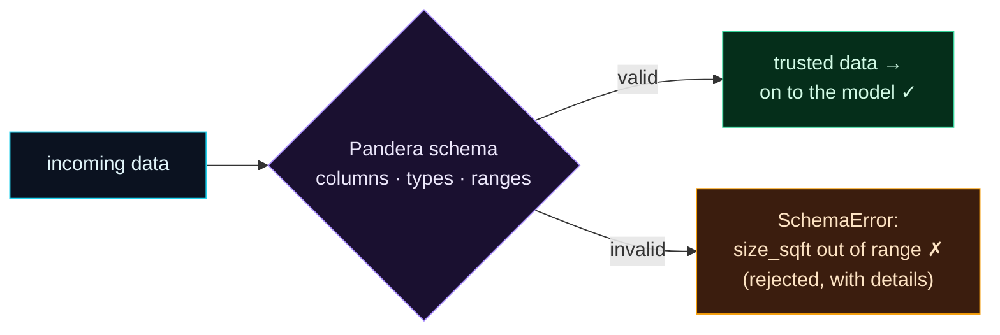

Welcome to **Day 42 of 100 Days of MLOps**. Yesterday you watched a mis-recorded batch poison a model with no error at all. Today you build the guardrail that catches it: **Pandera**, a lightweight library for declaring *exactly what your data must look like* — which columns, what types, what value ranges — and enforcing that contract in code. Point it at yesterday's poisoned batch and it stops the bad data cold, with a clear message naming the problem.

Pandera is the simplest, most Pythonic way to add data validation to an ML project, and it fits right into the pipelines you've built. A schema is just a declaration of your expectations; `validate` either returns your (now-trusted) data or raises a specific error telling you exactly what's wrong.

> **A data contract in a few lines.** Declare the rules once; enforce them everywhere data enters your system.

By the end of today you will:

- Write a **Pandera schema** — columns, types, and value ranges.
- **Validate** a DataFrame and get trusted data back — or a clear error.
- **Reject yesterday's poisoned batch** with a specific message.
- Collect **all** failures at once with `lazy=True`.

---

## A schema is a data contract

The core idea: instead of *hoping* your data is right, you *declare* what right means. A **`DataFrameSchema`** lists each column with its type and one or more **`Check`s** — rules like "in this range" or "in this set." Then `schema.validate(df)` enforces it.



**Reading this diagram:**

On the left, in **cyan**, is your **incoming data** — untrusted, straight from wherever it came. It hits the **purple schema gate**, which checks every column against your declared rules (types, ranges). From there, exactly one of two things happens. If the data is **valid**, it passes through to the **green node** as *trusted* data, on its way to the model. If it's **invalid**, it's diverted to the **amber node**: a `SchemaError` that **rejects** the batch and tells you precisely what failed (which column, which rule, which values).

Contrast this with yesterday's diagram, where bad data flowed straight to the model with "no error!" Here, the gate makes that impossible — nothing invalid gets past it, and when something's wrong you get a specific, actionable message instead of silent garbage. The takeaway: **a schema turns "hope the data is right" into "prove the data is right, or stop."**

---

## Write and enforce a schema

Install Pandera (`pip install pandera`), then create `schema.py`. Note the import path — Pandera's pandas API lives under `pandera.pandas`:

```python
"""schema.py — Day 42: declare what the data MUST look like, and enforce it."""
import pandas as pd
import pandera.pandas as pa
from pandera.pandas import Column, Check, DataFrameSchema

# The data contract: columns, types, and valid ranges.
schema = DataFrameSchema({
    "size_sqft":      Column(int, Check.in_range(400, 6000)),
    "bedrooms":       Column(int, Check.in_range(1, 10)),
    "age_years":      Column(int, Check.in_range(0, 150)),
    "location_score": Column(int, Check.in_range(1, 10)),
})


def check(name, path):
    df = pd.read_csv(path)
    try:
        schema.validate(df, lazy=True)          # lazy=True: report ALL failures
        print(f"{name}: VALID ✓")
    except pa.errors.SchemaErrors as e:
        print(f"{name}: REJECTED ✗")
        print(e.failure_cases[["column", "check", "failure_case"]].drop_duplicates("column").to_string(index=False))


check("clean batch (train.csv)", "train.csv")
print()
check("poisoned batch (new_batch.csv)", "new_batch.csv")
```

Each `Column` declares a type and a `Check`. `Check.in_range(400, 6000)` says "`size_sqft` must be between 400 and 6000" — exactly the rule that would have caught yesterday's square-metres bug. Run it against the clean batch and the poisoned one from Day 41:

```bash
python schema.py
```

```text
clean batch (train.csv): VALID ✓

poisoned batch (new_batch.csv): REJECTED ✗
   column               check  failure_case
size_sqft in_range(400, 6000)           310
```

**That's the guardrail working.** The clean batch passes. The poisoned batch is **rejected**, and Pandera tells you *exactly* why: the `size_sqft` column failed the `in_range(400, 6000)` check, with an example failing value (310 — a metres reading). Yesterday this batch produced $28k "prices" silently; today it never reaches the model at all.

---

## Clear errors, and all of them at once

If you `validate` without `lazy=True`, Pandera raises a `SchemaError` on the *first* failure — a clear, specific message:

```text
pandera.errors.SchemaError: Column 'size_sqft' failed element-wise validator
number 0: in_range(400, 6000) failure cases: 310, 224, 240, 297, 212, 265, ...
```

It names the column, the exact check, and the values that broke it — no guessing. But real data often has *several* problems at once, and fixing them one error-at-a-time is slow. That's what **`lazy=True`** is for (as in `schema.py`): it runs *every* check and collects *all* failures into a `SchemaErrors` (note the plural) with a `.failure_cases` table, so you see the complete picture in one pass — every bad column, not just the first.

---

## A reusable, typed schema

For schemas you'll reuse across a project, Pandera offers a class-based style (`DataFrameModel`) that reads like a typed definition:

```python
import pandera.pandas as pa
from pandera.typing import Series

class HouseSchema(pa.DataFrameModel):
    size_sqft: Series[int] = pa.Field(in_range={"min_value": 400, "max_value": 6000})
    bedrooms: Series[int] = pa.Field(in_range={"min_value": 1, "max_value": 10})
    age_years: Series[int] = pa.Field(in_range={"min_value": 0, "max_value": 150})
    location_score: Series[int] = pa.Field(in_range={"min_value": 1, "max_value": 10})

HouseSchema.validate(df)   # same enforcement, class-based
```

Either style works; the `DataFrameSchema` dict is quick for one-offs, the `DataFrameModel` class is nice for a shared, importable contract. Both do the same job: reject bad data at the door with a clear reason. Tomorrow (Day 44) you'll wire one into a pipeline as an automatic gate.

---

## Common errors (and how to fix them)

**1. `SchemaError: Column 'size_sqft' failed ... in_range(...)`**

This is the guardrail *working*, not a bug in your code. It means incoming data violated your contract — investigate the data (wrong units? bad source?), fix it upstream, and only then let it through.

**2. `ModuleNotFoundError` / `ImportError` on `Column`, `Check`**

In current Pandera the pandas API is under `pandera.pandas`: `import pandera.pandas as pa` and `from pandera.pandas import Column, Check, DataFrameSchema`. Older tutorials use `import pandera as pa` — update the import if you hit this.

**3. A type check fails on numbers that look fine**

pandas may have read a column as `float` (e.g. because of a missing value) when your schema says `int`. Either clean/cast the column first, declare it as `float`, or use `coerce=True` on the column to let Pandera convert it.

**4. `SchemaError` about nulls you didn't expect**

By default columns are non-nullable. If a column can legitimately have missing values, mark it `Column(float, nullable=True)` — but consider whether a null there is actually a data problem you *want* to catch.

**5. You only see one error when there are many**

Plain `validate` stops at the first failure. Pass `lazy=True` to collect **all** failures at once (catching `pa.errors.SchemaErrors`, plural), so you fix everything in one pass.

**6. The schema passes bad data anyway**

Your checks aren't tight enough. "Is an int" won't catch a wrong-unit value — you need a **range** or **set** check (`in_range`, `isin`) that encodes what's actually valid for that column. Make the contract specific.

---

## Recap — what you now have

You can enforce a data contract in code:

- You write a **Pandera schema** with columns, types, and `Check`s.
- `validate` returns **trusted data** or raises a **clear, specific error**.
- You **rejected yesterday's poisoned batch** on the `size_sqft` range check.
- You use **`lazy=True`** to collect all failures, and a class-based schema for reuse.

**Your cheat sheet:**

| Piece | Code |
|-------|------|
| A schema | `DataFrameSchema({"col": Column(int, Check.in_range(a, b))})` |
| Common checks | `Check.in_range(...)`, `Check.isin([...])`, `Check.gt(0)` |
| Enforce | `schema.validate(df)` → data or `SchemaError` |
| All failures | `schema.validate(df, lazy=True)` → `SchemaErrors` |
| Reusable | `class S(pa.DataFrameModel): col: Series[int] = pa.Field(...)` |

Golden rule: **declare a specific data contract and validate at the door** — a tight range/set check turns silent bad data into a loud, fixable error.

---

## Coming up on Day 43

Pandera is perfect for enforcing schemas in code. But teams often want something richer: a suite of expectations, human-readable **data documentation**, and validation results you can share with non-engineers. **Day 43 — "Great Expectations"** introduces the most established data-validation framework: you'll build an *expectation suite* (a collection of rules about your data), validate against it, and generate **Data Docs** — a browsable HTML report of what your data should look like and whether it passed. It's data validation as a shared, documented practice.

See the full roadmap on the [100 Days of MLOps series page](/series/100-days-mlops). See you tomorrow.
