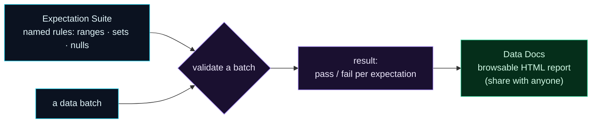

Welcome to **Day 43 of 100 Days of MLOps**. Pandera (Day 42) is a lightweight, code-first way to enforce a schema. Today you meet the heavyweight of data validation: **Great Expectations (GX)** — the most established data-quality framework, used across the industry. It adds two things Pandera doesn't emphasise: **expectation suites** (named, reusable collections of data rules) and **Data Docs** — a browsable HTML report of what your data should look like and whether it passed, that you can share with anyone, engineer or not.

Great Expectations treats data validation as a *documented, shared practice*, not just a code assertion. That makes it a natural fit for teams and for data-quality that needs to be visible beyond the codebase. It's more machinery than Pandera — so today is about understanding the core loop: **suite → validate → Data Docs.**

> **Validation you can hand to a stakeholder.** Rules become a named suite; results become a shareable report.

By the end of today you will:

- Build an **expectation suite** — a named collection of data rules.
- **Validate** a batch and read the per-expectation pass/fail result.
- Catch the **poisoned batch** from Day 41.
- Generate browsable **Data Docs** (HTML) from a validation.

---

## Suite, validate, document

Great Expectations has three moving parts. An **expectation** is one rule (`ExpectColumnValuesToBeBetween`). An **expectation suite** is a named bundle of them. You **validate** a data batch against the suite and get a result — pass/fail *per expectation*. And you can turn that result into **Data Docs**, an HTML site describing your expectations and the outcome.



**Reading this diagram:**

On the left, in **cyan**, are the two inputs: the **expectation suite** (your named rules) and a **data batch** (the data to check). They meet at the **purple validate** step, which runs every expectation in the suite against the batch and produces a **result** — and note this result is *per expectation*, so you see exactly which rules passed and which failed, not just an overall yes/no.

That result then flows to the **green Data Docs** node: a browsable HTML report. This is the piece that sets GX apart — the outcome isn't just a value in your code, it's a **document** anyone can open and read. The takeaway: **GX makes data validation a shared, documented practice** — the suite is the contract, the validation is the check, and Data Docs is the report that makes both visible to the whole team.

---

## Build a suite and validate

Install it (`pip install great_expectations`), then create `ge_validate.py`. We build a suite of three expectations and validate two batches against it:

```python
"""ge_validate.py — Day 43: an expectation suite + validation with Great Expectations."""
import great_expectations as gx
import pandas as pd

context = gx.get_context()   # in-memory context for this demo

# 1) an EXPECTATION SUITE: a named collection of rules about the data
suite = context.suites.add(gx.ExpectationSuite(name="house_suite"))
suite.add_expectation(gx.expectations.ExpectColumnValuesToBeBetween(
    column="size_sqft", min_value=400, max_value=6000))
suite.add_expectation(gx.expectations.ExpectColumnValuesToBeBetween(
    column="bedrooms", min_value=1, max_value=10))
suite.add_expectation(gx.expectations.ExpectColumnToExist(column="location_score"))
print(f"suite 'house_suite' has {len(suite.expectations)} expectations")

# 2) point it at a dataframe batch
asset = context.data_sources.add_pandas("pandas").add_dataframe_asset(name="houses")
batch_def = asset.add_batch_definition_whole_dataframe("whole")

def validate(name, path):
    batch = batch_def.get_batch(batch_parameters={"dataframe": pd.read_csv(path)})
    result = batch.validate(suite)
    print(f"\n{name}: {'PASSED ✓' if result.success else 'FAILED ✗'}")
    for r in result.results:
        if not r.success:
            c = r.expectation_config
            print(f"  {c.type} on '{c.kwargs['column']}': {r.result['unexpected_count']} unexpected values")

validate("clean batch", "train.csv")
validate("poisoned batch", "new_batch.csv")
```

The shape mirrors Pandera but with GX's vocabulary: a `context` (GX's entry point), a named `ExpectationSuite`, individual `expectations`, and a `batch` you `validate`. Run it against Day 41's batches:

```bash
python ge_validate.py
```

```text
suite 'house_suite' has 3 expectations

clean batch: PASSED ✓

poisoned batch: FAILED ✗
  expect_column_values_to_be_between on 'size_sqft': 200 unexpected values
```

Same guardrail as yesterday, richer report: the clean batch passes all three expectations, and the poisoned batch **fails** — GX pinpoints that `expect_column_values_to_be_between` on `size_sqft` had **200 unexpected values** (the whole metres-batch). The result is *per expectation*, so on real data you'd see exactly which of your dozens of rules broke.

---

## Data Docs: validation you can share

Here's what makes GX distinctive. From a validation, it generates **Data Docs** — a static HTML site documenting your expectations and the results. Using a file-backed context and a validation definition, one call builds it:

```python
context = gx.get_context(mode="file", project_root_dir=".")
# ... define suite + batch definition as above ...
vd = context.validation_definitions.add(
    gx.ValidationDefinition(name="house_vd", data=batch_def, suite=suite))
vd.run(batch_parameters={"dataframe": pd.read_csv("new_batch.csv")})
context.build_data_docs()
```

That produces a browsable site on disk:

```text
gx/uncommitted/data_docs/local_site/index.html
  → open it in a browser
```

Open `index.html` and you get a clean, human-readable report: the `house_suite` and its rules, and the validation run showing which expectations passed and which failed (with the offending counts). That's the payoff over a raw code assertion — a **shareable artifact** a data owner or manager can read without touching Python. Teams point stakeholders at Data Docs to answer "is our data healthy?" at a glance.

---

## Pandera or Great Expectations?

Both validate data; they suit different needs:

| | Pandera (Day 42) | Great Expectations |
|---|---|---|
| Style | lightweight, code-first | framework, suite-based |
| Best for | inline checks inside a pipeline | documented, shared data quality |
| Output | a `SchemaError` in code | per-expectation results **+ Data Docs** |
| Weight | tiny dependency | heavier, more setup |

Reach for **Pandera** when you want a quick schema check right in your training/serving code (which is what tomorrow's pipeline gate uses). Reach for **Great Expectations** when data quality needs to be a visible, documented practice across a team — with reports non-engineers can read. Many organisations use both. (One caveat: GX's API changes noticeably between major versions — the code here is for the 1.x line; match examples to your installed version.)

---

## Common errors (and how to fix them)

**1. `AttributeError` / methods not found on `context` or `suite`**

GX's API differs a lot across versions (0.x vs 1.x are very different). Check your installed version (`gx.__version__`) and use matching docs — the 1.x fluent API (`context.suites.add(...)`, `batch.validate(suite)`) is what today uses.

**2. An expectation "fails" — that's the point**

A failed expectation on bad data is GX doing its job (like today's `size_sqft`). Investigate and fix the *data*, or loosen the expectation only if the rule was genuinely wrong.

**3. `build_data_docs` produces nothing**

Data Docs need a **file-backed** context (`gx.get_context(mode="file")`), not the in-memory one — the in-memory context has nowhere to write the site. Use a file context and run a validation before building docs.

**4. Progress bars flood your output**

GX prints `Calculating Metrics` bars via tqdm. Set the environment variable `TQDM_DISABLE=1` (or filter stderr) for clean logs in scripts and CI.

**5. `Column not found` in an expectation**

An expectation references a column that isn't in the batch (typo, or an upstream rename). That's often a *real* schema problem worth catching — but confirm the column name matches the data.

**6. It feels like a lot of machinery for a small check**

It is — that's the trade-off. For a quick inline check, Pandera is lighter. Use GX when you want the suite + Data Docs + the shared-practice benefits; don't reach for it just to check one range.

---

## Recap — what you now have

You can run data validation as a documented practice:

- You built an **expectation suite** — a named collection of data rules.
- You **validated** batches and read **per-expectation** pass/fail results.
- You caught the **poisoned batch** (200 unexpected `size_sqft` values).
- You generated **Data Docs** — a browsable HTML report to share.

**Your cheat sheet:**

| Piece | Code |
|-------|------|
| Context | `context = gx.get_context()` |
| Suite | `context.suites.add(gx.ExpectationSuite(name="..."))` |
| Expectation | `gx.expectations.ExpectColumnValuesToBeBetween(column=..., min_value=..., max_value=...)` |
| Validate | `batch.validate(suite)` → `.success`, `.results` |
| Data Docs | file context → `context.build_data_docs()` |

Golden rule: **use a suite to declare rules and Data Docs to make results visible** — validation the whole team can read, not just the code.

---

## Coming up on Day 44

You can *write* validations (Pandera, GX) — now let's make them **automatic**. **Day 44 — "Validation as a Pipeline Gate"** wires validation into your training pipeline as a hard gate: before any training happens, the incoming data is validated, and if it fails, the pipeline **stops** with a clear error instead of training on garbage. You'll turn validation from "something you can run" into "something that always runs," so a poisoned batch can never silently reach your model again.

See the full roadmap on the [100 Days of MLOps series page](/series/100-days-mlops). See you tomorrow.
