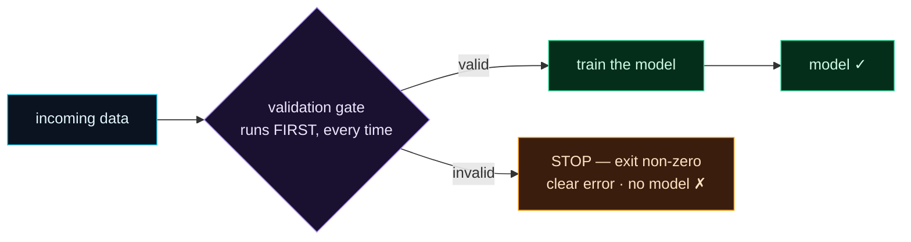

Welcome to **Day 44 of 100 Days of MLOps**. You can now *write* data validations with Pandera (Day 42) and Great Expectations (Day 43). But a validation you have to *remember* to run is only as reliable as your memory. Today you make validation **automatic and mandatory**: a **gate** at the front of your pipeline that runs *every time*, before any training, and **stops everything** if the data is bad — so a poisoned batch can never silently reach your model again.

This is the crucial shift from "validation exists in the codebase" to "validation always happens." The mechanism is beautifully simple — a non-zero exit code — and it's what lets automation (DVC, Make, CI) enforce data quality without a human in the loop. Fail fast, fail loud, train on nothing but good data.

> **From "you can validate" to "it always validates."** A gate the data must pass before the model is ever touched.

By the end of today you will:

- Put validation **first** in a training script and **fail fast** on bad data.
- Use a **non-zero exit code** so any pipeline or CI halts.
- Wire validation as a **DVC pipeline stage** that gates training.
- Guarantee a poisoned batch **never reaches the model**.

---

## The gate: validate first, or stop

The pattern is one rule: **validation runs before training, and if it fails, nothing downstream runs.** A valid batch flows through to training; an invalid one hits the gate and the whole pipeline halts with a clear error.



**Reading this diagram:**

On the left, in **cyan**, is the **incoming data**. It hits the **purple validation gate** — and the label matters: it runs *first*, and *every time*, before anything else touches the data. Two outcomes branch out. If the data is **valid**, it flows through to **train the model** and out to a **model** (both green — the happy path). If it's **invalid**, it takes the **amber** branch: **STOP** — the process exits with a non-zero code, prints a clear error, and produces **no model**.

That amber "STOP" node is the whole idea. Bad data doesn't get a partial run or a quietly-wrong model — it gets a hard halt. And because the gate is *first*, training literally cannot happen on unvalidated data. The takeaway: **a gate makes validation non-optional** — good data trains, bad data stops the line, and nothing in between.

---

## Build a gated training script

The key ingredient is `sys.exit(1)` — a non-zero exit code that signals "this failed" to whatever ran the script. Create `train.py` with validation *before* training:

```python
"""train.py — Day 44: VALIDATE first; refuse to train on bad data (fail fast)."""
import sys
import joblib, pandas as pd
import pandera.pandas as pa
from pandera.pandas import Column, Check, DataFrameSchema
from sklearn.linear_model import LinearRegression

SCHEMA = DataFrameSchema({
    "size_sqft":      Column(int, Check.in_range(400, 6000)),
    "bedrooms":       Column(int, Check.in_range(1, 10)),
    "age_years":      Column(int, Check.in_range(0, 150)),
    "location_score": Column(int, Check.in_range(1, 10)),
    "price":          Column(int, Check.gt(0)),
})

path = sys.argv[1] if len(sys.argv) > 1 else "train.csv"
df = pd.read_csv(path)

# --- THE GATE: validate BEFORE training. Fail fast on bad data. ---
try:
    SCHEMA.validate(df, lazy=True)
    print(f"[gate] {path}: data valid ✓")
except pa.errors.SchemaErrors as e:
    bad = e.failure_cases[["column", "check"]].drop_duplicates()
    print(f"[gate] {path}: VALIDATION FAILED — refusing to train", file=sys.stderr)
    print(bad.to_string(index=False), file=sys.stderr)
    sys.exit(1)                      # non-zero exit stops any pipeline/CI

# --- only reached if the gate passed ---
feats = ["size_sqft", "bedrooms", "age_years", "location_score"]
model = LinearRegression().fit(df[feats], df["price"])
joblib.dump(model, "model.joblib")
print("[train] model trained and saved ✓")
```

Run it on clean data — it validates, trains, and exits `0` (success):

```bash
python train.py train.csv
echo "exit code: $?"
```

```text
[gate] train.csv: data valid ✓
[train] model trained and saved ✓
exit code: 0
```

Now run it on the poisoned batch from Day 41 — the gate stops it cold:

```bash
python train.py new_batch.csv
echo "exit code: $?"
```

```text
[gate] new_batch.csv: VALIDATION FAILED — refusing to train
   column               check
size_sqft in_range(400, 6000)
exit code: 1
```

**No model was produced** (`model.joblib` is never written), and the exit code is `1`. That `1` is the important part — it's the signal automation reads. The training code after the gate simply never ran; the bad batch got nowhere near the model.

---

## Make it a pipeline stage

That exit code becomes powerful the moment a pipeline runs your script, because pipelines *stop on non-zero exits*. Recall Day 24's DVC pipelines — add a `validate` stage before `train`:

```yaml
stages:
  validate:
    cmd: python validate.py
    deps:
      - validate.py
      - data.csv
  train:
    cmd: python train_stage.py
    deps:
      - train_stage.py
      - data.csv
```

With **clean** data, `dvc repro` runs both stages in order:

```text
Running stage 'validate':
[validate] OK
Running stage 'train':
[train] training would happen here
```

But feed it the **poisoned** data and the pipeline halts at the gate — `train` never runs:

```text
Running stage 'validate':
[validate] FAILED — bad size_sqft
ERROR: failed to reproduce 'validate': failed to run: python validate.py, exited with 1
```

Because `validate` exited non-zero, DVC declared the pipeline failed and **stopped** — the `train` stage was never reached. The same happens in a `Makefile` (Day 9), a CI job, or any orchestrator: a failing gate stage blocks everything after it. This is validation as *infrastructure* — not a check you run, but a wall the data must pass.

> **Gate at every entrance.** Put a validation gate wherever data enters your system: before **training** (as here) and before **serving** (validate incoming requests before predicting — that's the model signature from Day 35, and more in Module 6). Every door the data comes through gets a gate.

---

## Common errors (and how to fix them)

**1. Validation "fails" but the pipeline keeps going**

You caught the error but forgot to **`sys.exit(1)`** (or you returned normally). Without a non-zero exit, the runner thinks the step succeeded. Always exit non-zero on a validation failure so the pipeline halts.

**2. The script exits `0` even on bad data**

An unhandled path (or a bare `except` that swallows the error) let it fall through. Make the failure path explicit: catch the validation error, print it, and `sys.exit(1)` — nothing after should run.

**3. You validate *after* training**

Too late — you've already spent the compute and maybe saved a bad model. The gate must be the **first** thing, before any `fit`.

**4. The gate blocks a legitimately new-but-valid batch**

Your schema is too strict (e.g. a real range widened). Update the *contract* deliberately when the data's valid range genuinely changes — don't just loosen it to make an error go away without understanding why.

**5. Errors printed to stdout get lost in logs**

Print validation failures to **stderr** (`file=sys.stderr`) and use a clear prefix, so they stand out in a pipeline's output and monitoring. The exit code stops the run; the message tells you why.

**6. Only gating training, not serving**

A model that's protected at training time can still get garbage at inference. Validate incoming data at **serving** too (Day 35's signature enforcement is one layer; add a schema check for full coverage).

---

## Recap — what you now have

Validation is now automatic and enforced:

- You put validation **first** and **`sys.exit(1)`** on failure — fail fast.
- A **non-zero exit code** halts any pipeline or CI job.
- You wired validation as a **DVC stage** that gates training (`train` never runs on bad data).
- A poisoned batch **cannot reach the model** — good data trains, bad data stops the line.

**Your cheat sheet:**

| Piece | How |
|-------|-----|
| Validate first | run the schema check before any `fit` |
| Fail fast | `except SchemaErrors: ...; sys.exit(1)` |
| Halt pipelines | non-zero exit → DVC/Make/CI stop |
| As a stage | a `validate` stage that `train` follows |
| Gate everywhere | before training **and** before serving |

Golden rule: **validation must always run, not just be runnable** — make it the first, mandatory gate, and let a non-zero exit stop everything downstream.

---

## Coming up on Day 45

Validation checks that data meets rules you *already know*. But how do you discover what your data even looks like — its distributions, correlations, missing values, and oddities — especially for a new dataset? **Day 45 — "Data Profiling & Documentation"** introduces automated profiling: point a tool at a DataFrame and get a rich, browsable report of every column's statistics and quirks in seconds. It's how you *understand* a dataset before you model it — and how you spot the problems your validation rules should catch.

See the full roadmap on the [100 Days of MLOps series page](/series/100-days-mlops). See you tomorrow.
