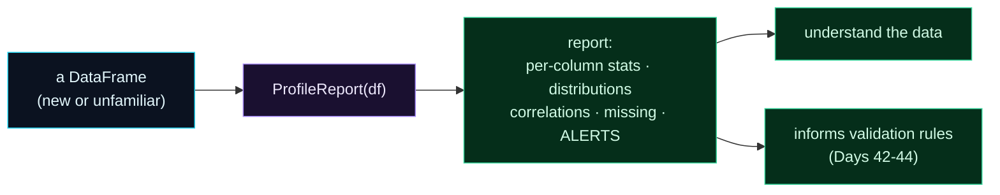

Welcome to **Day 45 of 100 Days of MLOps**. Validation (Days 42–44) enforces rules you *already know* — "`size_sqft` is between 400 and 6000." But where do those rules come from, and how do you get to know a *new* dataset in the first place? You could poke at it column by column with `df.describe()`... or you could point an automated **profiler** at it and get a complete, browsable report of every column's statistics, distributions, correlations, missing values, and suspicious quirks — in seconds. Today you'll use **ydata-profiling** to do exactly that.

Profiling is how you *understand* data before you model it, and it's the natural partner to validation: the profiler *finds* the problems and patterns, and you turn those findings into validation rules. It's also documentation — a shareable report of what your data looks like at a point in time.

> **Automated EDA in one line.** Point it at a DataFrame; get a full data report — and a list of things worth worrying about.

By the end of today you will:

- Generate a full **profile report** from a DataFrame.
- Read the **automatic alerts** a profiler surfaces (correlations, missing, zeros…).
- Use profiling to **decide what validation rules to write**.
- Understand profiling as both **exploration** and **documentation**.

---

## Profile first, then model

The idea: instead of manually inspecting a dataset, you let a tool compute *everything* about it and present it as a report. For each column you get counts, means, ranges, distinct values, missing counts, and a distribution chart; across columns you get correlations; and — most usefully — the profiler raises **alerts** about things that often signal problems.



**Reading this diagram:**

On the left, in **cyan**, is a **DataFrame** — often one you've never seen before. It goes into the **purple** step, `ProfileReport(df)`, which computes a full statistical summary automatically. Out comes the **green report**: per-column stats, distribution charts, correlations, missing-value counts, and **alerts** — the profiler's flags for anything unusual.

That report feeds two green outcomes. First, you **understand the data** — its ranges, shapes, and oddities, at a glance. Second, and this is the MLOps link, it **informs your validation rules**: the alerts tell you what to guard against (a column with 5% missing values → add a nullability rule; a range you now know → add an `in_range` check). The takeaway: **profiling is how you learn the data, and the learnings become your validation** — exploration and data-quality are two ends of the same tool.

---

## Generate a report

Install it (`pip install ydata-profiling`), then create `profile.py`. One object, one line to write the report — and you can also read its findings in code:

```python
"""profile.py — Day 45: auto-generate a data profile report."""
import pandas as pd
from ydata_profiling import ProfileReport

df = pd.read_csv("houses.csv")
profile = ProfileReport(df, title="House Prices - Data Profile")
profile.to_file("report.html")          # browsable HTML report

# the report is also queryable in code - pull out its automatic ALERTS
desc = profile.get_description()
print(f"Rows: {desc.table['n']}, Columns: {desc.table['n_var']}, "
      f"Missing cells: {desc.table['n_cells_missing']}")
print("Automatic alerts ydata-profiling found:")
for alert in desc.alerts:
    print(f"  - {alert}")
```

Run it on a house dataset (this one has a derived `price_k` column and some missing `bedrooms`, on purpose):

```bash
python profile.py
```

```text
Rows: 500, Columns: 6, Missing cells: 25
Automatic alerts ydata-profiling found:
  - [price] is highly overall correlated with [price_k] and 1 other fields
  - [price_k] is highly overall correlated with [price] and 1 other fields
  - [size_sqft] is highly overall correlated with [price] and 1 other fields
  - [bedrooms] 25 (5.0%) missing values
  - [age_years] has 9 (1.8%) zeros
```

In seconds, the profiler *told you what to look at*. And it wrote a rich **`report.html`** (a couple of megabytes) you can open in a browser to see every column's histogram, statistics, and the correlation matrix laid out visually. Open it and you get a professional data report you didn't have to build.

---

## Read the alerts — they're your to-do list

Every one of those alerts is a signal, and together they're a checklist for what to do next:

- **`price` highly correlated with `price_k`** — these two columns carry the *same* information (`price_k` is just `price/1000`). That's a **leakage risk** (Day 12): if `price_k` sneaked into your features, the model would "cheat." The profiler caught a redundant column you should drop.
- **`size_sqft` highly correlated with `price`** — expected and *good*: your main feature genuinely drives the target. Profiling confirms your signal is real.
- **`bedrooms` 5.0% missing values** — now you *know* to handle these (impute or drop, Day 11) — and to add a validation rule about how much missingness is acceptable.
- **`age_years` has zeros** — brand-new houses, or a data error? Worth a look, and maybe a rule.

See how directly this feeds validation? The 5%-missing alert tells you to write a nullability check; the ranges you see in the report tell you the `in_range` bounds for Days 42–44. **Profile to discover the rules, then validate to enforce them** — the two practices lock together.

Profiling is also **documentation**: keep `report.html` alongside a dataset version (Day 28) and you have a dated snapshot of exactly what the data looked like. And when you profile *two* versions of a dataset and compare, differences in the distributions are an early signal of **data drift** — which is where Module 10 goes.

---

## Common errors (and how to fix them)

**1. `ModuleNotFoundError: No module named 'pkg_resources'` on import**

ydata-profiling relies on `pkg_resources`, which recent setuptools (81+) removed. Pin it: `pip install "setuptools<81"`. (The library is also being renamed — you may see a notice pointing to `fg-data-profiling`; either works, but match your imports to what you installed.)

**2. Profiling a big dataset is slow / hangs**

The full report computes correlations and distributions for every column — expensive on large data. Use `ProfileReport(df, minimal=True)` for a fast, lighter report, or profile a **sample** (`df.sample(10000)`) for a representative picture.

**3. Everything is flagged "highly correlated"**

Some correlation is expected (features *should* relate to the target). Focus on *redundant* pairs like `price`/`price_k` — near-perfect correlation between two inputs usually means one is derived from the other (drop it), and correlation with the *target* can be leakage if that column shouldn't be a feature.

**4. High-cardinality / "unique" warnings on ID columns**

An ID or timestamp column will trip cardinality alerts — that's fine, it's just telling you the column isn't a useful feature. Exclude IDs from the model (and often from the profile).

**5. The HTML report is huge**

Rich reports embed charts and can be megabytes. That's normal for a full profile; use `minimal=True` for a smaller file, and don't commit big reports to Git — treat them like other artifacts.

**6. Treating the profile as validation**

Profiling *describes* data; it doesn't *enforce* anything. It's the discovery step — turn its findings into actual Pandera/GX rules (Days 42–44) and a pipeline gate (Day 44) to get enforcement.

---

## Recap — what you now have

You can understand a dataset in seconds and document it:

- You generate a full **profile report** (`ProfileReport(df).to_file(...)`) — stats, distributions, correlations.
- You read the **automatic alerts** (correlations, missing values, zeros) in code.
- You use profiling to **decide validation rules** — discovery feeds enforcement.
- You treat the report as **documentation** (and a seed for drift detection later).

**Your cheat sheet:**

| Task | Code |
|------|------|
| Full report | `ProfileReport(df).to_file("report.html")` |
| Fast report | `ProfileReport(df, minimal=True)` |
| Read findings | `profile.get_description().alerts` |
| Sample big data | `ProfileReport(df.sample(10000))` |
| Import fix | `pip install "setuptools<81"` |

Golden rule: **profile to understand, then validate to enforce** — let the profiler find the ranges, correlations, and gaps, and turn each finding into a rule.

---

## Coming up on Day 46

You've learned to clean, validate, and understand data. Now let's make the *transformations* you apply to it reusable and consistent. **Day 46 — "Reusable Feature Pipelines"** takes the feature engineering from Day 15 further: building a feature pipeline you **fit once and save**, separate from the model, so the exact same transformations apply in training *and* serving. It's the foundation for consistent features everywhere — and the on-ramp to feature stores in the days that follow.

See the full roadmap on the [100 Days of MLOps series page](/series/100-days-mlops). See you tomorrow.
