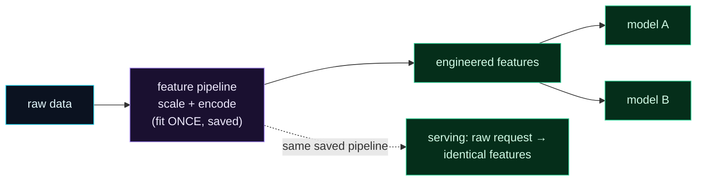

Welcome to **Day 46 of 100 Days of MLOps**. On Day 15 you built a scikit-learn Pipeline that bundled preprocessing *and* the model into one object — perfect for a single model. But sometimes you want the **feature transformations by themselves**, separate from any model: a *feature pipeline* you fit once, save as its own artifact, and reuse everywhere. Today you'll build exactly that, and see why it matters — the same fitted transformations applying identically in training and serving is what keeps your features **consistent**, and it's the idea that leads straight to feature stores.

Separating features from the model unlocks three things: consistency (no training/serving mismatch), reuse (many models share the same features), and a versionable feature artifact you can manage on its own. It's a small change in structure with a big payoff in reliability.

> **Fit the transforms once, reuse them forever.** A feature pipeline remembers its training statistics — that memory is what makes features match everywhere.

By the end of today you will:

- Build a **feature pipeline** separate from the model.
- **Fit it once** and **save** it as a reusable artifact.
- **Load and apply** it to new data with the identical transformation.
- Understand why re-fitting at serving would break things.

---

## Features apart from the model

A **feature pipeline** is just the transformation half of Day 15's Pipeline — scaling, encoding — with no estimator attached. You fit it on your training data (so it learns the scaling means, the category lists), save the *fitted* object, and then that one artifact produces features for training, for serving, and for any number of models.



**Reading this diagram:**

On the left, in **cyan**, is **raw data**. It flows into the **purple feature pipeline** — the transformations, fit *once* and saved. Out come the **green engineered features**, which then feed *multiple* models (A and B) — that's the **reuse** benefit: build the features once, share them across every model that needs them, no duplicated preprocessing code.

Now the dotted arrow at the bottom: the **same saved pipeline** runs at **serving** time, turning a raw request into the *identical* features it produced during training. That's the **consistency** benefit, and it's the whole reason to separate features from the model — because the pipeline carries its training statistics, a house scaled during training and the same house scaled at serving come out *exactly* the same. The takeaway: **a saved feature pipeline is a single source of truth for features** — reused across models and identical in training and serving.

---

## Build and save the pipeline

Create `build_features.py`. It's a `ColumnTransformer` (Day 15) — but this time we fit it and save it *on its own*, with no model:

```python
"""build_features.py — Day 46: a feature pipeline, fit ONCE and SAVED (separate from the model)."""
import joblib, pandas as pd
from sklearn.compose import ColumnTransformer
from sklearn.preprocessing import OneHotEncoder, StandardScaler

NUMERIC = ["size_sqft", "bedrooms", "age_years"]
CATEGORICAL = ["neighborhood"]

df = pd.read_csv("houses.csv")

# The FEATURE pipeline — transformations only, NO model.
feature_pipeline = ColumnTransformer([
    ("num", StandardScaler(), NUMERIC),
    ("cat", OneHotEncoder(handle_unknown="ignore"), CATEGORICAL),
])

# Fit on training data, then SAVE the fitted pipeline as a reusable artifact.
X = df[NUMERIC + CATEGORICAL]
feature_pipeline.fit(X)
joblib.dump(feature_pipeline, "feature_pipeline.joblib")

features = feature_pipeline.transform(X)
print("fitted + saved feature_pipeline.joblib")
print(f"raw columns: {len(X.columns)}  ->  engineered features: {features.shape[1]}")
print(f"feature names: {list(feature_pipeline.get_feature_names_out())}")
```

```bash
python build_features.py
```

```text
fitted + saved feature_pipeline.joblib
raw columns: 4  ->  engineered features: 6
feature names: ['num__size_sqft', 'num__bedrooms', 'num__age_years', 'cat__neighborhood_downtown', 'cat__neighborhood_rural', 'cat__neighborhood_suburb']
```

Four raw columns became six features (three scaled numbers plus three one-hot neighborhood columns), and — critically — the *fitted* pipeline is saved to `feature_pipeline.joblib`. That file has *memorised* the training data's statistics: the mean and standard deviation used to scale, and the exact list of neighborhoods to one-hot encode.

---

## Reuse it — identical features, no re-fitting

Now a completely separate program loads that saved pipeline and applies it to a brand-new house. Notice there is **no `fit`** here — only `transform`:

```python
"""apply_features.py — load the SAVED feature pipeline and transform new data identically."""
import joblib, pandas as pd

# No fitting here — just load the pipeline fitted at training time.
feature_pipeline = joblib.load("feature_pipeline.joblib")

new_house = pd.DataFrame([{
    "size_sqft": 2000, "bedrooms": 4, "age_years": 5, "neighborhood": "downtown",
}])
features = feature_pipeline.transform(new_house)

names = feature_pipeline.get_feature_names_out()
print("raw house:", new_house.iloc[0].to_dict())
print("\ntransformed features (same recipe as training):")
for name, val in zip(names, features[0]):
    print(f"  {name:<28} {val:.3f}")
```

```bash
python apply_features.py
```

```text
raw house: {'size_sqft': 2000, 'bedrooms': 4, 'age_years': 5, 'neighborhood': 'downtown'}

transformed features (same recipe as training):
  num__size_sqft               -0.057
  num__bedrooms                0.673
  num__age_years               -1.517
  cat__neighborhood_downtown   1.000
  cat__neighborhood_rural      0.000
  cat__neighborhood_suburb     0.000
```

The new house was scaled using the **training** mean and standard deviation (that's why `size_sqft=2000` becomes `-0.057`, not some fresh value), and `neighborhood="downtown"` became the correct one-hot column — using the categories learned at training. **Same recipe, applied identically.** That's the guarantee: whatever transformation a house got during training, it gets exactly the same transformation at serving, because they run through the *same saved, fitted pipeline*.

---

## Why you save the fitted pipeline (not re-fit)

Here's the subtle, crucial point. The scaling depends on statistics — the *mean* and *std* of the training data. If you re-`fit` the pipeline on serving data (or on each new batch), it computes *new* statistics, so the same house gets scaled *differently* than it was in training. The model, trained on one scaling, now sees another. That mismatch is **training/serving skew** (Day 49's whole topic), and it silently degrades predictions.

The fix is exactly what we did: **fit once on training data, save the fitted pipeline, and only ever `transform` after that.** Never re-fit at serving. (This also means a fresh, unfitted pipeline can't transform at all — it has no statistics yet, and scikit-learn stops you with a clear error, as you'll see below.)

**Combined vs. separate.** Day 15's bundled Pipeline (preprocessing + model in one) is perfect when one model owns its features. A *separate* feature pipeline is better when features are **shared** across models, need to be **versioned** on their own, or must be **served independently** — and it's the mental model behind **feature stores**, which we start tomorrow.

---

## Common errors (and how to fix them)

**1. `NotFittedError: This ColumnTransformer instance is not fitted yet`**

You called `transform` on a pipeline that was never fitted (or a fresh one, not the loaded one):

```text
sklearn.exceptions.NotFittedError: This ColumnTransformer instance is not fitted
yet. Call 'fit' with appropriate arguments before using this estimator.
```

Fit it on training data and save it; then **load the fitted pipeline** and only `transform`. Don't create a new pipeline at serving.

**2. You re-fit the pipeline at serving time**

This recomputes scaling statistics from serving data, causing training/serving skew. Fit **once** on training data, save, and only `transform` afterward — never `fit` again on new data.

**3. Features come out in the wrong order / wrong shape**

You passed raw columns in a different order or with different names than at training. Always transform a DataFrame with the **same column names** the pipeline was fit on; the `ColumnTransformer` selects columns by name, so order in a named DataFrame is safe, but missing/renamed columns break it.

**4. A new category crashes or is dropped unexpectedly**

At serving you may see a neighborhood not present in training. `OneHotEncoder(handle_unknown="ignore")` (Day 15) handles it as all-zeros instead of erroring — make sure it's set, and remember an all-zeros encoding means "unknown."

**5. The saved pipeline breaks after a library upgrade**

A pickled transformer depends on the scikit-learn version that made it (Day 7's version trap). Pin `scikit-learn` in `requirements.txt` so the pipeline loads and behaves identically.

**6. You mapped feature values to the wrong names**

After transform you get a plain array; use `get_feature_names_out()` to line values up with names (as in `apply_features.py`) rather than assuming an order.

---

## Recap — what you now have

You can build features once and reuse them everywhere:

- You built a **feature pipeline** separate from the model.
- You **fit it once** and **saved** the fitted artifact (`feature_pipeline.joblib`).
- You **loaded and applied** it to new data — identical transformation, no re-fitting.
- You understand that re-fitting at serving causes **skew**, so you always save-and-reuse.

**Your cheat sheet:**

| Task | Code |
|------|------|
| Build features only | `ColumnTransformer([...])` (no model) |
| Fit + save | `fp.fit(X); joblib.dump(fp, "feature_pipeline.joblib")` |
| Reuse | `fp = joblib.load(...); fp.transform(new)` — **no fit** |
| Feature names | `fp.get_feature_names_out()` |
| Unknown categories | `OneHotEncoder(handle_unknown="ignore")` |

Golden rule: **fit the feature pipeline once, save it, and only transform** — the saved statistics are what make features identical in training and serving.

---

## Coming up on Day 47

A saved feature pipeline works great for one project — but organisations want a *central* place to define, store, and share features across many models and teams, without everyone re-implementing the same transformations. **Day 47 — "Intro to Feature Stores (Feast)"** introduces the feature store: you'll install Feast, define **feature views** over your data, and materialise features — the shared, consistent feature layer that solves "everyone computes features slightly differently" at scale. It's where reusable features grow up into infrastructure.

See the full roadmap on the [100 Days of MLOps series page](/series/100-days-mlops). See you tomorrow.
