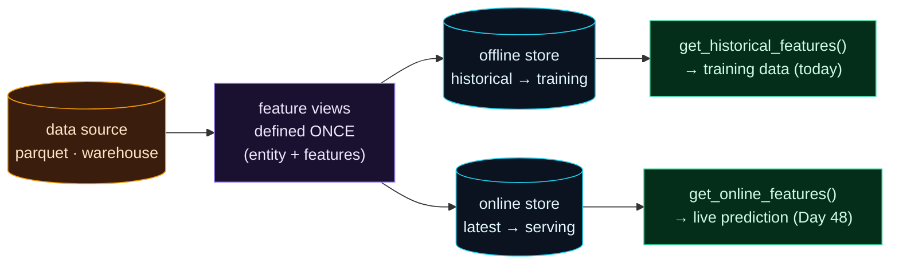

Welcome to **Day 47 of 100 Days of MLOps**. Yesterday's saved feature pipeline is great for one project. But zoom out to an organisation with dozens of models and several teams, and a new problem appears: *everyone re-implements the same features slightly differently*, features drift out of sync between training and serving, and there's no single place to find "the customer's 30-day spend" feature that three teams all need. The solution is a **feature store**, and today you'll meet the most popular open-source one: **Feast**.

A feature store is a central system for *defining, storing, and serving features consistently* — the same feature, computed once, available to every model for both training and live prediction. It's heavier machinery than a saved pipeline, aimed at scale. Today we set up Feast, define features once, and pull training data from it.

> **Features as shared infrastructure.** Define a feature once; every model and team uses the exact same one, in training and in serving.

By the end of today you will:

- Understand a feature store's core parts: **entities, feature views, offline & online stores**.
- Set up a **Feast** feature repository and register definitions with `feast apply`.
- Pull **point-in-time-correct** training data from the offline store.
- Know where the online store fits (tomorrow).

---

## The shape of a feature store

Feast has a few core concepts. An **entity** is the thing features describe (a house, identified by `house_id`). A **feature view** is a named group of features drawn from a **source** (here, a parquet file). And there are two stores: the **offline store** holds *historical* values for building training data, and the **online store** holds the *latest* values for fast serving.



**Reading this diagram:**

Start on the left with the **amber data source** — where your raw feature data lives (a parquet file locally; a data warehouse in production). It feeds the **purple feature views**: the definitions, written *once*, that say "these are the features, and this is the entity they belong to." That single definition is the whole value proposition — features are declared in one place, not re-coded per project.

From the feature views, the data flows into **two cyan stores**. The **offline store** keeps *historical* values, used to build training datasets — that's the **green `get_historical_features()`** path we use today. The **online store** keeps the *latest* values for fast lookups at prediction time — the **green `get_online_features()`** path we'll use tomorrow. The takeaway: **define features once, serve them two ways** — historical for training, latest for serving — from a single shared source of truth. That's what keeps every model and team on the same features.

---

## Set up a feature repository

Install Feast (`pip install feast`) and create a small feature repo. First, some data as parquet, with an **entity id** and an **event timestamp** (Feast needs both — the id to join on, the timestamp for point-in-time correctness):

```python
import numpy as np, pandas as pd
rng = np.random.default_rng(42); n = 200
df = pd.DataFrame({
    "house_id": range(n),
    "size_sqft": rng.integers(600, 3500, n),
    "bedrooms": rng.integers(1, 6, n),
    "age_years": rng.integers(0, 80, n),
    "location_score": rng.integers(1, 11, n),
})
df["event_timestamp"] = pd.Timestamp("2026-01-01")
df.to_parquet("data/houses.parquet")
```

Then the store config, **`feature_store.yaml`** — a local setup (file offline store, SQLite online store):

```yaml
project: houses
registry: data/registry.db
provider: local
online_store:
    type: sqlite
    path: data/online_store.db
entity_key_serialization_version: 3
```

And the feature definitions, **`definitions.py`** — the entity, the source, and the feature view:

```python
from datetime import timedelta
from pathlib import Path
from feast import Entity, FeatureView, Field, FileSource
from feast.types import Int64

house = Entity(name="house", join_keys=["house_id"])

source = FileSource(
    path=str(Path(__file__).parent / "data" / "houses.parquet"),
    timestamp_field="event_timestamp",
)

house_features = FeatureView(
    name="house_features",
    entities=[house],
    ttl=timedelta(days=3650),
    schema=[
        Field(name="size_sqft", dtype=Int64),
        Field(name="bedrooms", dtype=Int64),
        Field(name="age_years", dtype=Int64),
        Field(name="location_score", dtype=Int64),
    ],
    source=source,
)
```

Now register it all with one command (run it in the repo folder):

```bash
feast apply
```

```text
Applying changes for project houses
Created project houses
Created entity house
Created feature view house_features
Created sqlite table houses_house_features
```

`feast apply` reads your definitions and registers them in Feast's registry — the entity, the feature view, and the backing tables. Your features are now *defined in the store*, ready to be fetched.

---

## Pull training data from the offline store

Here's the payoff for training. You provide an **entity DataFrame** — which houses you want features for, and *as of when* — and Feast returns the matching feature values, joined correctly. Create `get_training_data.py`:

```python
"""get_training_data.py — fetch offline (historical) features from the store for training."""
import pandas as pd
from feast import FeatureStore

store = FeatureStore(repo_path=".")

# Which houses (entities) + when we want features for — the training "spine".
entity_df = pd.DataFrame({
    "house_id": [0, 1, 2, 3, 4],
    "event_timestamp": pd.Timestamp("2026-02-01"),
})

training_df = store.get_historical_features(
    entity_df=entity_df,
    features=[
        "house_features:size_sqft",
        "house_features:bedrooms",
        "house_features:location_score",
    ],
).to_df()

print("Training features pulled from the feature store:")
print(training_df.to_string(index=False))
```

```bash
python get_training_data.py
```

```text
Training features pulled from the feature store:
 house_id           event_timestamp  size_sqft  bedrooms  location_score
        0 2026-02-01 00:00:00+00:00        858         2               7
        1 2026-02-01 00:00:00+00:00       2844         5               8
        2 2026-02-01 00:00:00+00:00       2498         3               8
        3 2026-02-01 00:00:00+00:00       1872         4               2
        4 2026-02-01 00:00:00+00:00       1855         3               9
```

You asked for three specific features on five houses, and Feast assembled a clean training table. You didn't write a join or a transformation — you *requested features by name* from the store.

The subtle magic is **point-in-time correctness**. You asked for features "as of `2026-02-01`," and Feast returns the values that were valid *at that time* — never accidentally using data from the future. On a real system where features change over time, this prevents a sneaky form of leakage (Day 12): training on a feature value the model couldn't have known yet. The feature store handles that time-travel for you, which is one of the biggest reasons to use one.

> **This is infrastructure, not a one-liner.** A feature store is more setup than yesterday's saved pipeline, and it earns its keep at *scale* — many models, many teams, features that must stay consistent. For a single small project, a saved pipeline is plenty; reach for a feature store when features become a shared asset. (Locally we use files and SQLite; in production the offline store is a warehouse like BigQuery/Snowflake and the online store is Redis or similar.)

---

## Common errors (and how to fix them)

**1. `KeyError: 'Feature garage_count not found in projection house_features'`**

You requested a feature that isn't in the feature view:

```text
KeyError: 'Feature garage_count not found in projection house_features'
```

Request only features you defined (`house_features:size_sqft`, etc.). To add a new one, add it to the `schema` in `definitions.py` and re-run `feast apply`.

**2. `feast apply` errors about the timestamp or entity**

Your source data must have the `timestamp_field` (`event_timestamp`) and the entity join key (`house_id`) as real columns. Make sure the parquet has both, with the names your definitions reference.

**3. `get_historical_features` returns empty or NaN features**

The entity IDs or timestamps in your `entity_df` don't match the source data, or you asked for a time *before* any feature values exist. Check the ids exist and the request timestamp is at/after the data's `event_timestamp`.

**4. `FeatureStore` can't find the repo**

`FeatureStore(repo_path=".")` must point at the folder containing `feature_store.yaml`. Run from the repo directory, or pass the correct path.

**5. You changed definitions but the store didn't update**

Feast works off its *registry*. After editing `definitions.py`, re-run **`feast apply`** to register the changes — otherwise the store still has the old definitions.

**6. Using a feature store for a tiny project**

It's overkill for one model on one machine — that's yesterday's saved pipeline's job. Adopt a feature store when features are **shared** across models/teams and consistency at scale becomes the problem.

---

## Recap — what you now have

You can define and serve features as shared infrastructure:

- You understand **entities, feature views, and offline/online stores**.
- You set up a **Feast repo** and registered features with `feast apply`.
- You pulled **point-in-time-correct** training data via `get_historical_features`.
- You know a feature store is **scale infrastructure**, not a replacement for a small saved pipeline.

**Your cheat sheet:**

| Piece | Role |
|-------|------|
| Entity | the thing features describe (`house`, key `house_id`) |
| Feature view | a named group of features from a source |
| `feast apply` | register definitions in the store |
| Offline store | historical values → training |
| `get_historical_features(entity_df, features)` | point-in-time-correct training data |

Golden rule: **define features once in the store, request them by name** — the offline store gives point-in-time-correct training data with no re-implemented joins.

---

## Coming up on Day 48

Training pulls *historical* features in bulk. But serving a live prediction needs the **latest** feature values for one entity, *fast* — a different job entirely. **Day 48 — "Online vs Offline Features"** covers the other half of the feature store: you'll `materialize` features into the **online store** and fetch them with `get_online_features` for a single house in milliseconds — and understand why offline (batch, historical) and online (single, latest) are two distinct paths that must nonetheless return *consistent* features.

See the full roadmap on the [100 Days of MLOps series page](/series/100-days-mlops). See you tomorrow.
