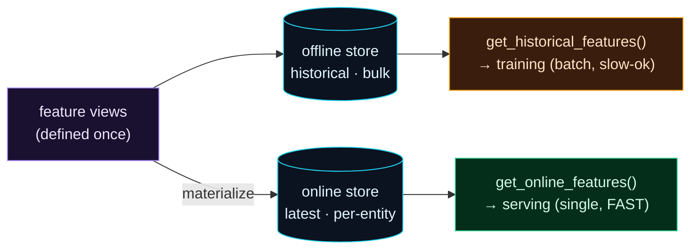

Welcome to **Day 48 of 100 Days of MLOps**. Yesterday you pulled *historical* features in bulk to build a training set. But serving a live prediction is a completely different job: you need the **latest** feature values for **one** entity, returned in **milliseconds**. Feeding a whole warehouse query into a real-time API would be far too slow. That's why a feature store has *two* stores — **offline** for training, **online** for serving — and today you'll use the online half.

Understanding this offline/online split is the key insight of feature stores. The two paths look different (bulk vs single, historical vs latest, slow-ok vs fast) but they must return **consistent** feature values, because a model trained on one and served from the other has to see the same numbers. Get that right and you've prevented training/serving skew (tomorrow's topic) at the infrastructure level.

> **Two paths, one source of truth.** Offline features train the model; online features serve it — both from the same definitions.

By the end of today you will:

- Understand the **offline vs online** split and when each is used.
- **Materialize** features into the online store.
- Fetch a single entity's **latest** features with `get_online_features`.
- Know why online features are empty until you materialize.

---

## Two stores, two access patterns

The same feature views (Day 47) feed two stores with very different jobs. The **offline store** holds all the *history*, queried in *bulk* to assemble training data — latency doesn't matter, completeness does. The **online store** holds only the *latest* value per entity, looked up *one at a time*, *fast* — because it's on the critical path of a live prediction. **Materialize** is the step that copies the latest values from offline into online.



**Reading this diagram:**

At the left, in **purple**, are the **feature views** — defined once (Day 47). They feed two **cyan stores**. The **offline store** holds historical data and flows to the **amber training path**, `get_historical_features()` — bulk, point-in-time, latency-tolerant (yesterday's lesson). Separately, the **`materialize`** arrow copies the *latest* values into the **online store**, which flows to the **green serving path**, `get_online_features()` — a single, fast lookup per entity (today's lesson).

The crucial thing is that *both* paths originate from the **same feature views**. Offline and online aren't different features — they're the same features, accessed two ways for two purposes: training in bulk, serving in real time. That shared origin is what guarantees the model sees consistent values whether it's being trained or being called live. The takeaway: **one definition, two stores** — historical for training, latest-and-fast for serving.

---

## Materialize into the online store

Starting from yesterday's applied feature repo, **materialize** — this reads the latest feature values from the offline source and loads them into the online store:

```python
from datetime import datetime, timezone
from feast import FeatureStore

store = FeatureStore(repo_path=".")
store.materialize_incremental(end_date=datetime(2026, 3, 1, tzinfo=timezone.utc))
```

```text
house_features from 2016-07-13 ... to 2026-03-01 ...:
```

`materialize_incremental` brings the online store up to the given date — the latest value for every house is now sitting in the fast online store (SQLite locally; Redis or DynamoDB in production). In a real system you'd run this on a **schedule** (say hourly) so the online store always reflects fresh data.

---

## Fetch the latest features for one entity

Now the serving path. You give `get_online_features` a small list of features and the entity you're predicting for, and it returns the latest values — fast enough for a live API:

```python
from feast import FeatureStore
store = FeatureStore(repo_path=".")

result = store.get_online_features(
    features=["house_features:size_sqft", "house_features:bedrooms", "house_features:location_score"],
    entity_rows=[{"house_id": 5}],
).to_dict()

for k, v in result.items():
    print(f"  {k}: {v[0]}")
```

```text
online features for house_id=5 (serving path):
  house_id: 5
  size_sqft: 3089
  bedrooms: 2
  location_score: 6
```

That's the serving lookup: "give me house 5's current features," answered instantly from the online store. In a real prediction service, you'd take those features and pass them straight to your model — the same features it was trained on (from the offline store), so training and serving agree. No re-computing, no risk of the API computing a feature differently than the training job did.

Compare the two calls you now know: `get_historical_features` (yesterday) took an *entity DataFrame* of many rows and returned a training *table*; `get_online_features` (today) takes *entity rows* for a few entities and returns their *latest* values. Same features, two shapes, two speeds.

> **You must materialize before serving.** The online store starts empty. If you call `get_online_features` *before* materializing, you get `None` back — `{'house_id': 5, 'size_sqft': None}` — because there's nothing there yet. Materialize populates it; a stale online store returns stale features, which is why production materializes on a schedule.

---

## Common errors (and how to fix them)

**1. Online features come back `None`**

The online store isn't populated. Run `store.materialize_incremental(end_date=...)` (or `feast materialize`) first — before materializing, every online feature is `None`.

**2. `sqlite3.OperationalError: no such table: ..._house_features`**

The online store's tables are missing — usually because the online DB was deleted or moved without re-registering. Re-run **`feast apply`** to recreate the online tables, then materialize again.

**3. Online features are stale (old values)**

Materialize is a *snapshot* — it doesn't auto-update. If the source data changed, run materialize again. In production, schedule it (e.g. hourly) so the online store stays fresh.

**4. `get_online_features` returns `None` for some entities**

Those `house_id`s aren't in the materialized data (new entities, or never materialized). Materialize the range that includes them, and confirm the ids exist in the source.

**5. Serving is slow**

You're likely querying the *offline* store (or a slow backend) on the request path. Serving must hit the **online** store (`get_online_features`); for real low latency, use a fast online store like Redis in production, not a file-based one.

**6. Training and serving features disagree**

If offline and online return different values, materialization is stale or you're computing features outside the store on one path. Keep *all* feature logic in the store's definitions and materialize regularly — that's exactly what prevents skew (Day 49).

---

## Recap — what you now have

You can serve features fast, consistently with training:

- You understand the **offline (bulk, training)** vs **online (single, fast, serving)** split.
- You **materialized** features into the online store.
- You fetched an entity's **latest features** with `get_online_features`.
- You know online features are **`None` until materialized**, and must be kept fresh.

**Your cheat sheet:**

| Path | Call | For |
|------|------|-----|
| Offline | `get_historical_features(entity_df, features)` | training (bulk, historical) |
| Materialize | `store.materialize_incremental(end_date=...)` | offline → online |
| Online | `get_online_features(features, entity_rows=[...])` | serving (single, latest, fast) |
| Refresh | re-run materialize (scheduled in prod) | keep online fresh |

Golden rule: **train from the offline store, serve from the online store** — materialize to bridge them, and both return the same features because they share one definition.

---

## Coming up on Day 49

You've now seen every place features can diverge between training and serving — different code, different scaling, a stale online store. **Day 49 — "Preventing Training/Serving Skew"** confronts that head-on: the single most common cause of "great in testing, broken in production," where the features a model is served differ subtly from the ones it trained on. You'll reproduce the skew, then *prove* it's gone by showing training and serving features match exactly — the reliability guarantee everything in this module has been building toward.

See the full roadmap on the [100 Days of MLOps series page](/series/100-days-mlops). See you tomorrow.
