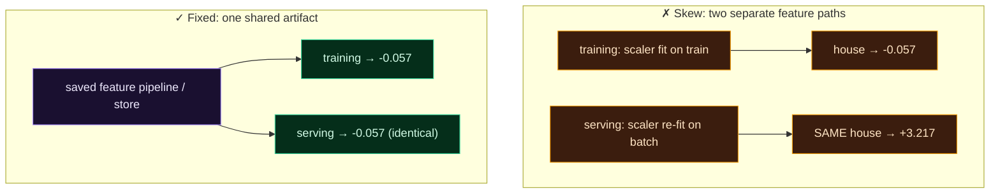

Welcome to **Day 49 of 100 Days of MLOps**. This is the failure the whole module has been circling: **training/serving skew** — when the features a model is *served* in production differ from the features it *trained* on. It's the single most common reason a model looks brilliant in testing and then fails in the real world, and it's insidious because nothing crashes. The model just quietly makes worse predictions, because it's being fed features that don't match what it learned from.

Today you'll *reproduce* the skew with your own eyes — watch the same house get two completely different feature values — and then *prove* it's gone using the tools from this module. By the end you'll understand why a shared feature artifact isn't a nicety but a reliability requirement.

> **The gap between "works in testing" and "works in production" is often just skew.** Close it by computing features once and using them everywhere.

By the end of today you will:

- Understand what **training/serving skew** is and why it's silent.
- **Reproduce** skew — the same input yielding different features.
- **Prove** it's gone with a single shared feature artifact.
- Know how to **test** for skew so it can't return.

---

## How skew creeps in

A model learns from features in a specific form — `size_sqft` scaled by the training data's mean and standard deviation, say. At serving time, *something* has to produce that same feature for a live request. Skew happens whenever that "something" differs from what training did:

- **Different code paths** — the training script and the serving API each compute the feature, slightly differently.
- **Re-fitting at serving** — a scaler or encoder is `fit` again on serving data, recomputing its statistics (Day 46's warning).
- **A stale online store** — serving reads outdated feature values (Day 48).



**Reading this diagram:**

The top box, in **amber**, is the **skew** scenario: two *separate* feature paths. Training fits its scaler on the training data and turns a house into `-0.057`; serving fits a *different* scaler (on a serving batch) and turns the **same** house into `+3.217`. Two paths, two answers for one house — and the model, trained to expect `-0.057`, is handed `+3.217`. That mismatch is skew, and every node here is amber because it's all broken.

The bottom box, in **green**, is the fix: a single **shared feature artifact** (the saved pipeline from Day 46, or the feature store from Days 47–48). Both training and serving go through *that same artifact*, so both produce `-0.057` — identical. The takeaway is the contrast between the two boxes: **skew comes from two feature paths; the cure is one.** Compute features through a single shared component and training and serving cannot disagree.

---

## Reproduce the skew

Let's make it concrete. We train with a scaler fit on the full range of houses, but serving *re-fits* a scaler on a batch that happens to be all smaller houses — a realistic mistake. Create `skew_demo.py`:

```python
"""skew_demo.py — Day 49: reproduce training/serving skew, then eliminate it."""
import joblib, numpy as np, pandas as pd
from sklearn.preprocessing import StandardScaler

train = pd.read_csv("train.csv")           # 600-3500 sqft
serve_batch = pd.read_csv("serve_batch.csv")  # 700-1600 sqft (smaller)
house = pd.DataFrame({"size_sqft": [2000]})    # the SAME house scored both ways

print("=== SKEW: training and serving compute features separately ===")
train_scaler = StandardScaler().fit(train[["size_sqft"]])           # fit on training data
serve_scaler = StandardScaler().fit(serve_batch[["size_sqft"]])     # BUG: re-fit at serving
tf = train_scaler.transform(house)[0, 0]
sf = serve_scaler.transform(house)[0, 0]
print(f"  house scaled at TRAINING: {tf:+.3f}")
print(f"  house scaled at SERVING:  {sf:+.3f}")
print(f"  identical? {np.isclose(tf, sf)}   <- the model sees a DIFFERENT feature at serving")

print("\n=== FIXED: one shared, saved feature artifact for both ===")
shared = StandardScaler().fit(train[["size_sqft"]])
joblib.dump(shared, "scaler.joblib")
tf2 = joblib.load("scaler.joblib").transform(house)[0, 0]   # training path
sf2 = joblib.load("scaler.joblib").transform(house)[0, 0]   # serving path (same artifact)
print(f"  house at TRAINING: {tf2:+.3f}")
print(f"  house at SERVING:  {sf2:+.3f}")
print(f"  identical? {np.isclose(tf2, sf2)}   <- no skew: same artifact, same feature")
```

```bash
python skew_demo.py
```

```text
=== SKEW: training and serving compute features separately ===
  house scaled at TRAINING: -0.057
  house scaled at SERVING:  +3.217
  identical? False   <- the model sees a DIFFERENT feature at serving

=== FIXED: one shared, saved feature artifact for both ===
  house at TRAINING: -0.057
  house at SERVING:  -0.057
  identical? True   <- no skew: same artifact, same feature
```

There's the disaster, and the cure, side by side. In the **skew** case, the *same house* — 2000 sqft — becomes `-0.057` at training but `+3.217` at serving. Why? The serving scaler was re-fit on a batch of small houses, so it thinks 2000 sqft is a huge outlier. The model, trained to expect roughly `-0.06` for that house, is handed `+3.2` and predicts nonsense — with **no error**, exactly the silent failure of Day 41. In the **fixed** case, both paths load the *same saved scaler*, so both produce `-0.057`. Identical. Skew eliminated.

---

## The principle, and how this module prevents it

The rule is simple and absolute:

> **Features must be computed once, by a shared component, and used identically in training and serving.** Never reimplement feature logic in two places, and never re-`fit` a transformer at serving time.

Everything you built this module exists to enforce this:

- The **saved feature pipeline** (Day 46) — fit once, saved, loaded identically for both paths. That's the fix in `skew_demo.py`.
- The **feature store** (Days 47–48) — features defined once, served from offline for training and online for serving, from the *same definitions*. Consistency by construction.

And you can *guard* against skew with a **skew test**: on the same input, assert that the training-path features equal the serving-path features (`np.allclose(train_features, serve_features)`). Run it in CI (Module 8), and a change that reintroduces skew fails the build before it ships. Skew is preventable — but only if you treat "features come from one place" as a hard rule, not a hope.

---

## Common errors (and how to fix them)

**1. Re-fitting a scaler/encoder at serving**

The classic, and what the demo shows. `fit` recomputes statistics from serving data, so the same input scales differently. **Fit once on training data, save, and only `transform` at serving** — never `fit` again (Day 46).

**2. Reimplementing feature logic in the serving code**

The training script computes a feature one way; the API computes it another. Even a tiny difference causes skew. Share *one* implementation (a saved pipeline or feature store), imported by both — don't copy-paste transform code.

**3. Serving from a stale online store**

The online store hasn't been materialized recently, so serving uses old feature values that differ from fresh training data (Day 48). Materialize on a schedule so online stays current.

**4. Different libraries/versions between training and serving**

A transformer pickled with one scikit-learn version behaving differently under another (Day 7). Pin versions (Day 27) so the shared artifact behaves identically everywhere.

**5. No test for skew, so it returns silently**

Skew doesn't crash, so without a test it comes back unnoticed. Add a skew test — same input through both paths, assert equal features — and run it in CI.

**6. Computing target-derived or time-dependent features inconsistently**

Features that depend on time or aggregates can differ if training and serving compute the window differently. Define them in the feature store (point-in-time correct, Day 47) rather than ad hoc on each side.

---

## Recap — what you now have

You can guarantee training and serving see the same features:

- You understand **training/serving skew** — silent, and the top cause of production failures.
- You **reproduced** it (same house: `-0.057` vs `+3.217`).
- You **fixed** it with a single shared artifact (identical `-0.057` both ways).
- You know to **test for skew** so it can't silently return.

**Your cheat sheet:**

| Cause of skew | Fix |
|---------------|-----|
| Re-fit transformer at serving | fit once, save, only `transform` |
| Feature logic in two places | one shared pipeline / feature store |
| Stale online store | materialize on a schedule |
| Version differences | pin dependencies (Day 27) |
| Undetected regressions | a skew test in CI: assert features match |

Golden rule: **compute features once, use them everywhere identically** — one shared artifact for training and serving, and a test that proves they match.

---

## Coming up on Day 50 — Module 5 finale

Time to bring data quality and features together. **Day 50 — "Capstone: A Validated Feature Pipeline"** ties the whole module into one clean, end-to-end flow: raw data → **validated** (schema gate, Days 42–44) → **transformed** into features by a shared pipeline (Day 46) → a reproducible training set — with skew prevented and bad data blocked at the door. It's the trustworthy data foundation every model deserves, and it closes out Module 5.

See the full roadmap on the [100 Days of MLOps series page](/series/100-days-mlops). See you tomorrow.
