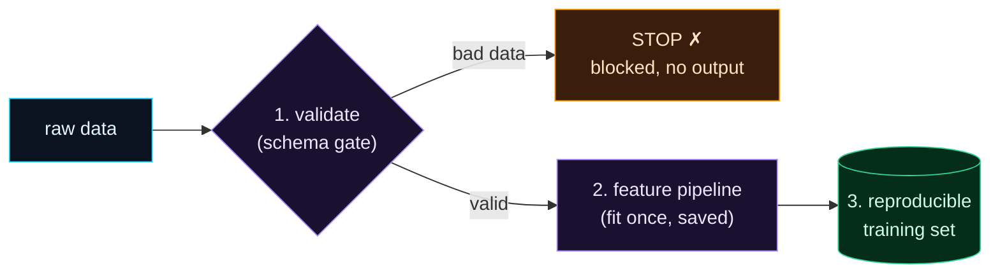

Welcome to **Day 50 of 100 Days of MLOps** — the finale of **Module 5**, and the halfway mark of the whole series. You've learned that bad data silently poisons models (Day 41), how to validate it (42–44), profile it (45), turn it into reusable features (46), serve those features consistently (47–48), and prevent training/serving skew (49). Today we assemble all of it into **one clean, end-to-end flow**: raw data goes in, and a **validated, feature-engineered, reproducible training set** comes out — with bad data blocked at the door and skew designed out.

This is the trustworthy data foundation every model deserves. When your training data is validated, your features are consistent, and the whole thing is reproducible, the model on top of it can actually be trusted. Let's build it.

> **The whole module in one pipeline.** Validate at the gate, transform with a shared artifact, emit a reproducible training set.

By the end of today you will:

- Assemble **validation + features** into a single build step.
- **Block bad data** at the gate before any features are computed.
- Produce a **reproducible training set** and a saved feature pipeline.
- Complete Module 5 with a foundation you can trust.

---

## The flow

Three stages, in order, each from a different day of this module. **Validate** first (the gate, Days 42–44) — bad data stops here. Then **transform** with a shared feature pipeline (Day 46) that's fit once and saved, so training and serving stay consistent (Day 49). Then emit a **reproducible training set**.



**Reading this diagram:**

On the left, in **cyan**, is **raw data** — untrusted, as always. It hits stage 1, the **purple validation gate**. This is the fork that makes everything downstream trustworthy: **bad data** takes the **amber "STOP"** branch (blocked, nothing produced), while only **valid** data continues. Nothing gets to feature engineering without passing the contract first.

Valid data flows to stage 2, the **purple feature pipeline** — fit once and saved, so the exact same transformation serves training and production (no skew). Its output reaches stage 3, the **green reproducible training set**: features plus target, ready to train on, regenerable byte-for-byte from the same inputs. Follow the whole path and you see the module's thesis: **validate, then transform with a shared artifact, then emit reproducible output** — bad data can't enter, features can't drift, and the result can always be rebuilt.

---

## Build it

Create `build_dataset.py` — it's the three stages, in order, combining Pandera (the gate) and a scikit-learn feature pipeline (the transform):

```python
"""build_dataset.py — Day 50 capstone: raw -> VALIDATE -> features -> training set."""
import sys, joblib, pandas as pd
import pandera.pandas as pa
from pandera.pandas import Column, Check, DataFrameSchema
from sklearn.compose import ColumnTransformer
from sklearn.preprocessing import OneHotEncoder, StandardScaler

SCHEMA = DataFrameSchema({                                  # the data contract (Days 42-44)
    "size_sqft":    Column(int, Check.in_range(400, 6000)),
    "bedrooms":     Column(int, Check.in_range(1, 10)),
    "age_years":    Column(int, Check.in_range(0, 150)),
    "neighborhood": Column(str, Check.isin(["downtown", "suburb", "rural"])),
    "price":        Column(int, Check.gt(0)),
})
NUMERIC = ["size_sqft", "bedrooms", "age_years"]
CATEGORICAL = ["neighborhood"]

path = sys.argv[1] if len(sys.argv) > 1 else "houses.csv"
df = pd.read_csv(path)

# 1. VALIDATE — the gate. Bad data is blocked here.
try:
    SCHEMA.validate(df, lazy=True)
    print(f"[1/3] validated {path} ({len(df)} rows) ✓")
except pa.errors.SchemaErrors as e:
    print(f"[1/3] {path} REJECTED — bad data blocked, no training set produced", file=sys.stderr)
    print(e.failure_cases[["column", "check"]].drop_duplicates().to_string(index=False), file=sys.stderr)
    sys.exit(1)

# 2. TRANSFORM — shared feature pipeline (fit once, saved -> no skew, Days 46/49)
feature_pipeline = ColumnTransformer([
    ("num", StandardScaler(), NUMERIC),
    ("cat", OneHotEncoder(handle_unknown="ignore"), CATEGORICAL),
])
X = feature_pipeline.fit_transform(df[NUMERIC + CATEGORICAL])
joblib.dump(feature_pipeline, "feature_pipeline.joblib")
print(f"[2/3] built + saved feature pipeline ({X.shape[1]} features) ✓")

# 3. REPRODUCIBLE training set (features + target)
training = pd.DataFrame(X, columns=feature_pipeline.get_feature_names_out())
training["price"] = df["price"].values
training.to_csv("training_set.csv", index=False)
print(f"[3/3] wrote training_set.csv  shape={training.shape} ✓")
```

Run it on clean data and watch all three stages complete:

```bash
python build_dataset.py houses.csv
```

```text
[1/3] validated houses.csv (500 rows) ✓
[2/3] built + saved feature pipeline (6 features) ✓
[3/3] wrote training_set.csv  shape=(500, 7) ✓
```

Validated, transformed, training set written — plus a saved `feature_pipeline.joblib` you'll reuse at serving to prevent skew. Now run it on a poisoned batch (the square-metres bug from Day 41), and the gate stops it at stage 1:

```bash
python build_dataset.py houses_bad.csv
echo "exit: $?"
```

```text
[1/3] houses_bad.csv REJECTED — bad data blocked, no training set produced
   column               check
size_sqft in_range(400, 6000)
exit: 1
```

**No feature pipeline was built, no training set was written.** The bad data never reached stage 2 — it was blocked at the gate, with a clear reason and a non-zero exit that halts any pipeline (Day 44). That's the guarantee: your training set is *only ever* built from validated data, transformed by a shared, reusable artifact.

---

## Why this is the foundation

Step back and see what this one script gives you — every module so far, working together:

- **Trustworthy data** — the validation gate (Days 42–44) means bad data cannot enter your training set. Ever.
- **Consistent features** — the saved feature pipeline (Day 46) applies the identical transformation at serving, preventing skew (Day 49).
- **Reproducible output** — `training_set.csv` and `feature_pipeline.joblib` are artifacts you can version (Module 3), so the exact training set is regenerable.
- **Trackable** — feed this validated set into a tracked experiment (Module 4) and you have a fully accountable path from raw data to model.

A model is only as trustworthy as the data beneath it. You've now built that data foundation properly — validated, consistent, reproducible. Everything you serve and deploy in the coming modules stands on it.

---

## Module 5 complete

That wraps **Module 5: Data Quality, Validation & Feature Stores.** You went from watching bad data silently wreck a model (Day 41) to a pipeline that makes that impossible. Along the way: schema validation with Pandera (42) and Great Expectations (43), automatic validation gates (44), data profiling (45), reusable feature pipelines (46), feature stores with Feast (47–48), and skew prevention (49). Your data is now something you can *trust* — the essential groundwork for serving models to the world, which is exactly where we go next.

---

## Common errors (and how to fix them)

**1. Features got built from bad data**

Your validation isn't *before* the transform, or it didn't `sys.exit(1)` on failure. The gate must be **stage 1**, and a failure must stop the script — no features, no training set (Day 44).

**2. `SchemaError` on a column you forgot to include**

Your schema must cover every column you rely on, with a real check (range, `isin`, `gt`). A missing or too-loose rule lets bad values through. Make the contract specific (Day 42).

**3. Re-fitting the feature pipeline at serving**

The capstone `fit`s once here (on training data) and **saves** the pipeline. At serving, *load and transform* — never re-fit — or you reintroduce skew (Day 49).

**4. A new category crashes the pipeline**

An unseen `neighborhood` at serving. `OneHotEncoder(handle_unknown="ignore")` handles it gracefully (all-zeros), and your `isin` check catches genuinely invalid categories at the gate.

**5. The training set isn't reproducible**

Unpinned randomness or unversioned inputs (Days 10, 27). Fix seeds, pin dependencies, and version `houses.csv` (Module 3) so the same inputs rebuild the same `training_set.csv`.

**6. Validation and features live in separate scripts that drift**

Keep the gate and the transform in one build step (as here), so data is *always* validated before features are computed — not sometimes.

---

## Recap — what you now have

You built the trustworthy data foundation:

- You assembled **validation + features** into one build step.
- Bad data is **blocked at the gate** — no features, no training set, non-zero exit.
- You produce a **reproducible training set** and a **saved feature pipeline**.
- You completed Module 5 — data you can trust.

**Your cheat sheet — the validated feature pipeline:**

| Stage | Tool | Guarantees |
|-------|------|-----------|
| 1. Validate | Pandera schema + `sys.exit(1)` | bad data blocked |
| 2. Transform | saved `ColumnTransformer` | consistent features, no skew |
| 3. Output | `training_set.csv` + `feature_pipeline.joblib` | reproducible, reusable |

Golden rule: **validate first, transform with a shared artifact, emit reproducible output** — a training set built only from good data, with features that stay consistent everywhere.

---

## Coming up on Day 51 — Module 6 begins

Your data is trustworthy and your models are trained, tracked, and reproducible — now it's time to **serve** them. **Module 6 — "Packaging & Serving Models"** opens with **Day 51 — "From Model to Inference API,"** where you'll turn a trained model into a real prediction *service*: a clean `predict()` function with proper input validation that other software can call. From building models, we turn to shipping them — the moment your work starts delivering predictions to the world.

See the full roadmap on the [100 Days of MLOps series page](/series/100-days-mlops). See you tomorrow.
