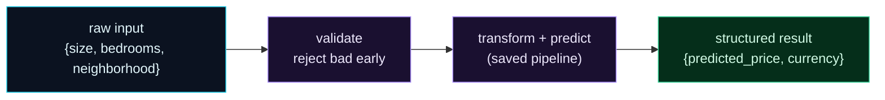

Welcome to **Day 51 of 100 Days of MLOps** — the start of **Module 6: Packaging & Serving Models.** You've built, validated, tracked, and reproduced models. But so far they've all lived in a `.joblib` file that only *your* Python scripts can open. To be useful, a model has to **serve** — to answer prediction requests from other software, a website, a phone app, another service. That's what this module is about, and it starts today with the core idea: **the inference logic that turns a request into a prediction.**

The key insight is to build that logic as a **plain function first**, separate from any web framework. A clean `predict()` function — validate the input, run the model, return a structured result — is testable, reusable, and HTTP-agnostic. Tomorrow's FastAPI server will just *wrap* it. Get the function right and serving becomes easy.

> **Serving is a function before it's a server.** Nail the inference logic, and the web layer is a thin shell around it.

By the end of today you will:

- Understand why a model file isn't a service.
- Separate **inference logic** from the **web layer**.
- Write a clean `predict()` function: **validate → predict → structured result**.
- Load the pipeline **once** and reject bad requests early.

---

## The anatomy of inference

A model in a file can't be called by a website. Inference logic is the code that bridges the two: it takes a *raw request* (a house's details), turns it into a *prediction*, and returns a *structured answer*. Three steps, and they're the same for every model you'll ever serve.



**Reading this diagram:**

On the left, in **cyan**, is a **raw input** — a house's details as they arrive from a caller. It flows through two **purple** steps. First **validate**: check the request makes sense and reject bad ones *early*, with a clear message — you never want garbage reaching the model (a lesson straight from Module 5). Then **transform + predict**: the saved pipeline (preprocessing *and* model in one, so no training/serving skew — Days 46/49) turns the validated input into a number. Finally, the **green** node: a **structured result** — not a bare number, but a labelled object (`{predicted_price, currency}`) that a caller can rely on.

Notice what's *not* here: any mention of HTTP, JSON, or a web server. This is pure inference logic — a function. That's deliberate: **the prediction logic and the web plumbing are separate concerns.** Build this function well and you can call it from a test, a CLI, a batch job, or (tomorrow) an HTTP endpoint. The takeaway: **inference is validate → predict → structure**, and it's a function long before it's a server.

---

## Build the predict function

First, a trained model saved as a **single pipeline** (preprocessing + model together — Day 15, so serving can't skew). Then the inference function. Create `service.py`:

```python
"""service.py — Day 51: the inference logic as a plain, HTTP-agnostic function."""
import joblib, pandas as pd

_pipeline = joblib.load("model.joblib")          # preprocessing + model together (no skew)
REQUIRED = ["size_sqft", "bedrooms", "age_years", "neighborhood"]


def predict(house: dict) -> dict:
    # 1. VALIDATE the input — reject bad requests early, with a clear message.
    missing = [f for f in REQUIRED if f not in house]
    if missing:
        raise ValueError(f"missing fields: {missing}")
    if not (100 <= house["size_sqft"] <= 20000):
        raise ValueError(f"size_sqft out of range: {house['size_sqft']}")

    # 2. TRANSFORM + PREDICT (the saved pipeline does both).
    X = pd.DataFrame([house])[REQUIRED]
    price = _pipeline.predict(X)[0]

    # 3. Return a STRUCTURED result.
    return {"predicted_price": round(float(price), 2), "currency": "USD"}


if __name__ == "__main__":
    print("valid request  ->", predict({"size_sqft": 2000, "bedrooms": 4, "age_years": 5, "neighborhood": "downtown"}))
    try:
        predict({"size_sqft": 2000, "bedrooms": 4})            # missing fields
    except ValueError as e:
        print("bad request    ->", f"rejected: {e}")
```

Three details make this production-shaped. The pipeline is **loaded once**, at import time — not inside `predict`, so you don't reload the model on every request. The function **validates first** and raises a clear error on bad input. And it returns a **structured dict**, not a bare float, so callers get labelled, self-describing output. Run it:

```bash
python service.py
```

```text
valid request  -> {'predicted_price': 471358.3, 'currency': 'USD'}
bad request    -> rejected: missing fields: ['age_years', 'neighborhood']
```

A valid house gets a clean, structured price. A malformed request is **rejected before it ever touches the model**, with a message that says exactly what's wrong. That's the whole shape of inference — and notice it works completely without a web server. You could call `predict()` from a test, a script, or a batch job right now.

---

## Why the function comes first

It would be tempting to jump straight to a FastAPI endpoint. Building the function first pays off in three ways:

- **Testable.** You can call `predict()` directly in a unit test (Day 55) — no HTTP client, no running server, just `assert predict(...) == ...`.
- **Reusable.** The same function backs an HTTP API *and* a batch scoring job (Day 56) *and* a CLI — write the inference logic once, wrap it many ways.
- **Separation of concerns.** The web layer handles HTTP (routing, status codes, JSON); the function handles *prediction*. Keeping them apart means each is simple, and you can change one without touching the other.

Tomorrow's FastAPI server will be a few lines that call this exact function. The hard part — turning a request into a validated, structured prediction — is already done. This is the discipline behind well-served models: **the model, its preprocessing, and the inference logic are one clean unit; the transport is a separate, thin layer on top.**

---

## Common errors (and how to fix them)

**1. The model and its preprocessing are separate at serving**

If you load a bare model and reapply transforms by hand in `predict`, you risk training/serving skew (Day 49). Save and load **one pipeline** (preprocessing + model together), so serving uses the exact training transformation.

**2. No input validation — garbage reaches the model**

Without a check, a missing field or absurd value flows straight into the model and produces a confident, wrong answer (Module 5's whole point). Validate first and raise a clear error on bad input.

**3. Loading the model inside `predict` (per request)**

`joblib.load` on every call is slow and wasteful. Load the pipeline **once** at module import (as above); every request then reuses the in-memory model.

**4. Returning a bare number or a NumPy type**

Callers need labelled, serialisable output. Return a structured dict (`{"predicted_price": ...}`) with plain Python types (`float(...)`), not a raw array or `np.float64` — the latter won't cleanly become JSON later.

**5. HTTP logic mixed into the inference function**

If `predict()` reads request headers or sets status codes, it's no longer reusable or easily testable. Keep it HTTP-free; let the web layer (Day 52) translate between HTTP and this function.

**6. `KeyError` / wrong column order into the model**

Build the input DataFrame with the exact expected columns (`pd.DataFrame([house])[REQUIRED]`) so the pipeline gets what it trained on, in the right shape.

---

## Recap — what you now have

You have the core of a model service:

- You understand a model file isn't a service — **inference logic** makes it callable.
- You separate **inference** (a function) from the **web layer** (tomorrow).
- Your `predict()` **validates → predicts → returns structured output**, loading the pipeline once.
- You reject bad requests **early**, with clear messages.

**Your cheat sheet:**

| Piece | Why |
|-------|-----|
| Load pipeline once (at import) | fast — no per-request reload |
| Validate input first | reject garbage before the model |
| Save preprocessing + model as one | no training/serving skew |
| Return a structured dict | labelled, serialisable output |
| Keep it HTTP-free | testable and reusable |

Golden rule: **serving is a function first** — validate, predict, return structured output, and let the web framework wrap it.

---

## Coming up on Day 52

Now let's put your inference function on the network. **Day 52 — "Serving a Model with FastAPI"** wraps `predict()` in a real REST API: a `/predict` endpoint that accepts a JSON request, calls your function, and returns a JSON response — running on a live local server you can hit from any client. You'll see how little code it takes to turn yesterday's function into a service the whole world could call, and get automatic interactive API docs for free.

See the full roadmap on the [100 Days of MLOps series page](/series/100-days-mlops). See you tomorrow.
