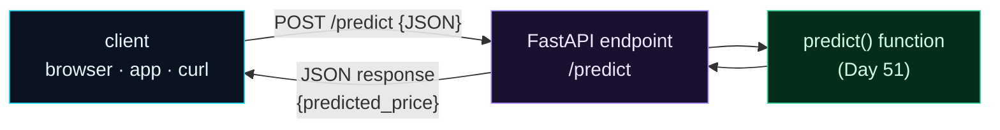

Welcome to **Day 52 of 100 Days of MLOps**. Yesterday you built the inference logic as a clean `predict()` function. Today you put it on the network so *anything* can call it — a website, a mobile app, another service, a `curl` command. You'll do it with **FastAPI**, the modern Python framework that's become the default for serving ML models, and by the end you'll have a real REST API running locally that turns a JSON request into a JSON prediction.

The beautiful part is how *little* code it takes. Because you separated inference from transport yesterday, the API is a thin wrapper: FastAPI handles the HTTP (parsing JSON, routing, status codes, responses) and simply hands off to your function. A few lines, and your model is a service — complete with automatic interactive documentation.

> **The web layer is a shell.** FastAPI translates HTTP to and from your `predict()` function; the model logic stays exactly where you left it.

By the end of today you will:

- Wrap `predict()` in a **FastAPI** app with a `/predict` endpoint.
- Run it on a live server with **uvicorn**.
- Call it over HTTP and get **JSON** predictions and proper **status codes**.
- Get free **interactive API docs** at `/docs`.

---

## HTTP in, prediction out

An API endpoint is just a bridge between the network and your function. A client sends an HTTP request with JSON; FastAPI parses it, calls your `predict()`, and sends back the result as JSON. Your inference logic doesn't change at all — it's wrapped, not rewritten.



**Reading this diagram:**

On the left, in **cyan**, is any **client** — a browser, a phone app, a `curl` command, another microservice. It sends an HTTP `POST` to `/predict` with a JSON body. That hits the **purple FastAPI endpoint**, whose only job is HTTP translation: parse the incoming JSON, and — following the arrow — call the **green `predict()` function** from Day 51. The function does the real work (validate, predict, structure) and returns its result *back to the endpoint*, which serialises it to JSON and sends it to the client.

The shape to notice is that the **green node is unchanged** from yesterday — it's the same inference function. FastAPI (purple) wraps around it, handling everything network-related so the model logic doesn't have to. The takeaway: **the endpoint is a thin HTTP shell; your function is the substance.** That separation is why serving is a few lines here rather than a tangle of web and model code.

---

## Build the API

Install FastAPI and a server (`pip install fastapi "uvicorn[standard]"`). Then create `app.py` — it imports yesterday's `predict` and exposes it over HTTP:

```python
"""app.py — Day 52: wrap the predict() function in a FastAPI REST API."""
from fastapi import FastAPI, HTTPException
from service import predict          # reuse Day 51's inference logic

app = FastAPI(title="House Price API")


@app.get("/health")
def health():
    return {"status": "ok"}


@app.post("/predict")
def predict_endpoint(house: dict):
    try:
        return predict(house)         # the web layer just calls the function
    except ValueError as e:
        raise HTTPException(status_code=422, detail=str(e))
```

That's the entire service. Two endpoints: `/health` (a standard "am I alive?" check every service should have) and `/predict`, which calls your function and — crucially — turns a validation `ValueError` into a proper HTTP **422** ("Unprocessable Entity"). FastAPI does the JSON parsing and serialising for you.

---

## Run it and call it

Start the server with uvicorn (the `--reload` flag restarts it when you edit code):

```bash
uvicorn app:app --reload
```

It runs at `http://127.0.0.1:8000`. Now hit it from another terminal with `curl`. The health check:

```bash
curl http://127.0.0.1:8000/health
```

```text
{"status":"ok"}
```

A real prediction — POST a house as JSON:

```bash
curl -X POST http://127.0.0.1:8000/predict \
  -H 'Content-Type: application/json' \
  -d '{"size_sqft":2000,"bedrooms":4,"age_years":5,"neighborhood":"downtown"}'
```

```text
{"predicted_price":471358.3,"currency":"USD"}
```

**Your model is a live web service.** That same request could come from a website's JavaScript, a mobile app, or another backend — anything that speaks HTTP. And a bad request gets the right treatment automatically: send a house missing fields and the endpoint returns **422** with a clear reason:

```text
POST /predict (missing fields)
-> 422 {"detail": "missing fields: ['age_years', 'neighborhood']"}
```

Valid input → `200` and a price; invalid input → `422` and an explanation. Proper HTTP semantics, for free.

---

## Free interactive docs

Here's a FastAPI superpower: it auto-generates interactive API documentation from your code. With the server running, open **`http://127.0.0.1:8000/docs`** in a browser:

```text
GET /docs -> HTTP 200   (interactive Swagger UI)
```

You get a **Swagger UI** page listing every endpoint, where you can fill in a request and hit "Execute" to try the API right in the browser — no `curl` needed. It's generated from your code automatically, always up to date, and invaluable for anyone integrating with your service. (There's a second style at `/redoc` too.) This is a big part of why FastAPI won the ML-serving world: a documented, testable API with almost no extra work.

---

## Common errors (and how to fix them)

**1. `ERROR: Error loading ASGI app. Could not import module "app"`**

uvicorn takes `module:variable`. Run `uvicorn app:app` from the folder containing `app.py`, where `app` is your `FastAPI()` instance. A typo in either half causes this.

**2. `Address already in use` on port 8000**

Another server (or a previous run) holds the port. Stop it, or pick another: `uvicorn app:app --port 8001`.

**3. `422 Unprocessable Entity` on a request you think is valid**

The endpoint rejected the input — often a missing field or a value that failed your validation. Read the `detail` in the response; it says exactly what's wrong. (Tomorrow, Pydantic makes these messages even richer.)

**4. `TypeError: Object of type ndarray/float32 is not JSON serializable`**

Your function returned a NumPy type FastAPI can't serialise. Return plain Python types (`float(...)`, `int(...)`) in a dict — exactly why Day 51's function did `round(float(price), 2)`.

**5. The model isn't found when the server starts**

`joblib.load("model.joblib")` runs at import; if the path is wrong relative to where you launched uvicorn, it fails on startup. Use a path relative to the app (or absolute), and start uvicorn from the right directory.

**6. Using `--reload` in production**

`--reload` watches files and is for development only. In production, run without it (and behind a process manager / multiple workers) — more on hardening when we containerise and deploy.

---

## Recap — what you now have

Your model is a live web service:

- You wrapped `predict()` in a **FastAPI** app with `/predict` and `/health`.
- You ran it with **uvicorn** and called it over HTTP with `curl`.
- You get **JSON** responses and correct **status codes** (200 / 422).
- You get **interactive docs** at `/docs` for free.

**Your cheat sheet:**

| Task | How |
|------|-----|
| Define the app | `app = FastAPI()` |
| An endpoint | `@app.post("/predict") def ...` |
| Bad input → HTTP error | `raise HTTPException(status_code=422, detail=...)` |
| Run it | `uvicorn app:app --reload` |
| Interactive docs | open `/docs` |

Golden rule: **the API wraps the function** — FastAPI handles HTTP and JSON, your `predict()` handles the model, and the two stay cleanly separate.

---

## Coming up on Day 53

Right now `/predict` accepts a raw `dict` — any JSON at all — and your function checks it by hand. There's a far better way. **Day 53 — "Request/Response Validation with Pydantic"** replaces the loose `dict` with a typed **Pydantic model** that declares exactly what a valid request looks like — field types, ranges, required fields — so FastAPI validates every request *automatically*, rejects malformed ones with precise errors, and documents the schema in `/docs`. It's the professional way to define an API's contract.

See the full roadmap on the [100 Days of MLOps series page](/series/100-days-mlops). See you tomorrow.
